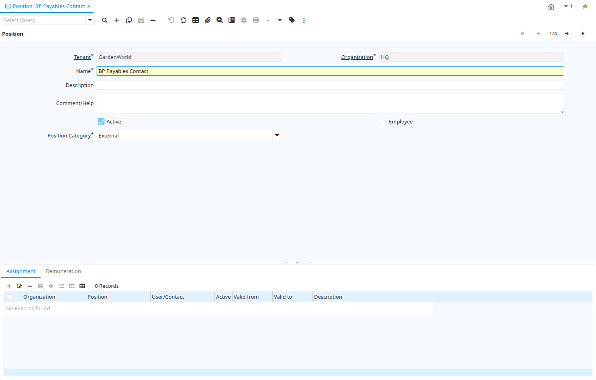

# Position

Window ID 351

*15/05/2005 → 13/11/2005*

**Description:** Maintain Job Positions

**Comment/Help:** Maintain internal (employee) or external positions

## Tab: Position

*Tab Level 0 · Created 15/05/2005 · Updated 16/09/2005*

**Description:** Maintain Job Position

**Comment/Help:** Maintain internal (employee) or external positions

| **Name** | **Description** | **Comment/Help** | **Technical Data** |
|---|---|---|---|
| Tenant | Tenant for this installation. | A Tenant is a company or a legal entity. You cannot share data between Tenants. | C_Job.AD_Client_ID<small> numeric(10)   Table Direct</small> |
| Organization | Organizational entity within tenant | An organization is a unit of your tenant or legal entity - examples are store, department. You can share data between organizations. | C_Job.AD_Org_ID<small> numeric(10)   Table Direct</small> |
| Name | Alphanumeric identifier of the entity | The name of an entity (record) is used as an default search option in addition to the search key. The name is up to 60 characters in length. | C_Job.Name<small> character varying(60)   String</small> |
| Description | Optional short description of the record | A description is limited to 255 characters. | C_Job.Description<small> character varying(255)   String</small> |
| Comment/Help | Comment or Hint | The Help field contains a hint, comment or help about the use of this item. | C_Job.Help<small> character varying(2000)   Text</small> |
| Active | The record is active in the system | There are two methods of making records unavailable in the system: One is to delete the record, the other is to de-activate the record. A de-activated record is not available for selection, but available for reports. There are two reasons for de-activating and not deleting records: (1) The system requires the record for audit purposes. (2) The record is referenced by other records. E.g., you cannot delete a Business Partner, if there are invoices for this partner record existing. You de-activate the Business Partner and prevent that this record is used for future entries. | C_Job.IsActive<small> character(1)   Yes-No</small> |
| Employee | Indicates if  this Business Partner is an employee | The Employee checkbox indicates if this Business Partner is an Employee.  If it is selected, additional fields will display which further identify this employee. | C_Job.IsEmployee<small> character(1)   Yes-No</small> |
| Position Category | Job Position Category | Classification of Job Positions | C_Job.C_JobCategory_ID<small> numeric(10)   Table Direct</small> |

## Tab: › Assignment

*Tab Level 1 · Created 15/05/2005 · Updated 15/05/2005*

**Description:** Employee Assignment

| **Name** | **Description** | **Comment/Help** | **Technical Data** |
|---|---|---|---|
| Tenant | Tenant for this installation. | A Tenant is a company or a legal entity. You cannot share data between Tenants. | C_JobAssignment.AD_Client_ID<small> numeric(10)   Table Direct</small> |
| Organization | Organizational entity within tenant | An organization is a unit of your tenant or legal entity - examples are store, department. You can share data between organizations. | C_JobAssignment.AD_Org_ID<small> numeric(10)   Table Direct</small> |
| Position | Job Position |  | C_JobAssignment.C_Job_ID<small> numeric(10)   Table Direct</small> |
| User/Contact | User within the system - Internal or Business Partner Contact | The User identifies a unique user in the system. This could be an internal user or a business partner contact | C_JobAssignment.AD_User_ID<small> numeric(10)   Search</small> |
| Active | The record is active in the system | There are two methods of making records unavailable in the system: One is to delete the record, the other is to de-activate the record. A de-activated record is not available for selection, but available for reports. There are two reasons for de-activating and not deleting records: (1) The system requires the record for audit purposes. (2) The record is referenced by other records. E.g., you cannot delete a Business Partner, if there are invoices for this partner record existing. You de-activate the Business Partner and prevent that this record is used for future entries. | C_JobAssignment.IsActive<small> character(1)   Yes-No</small> |
| Valid from | Valid from including this date (first day) | The Valid From date indicates the first day of a date range | C_JobAssignment.ValidFrom<small> timestamp without time zone   Date+Time</small> |
| Valid to | Valid to including this date (last day) | The Valid To date indicates the last day of a date range | C_JobAssignment.ValidTo<small> timestamp without time zone   Date+Time</small> |
| Description | Optional short description of the record | A description is limited to 255 characters. | C_JobAssignment.Description<small> character varying(255)   String</small> |

## Tab: › Remuneration

*Tab Level 1 · Created 15/05/2005 · Updated 15/05/2005*

**Description:** Position Remuneration

| **Name** | **Description** | **Comment/Help** | **Technical Data** |
|---|---|---|---|
| Tenant | Tenant for this installation. | A Tenant is a company or a legal entity. You cannot share data between Tenants. | C_JobRemuneration.AD_Client_ID<small> numeric(10)   Table Direct</small> |
| Organization | Organizational entity within tenant | An organization is a unit of your tenant or legal entity - examples are store, department. You can share data between organizations. | C_JobRemuneration.AD_Org_ID<small> numeric(10)   Table Direct</small> |
| Position | Job Position |  | C_JobRemuneration.C_Job_ID<small> numeric(10)   Table Direct</small> |
| Remuneration | Wage or Salary |  | C_JobRemuneration.C_Remuneration_ID<small> numeric(10)   Table Direct</small> |
| Active | The record is active in the system | There are two methods of making records unavailable in the system: One is to delete the record, the other is to de-activate the record. A de-activated record is not available for selection, but available for reports. There are two reasons for de-activating and not deleting records: (1) The system requires the record for audit purposes. (2) The record is referenced by other records. E.g., you cannot delete a Business Partner, if there are invoices for this partner record existing. You de-activate the Business Partner and prevent that this record is used for future entries. | C_JobRemuneration.IsActive<small> character(1)   Yes-No</small> |
| Valid from | Valid from including this date (first day) | The Valid From date indicates the first day of a date range | C_JobRemuneration.ValidFrom<small> timestamp without time zone   Date+Time</small> |
| Valid to | Valid to including this date (last day) | The Valid To date indicates the last day of a date range | C_JobRemuneration.ValidTo<small> timestamp without time zone   Date+Time</small> |
| Description | Optional short description of the record | A description is limited to 255 characters. | C_JobRemuneration.Description<small> character varying(255)   String</small> |

