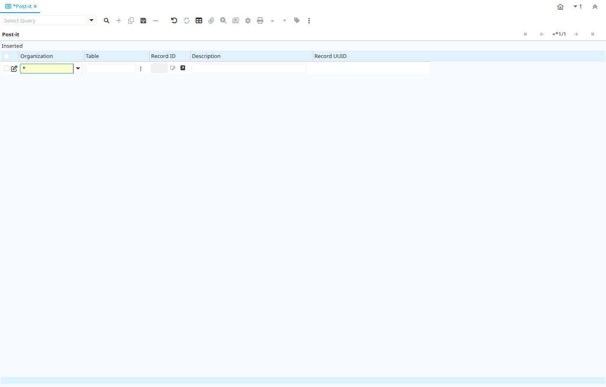

# Post-it

Window ID 200089

*24/11/2016 → 24/11/2016*

## Tab: Post-it

*Tab Level 0 · Created 24/11/2016 · Updated 24/11/2016*

| **Name** | **Description** | **Comment/Help** | **Technical Data** |
|---|---|---|---|
| Tenant | Tenant for this installation. | A Tenant is a company or a legal entity. You cannot share data between Tenants. | AD_PostIt.AD_Client_ID<small> numeric(10)   Table Direct</small> |
| Organization | Organizational entity within tenant | An organization is a unit of your tenant or legal entity - examples are store, department. You can share data between organizations. | AD_PostIt.AD_Org_ID<small> numeric(10)   Table Direct</small> |
| Table | Database Table information | The Database Table provides the information of the table definition | AD_PostIt.AD_Table_ID<small> numeric(10)   Search</small> |
| Record UUID |  |  | AD_PostIt.Record_UU<small> uuid   Record UUID</small> |
| Record ID | Direct internal record ID | The Record ID is the internal unique identifier of a record. Please note that zooming to the record may not be successful for Orders, Invoices and Shipment/Receipts as sometimes the Sales Order type is not known. | AD_PostIt.Record_ID<small> numeric(10)   Record ID</small> |
| Description |  |  | AD_PostIt.Text<small> character varying(2000)   String</small> |

