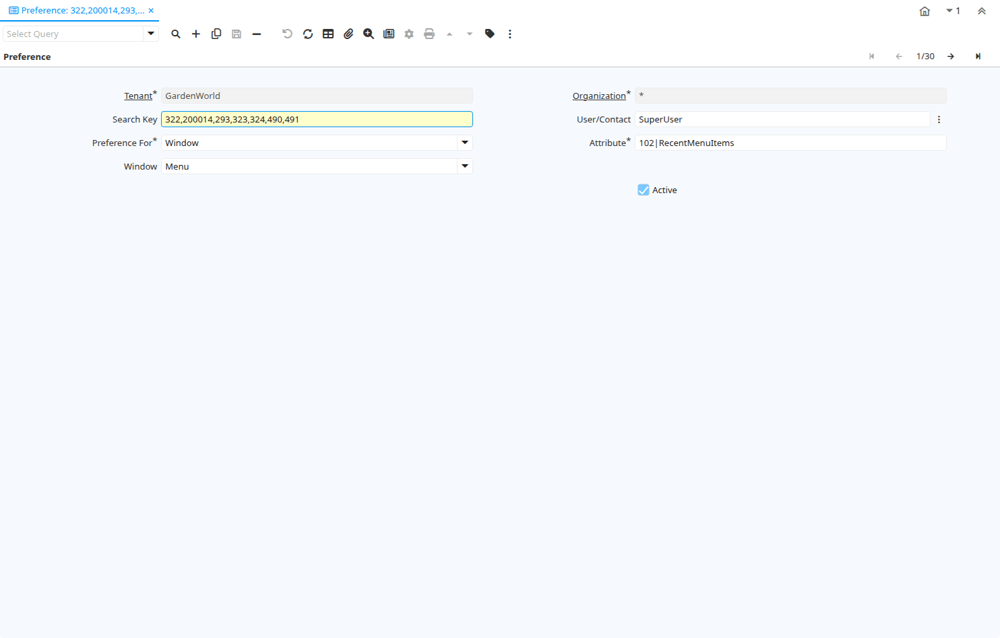

# Preference

Window ID 129

*29/06/1999 → 10/03/2022*

**Description:** Maintain System Tenant Org and User Preferences

**Comment/Help:** System Admin use only.

## Tab: Preference

*Tab Level 0 · Created 29/06/1999 · Updated 02/09/2023*

**Description:** Maintain System Tenant Org and User Preferences

| **Name** | **Description** | **Comment/Help** | **Technical Data** |
|---|---|---|---|
| Tenant | Tenant for this installation. | A Tenant is a company or a legal entity. You cannot share data between Tenants. | AD_Preference.AD_Client_ID<small> numeric(10)   Table Direct</small> |
| Organization | Organizational entity within tenant | An organization is a unit of your tenant or legal entity - examples are store, department. You can share data between organizations. | AD_Preference.AD_Org_ID<small> numeric(10)   Table Direct</small> |
| Search Key | Search key for the record in the format required - must be unique | A search key allows you a fast method of finding a particular record. If you leave the search key empty, the system automatically creates a numeric number.  The document sequence used for this fallback number is defined in the "Maintain Sequence" window with the name "DocumentNo_&lt;TableName&gt;", where TableName is the actual name of the table (e.g. C_Order). | AD_Preference.Value<small> character varying(60)   String</small> |
| User/Contact | User within the system - Internal or Business Partner Contact | The User identifies a unique user in the system. This could be an internal user or a business partner contact | AD_Preference.AD_User_ID<small> numeric(10)   Search</small> |
| Preference For | Type of preference, it can window, info window or parameter process |  | AD_Preference.PreferenceFor<small> character(1)   List</small> |
| Attribute |  |  | AD_Preference.Attribute<small> character varying(60)   String</small> |
| Window | Data entry or display window | The Window field identifies a unique Window in the system. | AD_Preference.AD_Window_ID<small> numeric(10)   Table Direct</small> |
| Process | Process or Report | The Process field identifies a unique Process or Report in the system. | AD_Preference.AD_Process_ID<small> numeric(10)   Table Direct</small> |
| Info Window | Info and search/select Window | The Info window is used to search and select records as well as display information relevant to the selection. | AD_Preference.AD_InfoWindow_ID<small> numeric(10)   Table Direct</small> |
| Special Form | Special Form | The Special Form field identifies a unique Special Form in the system. | AD_Preference.AD_Form_ID<small> numeric(10)   Search</small> |
| Active | The record is active in the system | There are two methods of making records unavailable in the system: One is to delete the record, the other is to de-activate the record. A de-activated record is not available for selection, but available for reports. There are two reasons for de-activating and not deleting records: (1) The system requires the record for audit purposes. (2) The record is referenced by other records. E.g., you cannot delete a Business Partner, if there are invoices for this partner record existing. You de-activate the Business Partner and prevent that this record is used for future entries. | AD_Preference.IsActive<small> character(1)   Yes-No</small> |

