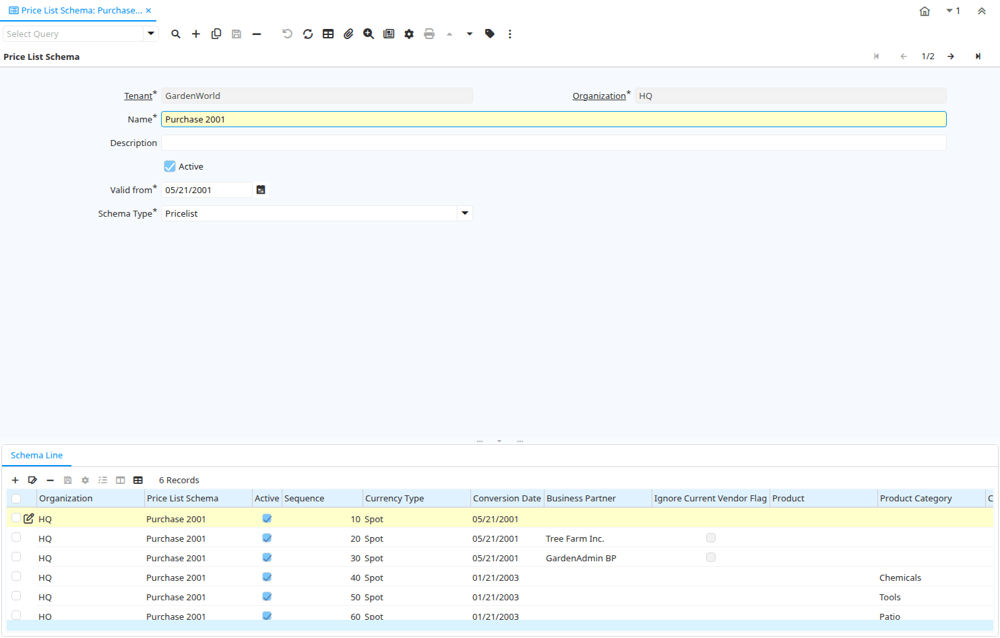

# Price List Schema

Window ID 337

*28/12/2001 → 03/06/2021*

**Description:** Maintain Price List Schema

**Comment/Help:** Price List schema defines calculation rules for price lists

## Tab: Price List Schema

*Tab Level 0 · Created 07/07/2004 · Updated 30/09/2009*

**Description:** Price List Schema

**Comment/Help:** Price List schema defines calculation rules for price lists

| **Name** | **Description** | **Comment/Help** | **Technical Data** |
|---|---|---|---|
| Tenant | Tenant for this installation. | A Tenant is a company or a legal entity. You cannot share data between Tenants. | M_DiscountSchema.AD_Client_ID<small> numeric(10)   Table Direct</small> |
| Organization | Organizational entity within tenant | An organization is a unit of your tenant or legal entity - examples are store, department. You can share data between organizations. | M_DiscountSchema.AD_Org_ID<small> numeric(10)   Table Direct</small> |
| Name | Alphanumeric identifier of the entity | The name of an entity (record) is used as an default search option in addition to the search key. The name is up to 60 characters in length. | M_DiscountSchema.Name<small> character varying(60)   String</small> |
| Description | Optional short description of the record | A description is limited to 255 characters. | M_DiscountSchema.Description<small> character varying(255)   String</small> |
| Active | The record is active in the system | There are two methods of making records unavailable in the system: One is to delete the record, the other is to de-activate the record. A de-activated record is not available for selection, but available for reports. There are two reasons for de-activating and not deleting records: (1) The system requires the record for audit purposes. (2) The record is referenced by other records. E.g., you cannot delete a Business Partner, if there are invoices for this partner record existing. You de-activate the Business Partner and prevent that this record is used for future entries. | M_DiscountSchema.IsActive<small> character(1)   Yes-No</small> |
| Valid from | Valid from including this date (first day) | The Valid From date indicates the first day of a date range | M_DiscountSchema.ValidFrom<small> timestamp without time zone   Date</small> |
| Schema Type | Type of trade schema calculation | Type of procedure used to calculate the trade schema percentage | M_DiscountSchema.DiscountType<small> character(1)   List</small> |
| Renumber | Renumber Discount entries |  | M_DiscountSchema.Processing<small> character(1)   Button</small> |

## Tab: › Schema Line

*Tab Level 1 · Created 28/12/2001 · Updated 02/01/2000*

**Description:** Trade Discount Price List Lines

**Comment/Help:** Pricelists are created based on Product Purchase and Category Discounts.
The parameters listed here allow to copy and calculate pricelists.&lt;BR&gt;
The calculation:
&lt;UL&gt;
&lt;LI&gt;Copy and convert price from referenced price list
&lt;LI&gt;result plus Surcharge Amount
&lt;LI&gt;result minus Discount
&lt;LI&gt;if resulting price is less than the original limit price plus min Margin, use this price (only if Margin is not zero)
&lt;LI&gt;if resulting price is more than the original limit price plus max Margin, use this price (only if Margin us not zero)
&lt;LI&gt;Round resulting price
&lt;/UL&gt;
&lt;B&gt;The Formula&lt;/B&gt; is&lt;BR&gt;
NewPrice = (Convert(BasePrice) + Surcharge) * (100-Discount) / 100;&lt;BR&gt;
if MinMargin &lt;&gt; 0 then NewPrice = Max (NewPrice, Convert(OrigLimitPrice) + MinMargin);&lt;BR&gt;
if MaxMargin &lt;&gt; 0 then NewPrice = Min (NewPrice, Convert(OrigLimitPrice) + MaxMargin);&lt;BR&gt;
 &lt;BR&gt;
&lt;B&gt;Example:&lt;/B&gt; (assuming same currency)&lt;BR&gt;
Original Prices:  List=300, Standard=250, Limit=200;&lt;BR&gt;
New List Price: Base=List, Surcharge=0, Discount=0, Round

| **Name** | **Description** | **Comment/Help** | **Technical Data** |
|---|---|---|---|
| Tenant | Tenant for this installation. | A Tenant is a company or a legal entity. You cannot share data between Tenants. | M_DiscountSchemaLine.AD_Client_ID<small> numeric(10)   Table Direct</small> |
| Organization | Organizational entity within tenant | An organization is a unit of your tenant or legal entity - examples are store, department. You can share data between organizations. | M_DiscountSchemaLine.AD_Org_ID<small> numeric(10)   Table Direct</small> |
| Price List Schema | Schema to calculate price lists |  | M_DiscountSchemaLine.M_DiscountSchema_ID<small> numeric(10)   Table</small> |
| Active | The record is active in the system | There are two methods of making records unavailable in the system: One is to delete the record, the other is to de-activate the record. A de-activated record is not available for selection, but available for reports. There are two reasons for de-activating and not deleting records: (1) The system requires the record for audit purposes. (2) The record is referenced by other records. E.g., you cannot delete a Business Partner, if there are invoices for this partner record existing. You de-activate the Business Partner and prevent that this record is used for future entries. | M_DiscountSchemaLine.IsActive<small> character(1)   Yes-No</small> |
| Sequence | Method of ordering records; lowest number comes first | The Sequence indicates the order of records | M_DiscountSchemaLine.SeqNo<small> numeric(10)   Integer</small> |
| Description | Optional short description of the record | A description is limited to 255 characters. | M_DiscountSchemaLine.Description<small> character varying(255)   String</small> |
| Currency Type | Currency Conversion Rate Type | The Currency Conversion Rate Type lets you define different type of rates, e.g. Spot, Corporate and/or Sell/Buy rates. | M_DiscountSchemaLine.C_ConversionType_ID<small> numeric(10)   Table Direct</small> |
| Conversion Date | Date for selecting conversion rate | The Conversion Date identifies the date used for currency conversion. The conversion rate chosen must include this date in it's date range | M_DiscountSchemaLine.ConversionDate<small> timestamp without time zone   Date</small> |
| Business Partner | Identifies a Business Partner | A Business Partner is anyone with whom you transact.  This can include Vendor, Customer, Employee or Salesperson | M_DiscountSchemaLine.C_BPartner_ID<small> numeric(10)   Search</small> |
| Ignore Current Vendor Flag | take all PO prices into account | will use PO price even if it is not marked as current vendor | M_DiscountSchemaLine.IsIgnoreIsCurrentVendor<small> character(1)   Yes-No</small> |
| Product | Product, Service, Item | Identifies an item which is either purchased or sold in this organization. | M_DiscountSchemaLine.M_Product_ID<small> numeric(10)   Search</small> |
| Product Category | Category of a Product | Identifies the category which this product belongs to.  Product categories are used for pricing and selection. | M_DiscountSchemaLine.M_Product_Category_ID<small> numeric(10)   Table Direct</small> |
| Classification | Classification for grouping | The Classification can be used to optionally group products. | M_DiscountSchemaLine.Classification<small> character varying(12)   String</small> |
| Group1 |  |  | M_DiscountSchemaLine.Group1<small> character varying(255)   String</small> |
| Group2 |  |  | M_DiscountSchemaLine.Group2<small> character varying(255)   String</small> |
| Partner Category | Product Category of the Business Partner | The Business Partner Category identifies the category used by the Business Partner for this product. | M_DiscountSchemaLine.VendorCategory<small> character varying(30)   String</small> |
| List price Base | Price used as the basis for price list calculations | The List Price Base indicates the price to use as the basis for the calculation of a new price list. | M_DiscountSchemaLine.List_Base<small> character(1)   List</small> |
| List price min Margin | Minimum margin for a product | The List Price Min Margin indicates the minimum margin for a product.  The margin is calculated by subtracting the original list price from the newly calculated price.  If this field contains 0.00 then it is ignored. | M_DiscountSchemaLine.List_MinAmt<small> numeric   Amount</small> |
| List price Surcharge Amount | List Price Surcharge Amount | The List Price Surcharge Amount indicates the amount to be added to the price prior to multiplication. | M_DiscountSchemaLine.List_AddAmt<small> numeric   Amount</small> |
| List price max Margin | Maximum margin for a product | The List Price Max Margin indicates the maximum margin for a product.  The margin is calculated by subtracting the original list price from the newly calculated price.  If this field contains 0.00 then it is ignored. | M_DiscountSchemaLine.List_MaxAmt<small> numeric   Amount</small> |
| List price Discount % | Discount from list price as a percentage | The List Price Discount Percentage indicates the percentage discount which will be subtracted from the base price.  A negative amount indicates the percentage which will be added to the base price. | M_DiscountSchemaLine.List_Discount<small> numeric   Number</small> |
| List price Rounding | Rounding rule for final list price | The List Price Rounding indicates how the final list price will be rounded. | M_DiscountSchemaLine.List_Rounding<small> character(1)   List</small> |
| Fixed List Price | Fixes List Price (not calculated) |  | M_DiscountSchemaLine.List_Fixed<small> numeric   Amount</small> |
| Standard price Base | Base price for calculating new standard price | The Standard Price Base indicates the price to use as the basis for the calculation of a new price standard.  | M_DiscountSchemaLine.Std_Base<small> character(1)   List</small> |
| Standard price min Margin | Minimum margin allowed for a product | The Standard Price Min Margin indicates the minimum margin for a product.  The margin is calculated by subtracting the original Standard price from the newly calculated price.  If this field contains 0.00 then it is ignored. | M_DiscountSchemaLine.Std_MinAmt<small> numeric   Amount</small> |
| Standard price Surcharge Amount | Amount added to a price as a surcharge | The Standard Price Surcharge Amount indicates the amount to be added to the price prior to multiplication.  | M_DiscountSchemaLine.Std_AddAmt<small> numeric   Amount</small> |
| Standard max Margin | Maximum margin allowed for a product | The Standard Price Max Margin indicates the maximum margin for a product.  The margin is calculated by subtracting the original Standard price from the newly calculated price.  If this field contains 0.00 then it is ignored. | M_DiscountSchemaLine.Std_MaxAmt<small> numeric   Amount</small> |
| Standard price Discount % | Discount percentage to subtract from base price | The Standard Price Discount Percentage indicates the percentage discount which will be subtracted from the base price.  A negative amount indicates the percentage which will be added to the base price. | M_DiscountSchemaLine.Std_Discount<small> numeric   Number</small> |
| Standard price Rounding | Rounding rule for calculated price | The Standard Price Rounding indicates how the final Standard price will be rounded. | M_DiscountSchemaLine.Std_Rounding<small> character(1)   List</small> |
| Fixed Standard Price | Fixed Standard Price (not calculated) |  | M_DiscountSchemaLine.Std_Fixed<small> numeric   Amount</small> |
| Limit price Base | Base price for calculation of the new price | Identifies the price to be used as the base for calculating a new price list. | M_DiscountSchemaLine.Limit_Base<small> character(1)   List</small> |
| Limit price min Margin | Minimum difference to original limit price; ignored if zero | Indicates the minimum margin for a product.  The margin is calculated by subtracting the original limit price from the newly calculated price.  If this field contains 0.00 then it is ignored. | M_DiscountSchemaLine.Limit_MinAmt<small> numeric   Amount</small> |
| Limit price Surcharge Amount | Amount added to the converted/copied price before multiplying | Indicates the amount to be added to the Limit price prior to multiplication. | M_DiscountSchemaLine.Limit_AddAmt<small> numeric   Amount</small> |
| Limit price max Margin | Maximum difference to original limit price; ignored if zero | Indicates the maximum margin for a product.  The margin is calculated by subtracting the original limit price from the newly calculated price.  If this field contains 0.00 then it is ignored. | M_DiscountSchemaLine.Limit_MaxAmt<small> numeric   Amount</small> |
| Limit price Discount % | Discount in percent to be subtracted from base, if negative it will be added to base price | Indicates the discount in percent to be subtracted from base, if negative it will be added to base price | M_DiscountSchemaLine.Limit_Discount<small> numeric   Number</small> |
| Limit price Rounding | Rounding of the final result | A drop down list box which indicates the rounding (if any) will apply to the final prices in this price list. | M_DiscountSchemaLine.Limit_Rounding<small> character(1)   List</small> |
| Fixed Limit Price | Fixed Limit Price (not calculated) |  | M_DiscountSchemaLine.Limit_Fixed<small> numeric   Amount</small> |

