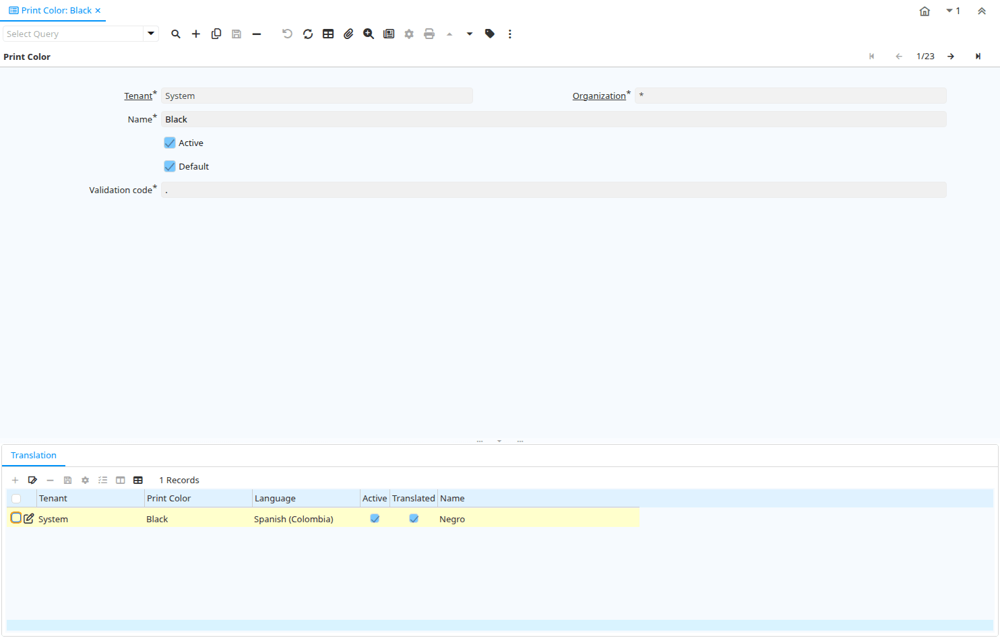

# Print Color

Window ID 238

*11/07/2002 → 02/01/2000*

**Description:** Maintain Print Color

**Comment/Help:** Colors used for printing

## Tab: Print Color

*Tab Level 0 · Created 11/07/2002 · Updated 02/01/2000*

**Description:** Maintain Print Color

**Comment/Help:** Colors used for printing

| **Name** | **Description** | **Comment/Help** | **Technical Data** |
|---|---|---|---|
| Tenant | Tenant for this installation. | A Tenant is a company or a legal entity. You cannot share data between Tenants. | AD_PrintColor.AD_Client_ID<small> numeric(10)   Table Direct</small> |
| Organization | Organizational entity within tenant | An organization is a unit of your tenant or legal entity - examples are store, department. You can share data between organizations. | AD_PrintColor.AD_Org_ID<small> numeric(10)   Table Direct</small> |
| Name | Alphanumeric identifier of the entity | The name of an entity (record) is used as an default search option in addition to the search key. The name is up to 60 characters in length. | AD_PrintColor.Name<small> character varying(60)   String</small> |
| Active | The record is active in the system | There are two methods of making records unavailable in the system: One is to delete the record, the other is to de-activate the record. A de-activated record is not available for selection, but available for reports. There are two reasons for de-activating and not deleting records: (1) The system requires the record for audit purposes. (2) The record is referenced by other records. E.g., you cannot delete a Business Partner, if there are invoices for this partner record existing. You de-activate the Business Partner and prevent that this record is used for future entries. | AD_PrintColor.IsActive<small> character(1)   Yes-No</small> |
| Default | Default value | The Default Checkbox indicates if this record will be used as a default value. | AD_PrintColor.IsDefault<small> character(1)   Yes-No</small> |
| Validation code | Validation Code | The Validation Code displays the date, time and message of the error. | AD_PrintColor.Code<small> character varying(2000)   String</small> |

## Tab: › Translation

*Tab Level 1 · Created 21/03/2014 · Updated 27/10/2024*

| **Name** | **Description** | **Comment/Help** | **Technical Data** |
|---|---|---|---|
| Tenant | Tenant for this installation. | A Tenant is a company or a legal entity. You cannot share data between Tenants. | AD_PrintColor_Trl.AD_Client_ID<small> numeric(10)   Table Direct</small> |
| Organization | Organizational entity within tenant | An organization is a unit of your tenant or legal entity - examples are store, department. You can share data between organizations. | AD_PrintColor_Trl.AD_Org_ID<small> numeric(10)   Table Direct</small> |
| Print Color | Color used for printing and display | Colors used for printing and display | AD_PrintColor_Trl.AD_PrintColor_ID<small> numeric(10)   Search</small> |
| Language | Language for this entity | The Language identifies the language to use for display and formatting | AD_PrintColor_Trl.AD_Language<small> character varying(6)   Table</small> |
| Active | The record is active in the system | There are two methods of making records unavailable in the system: One is to delete the record, the other is to de-activate the record. A de-activated record is not available for selection, but available for reports. There are two reasons for de-activating and not deleting records: (1) The system requires the record for audit purposes. (2) The record is referenced by other records. E.g., you cannot delete a Business Partner, if there are invoices for this partner record existing. You de-activate the Business Partner and prevent that this record is used for future entries. | AD_PrintColor_Trl.IsActive<small> character(1)   Yes-No</small> |
| Translated | This column is translated | The Translated checkbox indicates if this column is translated. | AD_PrintColor_Trl.IsTranslated<small> character(1)   Yes-No</small> |
| Name | Alphanumeric identifier of the entity | The name of an entity (record) is used as an default search option in addition to the search key. The name is up to 60 characters in length. | AD_PrintColor_Trl.Name<small> character varying(60)   String</small> |

