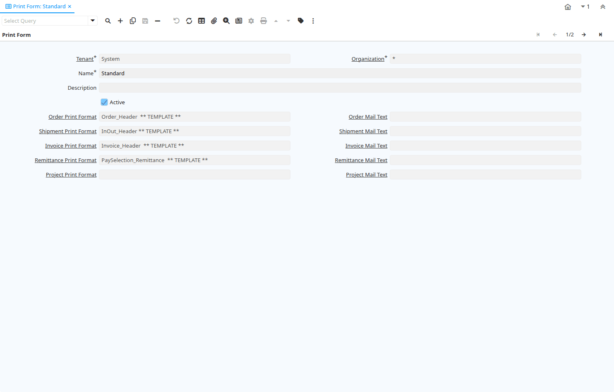

# Print Form

Window ID 224

*28/07/2001 → 15/01/2024*

**Description:** Maintain Print Forms (Invoices, Checks, ..) used

**Comment/Help:** Define the documents you use for this Tenant/Organization.  Note that the check format is defined in the Bank (Account) Window.&lt;p&gt;
The highest priority has the Print Format you define on a Document Type (example specific Export Invoice format). The next level is the set of Print Formats you defined for the organization of the document printed. The default is the set of Print Formats defines for all organizations of the Tenant (Organization=*).

## Tab: Print Form

*Tab Level 0 · Created 28/07/2001 · Updated 02/01/2000*

**Description:** Maintain Print Form (Invoices, Checks, ..) information

**Comment/Help:** The selection determines what Print Format is used to print a particular Form for your Organization.

| **Name** | **Description** | **Comment/Help** | **Technical Data** |
|---|---|---|---|
| Tenant | Tenant for this installation. | A Tenant is a company or a legal entity. You cannot share data between Tenants. | AD_PrintForm.AD_Client_ID<small> numeric(10)   Table Direct</small> |
| Organization | Organizational entity within tenant | An organization is a unit of your tenant or legal entity - examples are store, department. You can share data between organizations. | AD_PrintForm.AD_Org_ID<small> numeric(10)   Table Direct</small> |
| Name | Alphanumeric identifier of the entity | The name of an entity (record) is used as an default search option in addition to the search key. The name is up to 60 characters in length. | AD_PrintForm.Name<small> character varying(60)   String</small> |
| Description | Optional short description of the record | A description is limited to 255 characters. | AD_PrintForm.Description<small> character varying(255)   String</small> |
| Active | The record is active in the system | There are two methods of making records unavailable in the system: One is to delete the record, the other is to de-activate the record. A de-activated record is not available for selection, but available for reports. There are two reasons for de-activating and not deleting records: (1) The system requires the record for audit purposes. (2) The record is referenced by other records. E.g., you cannot delete a Business Partner, if there are invoices for this partner record existing. You de-activate the Business Partner and prevent that this record is used for future entries. | AD_PrintForm.IsActive<small> character(1)   Yes-No</small> |
| Order Print Format | Print Format for Orders, Quotes, Offers | You need to define a Print Format to print the document. | AD_PrintForm.Order_PrintFormat_ID<small> numeric(10)   Table</small> |
| Order Mail Text | Email text used for sending order acknowledgements or quotations | Standard email template used to send acknowledgements or quotations as attachments. | AD_PrintForm.Order_MailText_ID<small> numeric(10)   Table</small> |
| Shipment Print Format | Print Format for Shipments, Receipts, Pick Lists | You need to define a Print Format to print the document. | AD_PrintForm.Shipment_PrintFormat_ID<small> numeric(10)   Table</small> |
| Shipment Mail Text | Email text used for sending delivery notes | Standard email template used to send delivery notes as attachments. | AD_PrintForm.Shipment_MailText_ID<small> numeric(10)   Table</small> |
| Invoice Print Format | Print Format for printing Invoices | You need to define a Print Format to print the document. | AD_PrintForm.Invoice_PrintFormat_ID<small> numeric(10)   Table</small> |
| Invoice Mail Text | Email text used for sending invoices | Standard email template used to send invoices as attachments. | AD_PrintForm.Invoice_MailText_ID<small> numeric(10)   Table</small> |
| Remittance Print Format | Print Format for separate Remittances | You need to define a Print Format to print the document. | AD_PrintForm.Remittance_PrintFormat_ID<small> numeric(10)   Table</small> |
| Remittance Mail Text | Email text used for sending payment remittances | Standard email template used to send remittances as attachments. | AD_PrintForm.Remittance_MailText_ID<small> numeric(10)   Table</small> |
| Project Print Format | Standard Project Print Format | Standard Project Print Format | AD_PrintForm.Project_PrintFormat_ID<small> numeric(10)   Table</small> |
| Project Mail Text | Standard text for Project EMails | Standard text for Project EMails | AD_PrintForm.Project_MailText_ID<small> numeric(10)   Table</small> |

