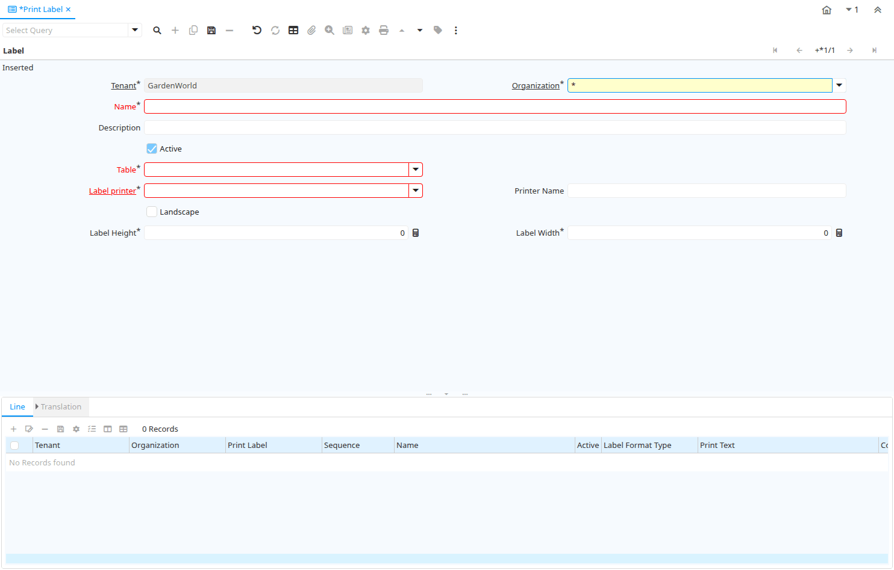

# Print Label

Window ID 263

*28/05/2003 → 17/02/2022*

**Description:** Print Label Format

**Comment/Help:** Maintain Format to print Labels

## Tab: Label

*Tab Level 0 · Created 28/05/2003 · Updated 02/01/2000*

**Description:** Print Label

**Comment/Help:** Maintain the Format for printing Labels

| **Name** | **Description** | **Comment/Help** | **Technical Data** |
|---|---|---|---|
| Tenant | Tenant for this installation. | A Tenant is a company or a legal entity. You cannot share data between Tenants. | AD_PrintLabel.AD_Client_ID<small> numeric(10)   Table Direct</small> |
| Organization | Organizational entity within tenant | An organization is a unit of your tenant or legal entity - examples are store, department. You can share data between organizations. | AD_PrintLabel.AD_Org_ID<small> numeric(10)   Table Direct</small> |
| Name | Alphanumeric identifier of the entity | The name of an entity (record) is used as an default search option in addition to the search key. The name is up to 60 characters in length. | AD_PrintLabel.Name<small> character varying(60)   String</small> |
| Description | Optional short description of the record | A description is limited to 255 characters. | AD_PrintLabel.Description<small> character varying(255)   String</small> |
| Active | The record is active in the system | There are two methods of making records unavailable in the system: One is to delete the record, the other is to de-activate the record. A de-activated record is not available for selection, but available for reports. There are two reasons for de-activating and not deleting records: (1) The system requires the record for audit purposes. (2) The record is referenced by other records. E.g., you cannot delete a Business Partner, if there are invoices for this partner record existing. You de-activate the Business Partner and prevent that this record is used for future entries. | AD_PrintLabel.IsActive<small> character(1)   Yes-No</small> |
| Table | Database Table information | The Database Table provides the information of the table definition | AD_PrintLabel.AD_Table_ID<small> numeric(10)   Table Direct</small> |
| Label printer | Label Printer Definition |  | AD_PrintLabel.AD_LabelPrinter_ID<small> numeric(10)   Table Direct</small> |
| Printer Name | Name of the Printer | Internal (Operating System) Name of the Printer; Please mote that the printer name may be different on different tenants. Enter a printer name, which applies to ALL tenants (e.g. printer on a server). &lt;p&gt; If none is entered, the default printer is used. You specify your default printer when you log in. You can also change the default printer in Preferences. | AD_PrintLabel.PrinterName<small> character varying(40)   String</small> |
| Landscape | Landscape orientation |  | AD_PrintLabel.IsLandscape<small> character(1)   Yes-No</small> |
| Label Height | Height of the label | Physical height of the label | AD_PrintLabel.LabelHeight<small> numeric(10)   Integer</small> |
| Label Width | Width of the Label | Physical Width of the Label | AD_PrintLabel.LabelWidth<small> numeric(10)   Integer</small> |

## Tab: › Line

*Tab Level 1 · Created 28/05/2003 · Updated 02/01/2000*

**Description:** Print Label Line

**Comment/Help:** Maintain Format of the line on a Label

| **Name** | **Description** | **Comment/Help** | **Technical Data** |
|---|---|---|---|
| Tenant | Tenant for this installation. | A Tenant is a company or a legal entity. You cannot share data between Tenants. | AD_PrintLabelLine.AD_Client_ID<small> numeric(10)   Table Direct</small> |
| Organization | Organizational entity within tenant | An organization is a unit of your tenant or legal entity - examples are store, department. You can share data between organizations. | AD_PrintLabelLine.AD_Org_ID<small> numeric(10)   Table Direct</small> |
| Print Label | Label Format to print | Format for printing Labels | AD_PrintLabelLine.AD_PrintLabel_ID<small> numeric(10)   Table Direct</small> |
| Sequence | Method of ordering records; lowest number comes first | The Sequence indicates the order of records | AD_PrintLabelLine.SeqNo<small> numeric(10)   Integer</small> |
| Name | Alphanumeric identifier of the entity | The name of an entity (record) is used as an default search option in addition to the search key. The name is up to 60 characters in length. | AD_PrintLabelLine.Name<small> character varying(60)   String</small> |
| Active | The record is active in the system | There are two methods of making records unavailable in the system: One is to delete the record, the other is to de-activate the record. A de-activated record is not available for selection, but available for reports. There are two reasons for de-activating and not deleting records: (1) The system requires the record for audit purposes. (2) The record is referenced by other records. E.g., you cannot delete a Business Partner, if there are invoices for this partner record existing. You de-activate the Business Partner and prevent that this record is used for future entries. | AD_PrintLabelLine.IsActive<small> character(1)   Yes-No</small> |
| Label Format Type | Label Format Type |  | AD_PrintLabelLine.LabelFormatType<small> character(1)   List</small> |
| Print Text | The label text to be printed on a document or correspondence. | The Label to be printed indicates the name that will be printed on a document or correspondence. The max length is 2000 characters. | AD_PrintLabelLine.PrintName<small> character varying(60)   String</small> |
| Column | Column in the table | Link to the database column of the table | AD_PrintLabelLine.AD_Column_ID<small> numeric(10)   Table Direct</small> |
| X Position | Absolute X (horizontal) position in 1/72 of an inch | Absolute X (horizontal) position in 1/72 of an inch | AD_PrintLabelLine.XPosition<small> numeric(10)   Integer</small> |
| Y Position | Absolute Y (vertical) position in 1/72 of an inch | Absolute Y (vertical) position in 1/72 of an inch | AD_PrintLabelLine.YPosition<small> numeric(10)   Integer</small> |
| Label printer Function | Function of Label Printer |  | AD_PrintLabelLine.AD_LabelPrinterFunction_ID<small> numeric(10)   Table Direct</small> |

## Tab: › › › Translation

*Tab Level 3 · Created 28/05/2003 · Updated 27/10/2024*

**Description:** Print Label Line Translation

**Comment/Help:** Maintain the translation for Label Line formats

| **Name** | **Description** | **Comment/Help** | **Technical Data** |
|---|---|---|---|
| Tenant | Tenant for this installation. | A Tenant is a company or a legal entity. You cannot share data between Tenants. | AD_PrintLabelLine_Trl.AD_Client_ID<small> numeric(10)   Table Direct</small> |
| Organization | Organizational entity within tenant | An organization is a unit of your tenant or legal entity - examples are store, department. You can share data between organizations. | AD_PrintLabelLine_Trl.AD_Org_ID<small> numeric(10)   Table Direct</small> |
| Print Label Line | Print Label Line Format | Format of the line on a Label | AD_PrintLabelLine_Trl.AD_PrintLabelLine_ID<small> numeric(10)   Table Direct</small> |
| Language | Language for this entity | The Language identifies the language to use for display and formatting | AD_PrintLabelLine_Trl.AD_Language<small> character varying(6)   Table</small> |
| Active | The record is active in the system | There are two methods of making records unavailable in the system: One is to delete the record, the other is to de-activate the record. A de-activated record is not available for selection, but available for reports. There are two reasons for de-activating and not deleting records: (1) The system requires the record for audit purposes. (2) The record is referenced by other records. E.g., you cannot delete a Business Partner, if there are invoices for this partner record existing. You de-activate the Business Partner and prevent that this record is used for future entries. | AD_PrintLabelLine_Trl.IsActive<small> character(1)   Yes-No</small> |
| Translated | This column is translated | The Translated checkbox indicates if this column is translated. | AD_PrintLabelLine_Trl.IsTranslated<small> character(1)   Yes-No</small> |
| Print Text | The label text to be printed on a document or correspondence. | The Label to be printed indicates the name that will be printed on a document or correspondence. The max length is 2000 characters. | AD_PrintLabelLine_Trl.PrintName<small> character varying(60)   String</small> |

