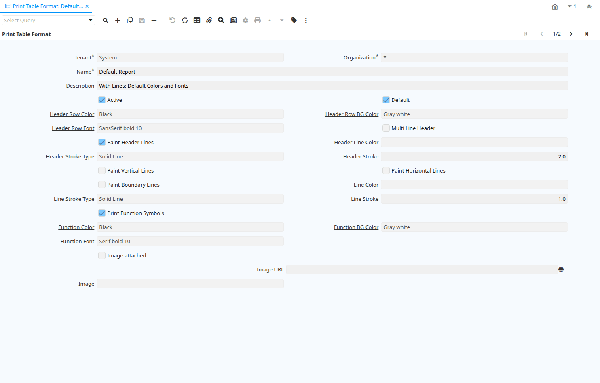

# Print Table Format

Window ID 243

*24/08/2002 → 02/01/2000*

**Description:** Define Report Table Format

**Comment/Help:** The Print Table Format lets you define how table header, etc. is printed. Please note that the Report Table FOrmat is cached to improve performance.

## Tab: Print Table Format

*Tab Level 0 · Created 24/08/2002 · Updated 02/01/2000*

**Description:** Define Report Table Format

**Comment/Help:** The Print Table Format lets you define how table header, etc. is printed. If you leave the entries empty, the default colors and fonts are used:&lt;br&gt;
Fonts are based on the Font used in the Report; Page Header and Table Header will be bold, the Function Font is Bold-Italic, the Footer Font is two points smaller, the Parameter Font is Italic.

| **Name** | **Description** | **Comment/Help** | **Technical Data** |
|---|---|---|---|
| Tenant | Tenant for this installation. | A Tenant is a company or a legal entity. You cannot share data between Tenants. | AD_PrintTableFormat.AD_Client_ID<small> numeric(10)   Table Direct</small> |
| Organization | Organizational entity within tenant | An organization is a unit of your tenant or legal entity - examples are store, department. You can share data between organizations. | AD_PrintTableFormat.AD_Org_ID<small> numeric(10)   Table Direct</small> |
| Name | Alphanumeric identifier of the entity | The name of an entity (record) is used as an default search option in addition to the search key. The name is up to 60 characters in length. | AD_PrintTableFormat.Name<small> character varying(60)   String</small> |
| Description | Optional short description of the record | A description is limited to 255 characters. | AD_PrintTableFormat.Description<small> character varying(255)   String</small> |
| Active | The record is active in the system | There are two methods of making records unavailable in the system: One is to delete the record, the other is to de-activate the record. A de-activated record is not available for selection, but available for reports. There are two reasons for de-activating and not deleting records: (1) The system requires the record for audit purposes. (2) The record is referenced by other records. E.g., you cannot delete a Business Partner, if there are invoices for this partner record existing. You de-activate the Business Partner and prevent that this record is used for future entries. | AD_PrintTableFormat.IsActive<small> character(1)   Yes-No</small> |
| Default | Default value | The Default Checkbox indicates if this record will be used as a default value. | AD_PrintTableFormat.IsDefault<small> character(1)   Yes-No</small> |
| Header Row Color | Foreground color if the table header row | Table header row foreground color | AD_PrintTableFormat.HdrTextFG_PrintColor_ID<small> numeric(10)   Table</small> |
| Header Row BG Color | Background color of header row | Table header row background color | AD_PrintTableFormat.HdrTextBG_PrintColor_ID<small> numeric(10)   Table</small> |
| Header Row Font | Header row Font | Font of the table header row | AD_PrintTableFormat.Hdr_PrintFont_ID<small> numeric(10)   Table</small> |
| Multi Line Header | Print column headers on multiple lines if necessary. | If selected, column header text will wrap onto the next line -- otherwise the text will be truncated. | AD_PrintTableFormat.IsMultiLineHeader<small> character(1)   Yes-No</small> |
| Paint Header Lines | Paint Lines over/under the Header Line  | If selected, a line is painted above and below the header line using the stroke information | AD_PrintTableFormat.IsPaintHeaderLines<small> character(1)   Yes-No</small> |
| Header Line Color | Table header row line color | Color of the table header row lines | AD_PrintTableFormat.HdrLine_PrintColor_ID<small> numeric(10)   Table</small> |
| Header Stroke Type | Type of the Header Line Stroke | Type of the line printed | AD_PrintTableFormat.HdrStrokeType<small> character(1)   List</small> |
| Header Stroke | Width of the Header Line Stroke | The width of the header line stroke (line thickness) in Points. | AD_PrintTableFormat.HdrStroke<small> numeric   Number</small> |
| Paint Vertical Lines | Paint vertical lines | Paint vertical table lines | AD_PrintTableFormat.IsPaintVLines<small> character(1)   Yes-No</small> |
| Paint Horizontal Lines | Paint horizontal lines | Paint horizontal table lines | AD_PrintTableFormat.IsPaintHLines<small> character(1)   Yes-No</small> |
| Paint Boundary Lines | Paint table boundary lines | Paint lines around table | AD_PrintTableFormat.IsPaintBoundaryLines<small> character(1)   Yes-No</small> |
| Line Color | Table line color |  | AD_PrintTableFormat.Line_PrintColor_ID<small> numeric(10)   Table</small> |
| Line Stroke Type | Type of the Line Stroke | Type of the line printed | AD_PrintTableFormat.LineStrokeType<small> character(1)   List</small> |
| Line Stroke | Width of the Line Stroke | The width of the line stroke (line thickness) in Points. | AD_PrintTableFormat.LineStroke<small> numeric   Number</small> |
| Print Function Symbols | Print Symbols for Functions (Sum, Average, Count) | If selected, print symbols - otherwise print names of the function | AD_PrintTableFormat.IsPrintFunctionSymbols<small> character(1)   Yes-No</small> |
| Function Color | Function Foreground Color | Foreground color of a function row | AD_PrintTableFormat.FunctFG_PrintColor_ID<small> numeric(10)   Table</small> |
| Function BG Color | Function Background Color | Background color of a function row | AD_PrintTableFormat.FunctBG_PrintColor_ID<small> numeric(10)   Table</small> |
| Function Font | Function row Font | Font of the function row | AD_PrintTableFormat.Funct_PrintFont_ID<small> numeric(10)   Table</small> |
| Image attached | The image to be printed is attached to the record | The image to be printed is stored in the database as attachment to this record. The image can be a gif, jpeg or png. | AD_PrintTableFormat.ImageIsAttached<small> character(1)   Yes-No</small> |
| Image URL | URL of  image | URL of image; The image is not stored in the database, but retrieved at runtime. The image can be a gif, jpeg or png. | AD_PrintTableFormat.ImageURL<small> character varying(120)   URL</small> |
| Image | Image or Icon | Images and Icon can be used to display supported graphic formats (gif, jpg, png). You can either load the image (in the database) or point to a graphic via a URI (i.e. it can point to a resource, http address) | AD_PrintTableFormat.AD_Image_ID<small> numeric(10)   Table Direct</small> |

