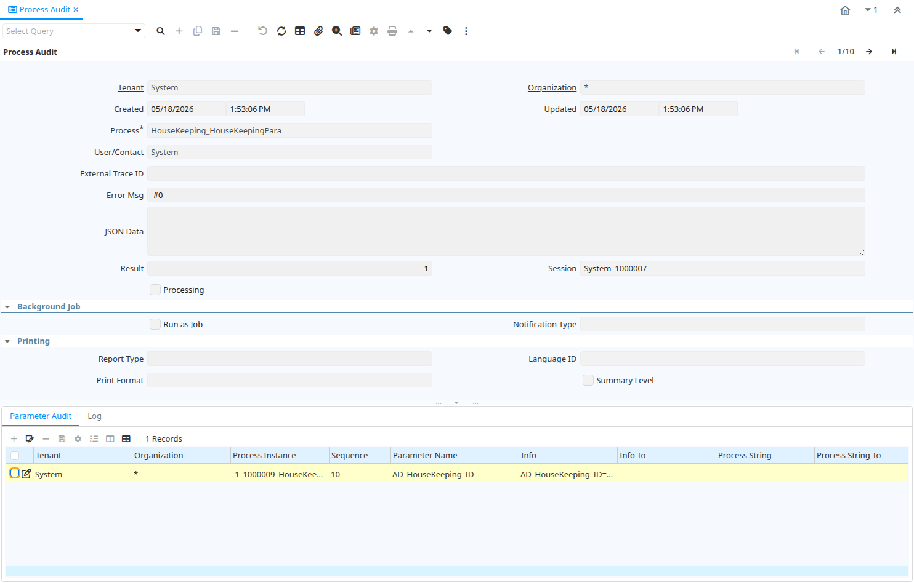

# Process Audit

Window ID 332

*15/06/2004 → 02/01/2000*

**Description:** Audit process use

**Comment/Help:** Process Instance Information

## Tab: Process Audit

*Tab Level 0 · Created 15/06/2004 · Updated 02/01/2000*

**Description:** Audit Process use

| **Name** | **Description** | **Comment/Help** | **Technical Data** |
|---|---|---|---|
| Tenant | Tenant for this installation. | A Tenant is a company or a legal entity. You cannot share data between Tenants. | AD_PInstance.AD_Client_ID<small> numeric(10)   Table Direct</small> |
| Organization | Organizational entity within tenant | An organization is a unit of your tenant or legal entity - examples are store, department. You can share data between organizations. | AD_PInstance.AD_Org_ID<small> numeric(10)   Table Direct</small> |
| Created | Date this record was created | The Created field indicates the date that this record was created. | AD_PInstance.Created<small> timestamp without time zone   Date+Time</small> |
| Updated | Date this record was updated | The Updated field indicates the date that this record was updated. | AD_PInstance.Updated<small> timestamp without time zone   Date+Time</small> |
| Process | Process or Report | The Process field identifies a unique Process or Report in the system. | AD_PInstance.AD_Process_ID<small> numeric(10)   Table Direct</small> |
| Table | Database Table information | The Database Table provides the information of the table definition | AD_PInstance.AD_Table_ID<small> numeric(10)   Table Direct</small> |
| Record ID | Direct internal record ID | The Record ID is the internal unique identifier of a record. Please note that zooming to the record may not be successful for Orders, Invoices and Shipment/Receipts as sometimes the Sales Order type is not known. | AD_PInstance.Record_ID<small> numeric(10)   Record ID</small> |
| Record UUID |  |  | AD_PInstance.Record_UU<small> uuid   Record UUID</small> |
| User/Contact | User within the system - Internal or Business Partner Contact | The User identifies a unique user in the system. This could be an internal user or a business partner contact | AD_PInstance.AD_User_ID<small> numeric(10)   Table Direct</small> |
| External Trace ID | External identifier used for audit tracing |  | AD_PInstance.ExternalTraceId<small> character varying(100)   String</small> |
| Error Msg |  |  | AD_PInstance.ErrorMsg<small> character varying(2000)   String</small> |
| JSON Data | The json field stores json data. |  | AD_PInstance.JsonData<small> json   JSON</small> |
| Result | Result of the action taken | The Result indicates the result of any action taken on this request. | AD_PInstance.Result<small> numeric(10)   Integer</small> |
| Session | User Session Online or Web | Online or Web Session Information | AD_PInstance.AD_Session_ID<small> numeric(10)   Search</small> |
| Processing |  |  | AD_PInstance.IsProcessing<small> character(1)   Yes-No</small> |
| Run as Job |  |  | AD_PInstance.IsRunAsJob<small> character(1)   Yes-No</small> |
| Notification Type | Type of Notifications | Emails or Notification sent out for Request Updates, etc. | AD_PInstance.NotificationType<small> character varying(2)   List</small> |
| Report Type |  |  | AD_PInstance.ReportType<small> character varying(5)   String</small> |
| Language ID |  |  | AD_PInstance.AD_Language_ID<small> numeric(10)   Table Direct</small> |
| Print Format | Data Print Format | The print format determines how data is rendered for print. | AD_PInstance.AD_PrintFormat_ID<small> numeric(10)   Table Direct</small> |
| Summary Level | This is a summary entity | A summary entity represents a branch in a tree rather than an end-node. Summary entities are used for reporting and do not have own values. | AD_PInstance.IsSummary<small> character(1)   Yes-No</small> |
| Name | Alphanumeric identifier of the entity | The name of an entity (record) is used as an default search option in addition to the search key. The name is up to 60 characters in length. | AD_PInstance.Name<small> character varying(60)   String</small> |

## Tab: › Parameter Audit

*Tab Level 1 · Created 15/06/2004 · Updated 02/01/2000*

**Description:** Audit Process Parameter Values

| **Name** | **Description** | **Comment/Help** | **Technical Data** |
|---|---|---|---|
| Tenant | Tenant for this installation. | A Tenant is a company or a legal entity. You cannot share data between Tenants. | AD_PInstance_Para.AD_Client_ID<small> numeric(10)   Table Direct</small> |
| Organization | Organizational entity within tenant | An organization is a unit of your tenant or legal entity - examples are store, department. You can share data between organizations. | AD_PInstance_Para.AD_Org_ID<small> numeric(10)   Table Direct</small> |
| Process Instance | Instance of the process |  | AD_PInstance_Para.AD_PInstance_ID<small> numeric(10)   Search</small> |
| Sequence | Method of ordering records; lowest number comes first | The Sequence indicates the order of records | AD_PInstance_Para.SeqNo<small> numeric(10)   ID</small> |
| Parameter Name |  |  | AD_PInstance_Para.ParameterName<small> character varying(60)   String</small> |
| Info | Information | The Information displays data from the source document line. | AD_PInstance_Para.Info<small> character varying(4000)   String</small> |
| Info To |  |  | AD_PInstance_Para.Info_To<small> character varying(4000)   String</small> |
| Process String | Process Parameter |  | AD_PInstance_Para.P_String<small> character varying(4000)   String</small> |
| Process String To | Process Parameter |  | AD_PInstance_Para.P_String_To<small> character varying(4000)   String</small> |
| Process Date | Process Parameter |  | AD_PInstance_Para.P_Date<small> timestamp without time zone   Date+Time</small> |
| Process Date To | Process Parameter |  | AD_PInstance_Para.P_Date_To<small> timestamp without time zone   Date+Time</small> |
| Process Number | Process Parameter |  | AD_PInstance_Para.P_Number<small> numeric   Number</small> |
| Process Number To | Process Parameter |  | AD_PInstance_Para.P_Number_To<small> numeric   Number</small> |
| Not Clause | Indicates if a chosen multiple component value must be negate |  | AD_PInstance_Para.IsNotClause<small> character(1)   Yes-No</small> |

## Tab: › Log

*Tab Level 1 · Created 15/06/2004 · Updated 02/01/2000*

**Description:** Process Log

| **Name** | **Description** | **Comment/Help** | **Technical Data** |
|---|---|---|---|
| Process Instance | Instance of the process |  | AD_PInstance_Log.AD_PInstance_ID<small> numeric(10)   Search</small> |
| Log |  |  | AD_PInstance_Log.Log_ID<small> numeric(10)   Integer</small> |
| Process ID |  |  | AD_PInstance_Log.P_ID<small> numeric(10)   ID</small> |
| Process Date | Process Parameter |  | AD_PInstance_Log.P_Date<small> timestamp without time zone   Date</small> |
| Process Number | Process Parameter |  | AD_PInstance_Log.P_Number<small> numeric   Number</small> |
| Process Message |  |  | AD_PInstance_Log.P_Msg<small> character varying(4000)   Memo</small> |
| JSON Data | The json field stores json data. |  | AD_PInstance_Log.JsonData<small> json   JSON</small> |
| Table | Database Table information | The Database Table provides the information of the table definition | AD_PInstance_Log.AD_Table_ID<small> numeric(10)   Table Direct</small> |
| Record ID | Direct internal record ID | The Record ID is the internal unique identifier of a record. Please note that zooming to the record may not be successful for Orders, Invoices and Shipment/Receipts as sometimes the Sales Order type is not known. | AD_PInstance_Log.Record_ID<small> numeric(10)   Record ID</small> |
| Log Type | Process Audit Log Type |  | AD_PInstance_Log.PInstanceLogType<small> character varying(3)   List</small> |

