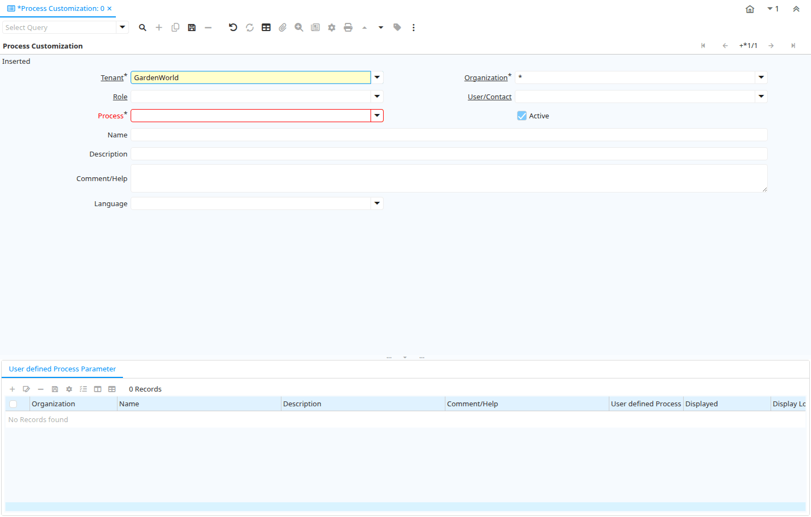

# Process Customization

Window ID 200095

*24/11/2017 → 20/09/2023*

**Description:** Define Process Customization for Role/User

**Comment/Help:** The customization values defined here overwrite/replace the default system definition if defined.

## Tab: Process Customization

*Tab Level 0 · Created 24/11/2017 · Updated 27/10/2024*

**Description:** User defined Process

**Comment/Help:** User defined Process

| **Name** | **Description** | **Comment/Help** | **Technical Data** |
|---|---|---|---|
| Tenant | Tenant for this installation. | A Tenant is a company or a legal entity. You cannot share data between Tenants. | AD_UserDef_Proc.AD_Client_ID<small> numeric(10)   Table Direct</small> |
| Organization | Organizational entity within tenant | An organization is a unit of your tenant or legal entity - examples are store, department. You can share data between organizations. | AD_UserDef_Proc.AD_Org_ID<small> numeric(10)   Table Direct</small> |
| Role | Responsibility Role | The Role determines security and access a user who has this Role will have in the System. | AD_UserDef_Proc.AD_Role_ID<small> numeric(10)   Table Direct</small> |
| User/Contact | User within the system - Internal or Business Partner Contact | The User identifies a unique user in the system. This could be an internal user or a business partner contact | AD_UserDef_Proc.AD_User_ID<small> numeric(10)   Table Direct</small> |
| Process | Process or Report | The Process field identifies a unique Process or Report in the system. | AD_UserDef_Proc.AD_Process_ID<small> numeric(10)   Table Direct</small> |
| Active | The record is active in the system | There are two methods of making records unavailable in the system: One is to delete the record, the other is to de-activate the record. A de-activated record is not available for selection, but available for reports. There are two reasons for de-activating and not deleting records: (1) The system requires the record for audit purposes. (2) The record is referenced by other records. E.g., you cannot delete a Business Partner, if there are invoices for this partner record existing. You de-activate the Business Partner and prevent that this record is used for future entries. | AD_UserDef_Proc.IsActive<small> character(1)   Yes-No</small> |
| Name | Alphanumeric identifier of the entity | The name of an entity (record) is used as an default search option in addition to the search key. The name is up to 60 characters in length. | AD_UserDef_Proc.Name<small> character varying(60)   String</small> |
| Description | Optional short description of the record | A description is limited to 255 characters. | AD_UserDef_Proc.Description<small> character varying(255)   String</small> |
| Comment/Help | Comment or Hint | The Help field contains a hint, comment or help about the use of this item. | AD_UserDef_Proc.Help<small> character varying(2000)   Text</small> |
| Language | Language for this entity | The Language identifies the language to use for display and formatting | AD_UserDef_Proc.AD_Language<small> character varying(6)   Table</small> |

## Tab: › User defined Process Parameter

*Tab Level 1 · Created 24/11/2017 · Updated 27/10/2024*

**Description:** User defined Process Parameter

**Comment/Help:** User defined Process Parameter

| **Name** | **Description** | **Comment/Help** | **Technical Data** |
|---|---|---|---|
| Tenant | Tenant for this installation. | A Tenant is a company or a legal entity. You cannot share data between Tenants. | AD_UserDef_Proc_Parameter.AD_Client_ID<small> numeric(10)   Table Direct</small> |
| Organization | Organizational entity within tenant | An organization is a unit of your tenant or legal entity - examples are store, department. You can share data between organizations. | AD_UserDef_Proc_Parameter.AD_Org_ID<small> numeric(10)   Table Direct</small> |
| User defined Process | Primary Key : User defined Process | Primary Key : User defined Process | AD_UserDef_Proc_Parameter.AD_UserDef_Proc_ID<small> numeric(10)   Table Direct</small> |
| Active | The record is active in the system | There are two methods of making records unavailable in the system: One is to delete the record, the other is to de-activate the record. A de-activated record is not available for selection, but available for reports. There are two reasons for de-activating and not deleting records: (1) The system requires the record for audit purposes. (2) The record is referenced by other records. E.g., you cannot delete a Business Partner, if there are invoices for this partner record existing. You de-activate the Business Partner and prevent that this record is used for future entries. | AD_UserDef_Proc_Parameter.IsActive<small> character(1)   Yes-No</small> |
| Process Parameter |  |  | AD_UserDef_Proc_Parameter.AD_Process_Para_ID<small> numeric(10)   Table Direct</small> |
| Range | The parameter is a range of values | The Range checkbox indicates that this parameter is a range of values. | AD_UserDef_Proc_Parameter.IsRange<small> character(1)   Yes-No</small> |
| Name | Alphanumeric identifier of the entity | The name of an entity (record) is used as an default search option in addition to the search key. The name is up to 60 characters in length. | AD_UserDef_Proc_Parameter.Name<small> character varying(60)   String</small> |
| Description | Optional short description of the record | A description is limited to 255 characters. | AD_UserDef_Proc_Parameter.Description<small> character varying(255)   String</small> |
| Comment/Help | Comment or Hint | The Help field contains a hint, comment or help about the use of this item. | AD_UserDef_Proc_Parameter.Help<small> character varying(2000)   Text</small> |
| Placeholder |  |  | AD_UserDef_Proc_Parameter.Placeholder<small> character varying(255)   String</small> |
| Placeholder2 |  |  | AD_UserDef_Proc_Parameter.Placeholder2<small> character varying(255)   String</small> |
| Sequence | Method of ordering records; lowest number comes first | The Sequence indicates the order of records | AD_UserDef_Proc_Parameter.SeqNo<small> numeric(10)   Integer</small> |
| Reference | System Reference and Validation | The Reference could be a display type, list or table validation. | AD_UserDef_Proc_Parameter.AD_Reference_ID<small> numeric(10)   Table</small> |
| Reference Key | Required to specify, if data type is Table or List | The Reference Value indicates where the reference values are stored.  It must be specified if the data type is Table or List.   | AD_UserDef_Proc_Parameter.AD_Reference_Value_ID<small> numeric(10)   Table</small> |
| Value Format | Format of the value; Can contain fixed format elements, Variables: "_lLoOaAcCa09", or ~regex | &lt;B&gt;Validation elements:&lt;/B&gt;  ~regex - Validates a regular expression   	(Space) any character _	Space (fixed character) l	any Letter a..Z NO space L	any Letter a..Z NO space converted to upper case o	any Letter a..Z or space O	any Letter a..Z or space converted to upper case a	any Letters &amp; Digits NO space A	any Letters &amp; Digits NO space converted to upper case c	any Letters &amp; Digits or space C	any Letters &amp; Digits or space converted to upper case 0	Digits 0..9 NO space 9	Digits 0..9 or space  Example of format "(000)_000-0000" | AD_UserDef_Proc_Parameter.VFormat<small> character varying(40)   String</small> |
| Dynamic Validation | Dynamic Validation Rule | These rules define how an entry is determined to valid. You can use variables for dynamic (context sensitive) validation. | AD_UserDef_Proc_Parameter.AD_Val_Rule_ID<small> numeric(10)   Table Direct</small> |
| Default Logic | Default value hierarchy, separated by ; | The defaults are evaluated in the order of definition, the first not null value becomes the default value of the column. The values are separated by comma or semicolon. a) Literals:. 'Text' or 123 b) Variables - in format @Variable@ - Login e.g. #Date, #AD_Org_ID, #AD_Tenant_ID - Accounting Schema: e.g. $C_AcctSchema_ID, $C_Calendar_ID - Global defaults: e.g. DateFormat - Window values (all Picks, CheckBoxes, RadioButtons, and DateDoc/DateAcct) c) SQL code with the tag: @SQL=SELECT something AS DefaultValue FROM ... The SQL statement can contain variables.  There can be no other value other than the SQL statement. The default is only evaluated, if no user preference is defined.  Default definitions are ignored for record columns as Key, Parent, Tenant as well as Buttons. | AD_UserDef_Proc_Parameter.DefaultValue<small> character varying(2000)   String</small> |
| Default Logic 2 | Default value hierarchy, separated by ; | The defaults are evaluated in the order of definition, the first not null value becomes the default value of the column. The values are separated by comma or semicolon. a) Literals:. 'Text' or 123 b) Variables - in format @Variable@ - Login e.g. #Date, #AD_Org_ID, #AD_Tenant_ID - Accounting Schema: e.g. $C_AcctSchema_ID, $C_Calendar_ID - Global defaults: e.g. DateFormat - Window values (all Picks, CheckBoxes, RadioButtons, and DateDoc/DateAcct) c) SQL code with the tag: @SQL=SELECT something AS DefaultValue FROM ... The SQL statement can contain variables.  There can be no other value other than the SQL statement. The default is only evaluated, if no user preference is defined.  Default definitions are ignored for record columns as Key, Parent, Tenant as well as Buttons. | AD_UserDef_Proc_Parameter.DefaultValue2<small> character varying(2000)   String</small> |
| Min. Value | Minimum Value for a field | The Minimum Value indicates the lowest  allowable value for a field. use format yyyy-mm-dd for Date | AD_UserDef_Proc_Parameter.ValueMin<small> character varying(20)   String</small> |
| Max. Value | Maximum Value for a field | The Maximum Value indicates the highest allowable value for a field. use format yyyy-mm-dd for Date | AD_UserDef_Proc_Parameter.ValueMax<small> character varying(20)   String</small> |
| Mandatory | Data entry is required in this column | The field must have a value for the record to be saved to the database. | AD_UserDef_Proc_Parameter.IsMandatory<small> character(1)   List</small> |
| Displayed | Determines, if this field is displayed | If the field is displayed, the field Display Logic will determine at runtime, if it is actually displayed | AD_UserDef_Proc_Parameter.IsDisplayed<small> character(1)   List</small> |
| Read Only Logic | Logic to determine if field is read only (applies only when field is read-write) | format := &#123;expression&#125; [&#123;logic&#125; &#123;expression&#125;]&lt;br&gt;  expression := @&#123;context&#125;@&#123;operand&#125;&#123;value&#125; or @&#123;context&#125;@&#123;operand&#125;&#123;value&#125;&lt;br&gt;  logic := &#123;\|&#125;\|&#123;&amp;&#125;&lt;br&gt; context := any global or window context &lt;br&gt; value := strings or numbers&lt;br&gt; logic operators	:= AND or OR with the previous result from left to right &lt;br&gt; operand := eq&#123;=&#125;, gt&#123;&amp;gt;&#125;, le&#123;&amp;lt;&#125;, not&#123;~^!&#125; &lt;br&gt; Examples: &lt;br&gt; &lt;ul&gt; &lt;li&gt; @AD_Table_ID@=14 \| @Language@!GERGER&lt;/li&gt; &lt;li&gt; @PriceLimit@&gt;10 \| @PriceList@&gt;@PriceActual@&lt;/li&gt; &lt;li&gt; @Name@&gt;J&lt;/li&gt; &lt;/ul&gt; Strings may be in single quotes (optional) | AD_UserDef_Proc_Parameter.ReadOnlyLogic<small> character varying(2000)   Text</small> |
| Display Logic | If the Field is displayed, the result determines if the field is actually displayed | format := &#123;expression&#125; [&#123;logic&#125; &#123;expression&#125;]&lt;br&gt;  expression := @&#123;context&#125;@&#123;operand&#125;&#123;value&#125; or @&#123;context&#125;@&#123;operand&#125;&#123;value&#125;&lt;br&gt;  logic := &#123;\|&#125;\|&#123;&amp;&#125;&lt;br&gt; context := any global or window context &lt;br&gt; value := strings or numbers&lt;br&gt; logic operators	:= AND or OR with the previous result from left to right &lt;br&gt; operand := eq&#123;=&#125;, gt&#123;&amp;gt;&#125;, le&#123;&amp;lt;&#125;, not&#123;~^!&#125; &lt;br&gt; Examples: &lt;br&gt; &lt;ul&gt; &lt;li&gt; @AD_Table_ID@=14 \| @Language@!GERGER&lt;/li&gt; &lt;li&gt; @PriceLimit@&gt;10 \| @PriceList@&gt;@PriceActual@&lt;/li&gt; &lt;li&gt; @Name@&gt;J&lt;/li&gt; &lt;/ul&gt; Strings may be in single quotes (optional) | AD_UserDef_Proc_Parameter.DisplayLogic<small> character varying(2000)   Text</small> |
| Mandatory Logic |  |  | AD_UserDef_Proc_Parameter.MandatoryLogic<small> character varying(2000)   Text</small> |
| Field Group | Logical grouping of fields | The Field Group indicates the logical group that this field belongs to (History, Amounts, Quantities) | AD_UserDef_Proc_Parameter.AD_FieldGroup_ID<small> numeric(10)   Table Direct</small> |

