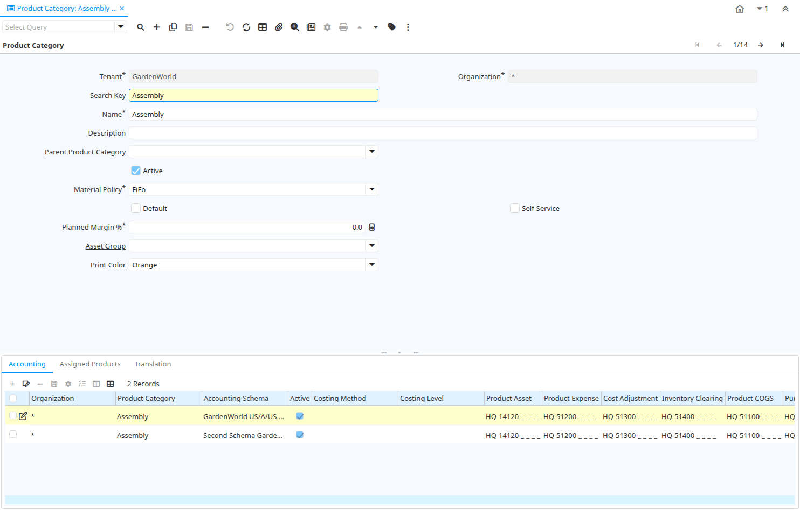

# Product Category

Window ID 144

*09/08/1999 → 24/07/2005*

**Description:** Maintain Product Categories

**Comment/Help:** The Product Category allows you to define different groups of products.  These groups can be used in generating Price Lists, defining margins and for easily assigning different accounting parameters for products.

## Tab: Product Category

*Tab Level 0 · Created 09/08/1999 · Updated 02/01/2000*

**Description:** Define Product Category

**Comment/Help:** The Product Category defines unique groupings of products.  Product categories can be used in building price lists.

| **Name** | **Description** | **Comment/Help** | **Technical Data** |
|---|---|---|---|
| Tenant | Tenant for this installation. | A Tenant is a company or a legal entity. You cannot share data between Tenants. | M_Product_Category.AD_Client_ID<small> numeric(10)   Table Direct</small> |
| Organization | Organizational entity within tenant | An organization is a unit of your tenant or legal entity - examples are store, department. You can share data between organizations. | M_Product_Category.AD_Org_ID<small> numeric(10)   Table Direct</small> |
| Search Key | Search key for the record in the format required - must be unique | A search key allows you a fast method of finding a particular record. If you leave the search key empty, the system automatically creates a numeric number.  The document sequence used for this fallback number is defined in the "Maintain Sequence" window with the name "DocumentNo_&lt;TableName&gt;", where TableName is the actual name of the table (e.g. C_Order). | M_Product_Category.Value<small> character varying(40)   String</small> |
| Name | Alphanumeric identifier of the entity | The name of an entity (record) is used as an default search option in addition to the search key. The name is up to 60 characters in length. | M_Product_Category.Name<small> character varying(60)   String</small> |
| Description | Optional short description of the record | A description is limited to 255 characters. | M_Product_Category.Description<small> character varying(255)   String</small> |
| Active | The record is active in the system | There are two methods of making records unavailable in the system: One is to delete the record, the other is to de-activate the record. A de-activated record is not available for selection, but available for reports. There are two reasons for de-activating and not deleting records: (1) The system requires the record for audit purposes. (2) The record is referenced by other records. E.g., you cannot delete a Business Partner, if there are invoices for this partner record existing. You de-activate the Business Partner and prevent that this record is used for future entries. | M_Product_Category.IsActive<small> character(1)   Yes-No</small> |
| Parent Product Category |  |  | M_Product_Category.M_Product_Category_Parent_ID<small> numeric(10)   Table</small> |
| Material Policy | Material Movement Policy | The Material Movement Policy determines how the stock is flowing (FiFo or LiFo) if a specific Product Instance was not selected.  The policy can not contradict the costing method (e.g. FiFo movement policy and LiFo costing method). | M_Product_Category.MMPolicy<small> character(1)   List</small> |
| Default | Default value | The Default Checkbox indicates if this record will be used as a default value. | M_Product_Category.IsDefault<small> character(1)   Yes-No</small> |
| Self-Service | This is a Self-Service entry or this entry can be changed via Self-Service | Self-Service allows users to enter data or update their data.  The flag indicates, that this record was entered or created via Self-Service or that the user can change it via the Self-Service functionality. | M_Product_Category.IsSelfService<small> character(1)   Yes-No</small> |
| Planned Margin % | Project's planned margin as a percentage | The Planned Margin Percentage indicates the anticipated margin percentage for this project or project line | M_Product_Category.PlannedMargin<small> numeric   Number</small> |
| Asset Group | Group of Assets | The group of assets determines default accounts.  If an asset group is selected in the product category, assets are created when delivering the asset. | M_Product_Category.A_Asset_Group_ID<small> numeric(10)   Table Direct</small> |
| Print Color | Color used for printing and display | Colors used for printing and display | M_Product_Category.AD_PrintColor_ID<small> numeric(10)   Table Direct</small> |

## Tab: › Accounting

*Tab Level 1 · Created 18/12/2000 · Updated 05/03/2013*

**Description:** Accounting Parameters

**Comment/Help:** The Accounting Tab defines default accounting parameters.  Any product that uses a product category can inherit its default accounting parameters.  If the Costing method is not defined, the default costing method of the accounting schema is used.

| **Name** | **Description** | **Comment/Help** | **Technical Data** |
|---|---|---|---|
| Tenant | Tenant for this installation. | A Tenant is a company or a legal entity. You cannot share data between Tenants. | M_Product_Category_Acct.AD_Client_ID<small> numeric(10)   Table Direct</small> |
| Organization | Organizational entity within tenant | An organization is a unit of your tenant or legal entity - examples are store, department. You can share data between organizations. | M_Product_Category_Acct.AD_Org_ID<small> numeric(10)   Table Direct</small> |
| Product Category | Category of a Product | Identifies the category which this product belongs to.  Product categories are used for pricing and selection. | M_Product_Category_Acct.M_Product_Category_ID<small> numeric(10)   Table Direct</small> |
| Accounting Schema | Rules for accounting | An Accounting Schema defines the rules used in accounting such as costing method, currency and calendar | M_Product_Category_Acct.C_AcctSchema_ID<small> numeric(10)   Table Direct</small> |
| Active | The record is active in the system | There are two methods of making records unavailable in the system: One is to delete the record, the other is to de-activate the record. A de-activated record is not available for selection, but available for reports. There are two reasons for de-activating and not deleting records: (1) The system requires the record for audit purposes. (2) The record is referenced by other records. E.g., you cannot delete a Business Partner, if there are invoices for this partner record existing. You de-activate the Business Partner and prevent that this record is used for future entries. | M_Product_Category_Acct.IsActive<small> character(1)   Yes-No</small> |
| Costing Method | Indicates how Costs will be calculated | The Costing Method indicates how costs will be calculated (Standard, Average, Lifo, FiFo).  The default costing method is defined on accounting schema level and can be optionally overwritten in the product category.  The costing method cannot conflict with the Material Movement Policy (defined on Product Category). | M_Product_Category_Acct.CostingMethod<small> character(1)   List</small> |
| Costing Level | The lowest level to accumulate Costing Information | If you want to maintain different costs per organization (warehouse) or per Batch/Lot, you need to make sure that you define the costs for each of the organizations or batch/lot. The Costing Level is defined per Accounting Schema and can be overwritten by Product Category and Accounting Schema. | M_Product_Category_Acct.CostingLevel<small> character(1)   List</small> |
| Product Asset | Account for Product Asset (Inventory) | The Product Asset Account indicates the account used for valuing this a product in inventory. | M_Product_Category_Acct.P_Asset_Acct<small> numeric(10)   Account</small> |
| Product Expense | Account for Product Expense | The Product Expense Account indicates the account used to record expenses associated with this product. | M_Product_Category_Acct.P_Expense_Acct<small> numeric(10)   Account</small> |
| Cost Adjustment | Product Cost Adjustment Account | Account used for posting product cost adjustments (e.g. landed costs) | M_Product_Category_Acct.P_CostAdjustment_Acct<small> numeric(10)   Account</small> |
| Inventory Clearing | Product Inventory Clearing Account | Account used for posting matched product (item) expenses (e.g. AP Invoice, Invoice Match).  You would use a different account then Product Expense, if you want to differentiate service related costs from item related costs. The balance on the clearing account should be zero and accounts for the timing difference between invoice receipt and matching. | M_Product_Category_Acct.P_InventoryClearing_Acct<small> numeric(10)   Account</small> |
| Product COGS | Account for Cost of Goods Sold | The Product COGS Account indicates the account used when recording costs associated with this product. | M_Product_Category_Acct.P_COGS_Acct<small> numeric(10)   Account</small> |
| Product Revenue | Account for Product Revenue (Sales Account) | The Product Revenue Account indicates the account used for recording sales revenue for this product. | M_Product_Category_Acct.P_Revenue_Acct<small> numeric(10)   Account</small> |
| Purchase Price Variance | Difference between Standard Cost and Purchase Price (PPV) | The Purchase Price Variance is used in Standard Costing. It reflects the difference between the Standard Cost and the Purchase Order Price. | M_Product_Category_Acct.P_PurchasePriceVariance_Acct<small> numeric(10)   Account</small> |
| Invoice Price Variance | Difference between Costs and Invoice Price (IPV) | The Invoice Price Variance is used reflects the difference between the current Costs and the Invoice Price. | M_Product_Category_Acct.P_InvoicePriceVariance_Acct<small> numeric(10)   Account</small> |
| Trade Discount Received | Trade Discount Receivable Account | The Trade Discount Receivables Account indicates the account for received trade discounts in vendor invoices | M_Product_Category_Acct.P_TradeDiscountRec_Acct<small> numeric(10)   Account</small> |
| Trade Discount Granted | Trade Discount Granted Account | The Trade Discount Granted Account indicates the account for granted trade discount in sales invoices | M_Product_Category_Acct.P_TradeDiscountGrant_Acct<small> numeric(10)   Account</small> |
| Rate Variance | The Rate Variance account is the account used Manufacturing Order | The Rate Variance is used in Standard Costing. It reflects the difference between the Standard Cost Rates and  The Cost Rates of Manufacturing Order.  If you change the Standard Rates then this variance is generate. | M_Product_Category_Acct.P_RateVariance_Acct<small> numeric(10)   Account</small> |
| Average Cost Variance | Average Cost Variance | The Average Cost Variance is used in weighted average costing to reflect differences when posting costs for negative inventory. | M_Product_Category_Acct.P_AverageCostVariance_Acct<small> numeric(10)   Account</small> |
| Landed Cost Clearing | Product Landed Cost Clearing Account | Account used for posting of estimated and actual landed cost amount.  The balance on the clearing account should be zero and accounts for the timing difference between material receipt and landed cost invoice. | M_Product_Category_Acct.P_LandedCostClearing_Acct<small> numeric(10)   Account</small> |
| Copy Accounts | Copy and overwrite Accounts to Products of this category | If you copy and overwrite the current default values, you may have to repeat previous updates (e.g. set the revenue account, ...). If no Accounting Schema is selected all Accounting Schemas will be updated / inserted for products of this category. | M_Product_Category_Acct.Processing<small> character(1)   Button</small> |

## Tab: › Assigned Products

*Tab Level 1 · Created 01/01/2002 · Updated 02/01/2000*

**Description:** Products assigned to Product Category

| **Name** | **Description** | **Comment/Help** | **Technical Data** |
|---|---|---|---|
| Tenant | Tenant for this installation. | A Tenant is a company or a legal entity. You cannot share data between Tenants. | M_Product.AD_Client_ID<small> numeric(10)   Table Direct</small> |
| Organization | Organizational entity within tenant | An organization is a unit of your tenant or legal entity - examples are store, department. You can share data between organizations. | M_Product.AD_Org_ID<small> numeric(10)   Table Direct</small> |
| Product Category | Category of a Product | Identifies the category which this product belongs to.  Product categories are used for pricing and selection. | M_Product.M_Product_Category_ID<small> numeric(10)   Table Direct</small> |
| Search Key | Search key for the record in the format required - must be unique | A search key allows you a fast method of finding a particular record. If you leave the search key empty, the system automatically creates a numeric number.  The document sequence used for this fallback number is defined in the "Maintain Sequence" window with the name "DocumentNo_&lt;TableName&gt;", where TableName is the actual name of the table (e.g. C_Order). | M_Product.Value<small> character varying(510)   String</small> |
| Name | Alphanumeric identifier of the entity | The name of an entity (record) is used as an default search option in addition to the search key. The name is up to 60 characters in length. | M_Product.Name<small> character varying(255)   String</small> |
| Active | The record is active in the system | There are two methods of making records unavailable in the system: One is to delete the record, the other is to de-activate the record. A de-activated record is not available for selection, but available for reports. There are two reasons for de-activating and not deleting records: (1) The system requires the record for audit purposes. (2) The record is referenced by other records. E.g., you cannot delete a Business Partner, if there are invoices for this partner record existing. You de-activate the Business Partner and prevent that this record is used for future entries. | M_Product.IsActive<small> character(1)   Yes-No</small> |
| Summary Level | This is a summary entity | A summary entity represents a branch in a tree rather than an end-node. Summary entities are used for reporting and do not have own values. | M_Product.IsSummary<small> character(1)   Yes-No</small> |
| Discontinued | This product is no longer available | The Discontinued check box indicates a product that has been discontinued. | M_Product.Discontinued<small> character(1)   Yes-No</small> |
| Product Type | Type of product | The type of product also determines accounting consequences. | M_Product.ProductType<small> character(1)   List</small> |
| Expense Type | Expense report type |  | M_Product.S_ExpenseType_ID<small> numeric(10)   Table Direct</small> |
| Resource | Resource |  | M_Product.S_Resource_ID<small> numeric(10)   Table Direct</small> |
| Featured in Web Store | If selected, the product is displayed in the initial or any empty search | In the display of products in the Web Store, the product is displayed in the initial view or if no search criteria are entered. To be displayed, the product must be in the price list used. | M_Product.IsWebStoreFeatured<small> character(1)   Yes-No</small> |

## Tab: › Translation

*Tab Level 1 · Created 21/03/2014 · Updated 27/10/2024*

| **Name** | **Description** | **Comment/Help** | **Technical Data** |
|---|---|---|---|
| Tenant | Tenant for this installation. | A Tenant is a company or a legal entity. You cannot share data between Tenants. | M_Product_Category_Trl.AD_Client_ID<small> numeric(10)   Table Direct</small> |
| Organization | Organizational entity within tenant | An organization is a unit of your tenant or legal entity - examples are store, department. You can share data between organizations. | M_Product_Category_Trl.AD_Org_ID<small> numeric(10)   Table Direct</small> |
| Product Category | Category of a Product | Identifies the category which this product belongs to.  Product categories are used for pricing and selection. | M_Product_Category_Trl.M_Product_Category_ID<small> numeric(10)   Search</small> |
| Language | Language for this entity | The Language identifies the language to use for display and formatting | M_Product_Category_Trl.AD_Language<small> character varying(6)   Table</small> |
| Active | The record is active in the system | There are two methods of making records unavailable in the system: One is to delete the record, the other is to de-activate the record. A de-activated record is not available for selection, but available for reports. There are two reasons for de-activating and not deleting records: (1) The system requires the record for audit purposes. (2) The record is referenced by other records. E.g., you cannot delete a Business Partner, if there are invoices for this partner record existing. You de-activate the Business Partner and prevent that this record is used for future entries. | M_Product_Category_Trl.IsActive<small> character(1)   Yes-No</small> |
| Translated | This column is translated | The Translated checkbox indicates if this column is translated. | M_Product_Category_Trl.IsTranslated<small> character(1)   Yes-No</small> |
| Name | Alphanumeric identifier of the entity | The name of an entity (record) is used as an default search option in addition to the search key. The name is up to 60 characters in length. | M_Product_Category_Trl.Name<small> character varying(60)   String</small> |
| Description | Optional short description of the record | A description is limited to 255 characters. | M_Product_Category_Trl.Description<small> character varying(255)   String</small> |

