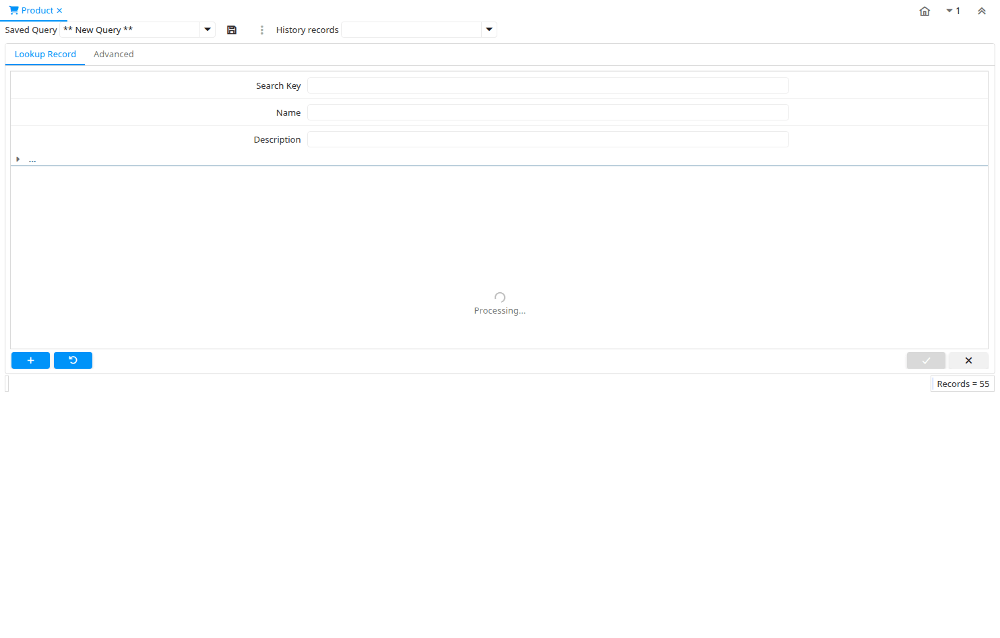

# Product

Window ID 140

*09/08/1999 → 26/01/2023*

**Description:** Maintain Products

**Comment/Help:** The Product Window defines all products used by an organization.  These products include those sold to customers, used in the manufacture of products sold to customers and products purchased by an organization.

## Tab: Product

*Tab Level 0 · Created 09/08/1999 · Updated 02/01/2000*

**Description:** Define Product

**Comment/Help:** The Product Tab defines each product and identifies it for use in price lists and orders. The Location is the default location when receiving the stored product.

| **Name** | **Description** | **Comment/Help** | **Technical Data** |
|---|---|---|---|
| Tenant | Tenant for this installation. | A Tenant is a company or a legal entity. You cannot share data between Tenants. | M_Product.AD_Client_ID<small> numeric(10)   Table Direct</small> |
| Organization | Organizational entity within tenant | An organization is a unit of your tenant or legal entity - examples are store, department. You can share data between organizations. | M_Product.AD_Org_ID<small> numeric(10)   Table Direct</small> |
| Search Key | Search key for the record in the format required - must be unique | A search key allows you a fast method of finding a particular record. If you leave the search key empty, the system automatically creates a numeric number.  The document sequence used for this fallback number is defined in the "Maintain Sequence" window with the name "DocumentNo_&lt;TableName&gt;", where TableName is the actual name of the table (e.g. C_Order). | M_Product.Value<small> character varying(510)   String</small> |
| Version No | Version Number |  | M_Product.VersionNo<small> character varying(20)   String</small> |
| Name | Alphanumeric identifier of the entity | The name of an entity (record) is used as an default search option in addition to the search key. The name is up to 60 characters in length. | M_Product.Name<small> character varying(255)   String</small> |
| Description | Optional short description of the record | A description is limited to 255 characters. | M_Product.Description<small> character varying(255)   String</small> |
| Comment/Help | Comment or Hint | The Help field contains a hint, comment or help about the use of this item. | M_Product.Help<small> character varying(2000)   Text</small> |
| Document Note | Additional information for a Document | The Document Note is used for recording any additional information regarding this product. | M_Product.DocumentNote<small> character varying(2000)   Text</small> |
| UPC/EAN | Bar Code (Universal Product Code or its superset European Article Number) | Use this field to enter the bar code for the product in any of the bar code symbologies (Codabar, Code 25, Code 39, Code 93, Code 128, UPC (A), UPC (E), EAN-13, EAN-8, ITF, ITF-14, ISBN, ISSN, JAN-13, JAN-8, POSTNET and FIM, MSI/Plessey, and Pharmacode)  | M_Product.UPC<small> character varying(30)   String</small> |
| SKU | Stock Keeping Unit | The SKU indicates a user defined stock keeping unit.  It may be used for an additional bar code symbols or your own schema. | M_Product.SKU<small> character varying(30)   String</small> |
| Active | The record is active in the system | There are two methods of making records unavailable in the system: One is to delete the record, the other is to de-activate the record. A de-activated record is not available for selection, but available for reports. There are two reasons for de-activating and not deleting records: (1) The system requires the record for audit purposes. (2) The record is referenced by other records. E.g., you cannot delete a Business Partner, if there are invoices for this partner record existing. You de-activate the Business Partner and prevent that this record is used for future entries. | M_Product.IsActive<small> character(1)   Yes-No</small> |
| Summary Level | This is a summary entity | A summary entity represents a branch in a tree rather than an end-node. Summary entities are used for reporting and do not have own values. | M_Product.IsSummary<small> character(1)   Yes-No</small> |
| Product Category | Category of a Product | Identifies the category which this product belongs to.  Product categories are used for pricing and selection. | M_Product.M_Product_Category_ID<small> numeric(10)   Table Direct</small> |
| Classification | Classification for grouping | The Classification can be used to optionally group products. | M_Product.Classification<small> character varying(12)   String</small> |
| Tax Category | Tax Category | The Tax Category provides a method of grouping similar taxes.  For example, Sales Tax or Value Added Tax. | M_Product.C_TaxCategory_ID<small> numeric(10)   Table Direct</small> |
| Revenue Recognition | Method for recording revenue | The Revenue Recognition indicates how revenue will be recognized for this product | M_Product.C_RevenueRecognition_ID<small> numeric(10)   Table Direct</small> |
| UOM | Unit of Measure | The UOM defines a unique non monetary Unit of Measure | M_Product.C_UOM_ID<small> numeric(10)   Table Direct</small> |
| Sales Representative | Sales Representative or Company Agent | The Sales Representative indicates the Sales Rep for this Region.  Any Sales Rep must be a valid internal user. | M_Product.SalesRep_ID<small> numeric(10)   Table</small> |
| Product Type | Type of product | The type of product also determines accounting consequences. | M_Product.ProductType<small> character(1)   List</small> |
| Mail Template | Text templates for mailings | The Mail Template indicates the mail template for return messages. Mail text can include variables.  The priority of parsing is User/Contact, Business Partner and then the underlying business object (like Request, Dunning, Workflow object).&lt;br&gt; So, @Name@ would resolve into the User name (if user is defined defined), then Business Partner name (if business partner is defined) and then the Name of the business object if it has a Name.&lt;br&gt; For Multi-Lingual systems, the template is translated based on the Business Partner's language selection. | M_Product.R_MailText_ID<small> numeric(10)   Table Direct</small> |
| Weight | Weight of a product | The Weight indicates the weight  of the product in the Weight UOM of the Tenant | M_Product.Weight<small> numeric   Amount</small> |
| Volume | Volume of a product | The Volume indicates the volume of the product in the Volume UOM of the Tenant | M_Product.Volume<small> numeric   Amount</small> |
| Own Box |  |  | M_Product.IsOwnBox<small> character(1)   Yes-No</small> |
| Customs Tariff Number | Customs Tariff Number, usually the HS-Code |  | M_Product.CustomsTariffNumber<small> character varying(20)   String</small> |
| Freight Category | Category of the Freight | Freight Categories are used to calculate the Freight for the Shipper selected | M_Product.M_FreightCategory_ID<small> numeric(10)   Table Direct</small> |
| Drop Shipment | Drop Shipments are sent directly to the Drop Shipment Location | Drop Shipments are sent directly to the Drop Shipment Location using the Drop Ship Business Partner name and contact. | M_Product.IsDropShip<small> character(1)   Yes-No</small> |
| Stocked | Organization stocks this product | The Stocked check box indicates if this product is stocked by this Organization. | M_Product.IsStocked<small> character(1)   Yes-No</small> |
| Manufactured | This product is manufactured |  | M_Product.IsManufactured<small> character(1)   Yes-No</small> |
| Phantom | Phantom Component | Phantom Component are not stored and produced with the product. This is an option to avild maintaining an Engineering and Manufacturing Bill of Materials. | M_Product.IsPhantom<small> character(1)   Yes-No</small> |
| Kanban controlled | This part is Kanban controlled |  | M_Product.IsKanban<small> character(1)   Yes-No</small> |
| Part Type |  |  | M_Product.M_PartType_ID<small> numeric(10)   Table Direct</small> |
| Locator | Warehouse Locator | The Locator indicates where in a Warehouse a product is located. | M_Product.M_Locator_ID<small> numeric(10)   Locator (WH)</small> |
| Shelf Width | Shelf width required | The Shelf Width indicates the width dimension required on a shelf for a product | M_Product.ShelfWidth<small> numeric(10)   Integer</small> |
| Shelf Height | Shelf height required | The Shelf Height indicates the height dimension required on a shelf for a product | M_Product.ShelfHeight<small> numeric   Amount</small> |
| Shelf Depth | Shelf depth required | The Shelf Depth indicates the depth dimension required on a shelf for a product  | M_Product.ShelfDepth<small> numeric(10)   Integer</small> |
| Units Per Pallet | Units Per Pallet | The Units per Pallet indicates the number of units of this product which fit on a pallet. | M_Product.UnitsPerPallet<small> numeric   Costs+Prices</small> |
| Bill of Materials | Bill of Materials | The Bill of Materials check box indicates if this product consists of a bill of materials. | M_Product.IsBOM<small> character(1)   Yes-No</small> |
| Verified | The BOM configuration has been verified | The Verified check box indicates if the configuration of this product has been verified.  This is used for products that consist of a bill of materials | M_Product.IsVerified<small> character(1)   Yes-No</small> |
| Verify BOM Structure | Verify BOM for correctness | The Verify BOM process checks for circular BOMs (unsupported). | M_Product.Processing<small> character(1)   Button</small> |
| Auto Produce | Auto create production to fulfill shipment |  | M_Product.IsAutoProduce<small> character(1)   Yes-No</small> |
| Calculate BOM price if Zero |  | BOM Price Override. When Y, zero prices in price lists trigger BOM component calculation (legacy behavior). When N, explicit zero prices are respected as free items. Only affects behavior when price record exists with zero value; missing records always calculate from BOM. | M_Product.IsBOMPriceOverride<small> character(1)   Yes-No</small> |
| Print detail records on invoice | Print detail BOM elements on the invoice | The Print Details on Invoice indicates that the BOM element products will print on the Invoice as opposed to this product. | M_Product.IsInvoicePrintDetails<small> character(1)   Yes-No</small> |
| Print detail records on pick list | Print detail BOM elements on the pick list | The Print Details on Pick List indicates that the BOM element products will print on the Pick List as opposed to this product. | M_Product.IsPickListPrintDetails<small> character(1)   Yes-No</small> |
| Purchased | Organization purchases this product | The Purchased check box indicates if this product is purchased by this organization. | M_Product.IsPurchased<small> character(1)   Yes-No</small> |
| Sold | Organization sells this product | The Sold check box indicates if this product is sold by this organization. | M_Product.IsSold<small> character(1)   Yes-No</small> |
| Discontinued | This product is no longer available | The Discontinued check box indicates a product that has been discontinued. | M_Product.Discontinued<small> character(1)   Yes-No</small> |
| Discontinued At | Discontinued At indicates Date when product was discontinued |  | M_Product.DiscontinuedAt<small> timestamp without time zone   Date</small> |
| Expense Type | Expense report type |  | M_Product.S_ExpenseType_ID<small> numeric(10)   Table Direct</small> |
| Resource | Resource |  | M_Product.S_Resource_ID<small> numeric(10)   Table Direct</small> |
| Exclude Auto Delivery | Exclude from automatic Delivery | The product is excluded from generating Shipments.  This allows manual creation of shipments for high demand items. If selected, you need to create the shipment manually. But, the item is always included, when the delivery rule of the Order is Force (e.g. for POS).  This allows finer granularity of the Delivery Rule Manual. | M_Product.IsExcludeAutoDelivery<small> character(1)   Yes-No</small> |
| Image URL | URL of  image | URL of image; The image is not stored in the database, but retrieved at runtime. The image can be a gif, jpeg or png. | M_Product.ImageURL<small> character varying(120)   URL</small> |
| Description URL | URL for the description |  | M_Product.DescriptionURL<small> character varying(120)   URL</small> |
| Guarantee Days | Number of days the product is guaranteed or available | If the value is 0, there is no limit to the availability or guarantee, otherwise the guarantee date is calculated by adding the days to the delivery date. | M_Product.GuaranteeDays<small> numeric(10)   Integer</small> |
| Min Guarantee Days | Minimum number of guarantee days | When selecting batch/products with a guarantee date, the minimum left guarantee days for automatic picking.  You can pick any batch/product manually.  | M_Product.GuaranteeDaysMin<small> numeric(10)   Integer</small> |
| Attribute Set | Product Attribute Set | Define Product Attribute Sets to add additional attributes and values to the product. You need to define a Attribute Set if you want to enable Serial and Lot Number tracking. | M_Product.M_AttributeSet_ID<small> numeric(10)   Table Direct</small> |
| Attribute Set Instance | Product Attribute Values | The values of the actual Product Attributes. Product Instance attributes are defined in the actual transactions. | M_Product.M_AttributeSetInstance_ID<small> numeric(10)   Product Attribute</small> |
| Copy from product | Deep copy from other product | Copies BOM definition, prices, substitutes, related, replenish, business partner info and UOM conversions from another product | M_Product.CopyFrom<small> character(1)   Button</small> |
| Featured in Web Store | If selected, the product is displayed in the initial or any empty search | In the display of products in the Web Store, the product is displayed in the initial view or if no search criteria are entered. To be displayed, the product must be in the price list used. | M_Product.IsWebStoreFeatured<small> character(1)   Yes-No</small> |
| Self-Service | This is a Self-Service entry or this entry can be changed via Self-Service | Self-Service allows users to enter data or update their data.  The flag indicates, that this record was entered or created via Self-Service or that the user can change it via the Self-Service functionality. | M_Product.IsSelfService<small> character(1)   Yes-No</small> |
| Group1 |  |  | M_Product.Group1<small> character varying(255)   String</small> |
| Group2 |  |  | M_Product.Group2<small> character varying(255)   String</small> |

## Tab: › BOM

*Tab Level 1 · Created 26/11/2009 · Updated 26/09/2021*

**Description:** Bill of Material product lines

**Comment/Help:** The Bill of Materials tab defines those products that are generated from other products.  A Bill of Material (BOM) is one or more Products or BOMs.

Available Quantity:
- Stored BOMs have to be created via "Production"
- The available quantity of a non-stored BOMs is dynamically calculated
- The attribute "Stored" is defined in the "Product" tab

Price:
- BOMs must be listed in Pricelists
- If the price is 0.00, the price is dynamically calculated

Printing:
- Usually, only the BOM information is printed
- For invoices, delivery slips and pick lists, you have the option to print the details
- In the details, the quantity is listed - and the price, if this is dynamically calculated

| **Name** | **Description** | **Comment/Help** | **Technical Data** |
|---|---|---|---|
| Tenant | Tenant for this installation. | A Tenant is a company or a legal entity. You cannot share data between Tenants. | PP_Product_BOM.AD_Client_ID<small> numeric(10)   Table Direct</small> |
| Organization | Organizational entity within tenant | An organization is a unit of your tenant or legal entity - examples are store, department. You can share data between organizations. | PP_Product_BOM.AD_Org_ID<small> numeric(10)   Table Direct</small> |
| Product | Product, Service, Item | Identifies an item which is either purchased or sold in this organization. | PP_Product_BOM.M_Product_ID<small> numeric(10)   Search</small> |
| Attribute Set Instance | Product Attribute Set Instance | The values of the actual Product Attribute Instances.  The product level attributes are defined on Product level. | PP_Product_BOM.M_AttributeSetInstance_ID<small> numeric(10)   Product Attribute</small> |
| Search Key | Search key for the record in the format required - must be unique | A search key allows you a fast method of finding a particular record. If you leave the search key empty, the system automatically creates a numeric number.  The document sequence used for this fallback number is defined in the "Maintain Sequence" window with the name "DocumentNo_&lt;TableName&gt;", where TableName is the actual name of the table (e.g. C_Order). | PP_Product_BOM.Value<small> character varying(80)   String</small> |
| Name | Alphanumeric identifier of the entity | The name of an entity (record) is used as an default search option in addition to the search key. The name is up to 60 characters in length. | PP_Product_BOM.Name<small> character varying(60)   Text</small> |
| Description | Optional short description of the record | A description is limited to 255 characters. | PP_Product_BOM.Description<small> character varying(255)   String</small> |
| Comment/Help | Comment or Hint | The Help field contains a hint, comment or help about the use of this item. | PP_Product_BOM.Help<small> character varying(2000)   Text</small> |
| Active | The record is active in the system | There are two methods of making records unavailable in the system: One is to delete the record, the other is to de-activate the record. A de-activated record is not available for selection, but available for reports. There are two reasons for de-activating and not deleting records: (1) The system requires the record for audit purposes. (2) The record is referenced by other records. E.g., you cannot delete a Business Partner, if there are invoices for this partner record existing. You de-activate the Business Partner and prevent that this record is used for future entries. | PP_Product_BOM.IsActive<small> character(1)   Yes-No</small> |
| Revision |  |  | PP_Product_BOM.Revision<small> character varying(10)   String</small> |
| BOM Type | Type of BOM | The type of Bills of Materials determines the state | PP_Product_BOM.BOMType<small> character(1)   List</small> |
| BOM Use | The use of the Bill of Material | By default the Master BOM is used, if the alternatives are not defined | PP_Product_BOM.BOMUse<small> character(1)   List</small> |
| Copy BOM Lines From | Copy BOM Lines from an existing BOM | Copy BOM Lines from an existing BOM. The BOM being copied to, must not have any existing BOM Lines. | PP_Product_BOM.CopyFrom<small> character(1)   Button</small> |

## Tab: › › Components

*Tab Level 2 · Created 26/11/2009 · Updated 15/01/2024*

**Description:** Components

**Comment/Help:** Components of Bill of Materials

| **Name** | **Description** | **Comment/Help** | **Technical Data** |
|---|---|---|---|
| Line No | Unique line for this document | Indicates the unique line for a document.  It will also control the display order of the lines within a document. | PP_Product_BOMLine.Line<small> numeric(10)   Integer</small> |
| BOM &amp; Formula | BOM &amp; Formula |  | PP_Product_BOMLine.PP_Product_BOM_ID<small> numeric(10)   Search</small> |
| Product | Product, Service, Item | Identifies an item which is either purchased or sold in this organization. | PP_Product_BOMLine.M_Product_ID<small> numeric(10)   Search</small> |
| Attribute Set Instance | Product Attribute Set Instance | The values of the actual Product Attribute Instances.  The product level attributes are defined on Product level. | PP_Product_BOMLine.M_AttributeSetInstance_ID<small> numeric(10)   Product Attribute</small> |
| Component Type | Component Type for a Bill of Material or Formula | The Component Type can be:  1.- By Product: Define a By Product as Component into BOM 2.- Component: Define a normal Component into BOM  3.- Option: Define an Option for Product Configure BOM 4.- Phantom: Define a Phantom as Component into BOM 5.- Packing: Define a Packing as Component into BOM 6.- Planning : Define Planning as Component into BOM 7.- Tools: Define Tools as Component into BOM 8.- Variant: Define Variant  for Product Configure BOM  | PP_Product_BOMLine.ComponentType<small> character(2)   List</small> |
| Description | Optional short description of the record | A description is limited to 255 characters. | PP_Product_BOMLine.Description<small> character varying(255)   String</small> |
| Comment/Help | Comment or Hint | The Help field contains a hint, comment or help about the use of this item. | PP_Product_BOMLine.Help<small> character varying(2000)   Text</small> |
| Active | The record is active in the system | There are two methods of making records unavailable in the system: One is to delete the record, the other is to de-activate the record. A de-activated record is not available for selection, but available for reports. There are two reasons for de-activating and not deleting records: (1) The system requires the record for audit purposes. (2) The record is referenced by other records. E.g., you cannot delete a Business Partner, if there are invoices for this partner record existing. You de-activate the Business Partner and prevent that this record is used for future entries. | PP_Product_BOMLine.IsActive<small> character(1)   Yes-No</small> |
| Quantity | Indicate the Quantity use in this BOM | Exist two way the add a component to a BOM or Formula:  1.- Adding a Component based in quantity to use in this BOM 2.- Adding a Component based in % to use the Order Quantity of Manufacturing Order in this Formula.  | PP_Product_BOMLine.QtyBOM<small> numeric   Number</small> |
| Feature | Indicated the Feature for Product Configure | Indicated the Feature for Product Configure | PP_Product_BOMLine.Feature<small> character varying(30)   String</small> |

## Tab: › Substitute

*Tab Level 1 · Created 09/08/1999 · Updated 21/01/2009*

**Description:** Define Substitute

**Comment/Help:** The Substitute Tab defines products which may be used as a replacement for the selected product.

| **Name** | **Description** | **Comment/Help** | **Technical Data** |
|---|---|---|---|
| Tenant | Tenant for this installation. | A Tenant is a company or a legal entity. You cannot share data between Tenants. | M_Substitute.AD_Client_ID<small> numeric(10)   Table Direct</small> |
| Organization | Organizational entity within tenant | An organization is a unit of your tenant or legal entity - examples are store, department. You can share data between organizations. | M_Substitute.AD_Org_ID<small> numeric(10)   Table Direct</small> |
| Product | Product, Service, Item | Identifies an item which is either purchased or sold in this organization. | M_Substitute.M_Product_ID<small> numeric(10)   Search</small> |
| Name | Alphanumeric identifier of the entity | The name of an entity (record) is used as an default search option in addition to the search key. The name is up to 60 characters in length. | M_Substitute.Name<small> character varying(60)   String</small> |
| Description | Optional short description of the record | A description is limited to 255 characters. | M_Substitute.Description<small> character varying(255)   String</small> |
| Active | The record is active in the system | There are two methods of making records unavailable in the system: One is to delete the record, the other is to de-activate the record. A de-activated record is not available for selection, but available for reports. There are two reasons for de-activating and not deleting records: (1) The system requires the record for audit purposes. (2) The record is referenced by other records. E.g., you cannot delete a Business Partner, if there are invoices for this partner record existing. You de-activate the Business Partner and prevent that this record is used for future entries. | M_Substitute.IsActive<small> character(1)   Yes-No</small> |
| Substitute | Entity which can be used in place of this entity | The Substitute identifies the entity to be used as a substitute for this entity. | M_Substitute.Substitute_ID<small> numeric(10)   Search</small> |

## Tab: › Related

*Tab Level 1 · Created 19/02/2004 · Updated 21/01/2009*

**Description:** Related Product

**Comment/Help:** Related Product - e.g. for promotions

| **Name** | **Description** | **Comment/Help** | **Technical Data** |
|---|---|---|---|
| Tenant | Tenant for this installation. | A Tenant is a company or a legal entity. You cannot share data between Tenants. | M_RelatedProduct.AD_Client_ID<small> numeric(10)   Table Direct</small> |
| Organization | Organizational entity within tenant | An organization is a unit of your tenant or legal entity - examples are store, department. You can share data between organizations. | M_RelatedProduct.AD_Org_ID<small> numeric(10)   Table Direct</small> |
| Product | Product, Service, Item | Identifies an item which is either purchased or sold in this organization. | M_RelatedProduct.M_Product_ID<small> numeric(10)   Search</small> |
| Name | Alphanumeric identifier of the entity | The name of an entity (record) is used as an default search option in addition to the search key. The name is up to 60 characters in length. | M_RelatedProduct.Name<small> character varying(60)   String</small> |
| Description | Optional short description of the record | A description is limited to 255 characters. | M_RelatedProduct.Description<small> character varying(255)   Text</small> |
| Active | The record is active in the system | There are two methods of making records unavailable in the system: One is to delete the record, the other is to de-activate the record. A de-activated record is not available for selection, but available for reports. There are two reasons for de-activating and not deleting records: (1) The system requires the record for audit purposes. (2) The record is referenced by other records. E.g., you cannot delete a Business Partner, if there are invoices for this partner record existing. You de-activate the Business Partner and prevent that this record is used for future entries. | M_RelatedProduct.IsActive<small> character(1)   Yes-No</small> |
| Related Product Type |  |  | M_RelatedProduct.RelatedProductType<small> character(1)   List</small> |
| Related Product | Related Product |  | M_RelatedProduct.RelatedProduct_ID<small> numeric(10)   Search</small> |

## Tab: › Replenish

*Tab Level 1 · Created 09/08/1999 · Updated 21/07/2005*

**Description:** Define Product Replenishment

**Comment/Help:** The Replenishment Tab defines the type of replenishment quantities.  This is used for automated ordering.  If you select a custom replenishment type, you need to create a class implementing org.compiere.util.ReplenishInterface and set that on warehouse level.

| **Name** | **Description** | **Comment/Help** | **Technical Data** |
|---|---|---|---|
| Tenant | Tenant for this installation. | A Tenant is a company or a legal entity. You cannot share data between Tenants. | M_Replenish.AD_Client_ID<small> numeric(10)   Table Direct</small> |
| Organization | Organizational entity within tenant | An organization is a unit of your tenant or legal entity - examples are store, department. You can share data between organizations. | M_Replenish.AD_Org_ID<small> numeric(10)   Table Direct</small> |
| Product | Product, Service, Item | Identifies an item which is either purchased or sold in this organization. | M_Replenish.M_Product_ID<small> numeric(10)   Search</small> |
| Warehouse | Storage Warehouse and Service Point | The Warehouse identifies a unique Warehouse where products are stored or Services are provided. | M_Replenish.M_Warehouse_ID<small> numeric(10)   Table Direct</small> |
| Locator | Warehouse Locator | The Locator indicates where in a Warehouse a product is located. | M_Replenish.M_Locator_ID<small> numeric(10)   Table Direct</small> |
| Active | The record is active in the system | There are two methods of making records unavailable in the system: One is to delete the record, the other is to de-activate the record. A de-activated record is not available for selection, but available for reports. There are two reasons for de-activating and not deleting records: (1) The system requires the record for audit purposes. (2) The record is referenced by other records. E.g., you cannot delete a Business Partner, if there are invoices for this partner record existing. You de-activate the Business Partner and prevent that this record is used for future entries. | M_Replenish.IsActive<small> character(1)   Yes-No</small> |
| Replenish Type | Method for re-ordering a product | The Replenish Type indicates if this product will be manually re-ordered, ordered when the quantity is below the minimum quantity or ordered when it is below the maximum quantity. If you select a custom replenishment type, you need to create a class implementing org.compiere.util.ReplenishInterface and set that on warehouse level. | M_Replenish.ReplenishType<small> character(1)   List</small> |
| Minimum Level | Minimum Inventory level for this product | Indicates the minimum quantity of this product to be stocked in inventory.  | M_Replenish.Level_Min<small> numeric   Amount</small> |
| Maximum Level | Maximum Inventory level for this product | Indicates the maximum quantity of this product to be stocked in inventory. | M_Replenish.Level_Max<small> numeric   Amount</small> |
| Source Warehouse | Optional Warehouse to replenish from | If defined, the warehouse selected is used to replenish the product(s) | M_Replenish.M_WarehouseSource_ID<small> numeric(10)   Table</small> |
| Qty Batch Size |  |  | M_Replenish.QtyBatchSize<small> numeric   Quantity</small> |

## Tab: › Purchasing

*Tab Level 1 · Created 04/12/1999 · Updated 02/01/2000*

**Description:** Purchasing

**Comment/Help:** The Purchasing Tab define the pricing and rules ( pack quantity, UPC, minimum order quantity) for each product.

| **Name** | **Description** | **Comment/Help** | **Technical Data** |
|---|---|---|---|
| Tenant | Tenant for this installation. | A Tenant is a company or a legal entity. You cannot share data between Tenants. | M_Product_PO.AD_Client_ID<small> numeric(10)   Table Direct</small> |
| Organization | Organizational entity within tenant | An organization is a unit of your tenant or legal entity - examples are store, department. You can share data between organizations. | M_Product_PO.AD_Org_ID<small> numeric(10)   Table Direct</small> |
| Product | Product, Service, Item | Identifies an item which is either purchased or sold in this organization. | M_Product_PO.M_Product_ID<small> numeric(10)   Search</small> |
| Business Partner | Identifies a Business Partner | A Business Partner is anyone with whom you transact.  This can include Vendor, Customer, Employee or Salesperson | M_Product_PO.C_BPartner_ID<small> numeric(10)   Search</small> |
| Quality Rating | Method for rating vendors | The Quality Rating indicates how a vendor is rated (higher number = higher quality) | M_Product_PO.QualityRating<small> numeric   Integer</small> |
| Active | The record is active in the system | There are two methods of making records unavailable in the system: One is to delete the record, the other is to de-activate the record. A de-activated record is not available for selection, but available for reports. There are two reasons for de-activating and not deleting records: (1) The system requires the record for audit purposes. (2) The record is referenced by other records. E.g., you cannot delete a Business Partner, if there are invoices for this partner record existing. You de-activate the Business Partner and prevent that this record is used for future entries. | M_Product_PO.IsActive<small> character(1)   Yes-No</small> |
| Current vendor | Use this Vendor for pricing and stock replenishment | The Current Vendor indicates if prices are used and Product is reordered from this vendor | M_Product_PO.IsCurrentVendor<small> character(1)   Yes-No</small> |
| UPC/EAN | Bar Code (Universal Product Code or its superset European Article Number) | Use this field to enter the bar code for the product in any of the bar code symbologies (Codabar, Code 25, Code 39, Code 93, Code 128, UPC (A), UPC (E), EAN-13, EAN-8, ITF, ITF-14, ISBN, ISSN, JAN-13, JAN-8, POSTNET and FIM, MSI/Plessey, and Pharmacode)  | M_Product_PO.UPC<small> character varying(20)   String</small> |
| Currency | The Currency for this record | Indicates the Currency to be used when processing or reporting on this record | M_Product_PO.C_Currency_ID<small> numeric(10)   Table Direct</small> |
| List Price | List Price | The List Price is the official List Price in the document currency. | M_Product_PO.PriceList<small> numeric   Costs+Prices</small> |
| Price effective | Effective Date of Price | The Price Effective indicates the date this price is for. This allows you to enter future prices for products which will become effective when appropriate. | M_Product_PO.PriceEffective<small> timestamp without time zone   Date</small> |
| PO Price | Price based on a purchase order | The PO Price indicates the price for a product per the purchase order. | M_Product_PO.PricePO<small> numeric   Costs+Prices</small> |
| Royalty Amount | (Included) Amount for copyright, etc. |  | M_Product_PO.RoyaltyAmt<small> numeric   Amount</small> |
| Last PO Price | Price of the last purchase order for the product | The Last PO Price indicates the last price paid (per the purchase order) for this product. | M_Product_PO.PriceLastPO<small> numeric   Costs+Prices</small> |
| Last Invoice Price | Price of the last invoice for the product | The Last Invoice Price indicates the last price paid (per the invoice) for this product. | M_Product_PO.PriceLastInv<small> numeric   Costs+Prices</small> |
| UOM | Unit of Measure | The UOM defines a unique non monetary Unit of Measure | M_Product_PO.C_UOM_ID<small> numeric(10)   Table Direct</small> |
| Minimum Order Qty | Minimum order quantity in UOM | The Minimum Order Quantity indicates the smallest quantity of this product which can be ordered. | M_Product_PO.Order_Min<small> numeric   Quantity</small> |
| Order Pack Qty | Package order size in UOM (e.g. order set of 5 units) | The Order Pack Quantity indicates the number of units in each pack of this product. | M_Product_PO.Order_Pack<small> numeric   Quantity</small> |
| Promised Delivery Time | Promised days between order and delivery | The Promised Delivery Time indicates the number of days between the order date and the date that delivery was promised. | M_Product_PO.DeliveryTime_Promised<small> numeric(10)   Integer</small> |
| Actual Delivery Time | Actual days between order and delivery | The Actual Delivery Time indicates the number of days elapsed between placing an order and the delivery of the order | M_Product_PO.DeliveryTime_Actual<small> numeric(10)   Integer</small> |
| Cost per Order | Fixed Cost Per Order | The Cost Per Order indicates the fixed charge levied when an order for this product is placed. | M_Product_PO.CostPerOrder<small> numeric   Costs+Prices</small> |
| Partner Product Key | Product Key of the Business Partner | The Business Partner Product Key identifies the number used by the Business Partner for this product. It can be printed on orders and invoices when you include the Product Key in the print format. | M_Product_PO.VendorProductNo<small> character varying(40)   String</small> |
| Partner Category | Product Category of the Business Partner | The Business Partner Category identifies the category used by the Business Partner for this product. | M_Product_PO.VendorCategory<small> character varying(30)   String</small> |
| Manufacturer | Manufacturer of the Product | The manufacturer of the Product (used if different from the Business Partner / Vendor) | M_Product_PO.Manufacturer<small> character varying(30)   String</small> |
| Discontinued | This product is no longer available | The Discontinued check box indicates a product that has been discontinued. | M_Product_PO.Discontinued<small> character(1)   Yes-No</small> |
| Discontinued At | Discontinued At indicates Date when product was discontinued |  | M_Product_PO.DiscontinuedAt<small> timestamp without time zone   Date</small> |

## Tab: › Business Partner

*Tab Level 1 · Created 07/12/2003 · Updated 19/04/2005*

**Description:** Business Partner specific Information of a Product

**Comment/Help:** Note that some information is for reference only!  The 

| **Name** | **Description** | **Comment/Help** | **Technical Data** |
|---|---|---|---|
| Tenant | Tenant for this installation. | A Tenant is a company or a legal entity. You cannot share data between Tenants. | C_BPartner_Product.AD_Client_ID<small> numeric(10)   Table Direct</small> |
| Organization | Organizational entity within tenant | An organization is a unit of your tenant or legal entity - examples are store, department. You can share data between organizations. | C_BPartner_Product.AD_Org_ID<small> numeric(10)   Table Direct</small> |
| Product | Product, Service, Item | Identifies an item which is either purchased or sold in this organization. | C_BPartner_Product.M_Product_ID<small> numeric(10)   Search</small> |
| Business Partner | Identifies a Business Partner | A Business Partner is anyone with whom you transact.  This can include Vendor, Customer, Employee or Salesperson | C_BPartner_Product.C_BPartner_ID<small> numeric(10)   Search</small> |
| Description | Optional short description of the record | A description is limited to 255 characters. | C_BPartner_Product.Description<small> character varying(255)   String</small> |
| Active | The record is active in the system | There are two methods of making records unavailable in the system: One is to delete the record, the other is to de-activate the record. A de-activated record is not available for selection, but available for reports. There are two reasons for de-activating and not deleting records: (1) The system requires the record for audit purposes. (2) The record is referenced by other records. E.g., you cannot delete a Business Partner, if there are invoices for this partner record existing. You de-activate the Business Partner and prevent that this record is used for future entries. | C_BPartner_Product.IsActive<small> character(1)   Yes-No</small> |
| Partner Product Key | Product Key of the Business Partner | The Business Partner Product Key identifies the number used by the Business Partner for this product. It can be printed on orders and invoices when you include the Product Key in the print format. | C_BPartner_Product.VendorProductNo<small> character varying(30)   String</small> |
| Partner Category | Product Category of the Business Partner | The Business Partner Category identifies the category used by the Business Partner for this product. | C_BPartner_Product.VendorCategory<small> character varying(30)   String</small> |
| Manufacturer | Manufacturer of the Product | The manufacturer of the Product (used if different from the Business Partner / Vendor) | C_BPartner_Product.Manufacturer<small> character varying(30)   String</small> |
| Quality Rating | Method for rating vendors | The Quality Rating indicates how a vendor is rated (higher number = higher quality) | C_BPartner_Product.QualityRating<small> numeric   Number</small> |
| Min Shelf Life % | Minimum Shelf Life in percent based on Product Instance Guarantee Date | Minimum Shelf Life of products with Guarantee Date instance. If &gt; 0 you cannot select products with a shelf life ((Guarantee Date-Today) / Guarantee Days) less than the minimum shelf life, unless you select "Show All" | C_BPartner_Product.ShelfLifeMinPct<small> numeric(10)   Integer</small> |
| Min Shelf Life Days | Minimum Shelf Life in days based on Product Instance Guarantee Date | Minimum Shelf Life of products with Guarantee Date instance. If &gt; 0 you cannot select products with a shelf life less than the minimum shelf life, unless you select "Show All" | C_BPartner_Product.ShelfLifeMinDays<small> numeric(10)   Integer</small> |
| Is Manufacturer | Indicate role of this Business partner as Manufacturer |  | C_BPartner_Product.IsManufacturer<small> character(1)   Yes-No</small> |

## Tab: › Price

*Tab Level 1 · Created 09/08/1999 · Updated 02/01/2000*

**Description:** Product Pricing

**Comment/Help:** The Pricing Tab displays the List, Standard and Limit prices for each price list a product is contained in.

| **Name** | **Description** | **Comment/Help** | **Technical Data** |
|---|---|---|---|
| Tenant | Tenant for this installation. | A Tenant is a company or a legal entity. You cannot share data between Tenants. | M_ProductPrice.AD_Client_ID<small> numeric(10)   Table Direct</small> |
| Organization | Organizational entity within tenant | An organization is a unit of your tenant or legal entity - examples are store, department. You can share data between organizations. | M_ProductPrice.AD_Org_ID<small> numeric(10)   Table Direct</small> |
| Product | Product, Service, Item | Identifies an item which is either purchased or sold in this organization. | M_ProductPrice.M_Product_ID<small> numeric(10)   Search</small> |
| Price List Version | Identifies a unique instance of a Price List | Each Price List can have multiple versions.  The most common use is to indicate the dates that a Price List is valid for. | M_ProductPrice.M_PriceList_Version_ID<small> numeric(10)   Table Direct</small> |
| Active | The record is active in the system | There are two methods of making records unavailable in the system: One is to delete the record, the other is to de-activate the record. A de-activated record is not available for selection, but available for reports. There are two reasons for de-activating and not deleting records: (1) The system requires the record for audit purposes. (2) The record is referenced by other records. E.g., you cannot delete a Business Partner, if there are invoices for this partner record existing. You de-activate the Business Partner and prevent that this record is used for future entries. | M_ProductPrice.IsActive<small> character(1)   Yes-No</small> |
| List Price | List Price | The List Price is the official List Price in the document currency. | M_ProductPrice.PriceList<small> numeric   Costs+Prices</small> |
| Standard Price | Standard Price | The Standard Price indicates the standard or normal price for a product on this price list | M_ProductPrice.PriceStd<small> numeric   Costs+Prices</small> |
| Limit Price | Lowest price for a product | The Price Limit indicates the lowest price for a product stated in the Price List Currency. | M_ProductPrice.PriceLimit<small> numeric   Costs+Prices</small> |

## Tab: › Accounting

*Tab Level 1 · Created 26/09/1999 · Updated 05/03/2013*

**Description:** Define Accounting Parameters

**Comment/Help:** The Accounting Tab defines the defaults to use when generating accounting transactions for orders and invoices which contain this product.

| **Name** | **Description** | **Comment/Help** | **Technical Data** |
|---|---|---|---|
| Tenant | Tenant for this installation. | A Tenant is a company or a legal entity. You cannot share data between Tenants. | M_Product_Acct.AD_Client_ID<small> numeric(10)   Table Direct</small> |
| Organization | Organizational entity within tenant | An organization is a unit of your tenant or legal entity - examples are store, department. You can share data between organizations. | M_Product_Acct.AD_Org_ID<small> numeric(10)   Table Direct</small> |
| Product | Product, Service, Item | Identifies an item which is either purchased or sold in this organization. | M_Product_Acct.M_Product_ID<small> numeric(10)   Search</small> |
| Accounting Schema | Rules for accounting | An Accounting Schema defines the rules used in accounting such as costing method, currency and calendar | M_Product_Acct.C_AcctSchema_ID<small> numeric(10)   Table Direct</small> |
| Active | The record is active in the system | There are two methods of making records unavailable in the system: One is to delete the record, the other is to de-activate the record. A de-activated record is not available for selection, but available for reports. There are two reasons for de-activating and not deleting records: (1) The system requires the record for audit purposes. (2) The record is referenced by other records. E.g., you cannot delete a Business Partner, if there are invoices for this partner record existing. You de-activate the Business Partner and prevent that this record is used for future entries. | M_Product_Acct.IsActive<small> character(1)   Yes-No</small> |
| Product Asset | Account for Product Asset (Inventory) | The Product Asset Account indicates the account used for valuing this a product in inventory. | M_Product_Acct.P_Asset_Acct<small> numeric(10)   Account</small> |
| Product Expense | Account for Product Expense | The Product Expense Account indicates the account used to record expenses associated with this product. | M_Product_Acct.P_Expense_Acct<small> numeric(10)   Account</small> |
| Cost Adjustment | Product Cost Adjustment Account | Account used for posting product cost adjustments (e.g. landed costs) | M_Product_Acct.P_CostAdjustment_Acct<small> numeric(10)   Account</small> |
| Inventory Clearing | Product Inventory Clearing Account | Account used for posting matched product (item) expenses (e.g. AP Invoice, Invoice Match).  You would use a different account then Product Expense, if you want to differentiate service related costs from item related costs. The balance on the clearing account should be zero and accounts for the timing difference between invoice receipt and matching. | M_Product_Acct.P_InventoryClearing_Acct<small> numeric(10)   Account</small> |
| Product COGS | Account for Cost of Goods Sold | The Product COGS Account indicates the account used when recording costs associated with this product. | M_Product_Acct.P_COGS_Acct<small> numeric(10)   Account</small> |
| Product Revenue | Account for Product Revenue (Sales Account) | The Product Revenue Account indicates the account used for recording sales revenue for this product. | M_Product_Acct.P_Revenue_Acct<small> numeric(10)   Account</small> |
| Purchase Price Variance | Difference between Standard Cost and Purchase Price (PPV) | The Purchase Price Variance is used in Standard Costing. It reflects the difference between the Standard Cost and the Purchase Order Price. | M_Product_Acct.P_PurchasePriceVariance_Acct<small> numeric(10)   Account</small> |
| Invoice Price Variance | Difference between Costs and Invoice Price (IPV) | The Invoice Price Variance is used reflects the difference between the current Costs and the Invoice Price. | M_Product_Acct.P_InvoicePriceVariance_Acct<small> numeric(10)   Account</small> |
| Trade Discount Received | Trade Discount Receivable Account | The Trade Discount Receivables Account indicates the account for received trade discounts in vendor invoices | M_Product_Acct.P_TradeDiscountRec_Acct<small> numeric(10)   Account</small> |
| Trade Discount Granted | Trade Discount Granted Account | The Trade Discount Granted Account indicates the account for granted trade discount in sales invoices | M_Product_Acct.P_TradeDiscountGrant_Acct<small> numeric(10)   Account</small> |
| Rate Variance | The Rate Variance account is the account used Manufacturing Order | The Rate Variance is used in Standard Costing. It reflects the difference between the Standard Cost Rates and  The Cost Rates of Manufacturing Order.  If you change the Standard Rates then this variance is generate. | M_Product_Acct.P_RateVariance_Acct<small> numeric(10)   Account</small> |
| Average Cost Variance | Average Cost Variance | The Average Cost Variance is used in weighted average costing to reflect differences when posting costs for negative inventory. | M_Product_Acct.P_AverageCostVariance_Acct<small> numeric(10)   Account</small> |
| Landed Cost Clearing | Product Landed Cost Clearing Account | Account used for posting of estimated and actual landed cost amount.  The balance on the clearing account should be zero and accounts for the timing difference between material receipt and landed cost invoice. | M_Product_Acct.P_LandedCostClearing_Acct<small> numeric(10)   Account</small> |

## Tab: › Transactions

*Tab Level 1 · Created 17/05/2000 · Updated 02/01/2000*

**Description:** Transactions for stored Products

**Comment/Help:** The Transaction Tab displays the transactions that have been processed for this product.

| **Name** | **Description** | **Comment/Help** | **Technical Data** |
|---|---|---|---|
| Tenant | Tenant for this installation. | A Tenant is a company or a legal entity. You cannot share data between Tenants. | M_Transaction.AD_Client_ID<small> numeric(10)   Table Direct</small> |
| Organization | Organizational entity within tenant | An organization is a unit of your tenant or legal entity - examples are store, department. You can share data between organizations. | M_Transaction.AD_Org_ID<small> numeric(10)   Table Direct</small> |
| Product | Product, Service, Item | Identifies an item which is either purchased or sold in this organization. | M_Transaction.M_Product_ID<small> numeric(10)   Search</small> |
| Attribute Set Instance | Product Attribute Set Instance | The values of the actual Product Attribute Instances.  The product level attributes are defined on Product level. | M_Transaction.M_AttributeSetInstance_ID<small> numeric(10)   Product Attribute</small> |
| Active | The record is active in the system | There are two methods of making records unavailable in the system: One is to delete the record, the other is to de-activate the record. A de-activated record is not available for selection, but available for reports. There are two reasons for de-activating and not deleting records: (1) The system requires the record for audit purposes. (2) The record is referenced by other records. E.g., you cannot delete a Business Partner, if there are invoices for this partner record existing. You de-activate the Business Partner and prevent that this record is used for future entries. | M_Transaction.IsActive<small> character(1)   Yes-No</small> |
| Locator | Warehouse Locator | The Locator indicates where in a Warehouse a product is located. | M_Transaction.M_Locator_ID<small> numeric(10)   Locator (WH)</small> |
| Movement Quantity | Quantity of a product moved. | The Movement Quantity indicates the quantity of a product that has been moved. | M_Transaction.MovementQty<small> numeric   Quantity</small> |
| Movement Date | Date a product was moved in or out of inventory | The Movement Date indicates the date that a product moved in or out of inventory.  This is the result of a shipment, receipt or inventory movement. | M_Transaction.MovementDate<small> timestamp without time zone   Date</small> |
| Movement Type | Method of moving the inventory | The Movement Type indicates the type of movement (in, out, to production, etc) | M_Transaction.MovementType<small> character(2)   List</small> |
| Shipment/Receipt Line | Line on Shipment or Receipt document | The Shipment/Receipt Line indicates a unique line in a Shipment/Receipt document | M_Transaction.M_InOutLine_ID<small> numeric(10)   Search</small> |
| Phys.Inventory Line | Unique line in an Inventory document | The Physical Inventory Line indicates the inventory document line (if applicable) for this transaction | M_Transaction.M_InventoryLine_ID<small> numeric(10)   Search</small> |
| Move Line | Inventory Move document Line | The Movement Line indicates the inventory movement document line (if applicable) for this transaction | M_Transaction.M_MovementLine_ID<small> numeric(10)   Search</small> |
| Production Line | Document Line representing a production | The Production Line indicates the production document line (if applicable) for this transaction | M_Transaction.M_ProductionLine_ID<small> numeric(10)   Search</small> |
| Project Issue | Project Issues (Material, Labor) | Issues to the project initiated by the "Issue to Project" process. You can issue Receipts, Time and Expenses, or Stock. | M_Transaction.C_ProjectIssue_ID<small> numeric(10)   Search</small> |
| Manufacturing Cost Collector |  |  | M_Transaction.PP_Cost_Collector_ID<small> numeric(10)   Search</small> |

## Tab: › Translation

*Tab Level 1 · Created 04/12/1999 · Updated 27/10/2024*

| **Name** | **Description** | **Comment/Help** | **Technical Data** |
|---|---|---|---|
| Tenant | Tenant for this installation. | A Tenant is a company or a legal entity. You cannot share data between Tenants. | M_Product_Trl.AD_Client_ID<small> numeric(10)   Table Direct</small> |
| Organization | Organizational entity within tenant | An organization is a unit of your tenant or legal entity - examples are store, department. You can share data between organizations. | M_Product_Trl.AD_Org_ID<small> numeric(10)   Table Direct</small> |
| Product | Product, Service, Item | Identifies an item which is either purchased or sold in this organization. | M_Product_Trl.M_Product_ID<small> numeric(10)   Search</small> |
| Language | Language for this entity | The Language identifies the language to use for display and formatting | M_Product_Trl.AD_Language<small> character varying(6)   Table</small> |
| Name | Alphanumeric identifier of the entity | The name of an entity (record) is used as an default search option in addition to the search key. The name is up to 60 characters in length. | M_Product_Trl.Name<small> character varying(255)   String</small> |
| Description | Optional short description of the record | A description is limited to 255 characters. | M_Product_Trl.Description<small> character varying(255)   String</small> |
| Document Note | Additional information for a Document | The Document Note is used for recording any additional information regarding this product. | M_Product_Trl.DocumentNote<small> character varying(2000)   String</small> |
| Active | The record is active in the system | There are two methods of making records unavailable in the system: One is to delete the record, the other is to de-activate the record. A de-activated record is not available for selection, but available for reports. There are two reasons for de-activating and not deleting records: (1) The system requires the record for audit purposes. (2) The record is referenced by other records. E.g., you cannot delete a Business Partner, if there are invoices for this partner record existing. You de-activate the Business Partner and prevent that this record is used for future entries. | M_Product_Trl.IsActive<small> character(1)   Yes-No</small> |
| Translated | This column is translated | The Translated checkbox indicates if this column is translated. | M_Product_Trl.IsTranslated<small> character(1)   Yes-No</small> |

## Tab: › Located at

*Tab Level 1 · Created 28/08/2009 · Updated 19/11/2012*

**Description:** Where are my units located?

| **Name** | **Description** | **Comment/Help** | **Technical Data** |
|---|---|---|---|
| Tenant | Tenant for this installation. | A Tenant is a company or a legal entity. You cannot share data between Tenants. | M_Storage.AD_Client_ID<small> numeric(10)   Table Direct</small> |
| Organization | Organizational entity within tenant | An organization is a unit of your tenant or legal entity - examples are store, department. You can share data between organizations. | M_Storage.AD_Org_ID<small> numeric(10)   Table Direct</small> |
| Product | Product, Service, Item | Identifies an item which is either purchased or sold in this organization. | M_Storage.M_Product_ID<small> numeric(10)   Search</small> |
| Date  Material Policy | Time used for LIFO and FIFO Material Policy | This field is used to record time used for LIFO and FIFO material policy | M_Storage.DateMaterialPolicy<small> timestamp without time zone   Date</small> |
| Locator | Warehouse Locator | The Locator indicates where in a Warehouse a product is located. | M_Storage.M_Locator_ID<small> numeric(10)   Locator (WH)</small> |
| Attribute Set Instance | Product Attribute Set Instance | The values of the actual Product Attribute Instances.  The product level attributes are defined on Product level. | M_Storage.M_AttributeSetInstance_ID<small> numeric(10)   Product Attribute</small> |
| Active | The record is active in the system | There are two methods of making records unavailable in the system: One is to delete the record, the other is to de-activate the record. A de-activated record is not available for selection, but available for reports. There are two reasons for de-activating and not deleting records: (1) The system requires the record for audit purposes. (2) The record is referenced by other records. E.g., you cannot delete a Business Partner, if there are invoices for this partner record existing. You de-activate the Business Partner and prevent that this record is used for future entries. | M_Storage.IsActive<small> character(1)   Yes-No</small> |
| On Hand Quantity | On Hand Quantity | The On Hand Quantity indicates the quantity of a product that is on hand in a warehouse. | M_Storage.QtyOnHand<small> numeric   Quantity</small> |
| Date Last Inventory Count | Date of Last Inventory Count | The Date Last Inventory Count indicates the last time an Inventory count was done. | M_Storage.DateLastInventory<small> timestamp without time zone   Date</small> |
| Ordered Quantity | Ordered Quantity | The Ordered Quantity indicates the quantity of a product that was ordered. | M_Storage.QtyOrdered<small> numeric   Quantity</small> |
| Reserved Quantity | Reserved Quantity | The Reserved Quantity indicates the quantity of a product that is currently reserved. | M_Storage.QtyReserved<small> numeric   Quantity</small> |

## Tab: › UOM Conversion

*Tab Level 1 · Created 29/08/2009 · Updated 29/08/2009*

| **Name** | **Description** | **Comment/Help** | **Technical Data** |
|---|---|---|---|
| Tenant | Tenant for this installation. | A Tenant is a company or a legal entity. You cannot share data between Tenants. | C_UOM_Conversion.AD_Client_ID<small> numeric(10)   Table Direct</small> |
| Organization | Organizational entity within tenant | An organization is a unit of your tenant or legal entity - examples are store, department. You can share data between organizations. | C_UOM_Conversion.AD_Org_ID<small> numeric(10)   Table Direct</small> |
| Product | Product, Service, Item | Identifies an item which is either purchased or sold in this organization. | C_UOM_Conversion.M_Product_ID<small> numeric(10)   Search</small> |
| Active | The record is active in the system | There are two methods of making records unavailable in the system: One is to delete the record, the other is to de-activate the record. A de-activated record is not available for selection, but available for reports. There are two reasons for de-activating and not deleting records: (1) The system requires the record for audit purposes. (2) The record is referenced by other records. E.g., you cannot delete a Business Partner, if there are invoices for this partner record existing. You de-activate the Business Partner and prevent that this record is used for future entries. | C_UOM_Conversion.IsActive<small> character(1)   Yes-No</small> |
| UOM | Unit of Measure | The UOM defines a unique non monetary Unit of Measure | C_UOM_Conversion.C_UOM_ID<small> numeric(10)   Table Direct</small> |
| UoM To | Target or destination Unit of Measure | The UOM To indicates the destination UOM for a UOM Conversion pair. | C_UOM_Conversion.C_UOM_To_ID<small> numeric(10)   Table</small> |
| Multiply Rate | Rate to multiple the source by to calculate the target. | To convert Source number to Target number, the Source is multiplied by the multiply rate.  If the Multiply Rate is entered, then the Divide Rate will be automatically calculated. | C_UOM_Conversion.MultiplyRate<small> numeric   Number</small> |
| Divide Rate | To convert Source number to Target number, the Source is divided | To convert Source number to Target number, the Source is divided by the divide rate.  If you enter a Divide Rate, the Multiply Rate will be automatically calculated. | C_UOM_Conversion.DivideRate<small> numeric   Number</small> |

## Tab: › Costs

*Tab Level 1 · Created 02/12/2009 · Updated 02/12/2009*

| **Name** | **Description** | **Comment/Help** | **Technical Data** |
|---|---|---|---|
| Tenant | Tenant for this installation. | A Tenant is a company or a legal entity. You cannot share data between Tenants. | M_Cost.AD_Client_ID<small> numeric(10)   Table Direct</small> |
| Organization | Organizational entity within tenant | An organization is a unit of your tenant or legal entity - examples are store, department. You can share data between organizations. | M_Cost.AD_Org_ID<small> numeric(10)   Table Direct</small> |
| Product | Product, Service, Item | Identifies an item which is either purchased or sold in this organization. | M_Cost.M_Product_ID<small> numeric(10)   Search</small> |
| Attribute Set Instance | Product Attribute Set Instance | The values of the actual Product Attribute Instances.  The product level attributes are defined on Product level. | M_Cost.M_AttributeSetInstance_ID<small> numeric(10)   Product Attribute</small> |
| Accounting Schema | Rules for accounting | An Accounting Schema defines the rules used in accounting such as costing method, currency and calendar | M_Cost.C_AcctSchema_ID<small> numeric(10)   Table Direct</small> |
| Cost Type | Type of Cost (e.g. Current, Plan, Future) | You can define multiple cost types. A cost type selected in an Accounting Schema is used for accounting. | M_Cost.M_CostType_ID<small> numeric(10)   Table Direct</small> |
| Cost Element | Product Cost Element |  | M_Cost.M_CostElement_ID<small> numeric(10)   Table Direct</small> |
| Description | Optional short description of the record | A description is limited to 255 characters. | M_Cost.Description<small> character varying(255)   Text</small> |
| Active | The record is active in the system | There are two methods of making records unavailable in the system: One is to delete the record, the other is to de-activate the record. A de-activated record is not available for selection, but available for reports. There are two reasons for de-activating and not deleting records: (1) The system requires the record for audit purposes. (2) The record is referenced by other records. E.g., you cannot delete a Business Partner, if there are invoices for this partner record existing. You de-activate the Business Partner and prevent that this record is used for future entries. | M_Cost.IsActive<small> character(1)   Yes-No</small> |
| Costing Method | Indicates how Costs will be calculated | The Costing Method indicates how costs will be calculated (Standard, Average, Lifo, FiFo).  The default costing method is defined on accounting schema level and can be optionally overwritten in the product category.  The costing method cannot conflict with the Material Movement Policy (defined on Product Category). | M_Cost.CostingMethod<small>    List</small> |
| Current Cost Price | The currently used cost price |  | M_Cost.CurrentCostPrice<small> numeric   Costs+Prices</small> |
| Current Cost Price Lower Level | Current Price Lower Level Is the sum of the costs of the components of this product manufactured for this level. | Current Price Lower Level is used for get the total costs for lower level the a product manufactured.  The Current Price Lower Level always will be calculated.  You can see the Current Cost Price and Current Cost Price Lower Level with Cost  Bill of Material &amp; Formula Detail Report.   The sum the Current Cost Price + Current Cost Price Lower Level is the total cost to a product manufactured.  | M_Cost.CurrentCostPriceLL<small> numeric   Costs+Prices</small> |
| Future Cost Price |  |  | M_Cost.FutureCostPrice<small> numeric   Costs+Prices</small> |
| Future Cost Price Lower Level |  |  | M_Cost.FutureCostPriceLL<small> numeric   Costs+Prices</small> |
| Percent | Percentage | The Percent indicates the percentage used. | M_Cost.Percent<small> numeric(10)   Integer</small> |
| Current Quantity | Current Quantity |  | M_Cost.CurrentQty<small> numeric   Quantity</small> |
| Cost Frozen | Indicated that the Standard Cost is frozen |  | M_Cost.IsCostFrozen<small> character(1)   Yes-No</small> |
| Accumulated Amt | Total Amount | Sum of all amounts | M_Cost.CumulatedAmt<small> numeric   Amount</small> |
| Accumulated Qty | Total Quantity | Sum of the quantities | M_Cost.CumulatedQty<small> numeric   Quantity</small> |
| Processed | The document has been processed | The Processed checkbox indicates that a document has been processed. | M_Cost.Processed<small>    Yes-No</small> |

## Tab: › Reserved Quantity Log

*Tab Level 1 · Created 01/11/2021 · Updated 01/11/2021*

| **Name** | **Description** | **Comment/Help** | **Technical Data** |
|---|---|---|---|
| Tenant | Tenant for this installation. | A Tenant is a company or a legal entity. You cannot share data between Tenants. | M_StorageReservationLog.AD_Client_ID<small> numeric(10)   Search</small> |
| Organization | Organizational entity within tenant | An organization is a unit of your tenant or legal entity - examples are store, department. You can share data between organizations. | M_StorageReservationLog.AD_Org_ID<small> numeric(10)   Table Direct</small> |
| Warehouse | Storage Warehouse and Service Point | The Warehouse identifies a unique Warehouse where products are stored or Services are provided. | M_StorageReservationLog.M_Warehouse_ID<small> numeric(10)   Table Direct</small> |
| Product | Product, Service, Item | Identifies an item which is either purchased or sold in this organization. | M_StorageReservationLog.M_Product_ID<small> numeric(10)   Search</small> |
| Attribute Set Instance | Product Attribute Set Instance | The values of the actual Product Attribute Instances.  The product level attributes are defined on Product level. | M_StorageReservationLog.M_AttributeSetInstance_ID<small> numeric(10)   Product Attribute</small> |
| Document Type | Document type or rules | The Document Type determines document sequence and processing rules | M_StorageReservationLog.C_DocType_ID<small> numeric(10)   Table Direct</small> |
| Document No | Document sequence number of the document | The document number is usually automatically generated by the system and determined by the document type of the document. If the document is not saved, the preliminary number is displayed in "&lt;&gt;".  If the document type of your document has no automatic document sequence defined, the field is empty if you create a new document. This is for documents which usually have an external number (like vendor invoice).  If you leave the field empty, the system will generate a document number for you. The document sequence used for this fallback number is defined in the "Maintain Sequence" window with the name "DocumentNo_&lt;TableName&gt;", where TableName is the actual name of the table (e.g. C_Order). | M_StorageReservationLog.DocumentNo<small> character varying(255)   String</small> |
| Line | Line No |  | M_StorageReservationLog.LineNo<small> numeric(10)   Integer</small> |
| Table | Database Table information | The Database Table provides the information of the table definition | M_StorageReservationLog.AD_Table_ID<small> numeric(10)   Table Direct</small> |
| Record ID | Direct internal record ID | The Record ID is the internal unique identifier of a record. Please note that zooming to the record may not be successful for Orders, Invoices and Shipment/Receipts as sometimes the Sales Order type is not known. | M_StorageReservationLog.Record_ID<small> numeric(10)   Record ID</small> |
| Old Current Quantity | Old current quantity before the processing of M_CostDetail |  | M_StorageReservationLog.OldQty<small> numeric   Quantity</small> |
| Delta Quantity | Quantity Difference |  | M_StorageReservationLog.DeltaQty<small> numeric   Quantity</small> |
| New Current Quantity | New current quantity after processing of M_CostDetail |  | M_StorageReservationLog.NewQty<small> numeric   Quantity</small> |
| Created | Date this record was created | The Created field indicates the date that this record was created. | M_StorageReservationLog.Created<small> timestamp without time zone   Date+Time</small> |

## Tab: › Ordered Quantity Log

*Tab Level 1 · Created 01/11/2021 · Updated 01/11/2021*

| **Name** | **Description** | **Comment/Help** | **Technical Data** |
|---|---|---|---|
| Tenant | Tenant for this installation. | A Tenant is a company or a legal entity. You cannot share data between Tenants. | M_StorageReservationLog.AD_Client_ID<small> numeric(10)   Search</small> |
| Organization | Organizational entity within tenant | An organization is a unit of your tenant or legal entity - examples are store, department. You can share data between organizations. | M_StorageReservationLog.AD_Org_ID<small> numeric(10)   Table Direct</small> |
| Warehouse | Storage Warehouse and Service Point | The Warehouse identifies a unique Warehouse where products are stored or Services are provided. | M_StorageReservationLog.M_Warehouse_ID<small> numeric(10)   Table Direct</small> |
| Product | Product, Service, Item | Identifies an item which is either purchased or sold in this organization. | M_StorageReservationLog.M_Product_ID<small> numeric(10)   Search</small> |
| Attribute Set Instance | Product Attribute Set Instance | The values of the actual Product Attribute Instances.  The product level attributes are defined on Product level. | M_StorageReservationLog.M_AttributeSetInstance_ID<small> numeric(10)   Product Attribute</small> |
| Document Type | Document type or rules | The Document Type determines document sequence and processing rules | M_StorageReservationLog.C_DocType_ID<small> numeric(10)   Table Direct</small> |
| Document No | Document sequence number of the document | The document number is usually automatically generated by the system and determined by the document type of the document. If the document is not saved, the preliminary number is displayed in "&lt;&gt;".  If the document type of your document has no automatic document sequence defined, the field is empty if you create a new document. This is for documents which usually have an external number (like vendor invoice).  If you leave the field empty, the system will generate a document number for you. The document sequence used for this fallback number is defined in the "Maintain Sequence" window with the name "DocumentNo_&lt;TableName&gt;", where TableName is the actual name of the table (e.g. C_Order). | M_StorageReservationLog.DocumentNo<small> character varying(255)   String</small> |
| Line | Line No |  | M_StorageReservationLog.LineNo<small> numeric(10)   Integer</small> |
| Table | Database Table information | The Database Table provides the information of the table definition | M_StorageReservationLog.AD_Table_ID<small> numeric(10)   Table Direct</small> |
| Record ID | Direct internal record ID | The Record ID is the internal unique identifier of a record. Please note that zooming to the record may not be successful for Orders, Invoices and Shipment/Receipts as sometimes the Sales Order type is not known. | M_StorageReservationLog.Record_ID<small> numeric(10)   Record ID</small> |
| Old Current Quantity | Old current quantity before the processing of M_CostDetail |  | M_StorageReservationLog.OldQty<small> numeric   Quantity</small> |
| Delta Quantity | Quantity Difference |  | M_StorageReservationLog.DeltaQty<small> numeric   Quantity</small> |
| New Current Quantity | New current quantity after processing of M_CostDetail |  | M_StorageReservationLog.NewQty<small> numeric   Quantity</small> |
| Created | Date this record was created | The Created field indicates the date that this record was created. | M_StorageReservationLog.Created<small> timestamp without time zone   Date+Time</small> |

