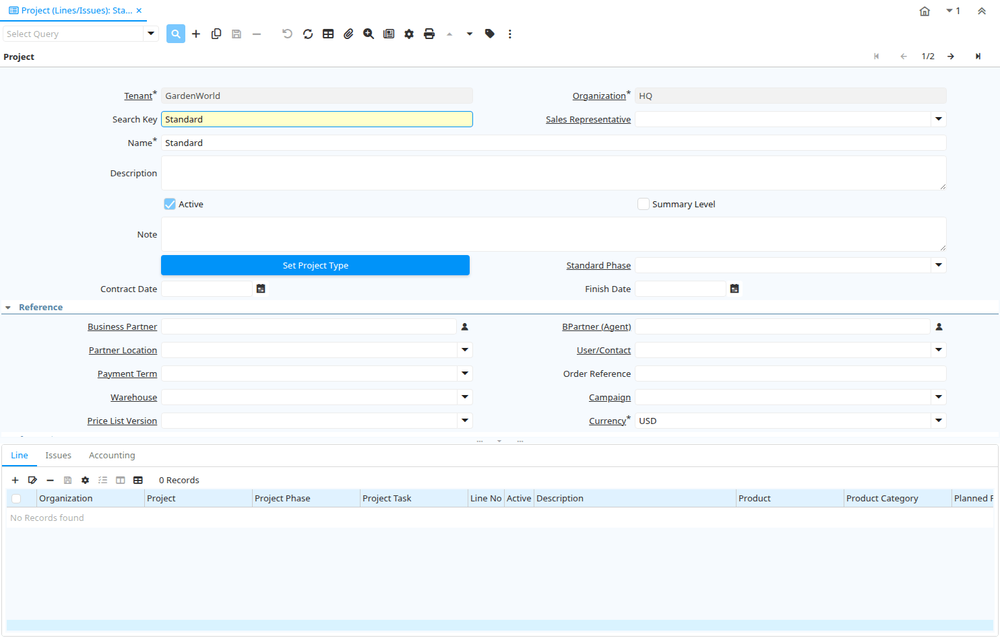

# Project (Lines/Issues)

Window ID 286

*10/07/2003 → 15/01/2024*

**Description:** Maintain Sales Order and Work Order Details

**Comment/Help:** The Project Window is used to maintain details of Projects Lines and Issues across Phases/Tasks

## Tab: Project

*Tab Level 0 · Created 10/07/2003 · Updated 26/03/2006*

**Description:** Maintain Sales Order Projects and Work Orders

**Comment/Help:** The Project Tab is used to define the Value, Name and Description for each project.  It also is defines the tracks the amounts assigned to, committed to and used for this project.

| **Name** | **Description** | **Comment/Help** | **Technical Data** |
|---|---|---|---|
| Tenant | Tenant for this installation. | A Tenant is a company or a legal entity. You cannot share data between Tenants. | C_Project.AD_Client_ID<small> numeric(10)   Table Direct</small> |
| Organization | Organizational entity within tenant | An organization is a unit of your tenant or legal entity - examples are store, department. You can share data between organizations. | C_Project.AD_Org_ID<small> numeric(10)   Table Direct</small> |
| Search Key | Search key for the record in the format required - must be unique | A search key allows you a fast method of finding a particular record. If you leave the search key empty, the system automatically creates a numeric number.  The document sequence used for this fallback number is defined in the "Maintain Sequence" window with the name "DocumentNo_&lt;TableName&gt;", where TableName is the actual name of the table (e.g. C_Order). | C_Project.Value<small> character varying(40)   String</small> |
| Sales Representative | Sales Representative or Company Agent | The Sales Representative indicates the Sales Rep for this Region.  Any Sales Rep must be a valid internal user. | C_Project.SalesRep_ID<small> numeric(10)   Table</small> |
| Name | Alphanumeric identifier of the entity | The name of an entity (record) is used as an default search option in addition to the search key. The name is up to 60 characters in length. | C_Project.Name<small> character varying(60)   String</small> |
| Description | Optional short description of the record | A description is limited to 255 characters. | C_Project.Description<small> character varying(255)   Text</small> |
| Active | The record is active in the system | There are two methods of making records unavailable in the system: One is to delete the record, the other is to de-activate the record. A de-activated record is not available for selection, but available for reports. There are two reasons for de-activating and not deleting records: (1) The system requires the record for audit purposes. (2) The record is referenced by other records. E.g., you cannot delete a Business Partner, if there are invoices for this partner record existing. You de-activate the Business Partner and prevent that this record is used for future entries. | C_Project.IsActive<small> character(1)   Yes-No</small> |
| Summary Level | This is a summary entity | A summary entity represents a branch in a tree rather than an end-node. Summary entities are used for reporting and do not have own values. | C_Project.IsSummary<small> character(1)   Yes-No</small> |
| Note | Optional additional user defined information | The Note field allows for optional entry of user defined information regarding this record | C_Project.Note<small> character varying(2000)   Text</small> |
| Set Project Type | Set Project Type and for Service Projects copy Phases and Tasks of Project Type into Project |   | C_Project.C_ProjectType_ID<small> numeric(10)   Button</small> |
| Standard Phase | Standard Phase of the Project Type | Phase of the project with standard performance information with standard work | C_Project.C_Phase_ID<small> numeric(10)   Table Direct</small> |
| Contract Date | The (planned) effective date of this document. | The contract date is used to determine when the document becomes effective. This is usually the contract date.  The contract date is used in reports and report parameters. | C_Project.DateContract<small> timestamp without time zone   Date</small> |
| Finish Date | Finish or (planned) completion date | The finish date is used to indicate when the project is expected to be completed or has been completed. | C_Project.DateFinish<small> timestamp without time zone   Date</small> |
| Business Partner | Identifies a Business Partner | A Business Partner is anyone with whom you transact.  This can include Vendor, Customer, Employee or Salesperson | C_Project.C_BPartner_ID<small> numeric(10)   Search</small> |
| BPartner (Agent) | Business Partner (Agent or Sales Rep) |  | C_Project.C_BPartnerSR_ID<small> numeric(10)   Search</small> |
| Partner Location | Identifies the (ship to) address for this Business Partner | The Partner address indicates the location of a Business Partner | C_Project.C_BPartner_Location_ID<small> numeric(10)   Table Direct</small> |
| User/Contact | User within the system - Internal or Business Partner Contact | The User identifies a unique user in the system. This could be an internal user or a business partner contact | C_Project.AD_User_ID<small> numeric(10)   Table Direct</small> |
| Payment Term | The terms of Payment (timing, discount) | Payment Terms identify the method and timing of payment. | C_Project.C_PaymentTerm_ID<small> numeric(10)   Table Direct</small> |
| Order Reference | Transaction Reference Number (Sales Order, Purchase Order) of your Business Partner | The business partner order reference is the order reference for this specific transaction; Often Purchase Order numbers are given to print on Invoices for easier reference.  A standard number can be defined in the Business Partner (Customer) window. | C_Project.POReference<small> character varying(20)   String</small> |
| Warehouse | Storage Warehouse and Service Point | The Warehouse identifies a unique Warehouse where products are stored or Services are provided. | C_Project.M_Warehouse_ID<small> numeric(10)   Table Direct</small> |
| Campaign | Marketing Campaign | The Campaign defines a unique marketing program.  Projects can be associated with a pre defined Marketing Campaign.  You can then report based on a specific Campaign. | C_Project.C_Campaign_ID<small> numeric(10)   Table Direct</small> |
| Price List Version | Identifies a unique instance of a Price List | Each Price List can have multiple versions.  The most common use is to indicate the dates that a Price List is valid for. | C_Project.M_PriceList_Version_ID<small> numeric(10)   Table Direct</small> |
| Currency | The Currency for this record | Indicates the Currency to be used when processing or reporting on this record | C_Project.C_Currency_ID<small> numeric(10)   Table Direct</small> |
| Planned Amount | Planned amount for this project | The Planned Amount indicates the anticipated amount for this project or project line. | C_Project.PlannedAmt<small> numeric   Amount</small> |
| Planned Quantity | Planned quantity for this project | The Planned Quantity indicates the anticipated quantity for this project or project line | C_Project.PlannedQty<small> numeric   Quantity</small> |
| Planned Margin | Project's planned margin amount | The Planned Margin Amount indicates the anticipated margin amount for this project or project line. | C_Project.PlannedMarginAmt<small> numeric   Amount</small> |
| Invoice Rule | Invoice Rule for the project | The Invoice Rule for the project determines how orders (and consequently invoices) are created.  The selection on project level can be overwritten on Phase or Task | C_Project.ProjInvoiceRule<small> character(1)   List</small> |
| Committed Amount | The (legal) commitment amount | The commitment amount is independent from the planned amount. You would use the planned amount for your realistic estimation, which might be higher or lower than the commitment amount. | C_Project.CommittedAmt<small> numeric   Amount</small> |
| Committed Quantity | The (legal) commitment Quantity | The commitment amount is independent from the planned amount. You would use the planned amount for your realistic estimation, which might be higher or lower than the commitment amount. | C_Project.CommittedQty<small> numeric   Quantity</small> |
| Invoiced Amount | The amount invoiced | The amount invoiced | C_Project.InvoicedAmt<small> numeric   Amount</small> |
| Quantity Invoiced | The quantity invoiced |  | C_Project.InvoicedQty<small> numeric   Quantity</small> |
| Project Balance | Total Project Balance | The project balance is the sum of all Issue to Project. | C_Project.ProjectBalanceAmt<small> numeric   Amount</small> |
| Copy Details | Copy Lines/Phases/Tasks from other Project |  | C_Project.CopyFrom<small> character(1)   Button</small> |
| Generate Order | Generate Order from Project | The Generate Order process will generate a new Order document based on the project phase. A price list and warehouse/service point must be defined on the project. | C_Project.GenerateTo<small> character(1)   Button</small> |
| Close Project |  |  | C_Project.Processing<small> character(1)   Button</small> |

## Tab: › Line

*Tab Level 1 · Created 11/03/2001 · Updated 02/09/2005*

**Description:** Define Project Lines

**Comment/Help:** The Project Lines Tab is used to define the lines (products and/or services) associated with this Project. This is an alternative to Project Phases. You would use lines, if you do not want to use a Project Type template with phases.

| **Name** | **Description** | **Comment/Help** | **Technical Data** |
|---|---|---|---|
| Tenant | Tenant for this installation. | A Tenant is a company or a legal entity. You cannot share data between Tenants. | C_ProjectLine.AD_Client_ID<small> numeric(10)   Table Direct</small> |
| Organization | Organizational entity within tenant | An organization is a unit of your tenant or legal entity - examples are store, department. You can share data between organizations. | C_ProjectLine.AD_Org_ID<small> numeric(10)   Table Direct</small> |
| Project | Financial Project | A Project allows you to track and control internal or external activities. | C_ProjectLine.C_Project_ID<small> numeric(10)   Table Direct</small> |
| Project Phase | Phase of a Project |  | C_ProjectLine.C_ProjectPhase_ID<small> numeric(10)   Table Direct</small> |
| Project Task | Actual Project Task in a Phase | A Project Task in a Project Phase represents the actual work. | C_ProjectLine.C_ProjectTask_ID<small> numeric(10)   Table Direct</small> |
| Line No | Unique line for this document | Indicates the unique line for a document.  It will also control the display order of the lines within a document. | C_ProjectLine.Line<small> numeric(10)   Integer</small> |
| Active | The record is active in the system | There are two methods of making records unavailable in the system: One is to delete the record, the other is to de-activate the record. A de-activated record is not available for selection, but available for reports. There are two reasons for de-activating and not deleting records: (1) The system requires the record for audit purposes. (2) The record is referenced by other records. E.g., you cannot delete a Business Partner, if there are invoices for this partner record existing. You de-activate the Business Partner and prevent that this record is used for future entries. | C_ProjectLine.IsActive<small> character(1)   Yes-No</small> |
| Description | Optional short description of the record | A description is limited to 255 characters. | C_ProjectLine.Description<small> character varying(255)   Text</small> |
| Product | Product, Service, Item | Identifies an item which is either purchased or sold in this organization. | C_ProjectLine.M_Product_ID<small> numeric(10)   Search</small> |
| Product Category | Category of a Product | Identifies the category which this product belongs to.  Product categories are used for pricing and selection. | C_ProjectLine.M_Product_Category_ID<small> numeric(10)   Table Direct</small> |
| Planned Price | Planned price for this project line | The Planned Price indicates the anticipated price for this project line. | C_ProjectLine.PlannedPrice<small> numeric   Costs+Prices</small> |
| Planned Quantity | Planned quantity for this project | The Planned Quantity indicates the anticipated quantity for this project or project line | C_ProjectLine.PlannedQty<small> numeric   Quantity</small> |
| Get Price | Get Price for Project Line based on Project Price List |  | C_ProjectLine.DoPricing<small> character(1)   Button</small> |
| Planned Amount | Planned amount for this project | The Planned Amount indicates the anticipated amount for this project or project line. | C_ProjectLine.PlannedAmt<small> numeric   Amount</small> |
| Printed | Indicates if this document / line is printed | The Printed checkbox indicates if this document or line will included when printing. | C_ProjectLine.IsPrinted<small> character(1)   Yes-No</small> |
| Planned Margin | Project's planned margin amount | The Planned Margin Amount indicates the anticipated margin amount for this project or project line. | C_ProjectLine.PlannedMarginAmt<small> numeric   Amount</small> |
| Committed Amount | The (legal) commitment amount | The commitment amount is independent from the planned amount. You would use the planned amount for your realistic estimation, which might be higher or lower than the commitment amount. | C_ProjectLine.CommittedAmt<small> numeric   Amount</small> |
| Committed Quantity | The (legal) commitment Quantity | The commitment amount is independent from the planned amount. You would use the planned amount for your realistic estimation, which might be higher or lower than the commitment amount. | C_ProjectLine.CommittedQty<small> numeric   Quantity</small> |
| Invoiced Amount | The amount invoiced | The amount invoiced | C_ProjectLine.InvoicedAmt<small> numeric   Amount</small> |
| Quantity Invoiced | The quantity invoiced |  | C_ProjectLine.InvoicedQty<small> numeric   Quantity</small> |
| Order | Order | The Order is a control document.  The  Order is complete when the quantity ordered is the same as the quantity shipped and invoiced.  When you close an order, unshipped (backordered) quantities are cancelled. | C_ProjectLine.C_Order_ID<small> numeric(10)   Search</small> |
| Purchase Order | Purchase Order |  | C_ProjectLine.C_OrderPO_ID<small> numeric(10)   Search</small> |
| Project Issue | Project Issues (Material, Labor) | Issues to the project initiated by the "Issue to Project" process. You can issue Receipts, Time and Expenses, or Stock. | C_ProjectLine.C_ProjectIssue_ID<small> numeric(10)   Table Direct</small> |
| Processed | The document has been processed | The Processed checkbox indicates that a document has been processed. | C_ProjectLine.Processed<small> character(1)   Yes-No</small> |

## Tab: › Issues

*Tab Level 1 · Created 02/09/2003 · Updated 17/08/2021*

**Description:** Issues to the Project

**Comment/Help:** The lab lists the Issues to the project initiated by the "Issue to Project" process. You can issue Receipts, Time and Expenses, or Stock.

| **Name** | **Description** | **Comment/Help** | **Technical Data** |
|---|---|---|---|
| Tenant | Tenant for this installation. | A Tenant is a company or a legal entity. You cannot share data between Tenants. | C_ProjectIssue.AD_Client_ID<small> numeric(10)   Table Direct</small> |
| Organization | Organizational entity within tenant | An organization is a unit of your tenant or legal entity - examples are store, department. You can share data between organizations. | C_ProjectIssue.AD_Org_ID<small> numeric(10)   Table Direct</small> |
| Project | Financial Project | A Project allows you to track and control internal or external activities. | C_ProjectIssue.C_Project_ID<small> numeric(10)   Table Direct</small> |
| Active | The record is active in the system | There are two methods of making records unavailable in the system: One is to delete the record, the other is to de-activate the record. A de-activated record is not available for selection, but available for reports. There are two reasons for de-activating and not deleting records: (1) The system requires the record for audit purposes. (2) The record is referenced by other records. E.g., you cannot delete a Business Partner, if there are invoices for this partner record existing. You de-activate the Business Partner and prevent that this record is used for future entries. | C_ProjectIssue.IsActive<small> character(1)   Yes-No</small> |
| Line No | Unique line for this document | Indicates the unique line for a document.  It will also control the display order of the lines within a document. | C_ProjectIssue.Line<small> numeric(10)   Integer</small> |
| Movement Date | Date a product was moved in or out of inventory | The Movement Date indicates the date that a product moved in or out of inventory.  This is the result of a shipment, receipt or inventory movement. | C_ProjectIssue.MovementDate<small> timestamp without time zone   Date</small> |
| Product | Product, Service, Item | Identifies an item which is either purchased or sold in this organization. | C_ProjectIssue.M_Product_ID<small> numeric(10)   Search</small> |
| Attribute Set Instance | Product Attribute Set Instance | The values of the actual Product Attribute Instances.  The product level attributes are defined on Product level. | C_ProjectIssue.M_AttributeSetInstance_ID<small> numeric(10)   Product Attribute</small> |
| Locator | Warehouse Locator | The Locator indicates where in a Warehouse a product is located. | C_ProjectIssue.M_Locator_ID<small> numeric(10)   Locator (WH)</small> |
| Movement Quantity | Quantity of a product moved. | The Movement Quantity indicates the quantity of a product that has been moved. | C_ProjectIssue.MovementQty<small> numeric   Quantity</small> |
| Description | Optional short description of the record | A description is limited to 255 characters. | C_ProjectIssue.Description<small> character varying(255)   Text</small> |
| Shipment/Receipt Line | Line on Shipment or Receipt document | The Shipment/Receipt Line indicates a unique line in a Shipment/Receipt document | C_ProjectIssue.M_InOutLine_ID<small> numeric(10)   Search</small> |
| Expense Line | Time and Expense Report Line |  | C_ProjectIssue.S_TimeExpenseLine_ID<small> numeric(10)   Search</small> |
| Document Status | The current status of the document | The Document Status indicates the status of a document at this time.  If you want to change the document status, use the Document Action field | C_ProjectIssue.DocStatus<small> character varying(2)   List</small> |
| Process Project Issue |  |  | C_ProjectIssue.DocAction<small> character(2)   Button</small> |
| Processed | The document has been processed | The Processed checkbox indicates that a document has been processed. | C_ProjectIssue.Processed<small> character(1)   Yes-No</small> |
| Posted | Posting status | The Posted field indicates the status of the Generation of General Ledger Accounting Lines  | C_ProjectIssue.Posted<small> character(1)   Button</small> |

## Tab: › Accounting

*Tab Level 1 · Created 10/07/2003 · Updated 26/03/2006*

**Description:** Define Project Accounting

**Comment/Help:** The Accounting Tab is used to define the Asset Account to use when a project is completed and the associated asset realized.

| **Name** | **Description** | **Comment/Help** | **Technical Data** |
|---|---|---|---|
| Tenant | Tenant for this installation. | A Tenant is a company or a legal entity. You cannot share data between Tenants. | C_Project_Acct.AD_Client_ID<small> numeric(10)   Table Direct</small> |
| Organization | Organizational entity within tenant | An organization is a unit of your tenant or legal entity - examples are store, department. You can share data between organizations. | C_Project_Acct.AD_Org_ID<small> numeric(10)   Table Direct</small> |
| Project | Financial Project | A Project allows you to track and control internal or external activities. | C_Project_Acct.C_Project_ID<small> numeric(10)   Table Direct</small> |
| Accounting Schema | Rules for accounting | An Accounting Schema defines the rules used in accounting such as costing method, currency and calendar | C_Project_Acct.C_AcctSchema_ID<small> numeric(10)   Table Direct</small> |
| Active | The record is active in the system | There are two methods of making records unavailable in the system: One is to delete the record, the other is to de-activate the record. A de-activated record is not available for selection, but available for reports. There are two reasons for de-activating and not deleting records: (1) The system requires the record for audit purposes. (2) The record is referenced by other records. E.g., you cannot delete a Business Partner, if there are invoices for this partner record existing. You de-activate the Business Partner and prevent that this record is used for future entries. | C_Project_Acct.IsActive<small> character(1)   Yes-No</small> |
| Project Asset | Project Asset Account | The Project Asset account is the account used as the final asset account in capital projects | C_Project_Acct.PJ_Asset_Acct<small> numeric(10)   Account</small> |
| Work In Progress | Account for Work in Progress | The Work in Process account is the account used in capital projects until the project is completed | C_Project_Acct.PJ_WIP_Acct<small> numeric(10)   Account</small> |

