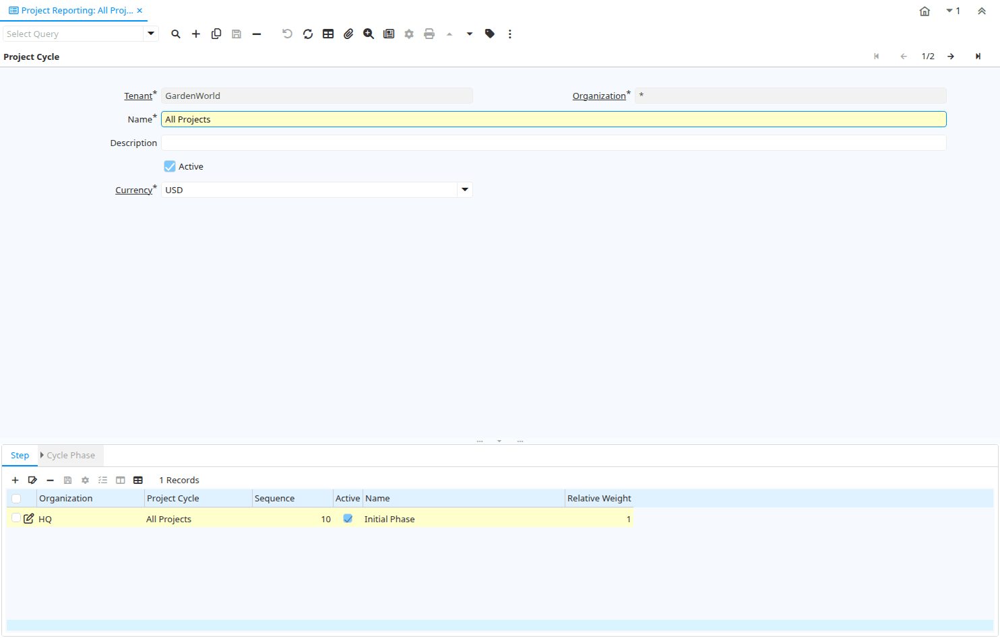

# Project Reporting

Window ID 208

*11/03/2001 → 02/01/2000*

**Description:** Maintain Project Reporting Cycles

**Comment/Help:** The Project Cycle Window defines the steps associated with a specific Project.
You may want to define several Project cycles to differentiate the different types of projects. Project cycles may use all or a subset of the used Project Status (e.g. Your opportunity project cycle may include the steps from prospect to contract - the service cycle may include steps from installation to customer acceptance.

## Tab: Project Cycle

*Tab Level 0 · Created 11/03/2001 · Updated 02/01/2000*

**Description:** Define Project Report Cycle

**Comment/Help:** Define the currency that projects Project are reported. The projects themselves could be in a different currency.

| **Name** | **Description** | **Comment/Help** | **Technical Data** |
|---|---|---|---|
| Tenant | Tenant for this installation. | A Tenant is a company or a legal entity. You cannot share data between Tenants. | C_Cycle.AD_Client_ID<small> numeric(10)   Table Direct</small> |
| Organization | Organizational entity within tenant | An organization is a unit of your tenant or legal entity - examples are store, department. You can share data between organizations. | C_Cycle.AD_Org_ID<small> numeric(10)   Table Direct</small> |
| Name | Alphanumeric identifier of the entity | The name of an entity (record) is used as an default search option in addition to the search key. The name is up to 60 characters in length. | C_Cycle.Name<small> character varying(60)   String</small> |
| Description | Optional short description of the record | A description is limited to 255 characters. | C_Cycle.Description<small> character varying(255)   String</small> |
| Active | The record is active in the system | There are two methods of making records unavailable in the system: One is to delete the record, the other is to de-activate the record. A de-activated record is not available for selection, but available for reports. There are two reasons for de-activating and not deleting records: (1) The system requires the record for audit purposes. (2) The record is referenced by other records. E.g., you cannot delete a Business Partner, if there are invoices for this partner record existing. You de-activate the Business Partner and prevent that this record is used for future entries. | C_Cycle.IsActive<small> character(1)   Yes-No</small> |
| Currency | The Currency for this record | Indicates the Currency to be used when processing or reporting on this record | C_Cycle.C_Currency_ID<small> numeric(10)   Table Direct</small> |

## Tab: › Step

*Tab Level 1 · Created 01/06/2003 · Updated 02/01/2000*

**Description:** Project Cycle Step

**Comment/Help:** The Cycle Step determines the logical sequence of events within your cycle. It is the common of similar Project Phases making different project types comparable.

| **Name** | **Description** | **Comment/Help** | **Technical Data** |
|---|---|---|---|
| Tenant | Tenant for this installation. | A Tenant is a company or a legal entity. You cannot share data between Tenants. | C_CycleStep.AD_Client_ID<small> numeric(10)   Table Direct</small> |
| Organization | Organizational entity within tenant | An organization is a unit of your tenant or legal entity - examples are store, department. You can share data between organizations. | C_CycleStep.AD_Org_ID<small> numeric(10)   Table Direct</small> |
| Project Cycle | Identifier for this Project Reporting Cycle | Identifies a Project Cycle which can be made up of one or more cycle steps and cycle phases. | C_CycleStep.C_Cycle_ID<small> numeric(10)   Table Direct</small> |
| Sequence | Method of ordering records; lowest number comes first | The Sequence indicates the order of records | C_CycleStep.SeqNo<small> numeric(10)   Integer</small> |
| Active | The record is active in the system | There are two methods of making records unavailable in the system: One is to delete the record, the other is to de-activate the record. A de-activated record is not available for selection, but available for reports. There are two reasons for de-activating and not deleting records: (1) The system requires the record for audit purposes. (2) The record is referenced by other records. E.g., you cannot delete a Business Partner, if there are invoices for this partner record existing. You de-activate the Business Partner and prevent that this record is used for future entries. | C_CycleStep.IsActive<small> character(1)   Yes-No</small> |
| Name | Alphanumeric identifier of the entity | The name of an entity (record) is used as an default search option in addition to the search key. The name is up to 60 characters in length. | C_CycleStep.Name<small> character varying(60)   String</small> |
| Relative Weight | Relative weight of this step (0 = ignored) | The relative weight allows you to adjust the project cycle report based on probabilities.  For example, if you have a 1:10 chance in closing a contract when it is in the prospect stage and a 1:2 chance when it is in the contract stage, you may put a weight of 0.1 and 0.5 on those steps. This allows sales funnels or measures of completion of your project. | C_CycleStep.RelativeWeight<small> numeric   Quantity</small> |

## Tab: › › Cycle Phase

*Tab Level 2 · Created 11/03/2001 · Updated 02/01/2000*

**Description:** Link Cycle Step with Project Phases

**Comment/Help:** Link similar Project Phases to a Cycle Step

| **Name** | **Description** | **Comment/Help** | **Technical Data** |
|---|---|---|---|
| Tenant | Tenant for this installation. | A Tenant is a company or a legal entity. You cannot share data between Tenants. | C_CyclePhase.AD_Client_ID<small> numeric(10)   Table Direct</small> |
| Organization | Organizational entity within tenant | An organization is a unit of your tenant or legal entity - examples are store, department. You can share data between organizations. | C_CyclePhase.AD_Org_ID<small> numeric(10)   Table Direct</small> |
| Cycle Step | The step for this Cycle | Identifies one or more steps within a Project Cycle. A cycle Step has multiple Phases | C_CyclePhase.C_CycleStep_ID<small> numeric(10)   Table Direct</small> |
| Active | The record is active in the system | There are two methods of making records unavailable in the system: One is to delete the record, the other is to de-activate the record. A de-activated record is not available for selection, but available for reports. There are two reasons for de-activating and not deleting records: (1) The system requires the record for audit purposes. (2) The record is referenced by other records. E.g., you cannot delete a Business Partner, if there are invoices for this partner record existing. You de-activate the Business Partner and prevent that this record is used for future entries. | C_CyclePhase.IsActive<small> character(1)   Yes-No</small> |
| Standard Phase | Standard Phase of the Project Type | Phase of the project with standard performance information with standard work | C_CyclePhase.C_Phase_ID<small> numeric(10)   Table Direct</small> |

