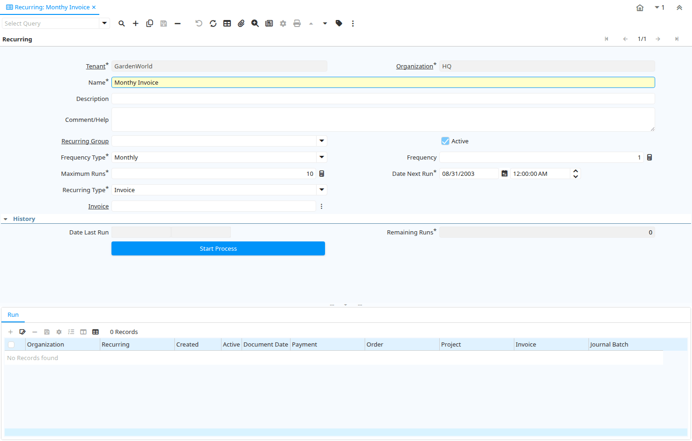

# Recurring

Window ID 266

*28/05/2003 → 02/01/2000*

**Description:** Recurring Document

**Comment/Help:** Create new documents based on existing one

## Tab: Recurring

*Tab Level 0 · Created 28/05/2003 · Updated 02/01/2000*

**Description:** Recurring Document

**Comment/Help:** Maintain Recurring Documents. The Date Next Run determines the Document (and Accounting Date) of the generated documents.

| **Name** | **Description** | **Comment/Help** | **Technical Data** |
|---|---|---|---|
| Tenant | Tenant for this installation. | A Tenant is a company or a legal entity. You cannot share data between Tenants. | C_Recurring.AD_Client_ID<small> numeric(10)   Table Direct</small> |
| Organization | Organizational entity within tenant | An organization is a unit of your tenant or legal entity - examples are store, department. You can share data between organizations. | C_Recurring.AD_Org_ID<small> numeric(10)   Table Direct</small> |
| Name | Alphanumeric identifier of the entity | The name of an entity (record) is used as an default search option in addition to the search key. The name is up to 60 characters in length. | C_Recurring.Name<small> character varying(60)   String</small> |
| Description | Optional short description of the record | A description is limited to 255 characters. | C_Recurring.Description<small> character varying(255)   String</small> |
| Comment/Help | Comment or Hint | The Help field contains a hint, comment or help about the use of this item. | C_Recurring.Help<small> character varying(2000)   Text</small> |
| Recurring Group |  |  | C_Recurring.C_RecurringGroup_ID<small> numeric(10)   Table Direct</small> |
| Active | The record is active in the system | There are two methods of making records unavailable in the system: One is to delete the record, the other is to de-activate the record. A de-activated record is not available for selection, but available for reports. There are two reasons for de-activating and not deleting records: (1) The system requires the record for audit purposes. (2) The record is referenced by other records. E.g., you cannot delete a Business Partner, if there are invoices for this partner record existing. You de-activate the Business Partner and prevent that this record is used for future entries. | C_Recurring.IsActive<small> character(1)   Yes-No</small> |
| Frequency Type | Frequency of event | The frequency type is used for calculating the date of the next event. | C_Recurring.FrequencyType<small> character(1)   List</small> |
| Frequency | Frequency of events | The frequency is used in conjunction with the frequency type in determining an event. Example: If the Frequency Type is Week and the Frequency is 2 - it is every two weeks. | C_Recurring.Frequency<small> numeric(10)   Integer</small> |
| Maximum Runs | Number of recurring runs | Number of recurring documents to be generated in total | C_Recurring.RunsMax<small> numeric(10)   Integer</small> |
| Date Next Run | Date the process will run next | The Date Next Run indicates the next time this process will run. | C_Recurring.DateNextRun<small> timestamp without time zone   Date+Time</small> |
| Recurring Type | Type of Recurring Document | The type of document to be generated | C_Recurring.RecurringType<small> character(1)   List</small> |
| Order | Order | The Order is a control document.  The  Order is complete when the quantity ordered is the same as the quantity shipped and invoiced.  When you close an order, unshipped (backordered) quantities are cancelled. | C_Recurring.C_Order_ID<small> numeric(10)   Search</small> |
| Journal Batch | General Ledger Journal Batch | The General Ledger Journal Batch identifies a group of journals to be processed as a group. | C_Recurring.GL_JournalBatch_ID<small> numeric(10)   Search</small> |
| Invoice | Invoice Identifier | The Invoice Document. | C_Recurring.C_Invoice_ID<small> numeric(10)   Search</small> |
| Project | Financial Project | A Project allows you to track and control internal or external activities. | C_Recurring.C_Project_ID<small> numeric(10)   Search</small> |
| Payment | Payment identifier | The Payment is a unique identifier of this payment. | C_Recurring.C_Payment_ID<small> numeric(10)   Search</small> |
| Date Last Run | Date the process was last run. | The Date Last Run indicates the last time that a process was run. | C_Recurring.DateLastRun<small> timestamp without time zone   Date+Time</small> |
| Remaining Runs | Number of recurring runs remaining | Number of recurring documents to be still generated | C_Recurring.RunsRemaining<small> numeric(10)   Integer</small> |
| Start Process | Start Recurring Run |  | C_Recurring.Processing<small> character(1)   Button</small> |

## Tab: › Run

*Tab Level 1 · Created 28/05/2003 · Updated 02/01/2000*

**Description:** Recurring Document Run

**Comment/Help:** History of Recurring Document Generation

| **Name** | **Description** | **Comment/Help** | **Technical Data** |
|---|---|---|---|
| Tenant | Tenant for this installation. | A Tenant is a company or a legal entity. You cannot share data between Tenants. | C_Recurring_Run.AD_Client_ID<small> numeric(10)   Table Direct</small> |
| Organization | Organizational entity within tenant | An organization is a unit of your tenant or legal entity - examples are store, department. You can share data between organizations. | C_Recurring_Run.AD_Org_ID<small> numeric(10)   Table Direct</small> |
| Recurring | Recurring Document | Recurring Documents | C_Recurring_Run.C_Recurring_ID<small> numeric(10)   Table Direct</small> |
| Created | Date this record was created | The Created field indicates the date that this record was created. | C_Recurring_Run.Created<small> timestamp without time zone   Date+Time</small> |
| Active | The record is active in the system | There are two methods of making records unavailable in the system: One is to delete the record, the other is to de-activate the record. A de-activated record is not available for selection, but available for reports. There are two reasons for de-activating and not deleting records: (1) The system requires the record for audit purposes. (2) The record is referenced by other records. E.g., you cannot delete a Business Partner, if there are invoices for this partner record existing. You de-activate the Business Partner and prevent that this record is used for future entries. | C_Recurring_Run.IsActive<small> character(1)   Yes-No</small> |
| Document Date | Date of the Document | The Document Date indicates the date the document was generated.  It may or may not be the same as the accounting date. | C_Recurring_Run.DateDoc<small> timestamp without time zone   Date</small> |
| Payment | Payment identifier | The Payment is a unique identifier of this payment. | C_Recurring_Run.C_Payment_ID<small> numeric(10)   Search</small> |
| Order | Order | The Order is a control document.  The  Order is complete when the quantity ordered is the same as the quantity shipped and invoiced.  When you close an order, unshipped (backordered) quantities are cancelled. | C_Recurring_Run.C_Order_ID<small> numeric(10)   Search</small> |
| Project | Financial Project | A Project allows you to track and control internal or external activities. | C_Recurring_Run.C_Project_ID<small> numeric(10)   Search</small> |
| Invoice | Invoice Identifier | The Invoice Document. | C_Recurring_Run.C_Invoice_ID<small> numeric(10)   Search</small> |
| Journal Batch | General Ledger Journal Batch | The General Ledger Journal Batch identifies a group of journals to be processed as a group. | C_Recurring_Run.GL_JournalBatch_ID<small> numeric(10)   Search</small> |

