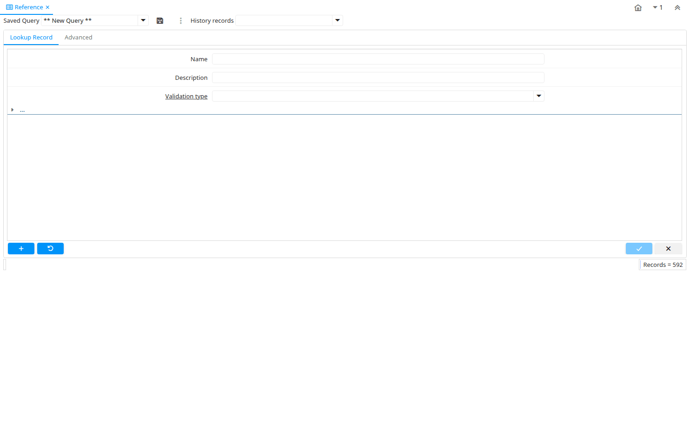

# Reference

Window ID 101

*21/05/1999 → 03/05/2006*

**Description:** Maintain System References

**Comment/Help:** The Reference Window defines field/display types and validations. This window is for System Admin use only.

## Tab: Reference

*Tab Level 0 · Created 21/05/1999 · Updated 02/01/2000*

**Description:** Reference header definitions

**Comment/Help:** The Reference Tab defines the references that are used to validate data

| **Name** | **Description** | **Comment/Help** | **Technical Data** |
|---|---|---|---|
| Tenant | Tenant for this installation. | A Tenant is a company or a legal entity. You cannot share data between Tenants. | AD_Reference.AD_Client_ID<small> numeric(10)   Table Direct</small> |
| Organization | Organizational entity within tenant | An organization is a unit of your tenant or legal entity - examples are store, department. You can share data between organizations. | AD_Reference.AD_Org_ID<small> numeric(10)   Table Direct</small> |
| Name | Alphanumeric identifier of the entity | The name of an entity (record) is used as an default search option in addition to the search key. The name is up to 60 characters in length. | AD_Reference.Name<small> character varying(60)   String</small> |
| Description | Optional short description of the record | A description is limited to 255 characters. | AD_Reference.Description<small> character varying(255)   String</small> |
| Comment/Help | Comment or Hint | The Help field contains a hint, comment or help about the use of this item. | AD_Reference.Help<small> character varying(2000)   Text</small> |
| Active | The record is active in the system | There are two methods of making records unavailable in the system: One is to delete the record, the other is to de-activate the record. A de-activated record is not available for selection, but available for reports. There are two reasons for de-activating and not deleting records: (1) The system requires the record for audit purposes. (2) The record is referenced by other records. E.g., you cannot delete a Business Partner, if there are invoices for this partner record existing. You de-activate the Business Partner and prevent that this record is used for future entries. | AD_Reference.IsActive<small> character(1)   Yes-No</small> |
| Entity Type | Dictionary Entity Type; Determines ownership and synchronization | The Entity Types "Dictionary", "iDempiere" and "Application" might be automatically synchronized and customizations deleted or overwritten.    For customizations, copy the entity and select "User"! | AD_Reference.EntityType<small> character varying(40)   Table</small> |
| Validation type | Different method of validating data | The Validation Type indicates the validation method to use.  These include list, table or data type validation. | AD_Reference.ValidationType<small> character(1)   List</small> |
| System Element | System Element enables the central maintenance of column description and help. | The System Element allows for the central maintenance of help, descriptions and terminology for a database column. | AD_Reference.AD_Element_ID<small> numeric(10)   Search</small> |
| Value Format | Format of the value; Can contain fixed format elements, Variables: "_lLoOaAcCa09", or ~regex | &lt;B&gt;Validation elements:&lt;/B&gt;  ~regex - Validates a regular expression   	(Space) any character _	Space (fixed character) l	any Letter a..Z NO space L	any Letter a..Z NO space converted to upper case o	any Letter a..Z or space O	any Letter a..Z or space converted to upper case a	any Letters &amp; Digits NO space A	any Letters &amp; Digits NO space converted to upper case c	any Letters &amp; Digits or space C	any Letters &amp; Digits or space converted to upper case 0	Digits 0..9 NO space 9	Digits 0..9 or space  Example of format "(000)_000-0000" | AD_Reference.VFormat<small> character varying(40)   String</small> |
| Show Inactive | Show Inactive Records |  | AD_Reference.ShowInactive<small> character varying(4)   List</small> |
| Order By Value | Order list using the value column instead of the name column | Order list using the value column instead of the name column | AD_Reference.IsOrderByValue<small> character(1)   Yes-No</small> |

## Tab: › List Validation

*Tab Level 1 · Created 21/05/1999 · Updated 16/11/2012*

**Description:** Reference List

**Comment/Help:** The List Validation Tab defines lists to validate data

| **Name** | **Description** | **Comment/Help** | **Technical Data** |
|---|---|---|---|
| Tenant | Tenant for this installation. | A Tenant is a company or a legal entity. You cannot share data between Tenants. | AD_Ref_List.AD_Client_ID<small> numeric(10)   Table Direct</small> |
| Organization | Organizational entity within tenant | An organization is a unit of your tenant or legal entity - examples are store, department. You can share data between organizations. | AD_Ref_List.AD_Org_ID<small> numeric(10)   Table Direct</small> |
| Reference | System Reference and Validation | The Reference could be a display type, list or table validation. | AD_Ref_List.AD_Reference_ID<small> numeric(10)   Table Direct</small> |
| Search Key | Search key for the record in the format required - must be unique | A search key allows you a fast method of finding a particular record. If you leave the search key empty, the system automatically creates a numeric number.  The document sequence used for this fallback number is defined in the "Maintain Sequence" window with the name "DocumentNo_&lt;TableName&gt;", where TableName is the actual name of the table (e.g. C_Order). | AD_Ref_List.Value<small> character varying(60)   String</small> |
| Name | Alphanumeric identifier of the entity | The name of an entity (record) is used as an default search option in addition to the search key. The name is up to 60 characters in length. | AD_Ref_List.Name<small> character varying(60)   String</small> |
| Description | Optional short description of the record | A description is limited to 255 characters. | AD_Ref_List.Description<small> character varying(255)   String</small> |
| Active | The record is active in the system | There are two methods of making records unavailable in the system: One is to delete the record, the other is to de-activate the record. A de-activated record is not available for selection, but available for reports. There are two reasons for de-activating and not deleting records: (1) The system requires the record for audit purposes. (2) The record is referenced by other records. E.g., you cannot delete a Business Partner, if there are invoices for this partner record existing. You de-activate the Business Partner and prevent that this record is used for future entries. | AD_Ref_List.IsActive<small> character(1)   Yes-No</small> |
| Entity Type | Dictionary Entity Type; Determines ownership and synchronization | The Entity Types "Dictionary", "iDempiere" and "Application" might be automatically synchronized and customizations deleted or overwritten.    For customizations, copy the entity and select "User"! | AD_Ref_List.EntityType<small> character varying(40)   Table</small> |
| Valid from | Valid from including this date (first day) | The Valid From date indicates the first day of a date range | AD_Ref_List.ValidFrom<small> timestamp without time zone   Date</small> |
| Valid to | Valid to including this date (last day) | The Valid To date indicates the last day of a date range | AD_Ref_List.ValidTo<small> timestamp without time zone   Date</small> |

## Tab: › › List Translation

*Tab Level 2 · Created 09/08/1999 · Updated 27/10/2024*

| **Name** | **Description** | **Comment/Help** | **Technical Data** |
|---|---|---|---|
| Tenant | Tenant for this installation. | A Tenant is a company or a legal entity. You cannot share data between Tenants. | AD_Ref_List_Trl.AD_Client_ID<small> numeric(10)   Table Direct</small> |
| Organization | Organizational entity within tenant | An organization is a unit of your tenant or legal entity - examples are store, department. You can share data between organizations. | AD_Ref_List_Trl.AD_Org_ID<small> numeric(10)   Table Direct</small> |
| Reference List | Reference List based on Table | The Reference List field indicates a list of reference values from a database tables.  Reference lists populate drop down list boxes in data entry screens | AD_Ref_List_Trl.AD_Ref_List_ID<small> numeric(10)   Table Direct</small> |
| Language | Language for this entity | The Language identifies the language to use for display and formatting | AD_Ref_List_Trl.AD_Language<small> character varying(6)   Table</small> |
| Active | The record is active in the system | There are two methods of making records unavailable in the system: One is to delete the record, the other is to de-activate the record. A de-activated record is not available for selection, but available for reports. There are two reasons for de-activating and not deleting records: (1) The system requires the record for audit purposes. (2) The record is referenced by other records. E.g., you cannot delete a Business Partner, if there are invoices for this partner record existing. You de-activate the Business Partner and prevent that this record is used for future entries. | AD_Ref_List_Trl.IsActive<small> character(1)   Yes-No</small> |
| Translated | This column is translated | The Translated checkbox indicates if this column is translated. | AD_Ref_List_Trl.IsTranslated<small> character(1)   Yes-No</small> |
| Name | Alphanumeric identifier of the entity | The name of an entity (record) is used as an default search option in addition to the search key. The name is up to 60 characters in length. | AD_Ref_List_Trl.Name<small> character varying(60)   String</small> |
| Description | Optional short description of the record | A description is limited to 255 characters. | AD_Ref_List_Trl.Description<small> character varying(255)   String</small> |

## Tab: › Table Validation

*Tab Level 1 · Created 21/05/1999 · Updated 16/11/2012*

**Description:** Table validation

**Comment/Help:** The Table Validation Tab defines tables to validate data

| **Name** | **Description** | **Comment/Help** | **Technical Data** |
|---|---|---|---|
| Tenant | Tenant for this installation. | A Tenant is a company or a legal entity. You cannot share data between Tenants. | AD_Ref_Table.AD_Client_ID<small> numeric(10)   Table Direct</small> |
| Organization | Organizational entity within tenant | An organization is a unit of your tenant or legal entity - examples are store, department. You can share data between organizations. | AD_Ref_Table.AD_Org_ID<small> numeric(10)   Table Direct</small> |
| Reference | System Reference and Validation | The Reference could be a display type, list or table validation. | AD_Ref_Table.AD_Reference_ID<small> numeric(10)   Table Direct</small> |
| Table | Database Table information | The Database Table provides the information of the table definition | AD_Ref_Table.AD_Table_ID<small> numeric(10)   Table Direct</small> |
| Key column | Unique identifier of a record | The Key Column indicates that this the unique identifier of a record on this table. | AD_Ref_Table.AD_Key<small> numeric(10)   Table</small> |
| Display Identifier | Display the record identifier | Display the columns that are marked as part of the identifier for this table. | AD_Ref_Table.IsDisplayIdentifier<small> character(1)   Yes-No</small> |
| Display column | Column that will display | The Display Column indicates the column that will display. | AD_Ref_Table.AD_Display<small> numeric(10)   Table</small> |
| Display Value | Displays Value column with the Display column | The Display Value checkbox indicates if the value column will display with the display column. | AD_Ref_Table.IsValueDisplayed<small> character(1)   Yes-No</small> |
| Display SQL | SQL for display of lookup value | Fully qualified subquery SQL | AD_Ref_Table.DisplaySQL<small> character varying(4000)   String</small> |
| Active | The record is active in the system | There are two methods of making records unavailable in the system: One is to delete the record, the other is to de-activate the record. A de-activated record is not available for selection, but available for reports. There are two reasons for de-activating and not deleting records: (1) The system requires the record for audit purposes. (2) The record is referenced by other records. E.g., you cannot delete a Business Partner, if there are invoices for this partner record existing. You de-activate the Business Partner and prevent that this record is used for future entries. | AD_Ref_Table.IsActive<small> character(1)   Yes-No</small> |
| Entity Type | Dictionary Entity Type; Determines ownership and synchronization | The Entity Types "Dictionary", "iDempiere" and "Application" might be automatically synchronized and customizations deleted or overwritten.    For customizations, copy the entity and select "User"! | AD_Ref_Table.EntityType<small> character varying(40)   Table</small> |
| Sql WHERE | Fully qualified SQL WHERE clause | The Where Clause indicates the SQL WHERE clause to use for record selection. The WHERE clause is added to the query. Fully qualified means "tablename.columnname". | AD_Ref_Table.WhereClause<small> character varying(2000)   Text</small> |
| Sql ORDER BY | Fully qualified ORDER BY clause | The ORDER BY Clause indicates the SQL ORDER BY clause to use for record selection | AD_Ref_Table.OrderByClause<small> character varying(2000)   Text</small> |
| Window | Data entry or display window | The Window field identifies a unique Window in the system. | AD_Ref_Table.AD_Window_ID<small> numeric(10)   Table Direct</small> |
| Info Window | Info and search/select Window | The Info window is used to search and select records as well as display information relevant to the selection. | AD_Ref_Table.AD_InfoWindow_ID<small> numeric(10)   Table Direct</small> |

## Tab: › Used in Column

*Tab Level 1 · Created 27/10/2005 · Updated 09/02/2026*

**Description:** Used in Column (Reference)

| **Name** | **Description** | **Comment/Help** | **Technical Data** |
|---|---|---|---|
| Tenant | Tenant for this installation. | A Tenant is a company or a legal entity. You cannot share data between Tenants. | AD_Column.AD_Client_ID<small> numeric(10)   Table Direct</small> |
| Organization | Organizational entity within tenant | An organization is a unit of your tenant or legal entity - examples are store, department. You can share data between organizations. | AD_Column.AD_Org_ID<small> numeric(10)   Table Direct</small> |
| Table | Database Table information | The Database Table provides the information of the table definition | AD_Column.AD_Table_ID<small> numeric(10)   Table Direct</small> |
| DB Column Name | Name of the column in the database | The Column Name indicates the name of a column on a table as defined in the database. | AD_Column.ColumnName<small> character varying(63)   String</small> |
| System Element | System Element enables the central maintenance of column description and help. | The System Element allows for the central maintenance of help, descriptions and terminology for a database column. | AD_Column.AD_Element_ID<small> numeric(10)   Search</small> |
| Name | Alphanumeric identifier of the entity | The name of an entity (record) is used as an default search option in addition to the search key. The name is up to 60 characters in length. | AD_Column.Name<small> character varying(60)   String</small> |
| Description | Optional short description of the record | A description is limited to 255 characters. | AD_Column.Description<small> character varying(255)   String</small> |
| Comment/Help | Comment or Hint | The Help field contains a hint, comment or help about the use of this item. | AD_Column.Help<small> character varying(2000)   Text</small> |
| Active | The record is active in the system | There are two methods of making records unavailable in the system: One is to delete the record, the other is to de-activate the record. A de-activated record is not available for selection, but available for reports. There are two reasons for de-activating and not deleting records: (1) The system requires the record for audit purposes. (2) The record is referenced by other records. E.g., you cannot delete a Business Partner, if there are invoices for this partner record existing. You de-activate the Business Partner and prevent that this record is used for future entries. | AD_Column.IsActive<small> character(1)   Yes-No</small> |
| Length | Length of the column in the database | The Length indicates the length of a column as defined in the database. | AD_Column.FieldLength<small> numeric(10)   Integer</small> |
| Reference | System Reference and Validation | The Reference could be a display type, list or table validation. | AD_Column.AD_Reference_ID<small> numeric(10)   Table</small> |
| Reference Key | Required to specify, if data type is Table or List | The Reference Value indicates where the reference values are stored.  It must be specified if the data type is Table or List.   | AD_Column.AD_Reference_Value_ID<small> numeric(10)   Table</small> |
| Dynamic Validation | Dynamic Validation Rule | These rules define how an entry is determined to valid. You can use variables for dynamic (context sensitive) validation. | AD_Column.AD_Val_Rule_ID<small> numeric(10)   Table Direct</small> |
| Dynamic Validation (Lookup) | Override Dynamic Validation Rule for Lookup Window | For some situations the dynamic validation rule for a Lookup window should be different from user data entry window.  | AD_Column.AD_Val_Rule_Lookup_ID<small> numeric(10)   Table</small> |

## Tab: › Reference Translation

*Tab Level 1 · Created 09/08/1999 · Updated 27/10/2024*

| **Name** | **Description** | **Comment/Help** | **Technical Data** |
|---|---|---|---|
| Tenant | Tenant for this installation. | A Tenant is a company or a legal entity. You cannot share data between Tenants. | AD_Reference_Trl.AD_Client_ID<small> numeric(10)   Table Direct</small> |
| Organization | Organizational entity within tenant | An organization is a unit of your tenant or legal entity - examples are store, department. You can share data between organizations. | AD_Reference_Trl.AD_Org_ID<small> numeric(10)   Table Direct</small> |
| Reference | System Reference and Validation | The Reference could be a display type, list or table validation. | AD_Reference_Trl.AD_Reference_ID<small> numeric(10)   Table Direct</small> |
| Language | Language for this entity | The Language identifies the language to use for display and formatting | AD_Reference_Trl.AD_Language<small> character varying(6)   Table</small> |
| Active | The record is active in the system | There are two methods of making records unavailable in the system: One is to delete the record, the other is to de-activate the record. A de-activated record is not available for selection, but available for reports. There are two reasons for de-activating and not deleting records: (1) The system requires the record for audit purposes. (2) The record is referenced by other records. E.g., you cannot delete a Business Partner, if there are invoices for this partner record existing. You de-activate the Business Partner and prevent that this record is used for future entries. | AD_Reference_Trl.IsActive<small> character(1)   Yes-No</small> |
| Translated | This column is translated | The Translated checkbox indicates if this column is translated. | AD_Reference_Trl.IsTranslated<small> character(1)   Yes-No</small> |
| Name | Alphanumeric identifier of the entity | The name of an entity (record) is used as an default search option in addition to the search key. The name is up to 60 characters in length. | AD_Reference_Trl.Name<small> character varying(60)   String</small> |
| Description | Optional short description of the record | A description is limited to 255 characters. | AD_Reference_Trl.Description<small> character varying(255)   String</small> |
| Comment/Help | Comment or Hint | The Help field contains a hint, comment or help about the use of this item. | AD_Reference_Trl.Help<small> character varying(2000)   Text</small> |

