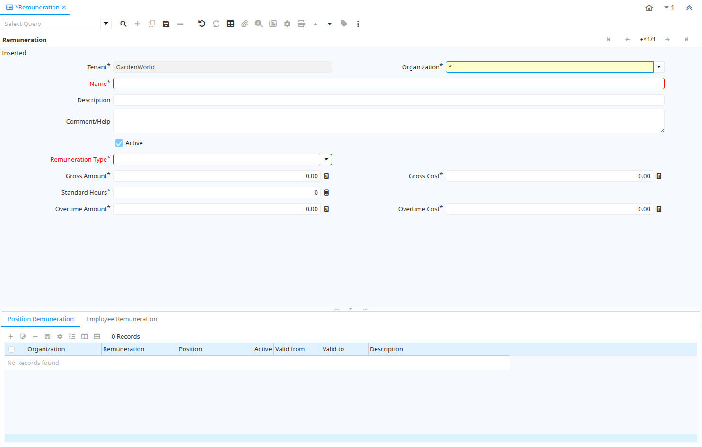

# Remuneration

Window ID 353

*15/05/2005 → 16/12/2017*

**Description:** Maintain Remuneration

**Comment/Help:** Wages and Salaries

## Tab: Remuneration

*Tab Level 0 · Created 15/05/2005 · Updated 15/05/2005*

**Description:** Maintain Remuneration Levels

| **Name** | **Description** | **Comment/Help** | **Technical Data** |
|---|---|---|---|
| Tenant | Tenant for this installation. | A Tenant is a company or a legal entity. You cannot share data between Tenants. | C_Remuneration.AD_Client_ID<small> numeric(10)   Table Direct</small> |
| Organization | Organizational entity within tenant | An organization is a unit of your tenant or legal entity - examples are store, department. You can share data between organizations. | C_Remuneration.AD_Org_ID<small> numeric(10)   Table Direct</small> |
| Name | Alphanumeric identifier of the entity | The name of an entity (record) is used as an default search option in addition to the search key. The name is up to 60 characters in length. | C_Remuneration.Name<small> character varying(60)   String</small> |
| Description | Optional short description of the record | A description is limited to 255 characters. | C_Remuneration.Description<small> character varying(255)   String</small> |
| Comment/Help | Comment or Hint | The Help field contains a hint, comment or help about the use of this item. | C_Remuneration.Help<small> character varying(2000)   Text</small> |
| Active | The record is active in the system | There are two methods of making records unavailable in the system: One is to delete the record, the other is to de-activate the record. A de-activated record is not available for selection, but available for reports. There are two reasons for de-activating and not deleting records: (1) The system requires the record for audit purposes. (2) The record is referenced by other records. E.g., you cannot delete a Business Partner, if there are invoices for this partner record existing. You de-activate the Business Partner and prevent that this record is used for future entries. | C_Remuneration.IsActive<small> character(1)   Yes-No</small> |
| Remuneration Type | Type of Remuneration |  | C_Remuneration.RemunerationType<small> character(1)   List</small> |
| Gross Amount | Gross Remuneration Amount | Gross Salary or Wage Amount (without Overtime, Benefits and Employer overhead) | C_Remuneration.GrossRAmt<small> numeric   Amount</small> |
| Gross Cost | Gross Remuneration Costs | Gross Salary or Wage Costs (without Overtime, with Benefits and Employer overhead) | C_Remuneration.GrossRCost<small> numeric   Costs+Prices</small> |
| Standard Hours | Standard Work Hours based on Remuneration Type | Number of hours per Remuneration Type (e.g. Daily 8 hours, Weekly 40 hours, etc.) to determine when overtime starts | C_Remuneration.StandardHours<small> numeric(10)   Integer</small> |
| Overtime Amount | Hourly Overtime Rate | Hourly Amount without Benefits and Employer overhead | C_Remuneration.OvertimeAmt<small> numeric   Amount</small> |
| Overtime Cost | Hourly Overtime Cost | Hourly Amount with Benefits and Employer overhead | C_Remuneration.OvertimeCost<small> numeric   Costs+Prices</small> |

## Tab: › Position Remuneration

*Tab Level 1 · Created 15/05/2005 · Updated 15/05/2005*

**Description:** Maintain Position Remuneration

| **Name** | **Description** | **Comment/Help** | **Technical Data** |
|---|---|---|---|
| Tenant | Tenant for this installation. | A Tenant is a company or a legal entity. You cannot share data between Tenants. | C_JobRemuneration.AD_Client_ID<small> numeric(10)   Table Direct</small> |
| Organization | Organizational entity within tenant | An organization is a unit of your tenant or legal entity - examples are store, department. You can share data between organizations. | C_JobRemuneration.AD_Org_ID<small> numeric(10)   Table Direct</small> |
| Remuneration | Wage or Salary |  | C_JobRemuneration.C_Remuneration_ID<small> numeric(10)   Table Direct</small> |
| Position | Job Position |  | C_JobRemuneration.C_Job_ID<small> numeric(10)   Table Direct</small> |
| Active | The record is active in the system | There are two methods of making records unavailable in the system: One is to delete the record, the other is to de-activate the record. A de-activated record is not available for selection, but available for reports. There are two reasons for de-activating and not deleting records: (1) The system requires the record for audit purposes. (2) The record is referenced by other records. E.g., you cannot delete a Business Partner, if there are invoices for this partner record existing. You de-activate the Business Partner and prevent that this record is used for future entries. | C_JobRemuneration.IsActive<small> character(1)   Yes-No</small> |
| Valid from | Valid from including this date (first day) | The Valid From date indicates the first day of a date range | C_JobRemuneration.ValidFrom<small> timestamp without time zone   Date+Time</small> |
| Valid to | Valid to including this date (last day) | The Valid To date indicates the last day of a date range | C_JobRemuneration.ValidTo<small> timestamp without time zone   Date+Time</small> |
| Description | Optional short description of the record | A description is limited to 255 characters. | C_JobRemuneration.Description<small> character varying(255)   String</small> |

## Tab: › Employee Remuneration

*Tab Level 1 · Created 15/05/2005 · Updated 15/05/2005*

**Description:** Overwrite of Employee Position Remuneration

| **Name** | **Description** | **Comment/Help** | **Technical Data** |
|---|---|---|---|
| Tenant | Tenant for this installation. | A Tenant is a company or a legal entity. You cannot share data between Tenants. | C_UserRemuneration.AD_Client_ID<small> numeric(10)   Table Direct</small> |
| Organization | Organizational entity within tenant | An organization is a unit of your tenant or legal entity - examples are store, department. You can share data between organizations. | C_UserRemuneration.AD_Org_ID<small> numeric(10)   Table Direct</small> |
| Remuneration | Wage or Salary |  | C_UserRemuneration.C_Remuneration_ID<small> numeric(10)   Table Direct</small> |
| User/Contact | User within the system - Internal or Business Partner Contact | The User identifies a unique user in the system. This could be an internal user or a business partner contact | C_UserRemuneration.AD_User_ID<small> numeric(10)   Search</small> |
| Active | The record is active in the system | There are two methods of making records unavailable in the system: One is to delete the record, the other is to de-activate the record. A de-activated record is not available for selection, but available for reports. There are two reasons for de-activating and not deleting records: (1) The system requires the record for audit purposes. (2) The record is referenced by other records. E.g., you cannot delete a Business Partner, if there are invoices for this partner record existing. You de-activate the Business Partner and prevent that this record is used for future entries. | C_UserRemuneration.IsActive<small> character(1)   Yes-No</small> |
| Gross Amount | Gross Remuneration Amount | Gross Salary or Wage Amount (without Overtime, Benefits and Employer overhead) | C_UserRemuneration.GrossRAmt<small> numeric   Amount</small> |
| Gross Cost | Gross Remuneration Costs | Gross Salary or Wage Costs (without Overtime, with Benefits and Employer overhead) | C_UserRemuneration.GrossRCost<small> numeric   Costs+Prices</small> |
| Overtime Amount | Hourly Overtime Rate | Hourly Amount without Benefits and Employer overhead | C_UserRemuneration.OvertimeAmt<small> numeric   Amount</small> |
| Overtime Cost | Hourly Overtime Cost | Hourly Amount with Benefits and Employer overhead | C_UserRemuneration.OvertimeCost<small> numeric   Costs+Prices</small> |
| Valid from | Valid from including this date (first day) | The Valid From date indicates the first day of a date range | C_UserRemuneration.ValidFrom<small> timestamp without time zone   Date+Time</small> |
| Valid to | Valid to including this date (last day) | The Valid To date indicates the last day of a date range | C_UserRemuneration.ValidTo<small> timestamp without time zone   Date+Time</small> |
| Description | Optional short description of the record | A description is limited to 255 characters. | C_UserRemuneration.Description<small> character varying(255)   String</small> |

