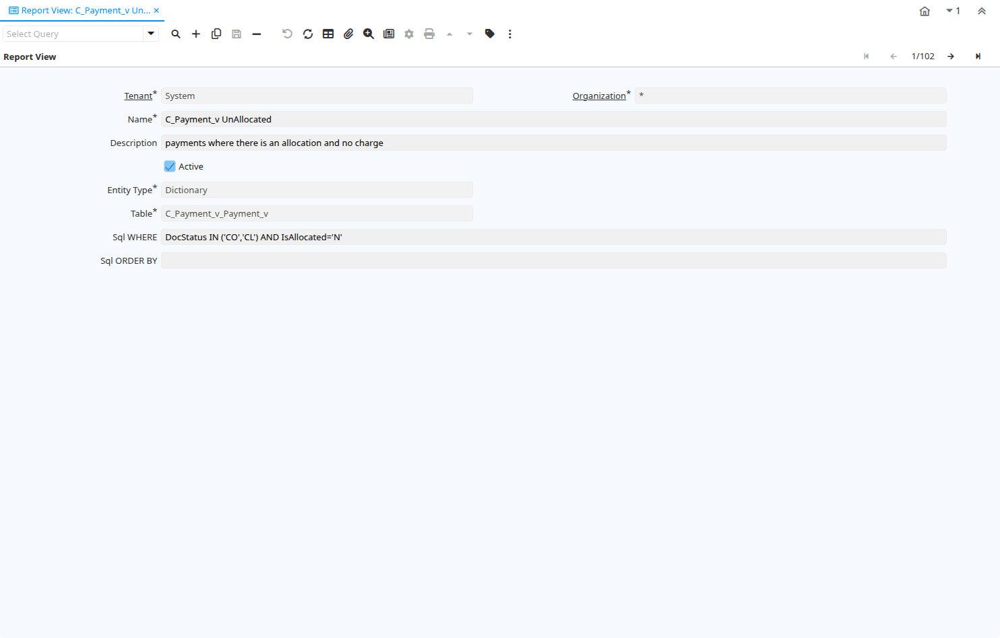

# Report View

Window ID 180

*15/05/2000 → 02/01/2000*

**Description:** Maintain Report Views

**Comment/Help:** The Report View Window defines the views used when generating reports.  This window is for System Admin use only.

## Tab: Report View

*Tab Level 0 · Created 15/05/2000 · Updated 08/04/2021*

**Description:** Define Report View

**Comment/Help:** The Define Report View defines the views used in report generation

| **Name** | **Description** | **Comment/Help** | **Technical Data** |
|---|---|---|---|
| Tenant | Tenant for this installation. | A Tenant is a company or a legal entity. You cannot share data between Tenants. | AD_ReportView.AD_Client_ID<small> numeric(10)   Table Direct</small> |
| Organization | Organizational entity within tenant | An organization is a unit of your tenant or legal entity - examples are store, department. You can share data between organizations. | AD_ReportView.AD_Org_ID<small> numeric(10)   Table Direct</small> |
| Name | Alphanumeric identifier of the entity | The name of an entity (record) is used as an default search option in addition to the search key. The name is up to 60 characters in length. | AD_ReportView.Name<small> character varying(60)   String</small> |
| Description | Optional short description of the record | A description is limited to 255 characters. | AD_ReportView.Description<small> character varying(255)   String</small> |
| Active | The record is active in the system | There are two methods of making records unavailable in the system: One is to delete the record, the other is to de-activate the record. A de-activated record is not available for selection, but available for reports. There are two reasons for de-activating and not deleting records: (1) The system requires the record for audit purposes. (2) The record is referenced by other records. E.g., you cannot delete a Business Partner, if there are invoices for this partner record existing. You de-activate the Business Partner and prevent that this record is used for future entries. | AD_ReportView.IsActive<small> character(1)   Yes-No</small> |
| Entity Type | Dictionary Entity Type; Determines ownership and synchronization | The Entity Types "Dictionary", "iDempiere" and "Application" might be automatically synchronized and customizations deleted or overwritten.    For customizations, copy the entity and select "User"! | AD_ReportView.EntityType<small> character varying(40)   Table</small> |
| Table | Database Table information | The Database Table provides the information of the table definition | AD_ReportView.AD_Table_ID<small> numeric(10)   Table Direct</small> |
| Sql WHERE | Fully qualified SQL WHERE clause | The Where Clause indicates the SQL WHERE clause to use for record selection. The WHERE clause is added to the query. Fully qualified means "tablename.columnname". | AD_ReportView.WhereClause<small> character varying(2000)   String</small> |
| Sql ORDER BY | Fully qualified ORDER BY clause | The ORDER BY Clause indicates the SQL ORDER BY clause to use for record selection | AD_ReportView.OrderByClause<small> character varying(2000)   String</small> |

## Tab: › Report View Column

*Tab Level 1 · Created 25/02/2001 · Updated 02/01/2000*

**Description:** Report View Column

**Comment/Help:** The Report View Column Tab defines any columns which will be overridden in the generation of the select SQL

| **Name** | **Description** | **Comment/Help** | **Technical Data** |
|---|---|---|---|
| Tenant | Tenant for this installation. | A Tenant is a company or a legal entity. You cannot share data between Tenants. | AD_ReportView_Col.AD_Client_ID<small> numeric(10)   Table Direct</small> |
| Organization | Organizational entity within tenant | An organization is a unit of your tenant or legal entity - examples are store, department. You can share data between organizations. | AD_ReportView_Col.AD_Org_ID<small> numeric(10)   Table Direct</small> |
| Report View | View used to generate this report | The Report View indicates the view used to generate this report. | AD_ReportView_Col.AD_ReportView_ID<small> numeric(10)   Table Direct</small> |
| Column | Column in the table | Link to the database column of the table | AD_ReportView_Col.AD_Column_ID<small> numeric(10)   Table Direct</small> |
| Active | The record is active in the system | There are two methods of making records unavailable in the system: One is to delete the record, the other is to de-activate the record. A de-activated record is not available for selection, but available for reports. There are two reasons for de-activating and not deleting records: (1) The system requires the record for audit purposes. (2) The record is referenced by other records. E.g., you cannot delete a Business Partner, if there are invoices for this partner record existing. You de-activate the Business Partner and prevent that this record is used for future entries. | AD_ReportView_Col.IsActive<small> character(1)   Yes-No</small> |
| Function Column | Overwrite Column with Function  | The Function Column indicates that the column will be overridden with a function | AD_ReportView_Col.FunctionColumn<small> character varying(124)   String</small> |
| SQL Group Function | This function will generate a Group By Clause | The SQL Group Function checkbox indicates that this function will generate a Group by Clause in the resulting SQL. | AD_ReportView_Col.IsGroupFunction<small> character(1)   Yes-No</small> |

## Tab: › Available Columns

*Tab Level 1 · Created 17/01/2014 · Updated 17/01/2014*

**Description:** You can define on this tab which columns will be available as the print format items

| **Name** | **Description** | **Comment/Help** | **Technical Data** |
|---|---|---|---|
| Tenant | Tenant for this installation. | A Tenant is a company or a legal entity. You cannot share data between Tenants. | AD_ReportView_Column.AD_Client_ID<small> numeric(10)   Table Direct</small> |
| Organization | Organizational entity within tenant | An organization is a unit of your tenant or legal entity - examples are store, department. You can share data between organizations. | AD_ReportView_Column.AD_Org_ID<small> numeric(10)   Table Direct</small> |
| Report View | View used to generate this report | The Report View indicates the view used to generate this report. | AD_ReportView_Column.AD_ReportView_ID<small> numeric(10)   Search</small> |
| Column | Column in the table | Link to the database column of the table | AD_ReportView_Column.AD_Column_ID<small> numeric(10)   Table Direct</small> |
| Active | The record is active in the system | There are two methods of making records unavailable in the system: One is to delete the record, the other is to de-activate the record. A de-activated record is not available for selection, but available for reports. There are two reasons for de-activating and not deleting records: (1) The system requires the record for audit purposes. (2) The record is referenced by other records. E.g., you cannot delete a Business Partner, if there are invoices for this partner record existing. You de-activate the Business Partner and prevent that this record is used for future entries. | AD_ReportView_Column.IsActive<small> character(1)   Yes-No</small> |

