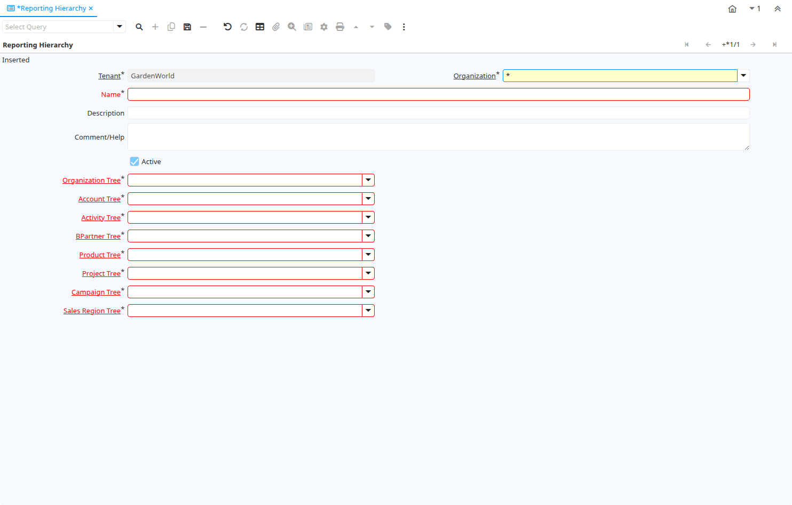

# Reporting Hierarchy

Window ID 360

*23/10/2005 → 15/01/2024*

**Description:** Define Reporting Hierarchy

**Comment/Help:** Reporting Hierarchy allows you to select different Hierarchies/Trees for the report.
Accounting Segments like Organization, Account, Product may have several hierarchies to accommodate different views on the business

## Tab: Reporting Hierarchy

*Tab Level 0 · Created 23/10/2005 · Updated 23/10/2005*

**Description:** Reporting Hierarchy

**Comment/Help:** Reporting Hierarchy allows you to select different Hierarchies/Trees for the report.
Accounting Segments like Organization, Account, Product may have several hierarchies to accomodate different views on the business

| **Name** | **Description** | **Comment/Help** | **Technical Data** |
|---|---|---|---|
| Tenant | Tenant for this installation. | A Tenant is a company or a legal entity. You cannot share data between Tenants. | PA_Hierarchy.AD_Client_ID<small> numeric(10)   Table Direct</small> |
| Organization | Organizational entity within tenant | An organization is a unit of your tenant or legal entity - examples are store, department. You can share data between organizations. | PA_Hierarchy.AD_Org_ID<small> numeric(10)   Table Direct</small> |
| Name | Alphanumeric identifier of the entity | The name of an entity (record) is used as an default search option in addition to the search key. The name is up to 60 characters in length. | PA_Hierarchy.Name<small> character varying(60)   String</small> |
| Description | Optional short description of the record | A description is limited to 255 characters. | PA_Hierarchy.Description<small> character varying(255)   String</small> |
| Comment/Help | Comment or Hint | The Help field contains a hint, comment or help about the use of this item. | PA_Hierarchy.Help<small> character varying(2000)   Text</small> |
| Active | The record is active in the system | There are two methods of making records unavailable in the system: One is to delete the record, the other is to de-activate the record. A de-activated record is not available for selection, but available for reports. There are two reasons for de-activating and not deleting records: (1) The system requires the record for audit purposes. (2) The record is referenced by other records. E.g., you cannot delete a Business Partner, if there are invoices for this partner record existing. You de-activate the Business Partner and prevent that this record is used for future entries. | PA_Hierarchy.IsActive<small> character(1)   Yes-No</small> |
| Organization Tree | Trees are used for (financial) reporting and security access (via role) | Trees are used for (finanial) reporting and security access (via role) | PA_Hierarchy.AD_Tree_Org_ID<small> numeric(10)   Table</small> |
| Account Tree | Tree for Natural Account Tree |  | PA_Hierarchy.AD_Tree_Account_ID<small> numeric(10)   Table</small> |
| Activity Tree | Trees are used for (financial) reporting | Trees are used for (finanial) reporting | PA_Hierarchy.AD_Tree_Activity_ID<small> numeric(10)   Table</small> |
| BPartner Tree | Trees are used for (financial) reporting | Trees are used for (finanial) reporting | PA_Hierarchy.AD_Tree_BPartner_ID<small> numeric(10)   Table</small> |
| Product Tree | Trees are used for (financial) reporting | Trees are used for (finanial) reporting | PA_Hierarchy.AD_Tree_Product_ID<small> numeric(10)   Table</small> |
| Project Tree | Trees are used for (financial) reporting | Trees are used for (finanial) reporting | PA_Hierarchy.AD_Tree_Project_ID<small> numeric(10)   Table</small> |
| Campaign Tree | Trees are used for (financial) reporting | Trees are used for (finanial) reporting | PA_Hierarchy.AD_Tree_Campaign_ID<small> numeric(10)   Table</small> |
| Sales Region Tree | Trees are used for (financial) reporting | Trees are used for (finanial) reporting | PA_Hierarchy.AD_Tree_SalesRegion_ID<small> numeric(10)   Table</small> |

