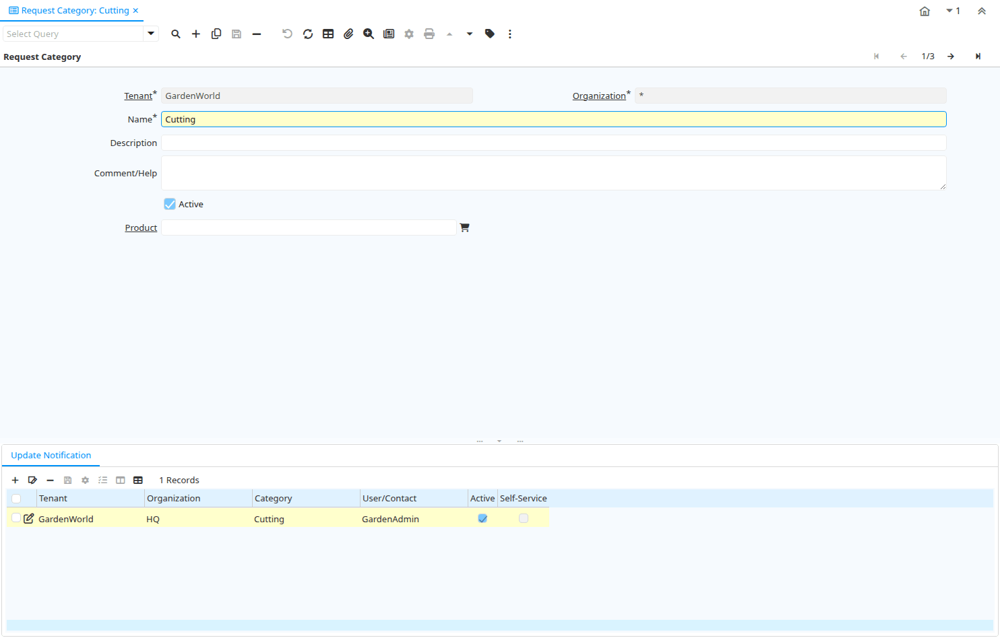

# Request Category

Window ID 345

*26/04/2005 → 26/04/2005*

**Description:** Maintain Request Category

**Comment/Help:** Category or Topic of the Request 

## Tab: Request Category

*Tab Level 0 · Created 26/04/2005 · Updated 26/04/2005*

**Description:** Maintain Request Category

**Comment/Help:** Category or Topic of the Request 

| **Name** | **Description** | **Comment/Help** | **Technical Data** |
|---|---|---|---|
| Tenant | Tenant for this installation. | A Tenant is a company or a legal entity. You cannot share data between Tenants. | R_Category.AD_Client_ID<small> numeric(10)   Table Direct</small> |
| Organization | Organizational entity within tenant | An organization is a unit of your tenant or legal entity - examples are store, department. You can share data between organizations. | R_Category.AD_Org_ID<small> numeric(10)   Table Direct</small> |
| Name | Alphanumeric identifier of the entity | The name of an entity (record) is used as an default search option in addition to the search key. The name is up to 60 characters in length. | R_Category.Name<small> character varying(60)   String</small> |
| Description | Optional short description of the record | A description is limited to 255 characters. | R_Category.Description<small> character varying(255)   String</small> |
| Comment/Help | Comment or Hint | The Help field contains a hint, comment or help about the use of this item. | R_Category.Help<small> character varying(2000)   Text</small> |
| Active | The record is active in the system | There are two methods of making records unavailable in the system: One is to delete the record, the other is to de-activate the record. A de-activated record is not available for selection, but available for reports. There are two reasons for de-activating and not deleting records: (1) The system requires the record for audit purposes. (2) The record is referenced by other records. E.g., you cannot delete a Business Partner, if there are invoices for this partner record existing. You de-activate the Business Partner and prevent that this record is used for future entries. | R_Category.IsActive<small> character(1)   Yes-No</small> |
| Product | Product, Service, Item | Identifies an item which is either purchased or sold in this organization. | R_Category.M_Product_ID<small> numeric(10)   Search</small> |

## Tab: › Update Notification

*Tab Level 1 · Created 13/05/2005 · Updated 13/05/2005*

**Description:** List Recipients for to receive Request Updates

| **Name** | **Description** | **Comment/Help** | **Technical Data** |
|---|---|---|---|
| Tenant | Tenant for this installation. | A Tenant is a company or a legal entity. You cannot share data between Tenants. | R_CategoryUpdates.AD_Client_ID<small> numeric(10)   Table Direct</small> |
| Organization | Organizational entity within tenant | An organization is a unit of your tenant or legal entity - examples are store, department. You can share data between organizations. | R_CategoryUpdates.AD_Org_ID<small> numeric(10)   Table Direct</small> |
| Category | Request Category | Category or Topic of the Request  | R_CategoryUpdates.R_Category_ID<small> numeric(10)   Table Direct</small> |
| User/Contact | User within the system - Internal or Business Partner Contact | The User identifies a unique user in the system. This could be an internal user or a business partner contact | R_CategoryUpdates.AD_User_ID<small> numeric(10)   Search</small> |
| Active | The record is active in the system | There are two methods of making records unavailable in the system: One is to delete the record, the other is to de-activate the record. A de-activated record is not available for selection, but available for reports. There are two reasons for de-activating and not deleting records: (1) The system requires the record for audit purposes. (2) The record is referenced by other records. E.g., you cannot delete a Business Partner, if there are invoices for this partner record existing. You de-activate the Business Partner and prevent that this record is used for future entries. | R_CategoryUpdates.IsActive<small> character(1)   Yes-No</small> |
| Self-Service | This is a Self-Service entry or this entry can be changed via Self-Service | Self-Service allows users to enter data or update their data.  The flag indicates, that this record was entered or created via Self-Service or that the user can change it via the Self-Service functionality. | R_CategoryUpdates.IsSelfService<small> character(1)   Yes-No</small> |

