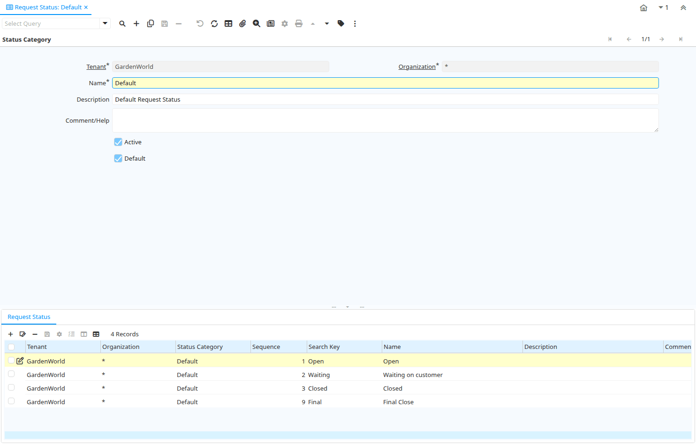

# Request Status

Window ID 349

*26/04/2005 → 26/04/2005*

**Description:** Maintain Request Status

**Comment/Help:** Status if the request (open, closed, investigating, ..)

## Tab: Status Category

*Tab Level 0 · Created 15/01/2006 · Updated 15/01/2006*

**Description:** Request Status Category

**Comment/Help:** Category of Request Status enables to maintain different set of Status for different Request Categories

| **Name** | **Description** | **Comment/Help** | **Technical Data** |
|---|---|---|---|
| Tenant | Tenant for this installation. | A Tenant is a company or a legal entity. You cannot share data between Tenants. | R_StatusCategory.AD_Client_ID<small> numeric(10)   Table Direct</small> |
| Organization | Organizational entity within tenant | An organization is a unit of your tenant or legal entity - examples are store, department. You can share data between organizations. | R_StatusCategory.AD_Org_ID<small> numeric(10)   Table Direct</small> |
| Name | Alphanumeric identifier of the entity | The name of an entity (record) is used as an default search option in addition to the search key. The name is up to 60 characters in length. | R_StatusCategory.Name<small> character varying(60)   String</small> |
| Description | Optional short description of the record | A description is limited to 255 characters. | R_StatusCategory.Description<small> character varying(255)   String</small> |
| Comment/Help | Comment or Hint | The Help field contains a hint, comment or help about the use of this item. | R_StatusCategory.Help<small> character varying(2000)   Text</small> |
| Active | The record is active in the system | There are two methods of making records unavailable in the system: One is to delete the record, the other is to de-activate the record. A de-activated record is not available for selection, but available for reports. There are two reasons for de-activating and not deleting records: (1) The system requires the record for audit purposes. (2) The record is referenced by other records. E.g., you cannot delete a Business Partner, if there are invoices for this partner record existing. You de-activate the Business Partner and prevent that this record is used for future entries. | R_StatusCategory.IsActive<small> character(1)   Yes-No</small> |
| Default | Default value | The Default Checkbox indicates if this record will be used as a default value. | R_StatusCategory.IsDefault<small> character(1)   Yes-No</small> |

## Tab: › Request Status

*Tab Level 1 · Created 26/04/2005 · Updated 15/01/2006*

**Description:** Maintain Request Status

**Comment/Help:** Status if the request (open, closed, investigating, ..)

| **Name** | **Description** | **Comment/Help** | **Technical Data** |
|---|---|---|---|
| Tenant | Tenant for this installation. | A Tenant is a company or a legal entity. You cannot share data between Tenants. | R_Status.AD_Client_ID<small> numeric(10)   Table Direct</small> |
| Organization | Organizational entity within tenant | An organization is a unit of your tenant or legal entity - examples are store, department. You can share data between organizations. | R_Status.AD_Org_ID<small> numeric(10)   Table Direct</small> |
| Status Category | Request Status Category | Category of Request Status enables to maintain different set of Status for different Request Categories | R_Status.R_StatusCategory_ID<small> numeric(10)   Table Direct</small> |
| Sequence | Method of ordering records; lowest number comes first | The Sequence indicates the order of records | R_Status.SeqNo<small> numeric(10)   Integer</small> |
| Search Key | Search key for the record in the format required - must be unique | A search key allows you a fast method of finding a particular record. If you leave the search key empty, the system automatically creates a numeric number.  The document sequence used for this fallback number is defined in the "Maintain Sequence" window with the name "DocumentNo_&lt;TableName&gt;", where TableName is the actual name of the table (e.g. C_Order). | R_Status.Value<small> character varying(40)   String</small> |
| Name | Alphanumeric identifier of the entity | The name of an entity (record) is used as an default search option in addition to the search key. The name is up to 60 characters in length. | R_Status.Name<small> character varying(60)   String</small> |
| Description | Optional short description of the record | A description is limited to 255 characters. | R_Status.Description<small> character varying(255)   String</small> |
| Comment/Help | Comment or Hint | The Help field contains a hint, comment or help about the use of this item. | R_Status.Help<small> character varying(2000)   Text</small> |
| Active | The record is active in the system | There are two methods of making records unavailable in the system: One is to delete the record, the other is to de-activate the record. A de-activated record is not available for selection, but available for reports. There are two reasons for de-activating and not deleting records: (1) The system requires the record for audit purposes. (2) The record is referenced by other records. E.g., you cannot delete a Business Partner, if there are invoices for this partner record existing. You de-activate the Business Partner and prevent that this record is used for future entries. | R_Status.IsActive<small> character(1)   Yes-No</small> |
| Default | Default value | The Default Checkbox indicates if this record will be used as a default value. | R_Status.IsDefault<small> character(1)   Yes-No</small> |
| Web Can Update | Entry can be updated from the Web |  | R_Status.IsWebCanUpdate<small> character(1)   Yes-No</small> |
| Update Status | Automatically change the status after entry from web | Change the status automatically after the entry was changed via the Web | R_Status.Update_Status_ID<small> numeric(10)   Table</small> |
| Timeout in Days | Timeout in Days to change Status automatically | After the number of days of inactivity, the status is changed automatically to the Next Status.  If no Next Status is defined, the status is not changed. | R_Status.TimeoutDays<small> numeric(10)   Integer</small> |
| Next Status | Move to next status automatically after timeout | After the timeout, change the status automatically | R_Status.Next_Status_ID<small> numeric(10)   Table</small> |
| Open Status | The status is closed | This allows to have the three general situations of "not open" - "open" - "closed" | R_Status.IsOpen<small> character(1)   Yes-No</small> |
| Closed Status | The status is closed | This allows to have multiple closed status | R_Status.IsClosed<small> character(1)   Yes-No</small> |
| Final Close | Entries with Final Close cannot be re-opened |  | R_Status.IsFinalClose<small> character(1)   Yes-No</small> |

