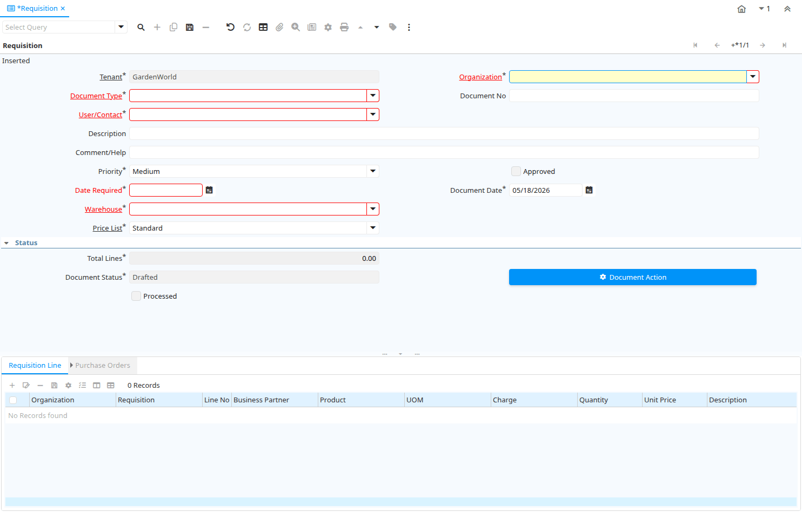

# Requisition

Window ID 322

*12/03/2004 → 30/06/2021*

**Description:** Material Requisition

**Comment/Help:** Enter and maintain Material Requisitions. Material Requisition can be created automatically via Replenishment.  You create generate optionally consolidated Purchase Orders.

## Tab: Requisition

*Tab Level 0 · Created 12/03/2004 · Updated 24/10/2005*

**Description:** Maintain Material Requisition

| **Name** | **Description** | **Comment/Help** | **Technical Data** |
|---|---|---|---|
| Tenant | Tenant for this installation. | A Tenant is a company or a legal entity. You cannot share data between Tenants. | M_Requisition.AD_Client_ID<small> numeric(10)   Table Direct</small> |
| Organization | Organizational entity within tenant | An organization is a unit of your tenant or legal entity - examples are store, department. You can share data between organizations. | M_Requisition.AD_Org_ID<small> numeric(10)   Table Direct</small> |
| Document Type | Document type or rules | The Document Type determines document sequence and processing rules | M_Requisition.C_DocType_ID<small> numeric(10)   Table Direct</small> |
| Document No | Document sequence number of the document | The document number is usually automatically generated by the system and determined by the document type of the document. If the document is not saved, the preliminary number is displayed in "&lt;&gt;".  If the document type of your document has no automatic document sequence defined, the field is empty if you create a new document. This is for documents which usually have an external number (like vendor invoice).  If you leave the field empty, the system will generate a document number for you. The document sequence used for this fallback number is defined in the "Maintain Sequence" window with the name "DocumentNo_&lt;TableName&gt;", where TableName is the actual name of the table (e.g. C_Order). | M_Requisition.DocumentNo<small> character varying(30)   String</small> |
| User/Contact | User within the system - Internal or Business Partner Contact | The User identifies a unique user in the system. This could be an internal user or a business partner contact | M_Requisition.AD_User_ID<small> numeric(10)   Table Direct</small> |
| Description | Optional short description of the record | A description is limited to 255 characters. | M_Requisition.Description<small> character varying(255)   String</small> |
| Comment/Help | Comment or Hint | The Help field contains a hint, comment or help about the use of this item. | M_Requisition.Help<small> character varying(2000)   String</small> |
| Priority | Priority of a document | The Priority indicates the importance (high, medium, low) of this document | M_Requisition.PriorityRule<small> character(1)   List</small> |
| Approved | Indicates if this document requires approval | The Approved checkbox indicates if this document requires approval before it can be processed. | M_Requisition.IsApproved<small> character(1)   Yes-No</small> |
| Date Required | Date when required |  | M_Requisition.DateRequired<small> timestamp without time zone   Date</small> |
| Document Date | Date of the Document | The Document Date indicates the date the document was generated.  It may or may not be the same as the accounting date. | M_Requisition.DateDoc<small> timestamp without time zone   Date</small> |
| Warehouse | Storage Warehouse and Service Point | The Warehouse identifies a unique Warehouse where products are stored or Services are provided. | M_Requisition.M_Warehouse_ID<small> numeric(10)   Table Direct</small> |
| Price List | Unique identifier of a Price List | Price Lists are used to determine the pricing, margin and cost of items purchased or sold. | M_Requisition.M_PriceList_ID<small> numeric(10)   Table Direct</small> |
| Total Lines | Total of all document lines | The Total amount displays the total of all lines in document currency | M_Requisition.TotalLines<small> numeric   Amount</small> |
| Document Status | The current status of the document | The Document Status indicates the status of a document at this time.  If you want to change the document status, use the Document Action field | M_Requisition.DocStatus<small> character(2)   List</small> |
| Process Requisition |  |  | M_Requisition.DocAction<small> character(2)   Button</small> |
| Processed | The document has been processed | The Processed checkbox indicates that a document has been processed. | M_Requisition.Processed<small> character(1)   Yes-No</small> |
| Posted | Posting status | The Posted field indicates the status of the Generation of General Ledger Accounting Lines  | M_Requisition.Posted<small> character(1)   Button</small> |

## Tab: › Requisition Line

*Tab Level 1 · Created 12/03/2004 · Updated 23/08/2013*

**Description:** Material Requisition Line

| **Name** | **Description** | **Comment/Help** | **Technical Data** |
|---|---|---|---|
| Tenant | Tenant for this installation. | A Tenant is a company or a legal entity. You cannot share data between Tenants. | M_RequisitionLine.AD_Client_ID<small> numeric(10)   Table Direct</small> |
| Organization | Organizational entity within tenant | An organization is a unit of your tenant or legal entity - examples are store, department. You can share data between organizations. | M_RequisitionLine.AD_Org_ID<small> numeric(10)   Table Direct</small> |
| Requisition | Material Requisition |  | M_RequisitionLine.M_Requisition_ID<small> numeric(10)   Search</small> |
| Line No | Unique line for this document | Indicates the unique line for a document.  It will also control the display order of the lines within a document. | M_RequisitionLine.Line<small> numeric(10)   Integer</small> |
| Business Partner | Identifies a Business Partner | A Business Partner is anyone with whom you transact.  This can include Vendor, Customer, Employee or Salesperson | M_RequisitionLine.C_BPartner_ID<small> numeric(10)   Search</small> |
| Product | Product, Service, Item | Identifies an item which is either purchased or sold in this organization. | M_RequisitionLine.M_Product_ID<small> numeric(10)   Search</small> |
| UOM | Unit of Measure | The UOM defines a unique non monetary Unit of Measure | M_RequisitionLine.C_UOM_ID<small> numeric(10)   Search</small> |
| Charge | Additional document charges | The Charge indicates a type of Charge (Handling, Shipping, Restocking) | M_RequisitionLine.C_Charge_ID<small> numeric(10)   Table Direct</small> |
| Quantity | Quantity | The Quantity indicates the number of a specific product or item for this document. | M_RequisitionLine.Qty<small> numeric   Quantity</small> |
| Unit Price | Actual Price  | The Actual or Unit Price indicates the Price for a product in source currency. | M_RequisitionLine.PriceActual<small> numeric   Costs+Prices</small> |
| Description | Optional short description of the record | A description is limited to 255 characters. | M_RequisitionLine.Description<small> character varying(255)   String</small> |
| Line Amount | Line Extended Amount (Quantity * Actual Price) without Freight and Charges | Indicates the extended line amount based on the quantity and the actual price.  Any additional charges or freight are not included.  The Amount may or may not include tax.  If the price list is inclusive tax, the line amount is the same as the line total. | M_RequisitionLine.LineNetAmt<small> numeric   Amount</small> |
| Purchase Order Line | Purchase Order Line | The Purchase Order Line is a unique identifier for a line in an order. | M_RequisitionLine.C_OrderLine_ID<small> numeric(10)   Search</small> |

## Tab: › › Purchase Orders

*Tab Level 2 · Created 24/10/2005 · Updated 24/10/2005*

**Description:** Related Purchase Orders

| **Name** | **Description** | **Comment/Help** | **Technical Data** |
|---|---|---|---|
| Tenant | Tenant for this installation. | A Tenant is a company or a legal entity. You cannot share data between Tenants. | C_OrderLine.AD_Client_ID<small> numeric(10)   Table Direct</small> |
| Organization | Organizational entity within tenant | An organization is a unit of your tenant or legal entity - examples are store, department. You can share data between organizations. | C_OrderLine.AD_Org_ID<small> numeric(10)   Table Direct</small> |
| Purchase Order | Purchase Order | The Purchase Order is a control document.  The Purchase Order is complete when the quantity ordered is the same as the quantity shipped and invoiced.  When you close an order, unshipped (backordered) quantities are cancelled. | C_OrderLine.C_Order_ID<small> numeric(10)   Search</small> |
| Line No | Unique line for this document | Indicates the unique line for a document.  It will also control the display order of the lines within a document. | C_OrderLine.Line<small> numeric(10)   Integer</small> |
| Business Partner | Identifies a Business Partner | A Business Partner is anyone with whom you transact.  This can include Vendor, Customer, Employee or Salesperson | C_OrderLine.C_BPartner_ID<small> numeric(10)   Search</small> |
| Partner Location | Identifies the (ship from) address for this Business Partner | The Partner address indicates the location of a Business Partner | C_OrderLine.C_BPartner_Location_ID<small> numeric(10)   Table Direct</small> |
| Date Ordered | Date of Order | Indicates the Date an item was ordered. | C_OrderLine.DateOrdered<small> timestamp without time zone   Date</small> |
| Date Promised | Date Order was promised | The Date Promised indicates the date, if any, that an Order was promised for. | C_OrderLine.DatePromised<small> timestamp without time zone   Date</small> |
| Date Delivered | Date when the product was delivered |  | C_OrderLine.DateDelivered<small> timestamp without time zone   Date</small> |
| Date Invoiced | Date printed on Invoice | The Date Invoice indicates the date printed on the invoice. | C_OrderLine.DateInvoiced<small> timestamp without time zone   Date</small> |
| Description | Optional short description of the record | A description is limited to 255 characters. | C_OrderLine.Description<small> character varying(255)   Text</small> |
| Warehouse | Storage Warehouse and Service Point | The Warehouse identifies a unique Warehouse where products are stored or Services are provided. | C_OrderLine.M_Warehouse_ID<small> numeric(10)   Table</small> |
| Product | Product, Service, Item | Identifies an item which is either purchased or sold in this organization. | C_OrderLine.M_Product_ID<small> numeric(10)   Search</small> |
| Attribute Set Instance | Product Attribute Set Instance | The values of the actual Product Attribute Instances.  The product level attributes are defined on Product level. | C_OrderLine.M_AttributeSetInstance_ID<small> numeric(10)   Product Attribute</small> |
| Charge | Additional document charges | The Charge indicates a type of Charge (Handling, Shipping, Restocking) | C_OrderLine.C_Charge_ID<small> numeric(10)   Table Direct</small> |
| Currency | The Currency for this record | Indicates the Currency to be used when processing or reporting on this record | C_OrderLine.C_Currency_ID<small> numeric(10)   Table Direct</small> |
| Price | Price Entered - the price based on the selected/base UoM | The price entered is converted to the actual price based on the UoM conversion | C_OrderLine.PriceEntered<small> numeric   Costs+Prices</small> |
| Cost Price | Price per Unit of Measure including all indirect costs (Freight, etc.) | Optional Purchase Order Line cost price. | C_OrderLine.PriceCost<small> numeric   Costs+Prices</small> |
| Unit Price | Actual Price  | The Actual or Unit Price indicates the Price for a product in source currency. | C_OrderLine.PriceActual<small> numeric   Costs+Prices</small> |
| UOM | Unit of Measure | The UOM defines a unique non monetary Unit of Measure | C_OrderLine.C_UOM_ID<small> numeric(10)   Table Direct</small> |
| PO Quantity | Ordered Quantity | The Ordered Quantity indicates the quantity of a product that was ordered. | C_OrderLine.QtyOrdered<small> numeric   Quantity</small> |
| Delivered Quantity | Delivered Quantity | The Delivered Quantity indicates the quantity of a product that has been delivered. | C_OrderLine.QtyDelivered<small> numeric   Quantity</small> |
| Quantity Invoiced | Invoiced Quantity | The Invoiced Quantity indicates the quantity of a product that have been invoiced. | C_OrderLine.QtyInvoiced<small> numeric   Quantity</small> |
| Tax | Tax identifier | The Tax indicates the type of tax used in document line. | C_OrderLine.C_Tax_ID<small> numeric(10)   Table Direct</small> |
| Line Amount | Line Extended Amount (Quantity * Actual Price) without Freight and Charges | Indicates the extended line amount based on the quantity and the actual price.  Any additional charges or freight are not included.  The Amount may or may not include tax.  If the price list is inclusive tax, the line amount is the same as the line total. | C_OrderLine.LineNetAmt<small> numeric   Amount</small> |

