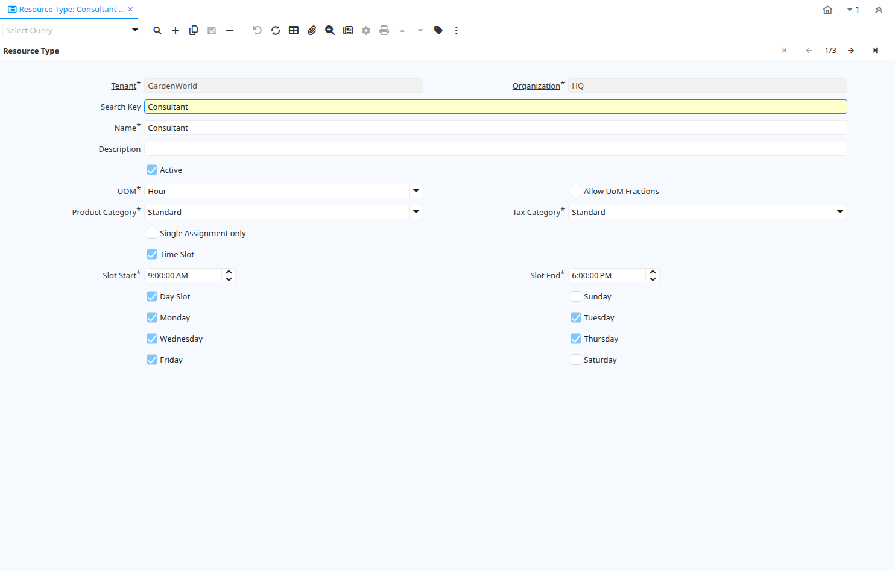

# Resource Type

Window ID 237

*15/06/2002 → 17/12/2007*

**Description:** Maintain Resource Types

**Comment/Help:** Maintain Resource types and their principal availability. it is used to calculate the available time in a resource. It allows input of starting time and end time for the slot according to the working days.

## Tab: Resource Type

*Tab Level 0 · Created 15/06/2002 · Updated 17/12/2007*

**Description:** Maintain Resource Types

**Comment/Help:** Maintain Resource types and their principal availability.

| **Name** | **Description** | **Comment/Help** | **Technical Data** |
|---|---|---|---|
| Tenant | Tenant for this installation. | A Tenant is a company or a legal entity. You cannot share data between Tenants. | S_ResourceType.AD_Client_ID<small> numeric(10)   Table Direct</small> |
| Organization | Organizational entity within tenant | An organization is a unit of your tenant or legal entity - examples are store, department. You can share data between organizations. | S_ResourceType.AD_Org_ID<small> numeric(10)   Table Direct</small> |
| Search Key | Search key for the record in the format required - must be unique | A search key allows you a fast method of finding a particular record. If you leave the search key empty, the system automatically creates a numeric number.  The document sequence used for this fallback number is defined in the "Maintain Sequence" window with the name "DocumentNo_&lt;TableName&gt;", where TableName is the actual name of the table (e.g. C_Order). | S_ResourceType.Value<small> character varying(40)   String</small> |
| Name | Alphanumeric identifier of the entity | The name of an entity (record) is used as an default search option in addition to the search key. The name is up to 60 characters in length. | S_ResourceType.Name<small> character varying(60)   String</small> |
| Description | Optional short description of the record | A description is limited to 255 characters. | S_ResourceType.Description<small> character varying(255)   String</small> |
| Active | The record is active in the system | There are two methods of making records unavailable in the system: One is to delete the record, the other is to de-activate the record. A de-activated record is not available for selection, but available for reports. There are two reasons for de-activating and not deleting records: (1) The system requires the record for audit purposes. (2) The record is referenced by other records. E.g., you cannot delete a Business Partner, if there are invoices for this partner record existing. You de-activate the Business Partner and prevent that this record is used for future entries. | S_ResourceType.IsActive<small> character(1)   Yes-No</small> |
| UOM | Unit of Measure | The UOM defines a unique non monetary Unit of Measure | S_ResourceType.C_UOM_ID<small> numeric(10)   Table Direct</small> |
| Allow UoM Fractions | Allow Unit of Measure Fractions | If allowed, you can enter UoM Fractions | S_ResourceType.AllowUoMFractions<small> character(1)   Yes-No</small> |
| Product Category | Category of a Product | Identifies the category which this product belongs to.  Product categories are used for pricing and selection. | S_ResourceType.M_Product_Category_ID<small> numeric(10)   Table Direct</small> |
| Tax Category | Tax Category | The Tax Category provides a method of grouping similar taxes.  For example, Sales Tax or Value Added Tax. | S_ResourceType.C_TaxCategory_ID<small> numeric(10)   Table Direct</small> |
| Single Assignment only | Only one assignment at a time (no double-booking or overlapping) | If selected, you can only have one assignment for the resource at a single point in time.   It is also  not possible to have overlapping assignments. | S_ResourceType.IsSingleAssignment<small> character(1)   Yes-No</small> |
| Time Slot | Resource has time slot availability | Resource is only available at certain times | S_ResourceType.IsTimeSlot<small> character(1)   Yes-No</small> |
| Slot Start | Time when timeslot starts | Starting time for time slots | S_ResourceType.TimeSlotStart<small> timestamp without time zone   Time</small> |
| Slot End | Time when timeslot ends | Ending time for time slots | S_ResourceType.TimeSlotEnd<small> timestamp without time zone   Time</small> |
| Day Slot | Resource has day slot availability | Resource is only available on certain days | S_ResourceType.IsDateSlot<small> character(1)   Yes-No</small> |
| Sunday | Available on Sundays |  | S_ResourceType.OnSunday<small> character(1)   Yes-No</small> |
| Monday | Available on Mondays |  | S_ResourceType.OnMonday<small> character(1)   Yes-No</small> |
| Tuesday | Available on Tuesdays |  | S_ResourceType.OnTuesday<small> character(1)   Yes-No</small> |
| Wednesday | Available on Wednesdays |  | S_ResourceType.OnWednesday<small> character(1)   Yes-No</small> |
| Thursday | Available on Thursdays |  | S_ResourceType.OnThursday<small> character(1)   Yes-No</small> |
| Friday | Available on Fridays |  | S_ResourceType.OnFriday<small> character(1)   Yes-No</small> |
| Saturday | Available on Saturday |  | S_ResourceType.OnSaturday<small> character(1)   Yes-No</small> |

