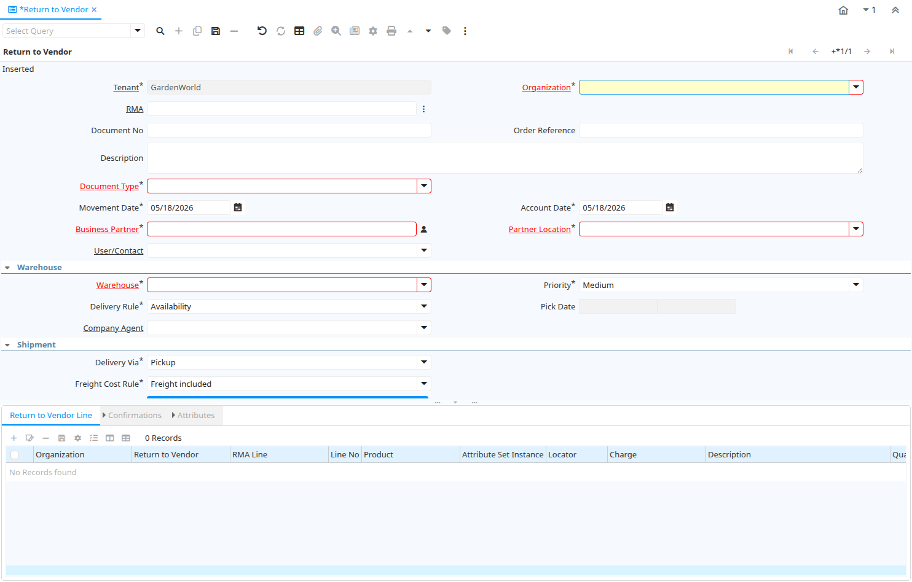

# Return to Vendor

Window ID 53098

*11/09/2009 → 11/09/2009*

**Description:** Vendor Returns

**Comment/Help:** The Return to Vendor Window defines shipments made or to be made to a vendor as part of a return.

## Tab: Return to Vendor

*Tab Level 0 · Created 11/09/2009 · Updated 30/09/2009*

**Description:** Vendor Returns

**Comment/Help:** The Return to Vendor Tab allows you to generate, maintain, enter and process Shipments to a Vendor because of a Return

| **Name** | **Description** | **Comment/Help** | **Technical Data** |
|---|---|---|---|
| Tenant | Tenant for this installation. | A Tenant is a company or a legal entity. You cannot share data between Tenants. | M_InOut.AD_Client_ID<small> numeric(10)   Table Direct</small> |
| Organization | Organizational entity within tenant | An organization is a unit of your tenant or legal entity - examples are store, department. You can share data between organizations. | M_InOut.AD_Org_ID<small> numeric(10)   Table Direct</small> |
| Purchase Order | Purchase Order | The Purchase Order is a control document.  The Purchase Order is complete when the quantity ordered is the same as the quantity shipped and invoiced.  When you close an order, unshipped (backordered) quantities are cancelled. | M_InOut.C_Order_ID<small> numeric(10)   Search</small> |
| Date Ordered | Date of Order | Indicates the Date an item was ordered. | M_InOut.DateOrdered<small> timestamp without time zone   Date</small> |
| RMA | Return Material Authorization | A Return Material Authorization may be required to accept returns and to create Credit Memos | M_InOut.M_RMA_ID<small> numeric(10)   Search</small> |
| Document No | Document sequence number of the document | The document number is usually automatically generated by the system and determined by the document type of the document. If the document is not saved, the preliminary number is displayed in "&lt;&gt;".  If the document type of your document has no automatic document sequence defined, the field is empty if you create a new document. This is for documents which usually have an external number (like vendor invoice).  If you leave the field empty, the system will generate a document number for you. The document sequence used for this fallback number is defined in the "Maintain Sequence" window with the name "DocumentNo_&lt;TableName&gt;", where TableName is the actual name of the table (e.g. C_Order). | M_InOut.DocumentNo<small> character varying(30)   String</small> |
| Order Reference | Transaction Reference Number (Sales Order, Purchase Order) of your Business Partner | The business partner order reference is the order reference for this specific transaction; Often Purchase Order numbers are given to print on Invoices for easier reference.  A standard number can be defined in the Business Partner (Customer) window. | M_InOut.POReference<small> character varying(20)   String</small> |
| Description | Optional short description of the record | A description is limited to 255 characters. | M_InOut.Description<small> character varying(255)   Text</small> |
| Document Type | Document type or rules | The Document Type determines document sequence and processing rules | M_InOut.C_DocType_ID<small> numeric(10)   Table</small> |
| Movement Date | Date a product was moved in or out of inventory | The Movement Date indicates the date that a product moved in or out of inventory.  This is the result of a shipment, receipt or inventory movement. | M_InOut.MovementDate<small> timestamp without time zone   Date</small> |
| Account Date | Accounting Date | The Accounting Date indicates the date to be used on the General Ledger account entries generated from this document. It is also used for any currency conversion. | M_InOut.DateAcct<small> timestamp without time zone   Date</small> |
| Business Partner | Identifies a Business Partner | A Business Partner is anyone with whom you transact.  This can include Vendor, Customer, Employee or Salesperson | M_InOut.C_BPartner_ID<small> numeric(10)   Search</small> |
| Partner Location | Identifies the (ship from) address for this Business Partner | The Partner address indicates the location of a Business Partner | M_InOut.C_BPartner_Location_ID<small> numeric(10)   Table Direct</small> |
| User/Contact | User within the system - Internal or Business Partner Contact | The User identifies a unique user in the system. This could be an internal user or a business partner contact | M_InOut.AD_User_ID<small> numeric(10)   Table Direct</small> |
| Warehouse | Storage Warehouse and Service Point | The Warehouse identifies a unique Warehouse where products are stored or Services are provided. | M_InOut.M_Warehouse_ID<small> numeric(10)   Table Direct</small> |
| Priority | Priority of a document | The Priority indicates the importance (high, medium, low) of this document | M_InOut.PriorityRule<small> character(1)   List</small> |
| Delivery Rule | Defines the timing of Delivery | The Delivery Rule indicates when an order should be delivered. For example should the order be delivered when the entire order is complete, when a line is complete or as the products become available. | M_InOut.DeliveryRule<small> character(1)   List</small> |
| Pick Date | Date/Time when picked for Shipment |  | M_InOut.PickDate<small> timestamp without time zone   Date+Time</small> |
| Company Agent | Purchase or Company Agent | Purchase agent for the document. Any Sales Rep must be a valid internal user. | M_InOut.SalesRep_ID<small> numeric(10)   Table</small> |
| Delivery Via | How the order will be delivered | The Delivery Via indicates how the products should be delivered. For example, will the order be picked up or shipped. | M_InOut.DeliveryViaRule<small> character(1)   List</small> |
| Shipper | Method or manner of product delivery | The Shipper indicates the method of delivering product | M_InOut.M_Shipper_ID<small> numeric(10)   Table</small> |
| Create Package | Create Package for Shipment |  | M_InOut.CreatePackage<small> character(1)   Button</small> |
| Ship Date | Shipment Date/Time | Actual Date/Time of Shipment (pick up) | M_InOut.ShipDate<small> timestamp without time zone   Date+Time</small> |
| No Packages | Number of packages shipped |  | M_InOut.NoPackages<small> numeric(10)   Integer</small> |
| Tracking No | Number to track the shipment |  | M_InOut.TrackingNo<small> character varying(60)   String</small> |
| Freight Cost Rule | Method for charging Freight | The Freight Cost Rule indicates the method used when charging for freight. | M_InOut.FreightCostRule<small> character(1)   List</small> |
| Freight Amount | Freight Amount  | The Freight Amount indicates the amount charged for Freight in the document currency. | M_InOut.FreightAmt<small> numeric   Amount</small> |
| Create lines from | Process which will generate a new document lines based on an existing document | The Create From process will create a new document based on information in an existing document selected by the user. | M_InOut.CreateLinesFrom<small> character(1)   Button</small> |
| Drop Shipment | Drop Shipments are sent directly to the Drop Shipment Location | Drop Shipments are sent directly to the Drop Shipment Location using the Drop Ship Business Partner name and contact. | M_InOut.IsDropShip<small> character(1)   Yes-No</small> |
| Drop Ship Business Partner | Business Partner to ship to | If empty the business partner will be shipped to. | M_InOut.DropShip_BPartner_ID<small> numeric(10)   Search</small> |
| Drop Shipment Location | Business Partner Location for shipping to |  | M_InOut.DropShip_Location_ID<small> numeric(10)   Table</small> |
| Drop Shipment Contact | Business Partner Contact for drop shipment |  | M_InOut.DropShip_User_ID<small> numeric(10)   Table</small> |
| Generate Invoice from Receipt | Create and process Invoice from this receipt.  The receipt should be correct and completed. | Generate Invoice from Receipt will create an invoice based on the selected receipt and match the invoice to that receipt. You can set the document number only if the invoice document type allows to set the document number manually. | M_InOut.GenerateTo<small> character(1)   Button</small> |
| Charge | Additional document charges | The Charge indicates a type of Charge (Handling, Shipping, Restocking) | M_InOut.C_Charge_ID<small> numeric(10)   Table</small> |
| Charge amount | Charge Amount | The Charge Amount indicates the amount for an additional charge. | M_InOut.ChargeAmt<small> numeric   Amount</small> |
| Project | Financial Project | A Project allows you to track and control internal or external activities. | M_InOut.C_Project_ID<small> numeric(10)   Table Direct</small> |
| Activity | Business Activity | Activities indicate tasks that are performed and used to utilize Activity based Costing | M_InOut.C_Activity_ID<small> numeric(10)   Table Direct</small> |
| Campaign | Marketing Campaign | The Campaign defines a unique marketing program.  Projects can be associated with a pre defined Marketing Campaign.  You can then report based on a specific Campaign. | M_InOut.C_Campaign_ID<small> numeric(10)   Table Direct</small> |
| Trx Organization | Performing or initiating organization | The organization which performs or initiates this transaction (for another organization).  The owning Organization may not be the transaction organization in a service bureau environment, with centralized services, and inter-organization transactions. | M_InOut.AD_OrgTrx_ID<small> numeric(10)   Table</small> |
| User Element List 1 | User defined list element #1 | The user defined element displays the optional elements that have been defined for this account combination. | M_InOut.User1_ID<small> numeric(10)   Search</small> |
| User Element List 2 | User defined list element #2 | The user defined element displays the optional elements that have been defined for this account combination. | M_InOut.User2_ID<small> numeric(10)   Search</small> |
| Movement Type | Method of moving the inventory | The Movement Type indicates the type of movement (in, out, to production, etc) | M_InOut.MovementType<small> character(2)   List</small> |
| Create Confirmation | Create Confirmations for the Document | The confirmations generated need to be processed (confirmed) before you can process this document | M_InOut.CreateConfirm<small> character(1)   Button</small> |
| In Transit | Movement is in transit | Material Movement is in transit - shipped, but not received. The transaction is completed, if confirmed. | M_InOut.IsInTransit<small> character(1)   Yes-No</small> |
| Date Received | Date a product was received | The Date Received indicates the date that product was received. | M_InOut.DateReceived<small> timestamp without time zone   Date</small> |
| Document Status | The current status of the document | The Document Status indicates the status of a document at this time.  If you want to change the document status, use the Document Action field | M_InOut.DocStatus<small> character(2)   List</small> |
| Process Shipment  | Process Shipment/Receipt (Update Inventory) | Process Shipment/Receipt will move products out of/into  inventory and mark line items as shipped/received. | M_InOut.DocAction<small> character(2)   Button</small> |
| In Dispute | Document is in dispute | The document is in dispute. Use Requests to track details. | M_InOut.IsInDispute<small> character(1)   Yes-No</small> |
| Posted | Posting status | The Posted field indicates the status of the Generation of General Ledger Accounting Lines  | M_InOut.Posted<small> character(1)   Button</small> |
| Cost Center |  |  | M_InOut.C_CostCenter_ID<small> numeric(10)   Table Direct</small> |
| Department |  |  | M_InOut.C_Department_ID<small> numeric(10)   Table Direct</small> |

## Tab: › Return to Vendor Line

*Tab Level 1 · Created 11/09/2009 · Updated 09/08/2013*

**Description:** Return to Vendor Line

**Comment/Help:** The Return to Vendor Line Tab defines the individual items in a Return to Vendor.

| **Name** | **Description** | **Comment/Help** | **Technical Data** |
|---|---|---|---|
| Tenant | Tenant for this installation. | A Tenant is a company or a legal entity. You cannot share data between Tenants. | M_InOutLine.AD_Client_ID<small> numeric(10)   Table Direct</small> |
| Organization | Organizational entity within tenant | An organization is a unit of your tenant or legal entity - examples are store, department. You can share data between organizations. | M_InOutLine.AD_Org_ID<small> numeric(10)   Table Direct</small> |
| Return to Vendor | Return to Vendor Document | The Return to Vendor | M_InOutLine.M_InOut_ID<small> numeric(10)   Search</small> |
| RMA Line | Return Material Authorization Line | Detail information about the returned goods | M_InOutLine.M_RMALine_ID<small> numeric(10)   Table Direct</small> |
| Line No | Unique line for this document | Indicates the unique line for a document.  It will also control the display order of the lines within a document. | M_InOutLine.Line<small> numeric(10)   Integer</small> |
| Product | Product, Service, Item | Identifies an item which is either purchased or sold in this organization. | M_InOutLine.M_Product_ID<small> numeric(10)   Search</small> |
| Attribute Set Instance | Product Attribute Set Instance | The values of the actual Product Attribute Instances.  The product level attributes are defined on Product level. | M_InOutLine.M_AttributeSetInstance_ID<small> numeric(10)   Product Attribute</small> |
| Locator | Warehouse Locator | The Locator indicates where in a Warehouse a product is located. | M_InOutLine.M_Locator_ID<small> numeric(10)   Locator (WH)</small> |
| Charge | Additional document charges | The Charge indicates a type of Charge (Handling, Shipping, Restocking) | M_InOutLine.C_Charge_ID<small> numeric(10)   Table Direct</small> |
| Description | Optional short description of the record | A description is limited to 255 characters. | M_InOutLine.Description<small> character varying(255)   Text</small> |
| Quantity | The Quantity Entered is based on the selected UoM | The Quantity Entered is converted to base product UoM quantity | M_InOutLine.QtyEntered<small> numeric   Quantity</small> |
| UOM | Unit of Measure | The UOM defines a unique non monetary Unit of Measure | M_InOutLine.C_UOM_ID<small> numeric(10)   Table Direct</small> |
| Movement Quantity | Quantity of a product moved. | The Movement Quantity indicates the quantity of a product that has been moved. | M_InOutLine.MovementQty<small> numeric   Quantity</small> |
| Picked Quantity |  |  | M_InOutLine.PickedQty<small> numeric   Quantity</small> |
| Target Quantity | Target Movement Quantity | The Quantity which should have been received | M_InOutLine.TargetQty<small> numeric   Quantity</small> |
| Confirmed Quantity | Confirmation of a received quantity | Confirmation of a received quantity | M_InOutLine.ConfirmedQty<small> numeric   Quantity</small> |
| Scrapped Quantity | The Quantity scrapped due to QA issues |  | M_InOutLine.ScrappedQty<small> numeric   Quantity</small> |
| Project | Financial Project | A Project allows you to track and control internal or external activities. | M_InOutLine.C_Project_ID<small> numeric(10)   Table Direct</small> |
| Activity | Business Activity | Activities indicate tasks that are performed and used to utilize Activity based Costing | M_InOutLine.C_Activity_ID<small> numeric(10)   Table Direct</small> |
| Project Phase | Phase of a Project |  | M_InOutLine.C_ProjectPhase_ID<small> numeric(10)   Table Direct</small> |
| Project Task | Actual Project Task in a Phase | A Project Task in a Project Phase represents the actual work. | M_InOutLine.C_ProjectTask_ID<small> numeric(10)   Table Direct</small> |
| Campaign | Marketing Campaign | The Campaign defines a unique marketing program.  Projects can be associated with a pre defined Marketing Campaign.  You can then report based on a specific Campaign. | M_InOutLine.C_Campaign_ID<small> numeric(10)   Table Direct</small> |
| Trx Organization | Performing or initiating organization | The organization which performs or initiates this transaction (for another organization).  The owning Organization may not be the transaction organization in a service bureau environment, with centralized services, and inter-organization transactions. | M_InOutLine.AD_OrgTrx_ID<small> numeric(10)   Table</small> |
| User Element List 1 | User defined list element #1 | The user defined element displays the optional elements that have been defined for this account combination. | M_InOutLine.User1_ID<small> numeric(10)   Search</small> |
| User Element List 2 | User defined list element #2 | The user defined element displays the optional elements that have been defined for this account combination. | M_InOutLine.User2_ID<small> numeric(10)   Search</small> |
| Cost Center |  |  | M_InOutLine.C_CostCenter_ID<small> numeric(10)   Table Direct</small> |
| Department |  |  | M_InOutLine.C_Department_ID<small> numeric(10)   Table Direct</small> |

## Tab: › › Confirmations

*Tab Level 2 · Created 11/09/2009 · Updated 09/08/2013*

**Description:** Optional Confirmations of Return to Vendor Lines

**Comment/Help:** The quantities are in the storage Unit of Measure!

| **Name** | **Description** | **Comment/Help** | **Technical Data** |
|---|---|---|---|
| Tenant | Tenant for this installation. | A Tenant is a company or a legal entity. You cannot share data between Tenants. | M_InOutLineConfirm.AD_Client_ID<small> numeric(10)   Table Direct</small> |
| Organization | Organizational entity within tenant | An organization is a unit of your tenant or legal entity - examples are store, department. You can share data between organizations. | M_InOutLineConfirm.AD_Org_ID<small> numeric(10)   Table Direct</small> |
| Receipt Line | Line on Receipt document |  | M_InOutLineConfirm.M_InOutLine_ID<small> numeric(10)   Search</small> |
| Ship/Receipt Confirmation | Material Shipment or Receipt Confirmation | Confirmation of Shipment or Receipt - Created from the Shipment/Receipt | M_InOutLineConfirm.M_InOutConfirm_ID<small> numeric(10)   Search</small> |
| Ship/Receipt Confirmation Line | Material Shipment or Receipt Confirmation Line | Confirmation details | M_InOutLineConfirm.M_InOutLineConfirm_ID<small> numeric(10)   ID</small> |
| Confirmation No | Confirmation Number |  | M_InOutLineConfirm.ConfirmationNo<small> character varying(20)   String</small> |
| Target Quantity | Target Movement Quantity | The Quantity which should have been received | M_InOutLineConfirm.TargetQty<small> numeric   Quantity</small> |
| Confirmed Quantity | Confirmation of a received quantity | Confirmation of a received quantity | M_InOutLineConfirm.ConfirmedQty<small> numeric   Quantity</small> |
| Difference | Difference Quantity |  | M_InOutLineConfirm.DifferenceQty<small> numeric   Quantity</small> |
| Scrapped Quantity | The Quantity scrapped due to QA issues |  | M_InOutLineConfirm.ScrappedQty<small> numeric   Quantity</small> |
| Description | Optional short description of the record | A description is limited to 255 characters. | M_InOutLineConfirm.Description<small> character varying(255)   String</small> |

## Tab: › › Attributes

*Tab Level 2 · Created 11/09/2009 · Updated 16/04/2014*

**Description:** Product Instance Attribute Material Allocation

| **Name** | **Description** | **Comment/Help** | **Technical Data** |
|---|---|---|---|
| Tenant | Tenant for this installation. | A Tenant is a company or a legal entity. You cannot share data between Tenants. | M_InOutLineMA.AD_Client_ID<small> numeric(10)   Table Direct</small> |
| Organization | Organizational entity within tenant | An organization is a unit of your tenant or legal entity - examples are store, department. You can share data between organizations. | M_InOutLineMA.AD_Org_ID<small> numeric(10)   Table Direct</small> |
| Receipt Line | Line on Receipt document |  | M_InOutLineMA.M_InOutLine_ID<small> numeric(10)   Search</small> |
| Attribute Set Instance | Product Attribute Set Instance | The values of the actual Product Attribute Instances.  The product level attributes are defined on Product level. | M_InOutLineMA.M_AttributeSetInstance_ID<small> numeric(10)   Product Attribute</small> |
| Movement Quantity | Quantity of a product moved. | The Movement Quantity indicates the quantity of a product that has been moved. | M_InOutLineMA.MovementQty<small> numeric   Quantity</small> |
| Date  Material Policy | Time used for LIFO and FIFO Material Policy | This field is used to record time used for LIFO and FIFO material policy | M_InOutLineMA.DateMaterialPolicy<small> timestamp without time zone   Date</small> |

