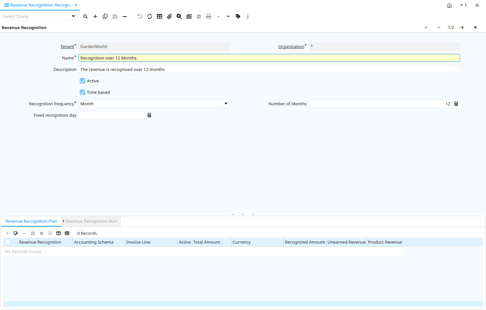

# Revenue Recognition

Window ID 174

*25/01/2000 → 17/02/2022*

**Description:** Revenue Recognition Rules

**Comment/Help:** The Revenue Recognition Window defines the intervals at which revenue will be recognized. Alternatively, the revenue recognition may be linked to service levels provided.

## Tab: Revenue Recognition

*Tab Level 0 · Created 25/01/2000 · Updated 02/01/2000*

**Description:** Revenue Recognition

**Comment/Help:** The Revenue Recognition Tab defines the intervals at which revenue will be recognized.  You can also base the revenue recognition on provided Service Levels.

| **Name** | **Description** | **Comment/Help** | **Technical Data** |
|---|---|---|---|
| Tenant | Tenant for this installation. | A Tenant is a company or a legal entity. You cannot share data between Tenants. | C_RevenueRecognition.AD_Client_ID<small> numeric(10)   Table Direct</small> |
| Organization | Organizational entity within tenant | An organization is a unit of your tenant or legal entity - examples are store, department. You can share data between organizations. | C_RevenueRecognition.AD_Org_ID<small> numeric(10)   Table Direct</small> |
| Name | Alphanumeric identifier of the entity | The name of an entity (record) is used as an default search option in addition to the search key. The name is up to 60 characters in length. | C_RevenueRecognition.Name<small> character varying(60)   String</small> |
| Description | Optional short description of the record | A description is limited to 255 characters. | C_RevenueRecognition.Description<small> character varying(255)   String</small> |
| Active | The record is active in the system | There are two methods of making records unavailable in the system: One is to delete the record, the other is to de-activate the record. A de-activated record is not available for selection, but available for reports. There are two reasons for de-activating and not deleting records: (1) The system requires the record for audit purposes. (2) The record is referenced by other records. E.g., you cannot delete a Business Partner, if there are invoices for this partner record existing. You de-activate the Business Partner and prevent that this record is used for future entries. | C_RevenueRecognition.IsActive<small> character(1)   Yes-No</small> |
| Time based | Time based Revenue Recognition rather than Service Level based | Revenue Recognition can be time or service level based. | C_RevenueRecognition.IsTimeBased<small> character(1)   Yes-No</small> |
| Recognition frequency |  |  | C_RevenueRecognition.RecognitionFrequency<small> character(1)   List</small> |
| Number of Months |  |  | C_RevenueRecognition.NoMonths<small> numeric(10)   Integer</small> |
| Fixed recognition day | Day of the period recognition occurs | The Fix Recognition Day indicates the day of the period that unearned revenue is recognised. If zero, the invoice date is used. | C_RevenueRecognition.FixedRecogDay<small> numeric(10)   Integer</small> |

## Tab: › Service

*Tab Level 1 · Created 28/10/2014 · Updated 28/10/2014*

| **Name** | **Description** | **Comment/Help** | **Technical Data** |
|---|---|---|---|
| Tenant | Tenant for this installation. | A Tenant is a company or a legal entity. You cannot share data between Tenants. | C_RevenueRecog_Service.AD_Client_ID<small> numeric(10)   Table Direct</small> |
| Organization | Organizational entity within tenant | An organization is a unit of your tenant or legal entity - examples are store, department. You can share data between organizations. | C_RevenueRecog_Service.AD_Org_ID<small> numeric(10)   Table Direct</small> |
| Revenue Recognition | Method for recording revenue | The Revenue Recognition indicates how revenue will be recognized for this product | C_RevenueRecog_Service.C_RevenueRecognition_ID<small> numeric(10)   Table Direct</small> |
| Active | The record is active in the system | There are two methods of making records unavailable in the system: One is to delete the record, the other is to de-activate the record. A de-activated record is not available for selection, but available for reports. There are two reasons for de-activating and not deleting records: (1) The system requires the record for audit purposes. (2) The record is referenced by other records. E.g., you cannot delete a Business Partner, if there are invoices for this partner record existing. You de-activate the Business Partner and prevent that this record is used for future entries. | C_RevenueRecog_Service.IsActive<small> character(1)   Yes-No</small> |
| Line No | Unique line for this document | Indicates the unique line for a document.  It will also control the display order of the lines within a document. | C_RevenueRecog_Service.Line<small> numeric(10)   Integer</small> |
| Percent | Percentage | The Percent indicates the percentage used. | C_RevenueRecog_Service.Percent<small> numeric   Amount</small> |
| Description | Optional short description of the record | A description is limited to 255 characters. | C_RevenueRecog_Service.Description<small> character varying(255)   String</small> |

## Tab: › Revenue Recognition Plan

*Tab Level 1 · Created 13/05/2001 · Updated 02/01/2000*

**Description:** View Revenue Recognition Plan

**Comment/Help:** The Revenue Recognition plan is generated then invoicing a product with revenue recognition.  With Revenue Recognition, the amount is posted to the Unrecognized revenue and over time or based on Service Level booked to Earned Revenue.

| **Name** | **Description** | **Comment/Help** | **Technical Data** |
|---|---|---|---|
| Tenant | Tenant for this installation. | A Tenant is a company or a legal entity. You cannot share data between Tenants. | C_RevenueRecognition_Plan.AD_Client_ID<small> numeric(10)   Table Direct</small> |
| Organization | Organizational entity within tenant | An organization is a unit of your tenant or legal entity - examples are store, department. You can share data between organizations. | C_RevenueRecognition_Plan.AD_Org_ID<small> numeric(10)   Table Direct</small> |
| Accounting Schema | Rules for accounting | An Accounting Schema defines the rules used in accounting such as costing method, currency and calendar | C_RevenueRecognition_Plan.C_AcctSchema_ID<small> numeric(10)   Table Direct</small> |
| Revenue Recognition | Method for recording revenue | The Revenue Recognition indicates how revenue will be recognized for this product | C_RevenueRecognition_Plan.C_RevenueRecognition_ID<small> numeric(10)   Table Direct</small> |
| Invoice Line | Invoice Detail Line | The Invoice Line uniquely identifies a single line of an Invoice. | C_RevenueRecognition_Plan.C_InvoiceLine_ID<small> numeric(10)   Search</small> |
| Active | The record is active in the system | There are two methods of making records unavailable in the system: One is to delete the record, the other is to de-activate the record. A de-activated record is not available for selection, but available for reports. There are two reasons for de-activating and not deleting records: (1) The system requires the record for audit purposes. (2) The record is referenced by other records. E.g., you cannot delete a Business Partner, if there are invoices for this partner record existing. You de-activate the Business Partner and prevent that this record is used for future entries. | C_RevenueRecognition_Plan.IsActive<small> character(1)   Yes-No</small> |
| Total Amount | Total Amount | The Total Amount indicates the total document amount. | C_RevenueRecognition_Plan.TotalAmt<small> numeric   Amount</small> |
| Currency | The Currency for this record | Indicates the Currency to be used when processing or reporting on this record | C_RevenueRecognition_Plan.C_Currency_ID<small> numeric(10)   Table Direct</small> |
| Recognized Amount |  |  | C_RevenueRecognition_Plan.RecognizedAmt<small> numeric   Amount</small> |
| Unearned Revenue | Account for unearned revenue | The Unearned Revenue indicates the account used for recording invoices sent for products or services not yet delivered.  It is used in revenue recognition | C_RevenueRecognition_Plan.UnEarnedRevenue_Acct<small> numeric(10)   Account</small> |
| Product Revenue | Account for Product Revenue (Sales Account) | The Product Revenue Account indicates the account used for recording sales revenue for this product. | C_RevenueRecognition_Plan.P_Revenue_Acct<small> numeric(10)   Account</small> |

## Tab: › › Revenue Recognition Run

*Tab Level 2 · Created 13/05/2001 · Updated 02/01/2000*

**Description:** View Revenue Recognition Run History

| **Name** | **Description** | **Comment/Help** | **Technical Data** |
|---|---|---|---|
| Tenant | Tenant for this installation. | A Tenant is a company or a legal entity. You cannot share data between Tenants. | C_RevenueRecognition_Run.AD_Client_ID<small> numeric(10)   Table Direct</small> |
| Organization | Organizational entity within tenant | An organization is a unit of your tenant or legal entity - examples are store, department. You can share data between organizations. | C_RevenueRecognition_Run.AD_Org_ID<small> numeric(10)   Table Direct</small> |
| Revenue Recognition Plan | Plan for recognizing or recording revenue | The Revenue Recognition Plan identifies a unique Revenue Recognition Plan. | C_RevenueRecognition_Run.C_RevenueRecognition_Plan_ID<small> numeric(10)   Table Direct</small> |
| Active | The record is active in the system | There are two methods of making records unavailable in the system: One is to delete the record, the other is to de-activate the record. A de-activated record is not available for selection, but available for reports. There are two reasons for de-activating and not deleting records: (1) The system requires the record for audit purposes. (2) The record is referenced by other records. E.g., you cannot delete a Business Partner, if there are invoices for this partner record existing. You de-activate the Business Partner and prevent that this record is used for future entries. | C_RevenueRecognition_Run.IsActive<small> character(1)   Yes-No</small> |
| Revenue Recognition Service |  |  | C_RevenueRecognition_Run.C_RevenueRecog_Service_ID<small> numeric(10)   Table Direct</small> |
| Recognition Date |  |  | C_RevenueRecognition_Run.DateRecognized<small> timestamp without time zone   Date</small> |
| Journal | General Ledger Journal | The General Ledger Journal identifies a group of journal lines which represent a logical business transaction | C_RevenueRecognition_Run.GL_Journal_ID<small> numeric(10)   Search</small> |
| Recognized Amount |  |  | C_RevenueRecognition_Run.RecognizedAmt<small> numeric   Amount</small> |

