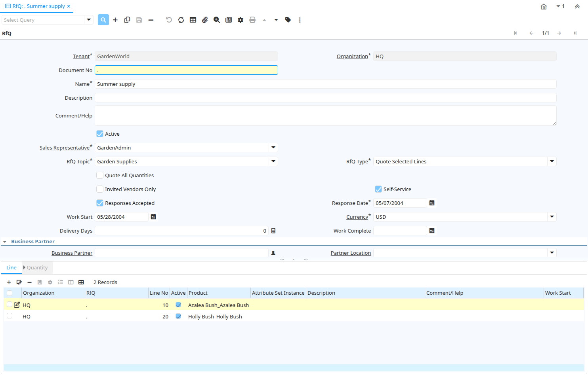

# RfQ

Window ID 315

*19/02/2004 → 02/01/2000*

**Description:** Manage Request for Quotations

**Comment/Help:** Request for Quotation to be sent out to vendors of a RfQ Topic. After Vendor selection, optionally create Sales Order or Quote for Customer as well as Purchase Order  for Vendor(s)

## Tab: RfQ

*Tab Level 0 · Created 19/02/2004 · Updated 02/01/2000*

**Description:** Request for Quotation

**Comment/Help:** Request for Quotation to be sent out to vendors of a RfQ Topic. After Vendor selection, optionally create Sales Order or Quote for Customer as well as Purchase Order  for Vendor(s)

| **Name** | **Description** | **Comment/Help** | **Technical Data** |
|---|---|---|---|
| Tenant | Tenant for this installation. | A Tenant is a company or a legal entity. You cannot share data between Tenants. | C_RfQ.AD_Client_ID<small> numeric(10)   Table Direct</small> |
| Organization | Organizational entity within tenant | An organization is a unit of your tenant or legal entity - examples are store, department. You can share data between organizations. | C_RfQ.AD_Org_ID<small> numeric(10)   Table Direct</small> |
| Document No | Document sequence number of the document | The document number is usually automatically generated by the system and determined by the document type of the document. If the document is not saved, the preliminary number is displayed in "&lt;&gt;".  If the document type of your document has no automatic document sequence defined, the field is empty if you create a new document. This is for documents which usually have an external number (like vendor invoice).  If you leave the field empty, the system will generate a document number for you. The document sequence used for this fallback number is defined in the "Maintain Sequence" window with the name "DocumentNo_&lt;TableName&gt;", where TableName is the actual name of the table (e.g. C_Order). | C_RfQ.DocumentNo<small> character varying(30)   String</small> |
| Name | Alphanumeric identifier of the entity | The name of an entity (record) is used as an default search option in addition to the search key. The name is up to 60 characters in length. | C_RfQ.Name<small> character varying(60)   String</small> |
| Description | Optional short description of the record | A description is limited to 255 characters. | C_RfQ.Description<small> character varying(255)   String</small> |
| Comment/Help | Comment or Hint | The Help field contains a hint, comment or help about the use of this item. | C_RfQ.Help<small> character varying(2000)   Text</small> |
| Active | The record is active in the system | There are two methods of making records unavailable in the system: One is to delete the record, the other is to de-activate the record. A de-activated record is not available for selection, but available for reports. There are two reasons for de-activating and not deleting records: (1) The system requires the record for audit purposes. (2) The record is referenced by other records. E.g., you cannot delete a Business Partner, if there are invoices for this partner record existing. You de-activate the Business Partner and prevent that this record is used for future entries. | C_RfQ.IsActive<small> character(1)   Yes-No</small> |
| Sales Representative | Sales Representative or Company Agent | The Sales Representative indicates the Sales Rep for this Region.  Any Sales Rep must be a valid internal user. | C_RfQ.SalesRep_ID<small> numeric(10)   Table</small> |
| RfQ Topic | Topic for Request for Quotations | A Request for Quotation Topic allows you to maintain a subscriber list of potential Vendors to respond to RfQs | C_RfQ.C_RfQ_Topic_ID<small> numeric(10)   Table Direct</small> |
| RfQ Type | Request for Quotation Type |  | C_RfQ.QuoteType<small> character(1)   List</small> |
| Quote All Quantities | Suppliers are requested to provide responses for all quantities | If selected, the response to the Request for Quotation needs to have a price for all Quantities | C_RfQ.IsQuoteAllQty<small> character(1)   Yes-No</small> |
| Quote Total Amt | The response can have just the total amount for the RfQ | If not selected, the response must be provided per line | C_RfQ.IsQuoteTotalAmt<small> character(1)   Yes-No</small> |
| Invited Vendors Only | Only invited vendors can respond to an RfQ | The Request for Quotation is only visible to the invited vendors | C_RfQ.IsInvitedVendorsOnly<small> character(1)   Yes-No</small> |
| Self-Service | This is a Self-Service entry or this entry can be changed via Self-Service | Self-Service allows users to enter data or update their data.  The flag indicates, that this record was entered or created via Self-Service or that the user can change it via the Self-Service functionality. | C_RfQ.IsSelfService<small> character(1)   Yes-No</small> |
| Responses Accepted | Are Responses to the Request for Quotation accepted | If selected, responses for the RfQ are accepted | C_RfQ.IsRfQResponseAccepted<small> character(1)   Yes-No</small> |
| Response Date | Date of the Response | Date of the Response | C_RfQ.DateResponse<small> timestamp without time zone   Date</small> |
| Work Start | Date when work is (planned to be) started |  | C_RfQ.DateWorkStart<small> timestamp without time zone   Date</small> |
| Currency | The Currency for this record | Indicates the Currency to be used when processing or reporting on this record | C_RfQ.C_Currency_ID<small> numeric(10)   Table Direct</small> |
| Delivery Days | Number of Days (planned) until Delivery |  | C_RfQ.DeliveryDays<small> numeric(10)   Integer</small> |
| Work Complete | Date when work is (planned to be) complete |  | C_RfQ.DateWorkComplete<small> timestamp without time zone   Date</small> |
| Create and Invite | Create RfQ and Invite Vendors | Create (missing) RfQ Responses and optionally send EMail Invitation/Reminder to Vendors to respond to RfQ | C_RfQ.PublishRfQ<small> character(1)   Button</small> |
| Rank Responses | Rank Completed RfQ Responses | Invalid responses are ranked with 999 per Quantity. The Quantity Responses are ranked among each other and the RfQ Best Response updated.  The response Lines is marked as Selected winner, where the line quantity purchase quantity is selected.  A total winner is only selected, if the RfQ type is "Quote All Lines" or "Quote Total only".  Then the rankings of all Quantity Responses are added for the total ranking of the response. The response with the lowest total ranking is marked as Selected Winner. | C_RfQ.RankRfQ<small> character(1)   Button</small> |
| Business Partner | Identifies a Business Partner | A Business Partner is anyone with whom you transact.  This can include Vendor, Customer, Employee or Salesperson | C_RfQ.C_BPartner_ID<small> numeric(10)   Search</small> |
| Partner Location | Identifies the (ship to) address for this Business Partner | The Partner address indicates the location of a Business Partner | C_RfQ.C_BPartner_Location_ID<small> numeric(10)   Table Direct</small> |
| User/Contact | User within the system - Internal or Business Partner Contact | The User identifies a unique user in the system. This could be an internal user or a business partner contact | C_RfQ.AD_User_ID<small> numeric(10)   Table Direct</small> |
| Margin % | Margin for a product as a percentage | The Margin indicates the margin for this product as a percentage of the limit price and selling price. | C_RfQ.Margin<small> numeric   Number</small> |
| Create Sales Order | Create Sales Order | A Sales Order is created for the entered Business Partner.  A sales order line is created for each RfQ line quantity, where "Offer Quantity" is selected.  If on the RfQ Line Quantity, an offer amount is entered (not 0), that price is used.  If a magin is entered on RfQ Line Quantity, it overwrites the general margin.  The margin is the percentage added to the Best Response Amount. | C_RfQ.CreateSO<small> character(1)   Button</small> |
| Order | Order | The Order is a control document.  The  Order is complete when the quantity ordered is the same as the quantity shipped and invoiced.  When you close an order, unshipped (backordered) quantities are cancelled. | C_RfQ.C_Order_ID<small> numeric(10)   Search</small> |
| Create Purchase Order | Create Purchase Order(s) for RfQ Winner(s) | Create purchase order(s) for the response(s) and lines marked as Selected Winner using the selected Purchase Quantity (in RfQ Line Quantity) . If a Response is marked as Selected Winner, all lines are created (and Selected Winner of other responses ignored).  If there is no response marked as Selected Winner, the lines are used. | C_RfQ.CreatePO<small> character(1)   Button</small> |
| Copy Lines | Copy Lines from another RfQ |  | C_RfQ.CopyLines<small> character(1)   Button</small> |
| Close RfQ | Close RfQ and Responses | Close the RfQ and all it's Responses | C_RfQ.Processing<small> character(1)   Button</small> |
| Processed | The document has been processed | The Processed checkbox indicates that a document has been processed. | C_RfQ.Processed<small> character(1)   Yes-No</small> |

## Tab: › Line

*Tab Level 1 · Created 19/02/2004 · Updated 02/01/2000*

**Description:** RfQ Line

**Comment/Help:** Request for Quotation Line

| **Name** | **Description** | **Comment/Help** | **Technical Data** |
|---|---|---|---|
| Tenant | Tenant for this installation. | A Tenant is a company or a legal entity. You cannot share data between Tenants. | C_RfQLine.AD_Client_ID<small> numeric(10)   Table Direct</small> |
| Organization | Organizational entity within tenant | An organization is a unit of your tenant or legal entity - examples are store, department. You can share data between organizations. | C_RfQLine.AD_Org_ID<small> numeric(10)   Table Direct</small> |
| RfQ | Request for Quotation | Request for Quotation to be sent out to vendors of a RfQ Topic. After Vendor selection, optionally create Sales Order or Quote for Customer as well as Purchase Order  for Vendor(s) | C_RfQLine.C_RfQ_ID<small> numeric(10)   Search</small> |
| Line No | Unique line for this document | Indicates the unique line for a document.  It will also control the display order of the lines within a document. | C_RfQLine.Line<small> numeric(10)   Integer</small> |
| Active | The record is active in the system | There are two methods of making records unavailable in the system: One is to delete the record, the other is to de-activate the record. A de-activated record is not available for selection, but available for reports. There are two reasons for de-activating and not deleting records: (1) The system requires the record for audit purposes. (2) The record is referenced by other records. E.g., you cannot delete a Business Partner, if there are invoices for this partner record existing. You de-activate the Business Partner and prevent that this record is used for future entries. | C_RfQLine.IsActive<small> character(1)   Yes-No</small> |
| Product | Product, Service, Item | Identifies an item which is either purchased or sold in this organization. | C_RfQLine.M_Product_ID<small> numeric(10)   Search</small> |
| Attribute Set Instance | Product Attribute Set Instance | The values of the actual Product Attribute Instances.  The product level attributes are defined on Product level. | C_RfQLine.M_AttributeSetInstance_ID<small> numeric(10)   Product Attribute</small> |
| Description | Optional short description of the record | A description is limited to 255 characters. | C_RfQLine.Description<small> character varying(255)   String</small> |
| Comment/Help | Comment or Hint | The Help field contains a hint, comment or help about the use of this item. | C_RfQLine.Help<small> character varying(2000)   Text</small> |
| Work Start | Date when work is (planned to be) started |  | C_RfQLine.DateWorkStart<small> timestamp without time zone   Date</small> |
| Delivery Days | Number of Days (planned) until Delivery |  | C_RfQLine.DeliveryDays<small> numeric(10)   Integer</small> |
| Work Complete | Date when work is (planned to be) complete |  | C_RfQLine.DateWorkComplete<small> timestamp without time zone   Date</small> |

## Tab: › › Quantity

*Tab Level 2 · Created 19/02/2004 · Updated 02/01/2000*

**Description:** RfQ Line Quantity

**Comment/Help:** Request for Quotation Line Quantity - You may request a quotation for different quantities

| **Name** | **Description** | **Comment/Help** | **Technical Data** |
|---|---|---|---|
| Tenant | Tenant for this installation. | A Tenant is a company or a legal entity. You cannot share data between Tenants. | C_RfQLineQty.AD_Client_ID<small> numeric(10)   Table Direct</small> |
| Organization | Organizational entity within tenant | An organization is a unit of your tenant or legal entity - examples are store, department. You can share data between organizations. | C_RfQLineQty.AD_Org_ID<small> numeric(10)   Table Direct</small> |
| RfQ Line | Request for Quotation Line | Request for Quotation Line | C_RfQLineQty.C_RfQLine_ID<small> numeric(10)   Table Direct</small> |
| Active | The record is active in the system | There are two methods of making records unavailable in the system: One is to delete the record, the other is to de-activate the record. A de-activated record is not available for selection, but available for reports. There are two reasons for de-activating and not deleting records: (1) The system requires the record for audit purposes. (2) The record is referenced by other records. E.g., you cannot delete a Business Partner, if there are invoices for this partner record existing. You de-activate the Business Partner and prevent that this record is used for future entries. | C_RfQLineQty.IsActive<small> character(1)   Yes-No</small> |
| UOM | Unit of Measure | The UOM defines a unique non monetary Unit of Measure | C_RfQLineQty.C_UOM_ID<small> numeric(10)   Table Direct</small> |
| Quantity | Quantity | The Quantity indicates the number of a specific product or item for this document. | C_RfQLineQty.Qty<small> numeric   Quantity</small> |
| RfQ Quantity | The quantity is used when generating RfQ Responses | When generating the RfQ Responses, this quantity is included | C_RfQLineQty.IsRfQQty<small> character(1)   Yes-No</small> |
| Benchmark Price | Price to compare responses to |  | C_RfQLineQty.BenchmarkPrice<small> numeric   Costs+Prices</small> |
| Purchase Quantity | This quantity is used in the Purchase Order to the Supplier | When multiple quantities are used in an Request for Quotation, the selected Quantity is used for generating the purchase order.  If none selected the lowest number is used. | C_RfQLineQty.IsPurchaseQty<small> character(1)   Yes-No</small> |
| Best Response Amount | Best Response Amount | Filled by Rank Response Process | C_RfQLineQty.BestResponseAmt<small> numeric   Amount</small> |
| Offer Quantity | This quantity is used in the Offer to the Customer | When multiple quantities are used in an Request for Quotation, the selected Quantity is used for generating the offer.  If none selected the lowest number is used. | C_RfQLineQty.IsOfferQty<small> character(1)   Yes-No</small> |
| Offer Amount | Amount of the Offer |  | C_RfQLineQty.OfferAmt<small> numeric   Amount</small> |
| Margin % | Margin for a product as a percentage | The Margin indicates the margin for this product as a percentage of the limit price and selling price. | C_RfQLineQty.Margin<small> numeric   Number</small> |

