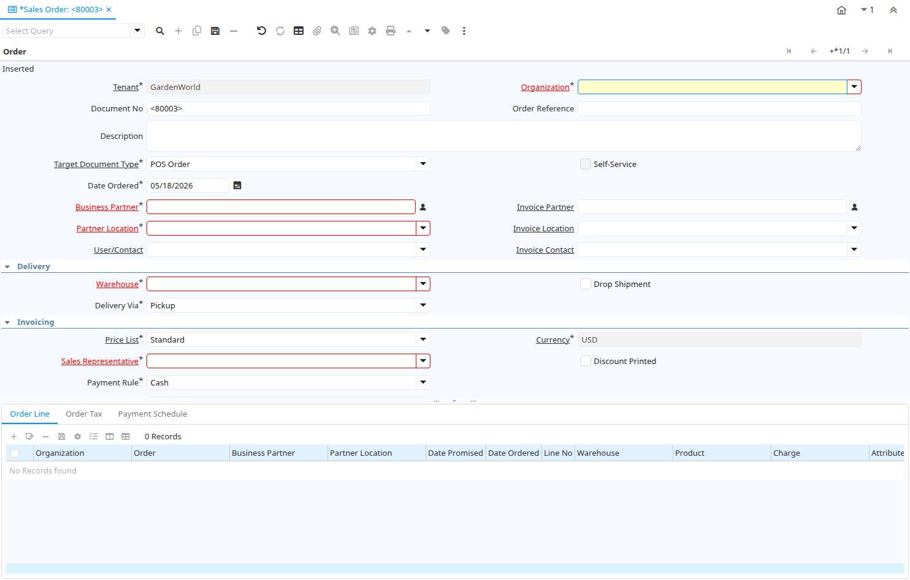

# Sales Order

Window ID 143

*09/08/1999 → 30/06/2021*

**Description:** Enter and change sales orders

**Comment/Help:** The Order Window allows you to enter and modify Sales Orders.  

## Tab: Order

*Tab Level 0 · Created 09/08/1999 · Updated 12/12/2009*

**Description:** Order Header

**Comment/Help:** The Order Header Tab defines the parameters of an Order. Changing the Organization, Business Partner, Warehouse, Date Promised, etc. changes these values on all the lines. 

| **Name** | **Description** | **Comment/Help** | **Technical Data** |
|---|---|---|---|
| Tenant | Tenant for this installation. | A Tenant is a company or a legal entity. You cannot share data between Tenants. | C_Order.AD_Client_ID<small> numeric(10)   Table Direct</small> |
| Organization | Organizational entity within tenant | An organization is a unit of your tenant or legal entity - examples are store, department. You can share data between organizations. | C_Order.AD_Org_ID<small> numeric(10)   Table Direct</small> |
| Document No | Document sequence number of the document | The document number is usually automatically generated by the system and determined by the document type of the document. If the document is not saved, the preliminary number is displayed in "&lt;&gt;".  If the document type of your document has no automatic document sequence defined, the field is empty if you create a new document. This is for documents which usually have an external number (like vendor invoice).  If you leave the field empty, the system will generate a document number for you. The document sequence used for this fallback number is defined in the "Maintain Sequence" window with the name "DocumentNo_&lt;TableName&gt;", where TableName is the actual name of the table (e.g. C_Order). | C_Order.DocumentNo<small> character varying(30)   String</small> |
| Order Reference | Transaction Reference Number (Sales Order, Purchase Order) of your Business Partner | The business partner order reference is the order reference for this specific transaction; Often Purchase Order numbers are given to print on Invoices for easier reference.  A standard number can be defined in the Business Partner (Customer) window. | C_Order.POReference<small> character varying(20)   String</small> |
| Description | Optional short description of the record | A description is limited to 255 characters. | C_Order.Description<small> character varying(255)   Text</small> |
| Target Document Type | Target document type for conversing documents | You can convert document types (e.g. from Offer to Order or Invoice).  The conversion is then reflected in the current type.  This processing is initiated by selecting the appropriate Document Action. | C_Order.C_DocTypeTarget_ID<small> numeric(10)   Table</small> |
| Self-Service | This is a Self-Service entry or this entry can be changed via Self-Service | Self-Service allows users to enter data or update their data.  The flag indicates, that this record was entered or created via Self-Service or that the user can change it via the Self-Service functionality. | C_Order.IsSelfService<small> character(1)   Yes-No</small> |
| Date Ordered | Date of Order | Indicates the Date an item was ordered. | C_Order.DateOrdered<small> timestamp without time zone   Date</small> |
| Date Promised | Date Order was promised | The Date Promised indicates the date, if any, that an Order was promised for. | C_Order.DatePromised<small> timestamp without time zone   Date</small> |
| Business Partner | Identifies a Business Partner | A Business Partner is anyone with whom you transact.  This can include Vendor, Customer, Employee or Salesperson | C_Order.C_BPartner_ID<small> numeric(10)   Search</small> |
| Invoice Partner | Business Partner to be invoiced | If empty the shipment business partner will be invoiced | C_Order.Bill_BPartner_ID<small> numeric(10)   Search</small> |
| Partner Location | Identifies the (ship to) address for this Business Partner | The Partner address indicates the location of a Business Partner | C_Order.C_BPartner_Location_ID<small> numeric(10)   Table Direct</small> |
| Invoice Location | Business Partner Location for invoicing |  | C_Order.Bill_Location_ID<small> numeric(10)   Table</small> |
| User/Contact | User within the system - Internal or Business Partner Contact | The User identifies a unique user in the system. This could be an internal user or a business partner contact | C_Order.AD_User_ID<small> numeric(10)   Table Direct</small> |
| Invoice Contact | Business Partner Contact for invoicing |  | C_Order.Bill_User_ID<small> numeric(10)   Table</small> |
| Delivery Rule | Defines the timing of Delivery | The Delivery Rule indicates when an order should be delivered. For example should the order be delivered when the entire order is complete, when a line is complete or as the products become available. | C_Order.DeliveryRule<small> character(1)   List</small> |
| Priority | Priority of a document | The Priority indicates the importance (high, medium, low) of this document | C_Order.PriorityRule<small> character(1)   List</small> |
| Warehouse | Storage Warehouse and Service Point | The Warehouse identifies a unique Warehouse where products are stored or Services are provided. | C_Order.M_Warehouse_ID<small> numeric(10)   Table Direct</small> |
| Drop Shipment | Drop Shipments are sent directly to the Drop Shipment Location | Drop Shipments are sent directly to the Drop Shipment Location using the Drop Ship Business Partner name and contact. | C_Order.IsDropShip<small> character(1)   Yes-No</small> |
| Drop Ship Business Partner | Business Partner to ship to | If empty the business partner will be shipped to. | C_Order.DropShip_BPartner_ID<small> numeric(10)   Search</small> |
| Drop Shipment Location | Business Partner Location for shipping to |  | C_Order.DropShip_Location_ID<small> numeric(10)   Table</small> |
| Drop Shipment Contact | Business Partner Contact for drop shipment |  | C_Order.DropShip_User_ID<small> numeric(10)   Table</small> |
| Delivery Via | How the order will be delivered | The Delivery Via indicates how the products should be delivered. For example, will the order be picked up or shipped. | C_Order.DeliveryViaRule<small> character(1)   List</small> |
| Shipper | Method or manner of product delivery | The Shipper indicates the method of delivering product | C_Order.M_Shipper_ID<small> numeric(10)   Table</small> |
| Freight Cost Rule | Method for charging Freight | The Freight Cost Rule indicates the method used when charging for freight. | C_Order.FreightCostRule<small> character(1)   List</small> |
| Freight Category | Category of the Freight | Freight Categories are used to calculate the Freight for the Shipper selected | C_Order.M_FreightCategory_ID<small> numeric(10)   Table Direct</small> |
| Freight Amount | Freight Amount  | The Freight Amount indicates the amount charged for Freight in the document currency. | C_Order.FreightAmt<small> numeric   Amount</small> |
| Privileged Rate |  |  | C_Order.IsPriviledgedRate<small> character(1)   Yes-No</small> |
| Online Shipping Sales Order Rate Inquiry |  |  | C_Order.ShippingRateInquiry<small> character(1)   Button</small> |
| Invoice Rule | Frequency and method of invoicing  | The Invoice Rule defines how a Business Partner is invoiced and the frequency of invoicing. | C_Order.InvoiceRule<small> character(1)   List</small> |
| Price List | Unique identifier of a Price List | Price Lists are used to determine the pricing, margin and cost of items purchased or sold. | C_Order.M_PriceList_ID<small> numeric(10)   Table Direct</small> |
| Currency | The Currency for this record | Indicates the Currency to be used when processing or reporting on this record | C_Order.C_Currency_ID<small> numeric(10)   Table Direct</small> |
| Currency Type | Currency Conversion Rate Type | The Currency Conversion Rate Type lets you define different type of rates, e.g. Spot, Corporate and/or Sell/Buy rates. | C_Order.C_ConversionType_ID<small> numeric(10)   Table Direct</small> |
| Sales Representative | Sales Representative or Company Agent | The Sales Representative indicates the Sales Rep for this Region.  Any Sales Rep must be a valid internal user. | C_Order.SalesRep_ID<small> numeric(10)   Table</small> |
| Discount Printed | Print Discount on Invoice and Order | The Discount Printed Checkbox indicates if the discount will be printed on the document. | C_Order.IsDiscountPrinted<small> character(1)   Yes-No</small> |
| Charge | Additional document charges | The Charge indicates a type of Charge (Handling, Shipping, Restocking) | C_Order.C_Charge_ID<small> numeric(10)   Table</small> |
| Charge amount | Charge Amount | The Charge Amount indicates the amount for an additional charge. | C_Order.ChargeAmt<small> numeric   Amount</small> |
| Payment Rule | How you pay the invoice | The Payment Rule indicates the method of invoice payment. | C_Order.PaymentRule<small> character(1)   Payment</small> |
| Payment Term | The terms of Payment (timing, discount) | Payment Terms identify the method and timing of payment. | C_Order.C_PaymentTerm_ID<small> numeric(10)   Table Direct</small> |
| Promotion Code | User entered promotion code at sales time | If present, user entered the promotion code at sales time to get this promotion | C_Order.PromotionCode<small> character varying(30)   String</small> |
| Project | Financial Project | A Project allows you to track and control internal or external activities. | C_Order.C_Project_ID<small> numeric(10)   Table Direct</small> |
| Activity | Business Activity | Activities indicate tasks that are performed and used to utilize Activity based Costing | C_Order.C_Activity_ID<small> numeric(10)   Table Direct</small> |
| Campaign | Marketing Campaign | The Campaign defines a unique marketing program.  Projects can be associated with a pre defined Marketing Campaign.  You can then report based on a specific Campaign. | C_Order.C_Campaign_ID<small> numeric(10)   Table Direct</small> |
| Trx Organization | Performing or initiating organization | The organization which performs or initiates this transaction (for another organization).  The owning Organization may not be the transaction organization in a service bureau environment, with centralized services, and inter-organization transactions. | C_Order.AD_OrgTrx_ID<small> numeric(10)   Table</small> |
| User Element List 1 | User defined list element #1 | The user defined element displays the optional elements that have been defined for this account combination. | C_Order.User1_ID<small> numeric(10)   Search</small> |
| User Element List 2 | User defined list element #2 | The user defined element displays the optional elements that have been defined for this account combination. | C_Order.User2_ID<small> numeric(10)   Search</small> |
| Total Lines | Total of all document lines | The Total amount displays the total of all lines in document currency | C_Order.TotalLines<small> numeric   Amount</small> |
| Grand Total | Total amount of document | The Grand Total displays the total amount including Tax and Freight in document currency | C_Order.GrandTotal<small> numeric   Amount</small> |
| Document Status | The current status of the document | The Document Status indicates the status of a document at this time.  If you want to change the document status, use the Document Action field | C_Order.DocStatus<small> character(2)   List</small> |
| Document Type | Document type or rules | The Document Type determines document sequence and processing rules | C_Order.C_DocType_ID<small> numeric(10)   Table Direct</small> |
| Pay Schedule valid | Is the Payment Schedule is valid | Payment Schedules allow to have multiple due dates. | C_Order.IsPayScheduleValid<small> character(1)   Yes-No</small> |
| Copy Lines | Copy Lines from other Order |  | C_Order.CopyFrom<small> character(1)   Button</small> |
| Process Order |  |  | C_Order.DocAction<small> character(2)   Button</small> |
| Order Source |  |  | C_Order.C_OrderSource_ID<small> numeric(10)   Table Direct</small> |
| Posted | Posting status | The Posted field indicates the status of the Generation of General Ledger Accounting Lines  | C_Order.Posted<small> character(1)   Button</small> |
| Cash Plan Line |  |  | C_Order.C_CashPlanLine_ID<small> numeric(10)   Search</small> |
| Quotation | Quotation used for generating this order |  | C_Order.QuotationOrder_ID<small> numeric(10)   Search</small> |
| Linked Order | This field links a sales order to the purchase order that is generated from it. |  | C_Order.Link_Order_ID<small> numeric(10)   Search</small> |
| Department |  |  | C_Order.C_Department_ID<small> numeric(10)   Table Direct</small> |
| Cost Center |  |  | C_Order.C_CostCenter_ID<small> numeric(10)   Table Direct</small> |

## Tab: › Order Line

*Tab Level 1 · Created 09/08/1999 · Updated 02/09/2005*

**Description:** Order Line

**Comment/Help:** The Order Line Tab defines the individual line items that comprise an Order.

| **Name** | **Description** | **Comment/Help** | **Technical Data** |
|---|---|---|---|
| Tenant | Tenant for this installation. | A Tenant is a company or a legal entity. You cannot share data between Tenants. | C_OrderLine.AD_Client_ID<small> numeric(10)   Table Direct</small> |
| Organization | Organizational entity within tenant | An organization is a unit of your tenant or legal entity - examples are store, department. You can share data between organizations. | C_OrderLine.AD_Org_ID<small> numeric(10)   Table Direct</small> |
| Order | Order | The Order is a control document.  The  Order is complete when the quantity ordered is the same as the quantity shipped and invoiced.  When you close an order, unshipped (backordered) quantities are cancelled. | C_OrderLine.C_Order_ID<small> numeric(10)   Search</small> |
| Business Partner | Identifies a Business Partner | A Business Partner is anyone with whom you transact.  This can include Vendor, Customer, Employee or Salesperson | C_OrderLine.C_BPartner_ID<small> numeric(10)   Search</small> |
| Partner Location | Identifies the (ship to) address for this Business Partner | The Partner address indicates the location of a Business Partner | C_OrderLine.C_BPartner_Location_ID<small> numeric(10)   Table Direct</small> |
| Date Promised | Date Order was promised | The Date Promised indicates the date, if any, that an Order was promised for. | C_OrderLine.DatePromised<small> timestamp without time zone   Date</small> |
| Date Ordered | Date of Order | Indicates the Date an item was ordered. | C_OrderLine.DateOrdered<small> timestamp without time zone   Date</small> |
| Line No | Unique line for this document | Indicates the unique line for a document.  It will also control the display order of the lines within a document. | C_OrderLine.Line<small> numeric(10)   Integer</small> |
| Warehouse | Storage Warehouse and Service Point | The Warehouse identifies a unique Warehouse where products are stored or Services are provided. | C_OrderLine.M_Warehouse_ID<small> numeric(10)   Table</small> |
| Product | Product, Service, Item | Identifies an item which is either purchased or sold in this organization. | C_OrderLine.M_Product_ID<small> numeric(10)   Search</small> |
| Charge | Additional document charges | The Charge indicates a type of Charge (Handling, Shipping, Restocking) | C_OrderLine.C_Charge_ID<small> numeric(10)   Table Direct</small> |
| Attribute Set Instance | Product Attribute Set Instance | The values of the actual Product Attribute Instances.  The product level attributes are defined on Product level. | C_OrderLine.M_AttributeSetInstance_ID<small> numeric(10)   Product Attribute</small> |
| Resource Assignment | Resource Assignment |  | C_OrderLine.S_ResourceAssignment_ID<small> numeric(10)   Assignment</small> |
| Description | Optional short description of the record | A description is limited to 255 characters. | C_OrderLine.Description<small> character varying(255)   Text</small> |
| Quantity | The Quantity Entered is based on the selected UoM | The Quantity Entered is converted to base product UoM quantity | C_OrderLine.QtyEntered<small> numeric   Quantity</small> |
| UOM | Unit of Measure | The UOM defines a unique non monetary Unit of Measure | C_OrderLine.C_UOM_ID<small> numeric(10)   Table Direct</small> |
| Ordered Quantity | Ordered Quantity | The Ordered Quantity indicates the quantity of a product that was ordered. | C_OrderLine.QtyOrdered<small> numeric   Quantity</small> |
| Delivered Quantity | Delivered Quantity | The Delivered Quantity indicates the quantity of a product that has been delivered. | C_OrderLine.QtyDelivered<small> numeric   Quantity</small> |
| Reserved Quantity | Reserved Quantity | The Reserved Quantity indicates the quantity of a product that is currently reserved. | C_OrderLine.QtyReserved<small> numeric   Quantity</small> |
| Quantity Invoiced | Invoiced Quantity | The Invoiced Quantity indicates the quantity of a product that have been invoiced. | C_OrderLine.QtyInvoiced<small> numeric   Quantity</small> |
| Shipper | Method or manner of product delivery | The Shipper indicates the method of delivering product | C_OrderLine.M_Shipper_ID<small> numeric(10)   Table</small> |
| Price | Price Entered - the price based on the selected/base UoM | The price entered is converted to the actual price based on the UoM conversion | C_OrderLine.PriceEntered<small> numeric   Costs+Prices</small> |
| Unit Price | Actual Price  | The Actual or Unit Price indicates the Price for a product in source currency. | C_OrderLine.PriceActual<small> numeric   Costs+Prices</small> |
| List Price | List Price | The List Price is the official List Price in the document currency. | C_OrderLine.PriceList<small> numeric   Costs+Prices</small> |
| Freight Amount | Freight Amount  | The Freight Amount indicates the amount charged for Freight in the document currency. | C_OrderLine.FreightAmt<small> numeric   Amount</small> |
| Tax | Tax identifier | The Tax indicates the type of tax used in document line. | C_OrderLine.C_Tax_ID<small> numeric(10)   Table Direct</small> |
| Discount % | Discount in percent | The Discount indicates the discount applied or taken as a percentage. | C_OrderLine.Discount<small> numeric   Number</small> |
| Project | Financial Project | A Project allows you to track and control internal or external activities. | C_OrderLine.C_Project_ID<small> numeric(10)   Table Direct</small> |
| Activity | Business Activity | Activities indicate tasks that are performed and used to utilize Activity based Costing | C_OrderLine.C_Activity_ID<small> numeric(10)   Table Direct</small> |
| Campaign | Marketing Campaign | The Campaign defines a unique marketing program.  Projects can be associated with a pre defined Marketing Campaign.  You can then report based on a specific Campaign. | C_OrderLine.C_Campaign_ID<small> numeric(10)   Table Direct</small> |
| Trx Organization | Performing or initiating organization | The organization which performs or initiates this transaction (for another organization).  The owning Organization may not be the transaction organization in a service bureau environment, with centralized services, and inter-organization transactions. | C_OrderLine.AD_OrgTrx_ID<small> numeric(10)   Table</small> |
| User Element List 1 | User defined list element #1 | The user defined element displays the optional elements that have been defined for this account combination. | C_OrderLine.User1_ID<small> numeric(10)   Search</small> |
| User Element List 2 | User defined list element #2 | The user defined element displays the optional elements that have been defined for this account combination. | C_OrderLine.User2_ID<small> numeric(10)   Search</small> |
| Line Amount | Line Extended Amount (Quantity * Actual Price) without Freight and Charges | Indicates the extended line amount based on the quantity and the actual price.  Any additional charges or freight are not included.  The Amount may or may not include tax.  If the price list is inclusive tax, the line amount is the same as the line total. | C_OrderLine.LineNetAmt<small> numeric   Amount</small> |
| Lost Sales Qty | Quantity of potential sales | When an order is closed and there is a difference between the ordered quantity and the delivered (invoiced) quantity is the Lost Sales Quantity.  Note that the Lost Sales Quantity is 0 if you void an order, so close the order if you want to track lost opportunities.  [Void = data entry error - Close = the order is finished] | C_OrderLine.QtyLostSales<small> numeric   Quantity</small> |
| Processed | The document has been processed | The Processed checkbox indicates that a document has been processed. | C_OrderLine.Processed<small> character(1)   Yes-No</small> |
| Create Shipment from Order Line | Create Shipment for single ordered product |  | C_OrderLine.CreateShipment<small> character(1)   Button</small> |
| Create Production from Order Line | Create Production for single ordered product |  | C_OrderLine.CreateProduction<small> character(1)   Button</small> |
| Department |  |  | C_OrderLine.C_Department_ID<small> numeric(10)   Table Direct</small> |
| Cost Center |  |  | C_OrderLine.C_CostCenter_ID<small> numeric(10)   Table Direct</small> |

## Tab: › Order Tax

*Tab Level 1 · Created 04/12/1999 · Updated 02/01/2000*

**Description:** Order Tax

**Comment/Help:** The Order Tax Tab displays the tax amount for an Order based on the lines entered.

| **Name** | **Description** | **Comment/Help** | **Technical Data** |
|---|---|---|---|
| Tenant | Tenant for this installation. | A Tenant is a company or a legal entity. You cannot share data between Tenants. | C_OrderTax.AD_Client_ID<small> numeric(10)   Table Direct</small> |
| Organization | Organizational entity within tenant | An organization is a unit of your tenant or legal entity - examples are store, department. You can share data between organizations. | C_OrderTax.AD_Org_ID<small> numeric(10)   Table Direct</small> |
| Order | Order | The Order is a control document.  The  Order is complete when the quantity ordered is the same as the quantity shipped and invoiced.  When you close an order, unshipped (backordered) quantities are cancelled. | C_OrderTax.C_Order_ID<small> numeric(10)   Search</small> |
| Tax | Tax identifier | The Tax indicates the type of tax used in document line. | C_OrderTax.C_Tax_ID<small> numeric(10)   Table Direct</small> |
| Tax Provider |  |  | C_OrderTax.C_TaxProvider_ID<small> numeric(10)   Table Direct</small> |
| Tax Amount | Tax Amount for a document | The Tax Amount displays the total tax amount for a document. | C_OrderTax.TaxAmt<small> numeric   Amount</small> |
| Tax base Amount | Base for calculating the tax amount | The Tax Base Amount indicates the base amount used for calculating the tax amount. | C_OrderTax.TaxBaseAmt<small> numeric   Amount</small> |
| Price includes Tax | Tax is included in the price  | The Tax Included checkbox indicates if the prices include tax.  This is also known as the gross price. | C_OrderTax.IsTaxIncluded<small> character(1)   Yes-No</small> |

## Tab: › Payment Schedule

*Tab Level 1 · Created 08/12/2010 · Updated 08/12/2010*

**Description:** Order Payment Schedule

| **Name** | **Description** | **Comment/Help** | **Technical Data** |
|---|---|---|---|
| Tenant | Tenant for this installation. | A Tenant is a company or a legal entity. You cannot share data between Tenants. | C_OrderPaySchedule.AD_Client_ID<small> numeric(10)   Table Direct</small> |
| Organization | Organizational entity within tenant | An organization is a unit of your tenant or legal entity - examples are store, department. You can share data between organizations. | C_OrderPaySchedule.AD_Org_ID<small> numeric(10)   Table Direct</small> |
| Order | Order | The Order is a control document.  The  Order is complete when the quantity ordered is the same as the quantity shipped and invoiced.  When you close an order, unshipped (backordered) quantities are cancelled. | C_OrderPaySchedule.C_Order_ID<small> numeric(10)   Search</small> |
| Payment Schedule | Payment Schedule Template | Information when parts of the payment are due | C_OrderPaySchedule.C_PaySchedule_ID<small> numeric(10)   Table Direct</small> |
| Active | The record is active in the system | There are two methods of making records unavailable in the system: One is to delete the record, the other is to de-activate the record. A de-activated record is not available for selection, but available for reports. There are two reasons for de-activating and not deleting records: (1) The system requires the record for audit purposes. (2) The record is referenced by other records. E.g., you cannot delete a Business Partner, if there are invoices for this partner record existing. You de-activate the Business Partner and prevent that this record is used for future entries. | C_OrderPaySchedule.IsActive<small> character(1)   Yes-No</small> |
| Due Date | Date when the payment is due | Date when the payment is due without deductions or discount | C_OrderPaySchedule.DueDate<small> timestamp without time zone   Date</small> |
| Amount due | Amount of the payment due | Full amount of the payment due | C_OrderPaySchedule.DueAmt<small> numeric   Amount</small> |
| Discount Date | Last Date for payments with discount | Last Date where a deduction of the payment discount is allowed | C_OrderPaySchedule.DiscountDate<small> timestamp without time zone   Date</small> |
| Discount Amount | Calculated amount of discount | The Discount Amount indicates the discount amount for a document or line. | C_OrderPaySchedule.DiscountAmt<small> numeric   Amount</small> |
| Validate | Validate Payment Schedule |  | C_OrderPaySchedule.Processing<small> character(1)   Button</small> |
| Valid | Element is valid | The element passed the validation check | C_OrderPaySchedule.IsValid<small> character(1)   Yes-No</small> |

## Tab: › POS Payment

*Tab Level 1 · Created 06/09/2012 · Updated 16/03/2021*

| **Name** | **Description** | **Comment/Help** | **Technical Data** |
|---|---|---|---|
| Tenant | Tenant for this installation. | A Tenant is a company or a legal entity. You cannot share data between Tenants. | C_POSPayment.AD_Client_ID<small> numeric(10)   Table Direct</small> |
| Organization | Organizational entity within tenant | An organization is a unit of your tenant or legal entity - examples are store, department. You can share data between organizations. | C_POSPayment.AD_Org_ID<small> numeric(10)   Table Direct</small> |
| Order | Order | The Order is a control document.  The  Order is complete when the quantity ordered is the same as the quantity shipped and invoiced.  When you close an order, unshipped (backordered) quantities are cancelled. | C_POSPayment.C_Order_ID<small> numeric(10)   Search</small> |
| Payment | Payment identifier | The Payment is a unique identifier of this payment. | C_POSPayment.C_Payment_ID<small> numeric(10)   Search</small> |
| POS Tender Type |  |  | C_POSPayment.C_POSTenderType_ID<small> numeric(10)   Table Direct</small> |
| Tender type | Method of Payment | The Tender Type indicates the method of payment (ACH or Direct Deposit, Credit Card, Check, Direct Debit) | C_POSPayment.TenderType<small> character(1)   List</small> |
| Payment amount | Amount being paid | Indicates the amount this payment is for.  The payment amount can be for single or multiple invoices or a partial payment for an invoice. | C_POSPayment.PayAmt<small> numeric   Amount</small> |
| Account Name | Name on Credit Card or Account holder | The Name of the Credit Card or Account holder. | C_POSPayment.A_Name<small> character varying(60)   String</small> |
| Routing No | Bank Routing Number | The Bank Routing Number (ABA Number) identifies a legal Bank.  It is used in routing checks and electronic transactions. | C_POSPayment.RoutingNo<small> character varying(20)   String</small> |
| Check No | Check Number | The Check Number indicates the number on the check. | C_POSPayment.CheckNo<small> character varying(20)   String</small> |
| Account No | Account Number | The Account Number indicates the Number assigned to this bank account.  | C_POSPayment.AccountNo<small> character varying(20)   String</small> |
| Micr | Combination of routing no, account and check no | The Micr number is the combination of the bank routing number, account number and check number | C_POSPayment.Micr<small> character varying(20)   String</small> |
| Post Dated |  |  | C_POSPayment.IsPostDated<small> character(1)   Yes-No</small> |
| Date Promised | Date Order was promised | The Date Promised indicates the date, if any, that an Order was promised for. | C_POSPayment.DatePromised<small> timestamp without time zone   Date</small> |
| Check Status |  |  | C_POSPayment.CheckStatus<small> character(1)   List</small> |
| Credit Card | Credit Card (Visa, MC, AmEx) | The Credit Card drop down list box is used for selecting the type of Credit Card presented for payment. | C_POSPayment.CreditCardType<small> character(1)   List</small> |
| Number | Credit Card Number  | The Credit Card number indicates the number on the credit card, without blanks or spaces. | C_POSPayment.CreditCardNumber<small> character varying(20)   String</small> |
| Voice authorization code | Voice Authorization Code from credit card company | The Voice Authorization Code indicates the code received from the Credit Card Company. | C_POSPayment.VoiceAuthCode<small> character varying(20)   String</small> |
| Deposit Group |  |  | C_POSPayment.DepositGroup<small> character varying(20)   String</small> |
| Comment/Help | Comment or Hint | The Help field contains a hint, comment or help about the use of this item. | C_POSPayment.Help<small> character varying(2000)   Text</small> |
| Processed | The document has been processed | The Processed checkbox indicates that a document has been processed. | C_POSPayment.Processed<small> character(1)   Yes-No</small> |
| Active | The record is active in the system | There are two methods of making records unavailable in the system: One is to delete the record, the other is to de-activate the record. A de-activated record is not available for selection, but available for reports. There are two reasons for de-activating and not deleting records: (1) The system requires the record for audit purposes. (2) The record is referenced by other records. E.g., you cannot delete a Business Partner, if there are invoices for this partner record existing. You de-activate the Business Partner and prevent that this record is used for future entries. | C_POSPayment.IsActive<small> character(1)   Yes-No</small> |

