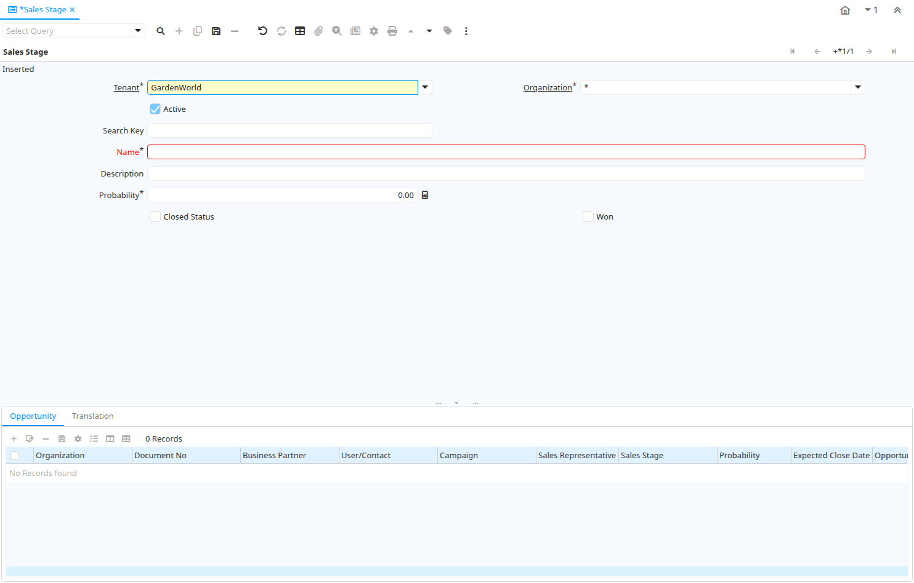

# Sales Stage

Window ID 53154

*25/08/2013 → 17/02/2022*

## Tab: Sales Stage

*Tab Level 0 · Created 25/08/2013 · Updated 25/08/2013*

| **Name** | **Description** | **Comment/Help** | **Technical Data** |
|---|---|---|---|
| Tenant | Tenant for this installation. | A Tenant is a company or a legal entity. You cannot share data between Tenants. | C_SalesStage.AD_Client_ID<small> numeric(10)   Table Direct</small> |
| Organization | Organizational entity within tenant | An organization is a unit of your tenant or legal entity - examples are store, department. You can share data between organizations. | C_SalesStage.AD_Org_ID<small> numeric(10)   Table Direct</small> |
| Active | The record is active in the system | There are two methods of making records unavailable in the system: One is to delete the record, the other is to de-activate the record. A de-activated record is not available for selection, but available for reports. There are two reasons for de-activating and not deleting records: (1) The system requires the record for audit purposes. (2) The record is referenced by other records. E.g., you cannot delete a Business Partner, if there are invoices for this partner record existing. You de-activate the Business Partner and prevent that this record is used for future entries. | C_SalesStage.IsActive<small> character(1)   Yes-No</small> |
| Search Key | Search key for the record in the format required - must be unique | A search key allows you a fast method of finding a particular record. If you leave the search key empty, the system automatically creates a numeric number.  The document sequence used for this fallback number is defined in the "Maintain Sequence" window with the name "DocumentNo_&lt;TableName&gt;", where TableName is the actual name of the table (e.g. C_Order). | C_SalesStage.Value<small> character varying(60)   String</small> |
| Name | Alphanumeric identifier of the entity | The name of an entity (record) is used as an default search option in addition to the search key. The name is up to 60 characters in length. | C_SalesStage.Name<small> character varying(60)   String</small> |
| Description | Optional short description of the record | A description is limited to 255 characters. | C_SalesStage.Description<small> character varying(255)   String</small> |
| Probability |  |  | C_SalesStage.Probability<small> numeric   Amount</small> |
| Closed Status | The status is closed | This allows to have multiple closed status | C_SalesStage.IsClosed<small> character(1)   Yes-No</small> |
| Won | The opportunity was won |  | C_SalesStage.IsWon<small> character(1)   Yes-No</small> |

## Tab: › Opportunity

*Tab Level 1 · Created 25/08/2013 · Updated 25/08/2013*

| **Name** | **Description** | **Comment/Help** | **Technical Data** |
|---|---|---|---|
| Tenant | Tenant for this installation. | A Tenant is a company or a legal entity. You cannot share data between Tenants. | C_Opportunity.AD_Client_ID<small> numeric(10)   Table Direct</small> |
| Organization | Organizational entity within tenant | An organization is a unit of your tenant or legal entity - examples are store, department. You can share data between organizations. | C_Opportunity.AD_Org_ID<small> numeric(10)   Table Direct</small> |
| Document No | Document sequence number of the document | The document number is usually automatically generated by the system and determined by the document type of the document. If the document is not saved, the preliminary number is displayed in "&lt;&gt;".  If the document type of your document has no automatic document sequence defined, the field is empty if you create a new document. This is for documents which usually have an external number (like vendor invoice).  If you leave the field empty, the system will generate a document number for you. The document sequence used for this fallback number is defined in the "Maintain Sequence" window with the name "DocumentNo_&lt;TableName&gt;", where TableName is the actual name of the table (e.g. C_Order). | C_Opportunity.DocumentNo<small> character varying(60)   String</small> |
| Business Partner | Identifies a Business Partner | A Business Partner is anyone with whom you transact.  This can include Vendor, Customer, Employee or Salesperson | C_Opportunity.C_BPartner_ID<small> numeric(10)   Search</small> |
| User/Contact | User within the system - Internal or Business Partner Contact | The User identifies a unique user in the system. This could be an internal user or a business partner contact | C_Opportunity.AD_User_ID<small> numeric(10)   Table Direct</small> |
| Campaign | Marketing Campaign | The Campaign defines a unique marketing program.  Projects can be associated with a pre defined Marketing Campaign.  You can then report based on a specific Campaign. | C_Opportunity.C_Campaign_ID<small> numeric(10)   Table Direct</small> |
| Sales Representative | Sales Representative or Company Agent | The Sales Representative indicates the Sales Rep for this Region.  Any Sales Rep must be a valid internal user. | C_Opportunity.SalesRep_ID<small> numeric(10)   Table</small> |
| Sales Stage | Stages of the sales process | Define what stages your sales process will move through | C_Opportunity.C_SalesStage_ID<small> numeric(10)   Table</small> |
| Probability |  |  | C_Opportunity.Probability<small> numeric   Amount</small> |
| Expected Close Date | Expected Close Date | The Expected Close Date indicates the expected last or final date | C_Opportunity.ExpectedCloseDate<small> timestamp without time zone   Date</small> |
| Opportunity Amount | The estimated value of this opportunity. |  | C_Opportunity.OpportunityAmt<small> numeric   Amount</small> |
| Currency | The Currency for this record | Indicates the Currency to be used when processing or reporting on this record | C_Opportunity.C_Currency_ID<small> numeric(10)   Table Direct</small> |
| Description | Optional short description of the record | A description is limited to 255 characters. | C_Opportunity.Description<small> character varying(255)   String</small> |
| Comments | Comments or additional information | The Comments field allows for free form entry of additional information. | C_Opportunity.Comments<small> text   Text</small> |
| Close Date | Close Date | The Start Date indicates the last or final date | C_Opportunity.CloseDate<small> timestamp without time zone   Date</small> |
| Cost | Cost information |  | C_Opportunity.Cost<small> numeric   Amount</small> |

## Tab: › Translation

*Tab Level 1 · Created 24/03/2014 · Updated 27/10/2024*

| **Name** | **Description** | **Comment/Help** | **Technical Data** |
|---|---|---|---|
| Tenant | Tenant for this installation. | A Tenant is a company or a legal entity. You cannot share data between Tenants. | C_SalesStage_Trl.AD_Client_ID<small> numeric(10)   Table Direct</small> |
| Organization | Organizational entity within tenant | An organization is a unit of your tenant or legal entity - examples are store, department. You can share data between organizations. | C_SalesStage_Trl.AD_Org_ID<small> numeric(10)   Table Direct</small> |
| Sales Stage | Stages of the sales process | Define what stages your sales process will move through | C_SalesStage_Trl.C_SalesStage_ID<small> numeric(10)   Search</small> |
| Language | Language for this entity | The Language identifies the language to use for display and formatting | C_SalesStage_Trl.AD_Language<small> character varying(6)   Table</small> |
| Active | The record is active in the system | There are two methods of making records unavailable in the system: One is to delete the record, the other is to de-activate the record. A de-activated record is not available for selection, but available for reports. There are two reasons for de-activating and not deleting records: (1) The system requires the record for audit purposes. (2) The record is referenced by other records. E.g., you cannot delete a Business Partner, if there are invoices for this partner record existing. You de-activate the Business Partner and prevent that this record is used for future entries. | C_SalesStage_Trl.IsActive<small> character(1)   Yes-No</small> |
| Translated | This column is translated | The Translated checkbox indicates if this column is translated. | C_SalesStage_Trl.IsTranslated<small> character(1)   Yes-No</small> |
| Name | Alphanumeric identifier of the entity | The name of an entity (record) is used as an default search option in addition to the search key. The name is up to 60 characters in length. | C_SalesStage_Trl.Name<small> character varying(60)   String</small> |
| Description | Optional short description of the record | A description is limited to 255 characters. | C_SalesStage_Trl.Description<small> character varying(255)   String</small> |

