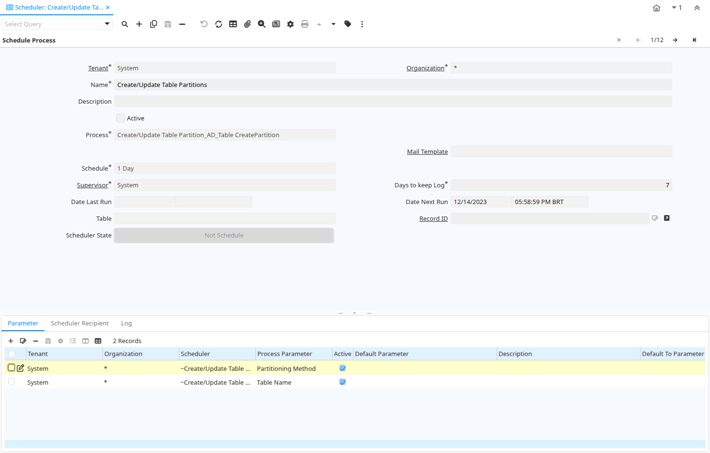

# Scheduler

Window ID 305

*19/02/2004 → 02/01/2000*

**Description:** Maintain Schedule Processes and Logs

**Comment/Help:** Schedule processes to be executed asynchronously

## Tab: Schedule Process

*Tab Level 0 · Created 19/02/2004 · Updated 02/01/2000*

**Description:** Schedule processes

**Comment/Help:** Schedule processes to be executed asynchronously

| **Name** | **Description** | **Comment/Help** | **Technical Data** |
|---|---|---|---|
| Tenant | Tenant for this installation. | A Tenant is a company or a legal entity. You cannot share data between Tenants. | AD_Scheduler.AD_Client_ID<small> numeric(10)   Table Direct</small> |
| Organization | Organizational entity within tenant | An organization is a unit of your tenant or legal entity - examples are store, department. You can share data between organizations. | AD_Scheduler.AD_Org_ID<small> numeric(10)   Table Direct</small> |
| Name | Alphanumeric identifier of the entity | The name of an entity (record) is used as an default search option in addition to the search key. The name is up to 60 characters in length. | AD_Scheduler.Name<small> character varying(60)   String</small> |
| Description | Optional short description of the record | A description is limited to 255 characters. | AD_Scheduler.Description<small> character varying(255)   String</small> |
| Active | The record is active in the system | There are two methods of making records unavailable in the system: One is to delete the record, the other is to de-activate the record. A de-activated record is not available for selection, but available for reports. There are two reasons for de-activating and not deleting records: (1) The system requires the record for audit purposes. (2) The record is referenced by other records. E.g., you cannot delete a Business Partner, if there are invoices for this partner record existing. You de-activate the Business Partner and prevent that this record is used for future entries. | AD_Scheduler.IsActive<small> character(1)   Yes-No</small> |
| Process | Process or Report | The Process field identifies a unique Process or Report in the system. | AD_Scheduler.AD_Process_ID<small> numeric(10)   Table Direct</small> |
| Print Format | Data Print Format | The print format determines how data is rendered for print. | AD_Scheduler.AD_PrintFormat_ID<small> numeric(10)   Table Direct</small> |
| Report Output Type |  |  | AD_Scheduler.ReportOutputType<small> character varying(4)   List</small> |
| Mail Template | Text templates for mailings | The Mail Template indicates the mail template for return messages. Mail text can include variables.  The priority of parsing is User/Contact, Business Partner and then the underlying business object (like Request, Dunning, Workflow object).&lt;br&gt; So, @Name@ would resolve into the User name (if user is defined defined), then Business Partner name (if business partner is defined) and then the Name of the business object if it has a Name.&lt;br&gt; For Multi-Lingual systems, the template is translated based on the Business Partner's language selection. | AD_Scheduler.R_MailText_ID<small> numeric(10)   Table Direct</small> |
| Schedule |  |  | AD_Scheduler.AD_Schedule_ID<small> numeric(10)   Table Direct</small> |
| Supervisor | Supervisor for this user/organization - used for escalation and approval | The Supervisor indicates who will be used for forwarding and escalating issues for this user - or for approvals. | AD_Scheduler.Supervisor_ID<small> numeric(10)   Table</small> |
| Days to keep Log | Number of days to keep the log entries | Older Log entries may be deleted | AD_Scheduler.KeepLogDays<small> numeric(10)   Integer</small> |
| Date Last Run | Date the process was last run. | The Date Last Run indicates the last time that a process was run. | AD_Scheduler.DateLastRun<small> timestamp with time zone   Timestamp With Time Zone</small> |
| Date Next Run | Date the process will run next | The Date Next Run indicates the next time this process will run. | AD_Scheduler.DateNextRun<small> timestamp with time zone   Timestamp With Time Zone</small> |
| Table | Database Table information | The Database Table provides the information of the table definition | AD_Scheduler.AD_Table_ID<small> numeric(10)   Table Direct</small> |
| Record ID | Direct internal record ID | The Record ID is the internal unique identifier of a record. Please note that zooming to the record may not be successful for Orders, Invoices and Shipment/Receipts as sometimes the Sales Order type is not known. | AD_Scheduler.Record_ID<small> numeric(10)   Record ID</small> |
| Scheduler State | State of this scheduler record (not scheduled, started or stopped) |  | AD_Scheduler.SchedulerState<small>    Scheduler State</small> |

## Tab: › Parameter

*Tab Level 1 · Created 19/02/2004 · Updated 02/01/2000*

**Description:** Scheduler Parameter

**Comment/Help:** Provide parameter for scheduled process

| **Name** | **Description** | **Comment/Help** | **Technical Data** |
|---|---|---|---|
| Tenant | Tenant for this installation. | A Tenant is a company or a legal entity. You cannot share data between Tenants. | AD_Scheduler_Para.AD_Client_ID<small> numeric(10)   Table Direct</small> |
| Organization | Organizational entity within tenant | An organization is a unit of your tenant or legal entity - examples are store, department. You can share data between organizations. | AD_Scheduler_Para.AD_Org_ID<small> numeric(10)   Table Direct</small> |
| Scheduler | Schedule Processes | Schedule processes to be executed asynchronously | AD_Scheduler_Para.AD_Scheduler_ID<small> numeric(10)   Table Direct</small> |
| Process Parameter |  |  | AD_Scheduler_Para.AD_Process_Para_ID<small> numeric(10)   Table Direct</small> |
| Active | The record is active in the system | There are two methods of making records unavailable in the system: One is to delete the record, the other is to de-activate the record. A de-activated record is not available for selection, but available for reports. There are two reasons for de-activating and not deleting records: (1) The system requires the record for audit purposes. (2) The record is referenced by other records. E.g., you cannot delete a Business Partner, if there are invoices for this partner record existing. You de-activate the Business Partner and prevent that this record is used for future entries. | AD_Scheduler_Para.IsActive<small> character(1)   Yes-No</small> |
| Default Parameter | Default value of the parameter | The default value can be a variable like @#Date@  | AD_Scheduler_Para.ParameterDefault<small> character varying(255)   String</small> |
| Default To Parameter | Default value of the to parameter | The default value can be a variable like @#Date@  | AD_Scheduler_Para.ParameterToDefault<small> character varying(255)   String</small> |
| Description | Optional short description of the record | A description is limited to 255 characters. | AD_Scheduler_Para.Description<small> character varying(255)   String</small> |

## Tab: › Scheduler Recipient

*Tab Level 1 · Created 12/03/2004 · Updated 02/01/2000*

**Description:** Recipient of the Scheduler Notification

**Comment/Help:** You can send the notifications to users or roles

| **Name** | **Description** | **Comment/Help** | **Technical Data** |
|---|---|---|---|
| Tenant | Tenant for this installation. | A Tenant is a company or a legal entity. You cannot share data between Tenants. | AD_SchedulerRecipient.AD_Client_ID<small> numeric(10)   Table Direct</small> |
| Organization | Organizational entity within tenant | An organization is a unit of your tenant or legal entity - examples are store, department. You can share data between organizations. | AD_SchedulerRecipient.AD_Org_ID<small> numeric(10)   Table Direct</small> |
| Scheduler | Schedule Processes | Schedule processes to be executed asynchronously | AD_SchedulerRecipient.AD_Scheduler_ID<small> numeric(10)   Table Direct</small> |
| Active | The record is active in the system | There are two methods of making records unavailable in the system: One is to delete the record, the other is to de-activate the record. A de-activated record is not available for selection, but available for reports. There are two reasons for de-activating and not deleting records: (1) The system requires the record for audit purposes. (2) The record is referenced by other records. E.g., you cannot delete a Business Partner, if there are invoices for this partner record existing. You de-activate the Business Partner and prevent that this record is used for future entries. | AD_SchedulerRecipient.IsActive<small> character(1)   Yes-No</small> |
| User/Contact | User within the system - Internal or Business Partner Contact | The User identifies a unique user in the system. This could be an internal user or a business partner contact | AD_SchedulerRecipient.AD_User_ID<small> numeric(10)   Search</small> |
| Role | Responsibility Role | The Role determines security and access a user who has this Role will have in the System. | AD_SchedulerRecipient.AD_Role_ID<small> numeric(10)   Table Direct</small> |
| Upload |  |  | AD_SchedulerRecipient.IsUpload<small> character(1)   Yes-No</small> |
| Authorization Account |  |  | AD_SchedulerRecipient.AD_AuthorizationAccount_ID<small> numeric(10)   Table Direct</small> |
| File Name | Name of the local file or URL | Name of a file in the local directory space - or URL (file://.., http://.., ftp://..) | AD_SchedulerRecipient.FileName<small> character varying(255)   String</small> |

## Tab: › Log

*Tab Level 1 · Created 19/02/2004 · Updated 02/01/2000*

**Description:** Scheduler Log

**Comment/Help:** Result of the execution of the Scheduler

| **Name** | **Description** | **Comment/Help** | **Technical Data** |
|---|---|---|---|
| Tenant | Tenant for this installation. | A Tenant is a company or a legal entity. You cannot share data between Tenants. | AD_SchedulerLog.AD_Client_ID<small> numeric(10)   Table Direct</small> |
| Organization | Organizational entity within tenant | An organization is a unit of your tenant or legal entity - examples are store, department. You can share data between organizations. | AD_SchedulerLog.AD_Org_ID<small> numeric(10)   Table Direct</small> |
| Scheduler | Schedule Processes | Schedule processes to be executed asynchronously | AD_SchedulerLog.AD_Scheduler_ID<small> numeric(10)   Table Direct</small> |
| Created | Date this record was created | The Created field indicates the date that this record was created. | AD_SchedulerLog.Created<small> timestamp without time zone   Date+Time</small> |
| Summary | Textual summary of this request | The Summary allows free form text entry of a recap of this request. | AD_SchedulerLog.Summary<small> character varying(2000)   Text</small> |
| Error | An Error occurred in the execution |  | AD_SchedulerLog.IsError<small> character(1)   Yes-No</small> |
| Reference | Reference for this record | The Reference displays the source document number. | AD_SchedulerLog.Reference<small> character varying(60)   String</small> |
| Text Message | Text Message |  | AD_SchedulerLog.TextMsg<small> character varying(2000)   Text</small> |
| Description | Optional short description of the record | A description is limited to 255 characters. | AD_SchedulerLog.Description<small> character varying(255)   String</small> |

