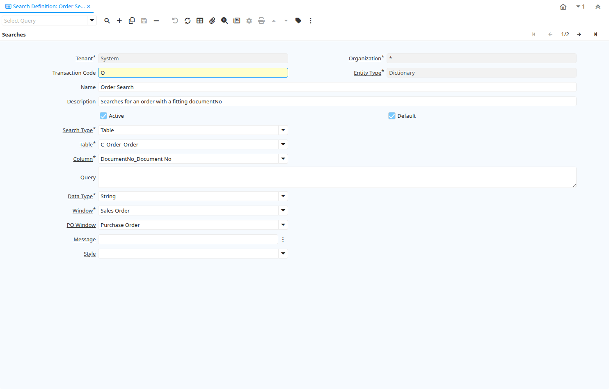

# Search Definition

Window ID 53069

*18/02/2009 → 18/02/2009*

**Description:** Define transactioncodes for the QuickSearch bar

## Tab: Searches

*Tab Level 0 · Created 18/02/2009 · Updated 18/02/2009*

| **Name** | **Description** | **Comment/Help** | **Technical Data** |
|---|---|---|---|
| Tenant | Tenant for this installation. | A Tenant is a company or a legal entity. You cannot share data between Tenants. | AD_SearchDefinition.AD_Client_ID<small> numeric(10)   Table Direct</small> |
| Organization | Organizational entity within tenant | An organization is a unit of your tenant or legal entity - examples are store, department. You can share data between organizations. | AD_SearchDefinition.AD_Org_ID<small> numeric(10)   Table Direct</small> |
| Transaction Code | The transaction code represents the search definition |  | AD_SearchDefinition.TransactionCode<small> character varying(8)   String</small> |
| Entity Type | Dictionary Entity Type; Determines ownership and synchronization | The Entity Types "Dictionary", "iDempiere" and "Application" might be automatically synchronized and customizations deleted or overwritten.    For customizations, copy the entity and select "User"! | AD_SearchDefinition.EntityType<small> character varying(40)   Table</small> |
| Name | Alphanumeric identifier of the entity | The name of an entity (record) is used as an default search option in addition to the search key. The name is up to 60 characters in length. | AD_SearchDefinition.Name<small> character varying(60)   String</small> |
| Description | Optional short description of the record | A description is limited to 255 characters. | AD_SearchDefinition.Description<small> character varying(255)   String</small> |
| Active | The record is active in the system | There are two methods of making records unavailable in the system: One is to delete the record, the other is to de-activate the record. A de-activated record is not available for selection, but available for reports. There are two reasons for de-activating and not deleting records: (1) The system requires the record for audit purposes. (2) The record is referenced by other records. E.g., you cannot delete a Business Partner, if there are invoices for this partner record existing. You de-activate the Business Partner and prevent that this record is used for future entries. | AD_SearchDefinition.IsActive<small> character(1)   Yes-No</small> |
| Default | Default value | The Default Checkbox indicates if this record will be used as a default value. | AD_SearchDefinition.IsDefault<small> character(1)   Yes-No</small> |
| Search Type | Which kind of search is used (Query or Table) |  | AD_SearchDefinition.SearchType<small> character varying(255)   List</small> |
| Table | Database Table information | The Database Table provides the information of the table definition | AD_SearchDefinition.AD_Table_ID<small> numeric(10)   Table</small> |
| Column | Column in the table | Link to the database column of the table | AD_SearchDefinition.AD_Column_ID<small> numeric(10)   Table</small> |
| Query | SQL query or where clause | SELECT SQL query for Query search type, where clause (without the WHERE keyword) for other search type | AD_SearchDefinition.Query<small> character varying(2000)   Text</small> |
| Data Type | Type of data |  | AD_SearchDefinition.DataType<small> character varying(1)   String</small> |
| Window | Data entry or display window | The Window field identifies a unique Window in the system. | AD_SearchDefinition.AD_Window_ID<small> numeric(10)   Table</small> |
| PO Window | Purchase Order Window | Window for Purchase Order (AP) Zooms | AD_SearchDefinition.PO_Window_ID<small> numeric(10)   Table</small> |
| Message | System Message | Information and Error messages | AD_SearchDefinition.AD_Message_ID<small> numeric(10)   Search</small> |
| Style | CSS style for field and label |  | AD_SearchDefinition.AD_Style_ID<small> numeric(10)   Table Direct</small> |

