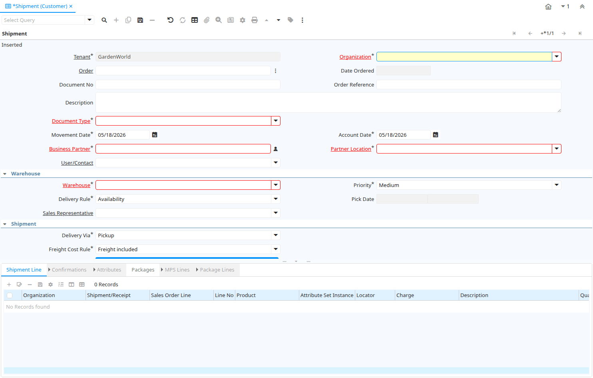

# Shipment (Customer)

Window ID 169

*19/12/1999 → 02/01/2000*

**Description:** Customer Inventory Shipments Customer Returns

**Comment/Help:** The Shipment Window defines shipments made or to be made to a customer.  They are generated from an Customer Order.  The Shipment Document will generate the Customer Invoice.

## Tab: Shipment

*Tab Level 0 · Created 19/12/1999 · Updated 30/09/2009*

**Description:** Shipments and Customer Returns

**Comment/Help:** The Shipments Tab allows you to generate, maintain, enter and process Shipments to a Customer or Returns from a Customer. 

| **Name** | **Description** | **Comment/Help** | **Technical Data** |
|---|---|---|---|
| Tenant | Tenant for this installation. | A Tenant is a company or a legal entity. You cannot share data between Tenants. | M_InOut.AD_Client_ID<small> numeric(10)   Table Direct</small> |
| Organization | Organizational entity within tenant | An organization is a unit of your tenant or legal entity - examples are store, department. You can share data between organizations. | M_InOut.AD_Org_ID<small> numeric(10)   Table Direct</small> |
| Order | Order | The Order is a control document.  The  Order is complete when the quantity ordered is the same as the quantity shipped and invoiced.  When you close an order, unshipped (backordered) quantities are cancelled. | M_InOut.C_Order_ID<small> numeric(10)   Search</small> |
| Date Ordered | Date of Order | Indicates the Date an item was ordered. | M_InOut.DateOrdered<small> timestamp without time zone   Date</small> |
| RMA | Return Material Authorization | A Return Material Authorization may be required to accept returns and to create Credit Memos | M_InOut.M_RMA_ID<small> numeric(10)   Search</small> |
| Document No | Document sequence number of the document | The document number is usually automatically generated by the system and determined by the document type of the document. If the document is not saved, the preliminary number is displayed in "&lt;&gt;".  If the document type of your document has no automatic document sequence defined, the field is empty if you create a new document. This is for documents which usually have an external number (like vendor invoice).  If you leave the field empty, the system will generate a document number for you. The document sequence used for this fallback number is defined in the "Maintain Sequence" window with the name "DocumentNo_&lt;TableName&gt;", where TableName is the actual name of the table (e.g. C_Order). | M_InOut.DocumentNo<small> character varying(30)   String</small> |
| Order Reference | Transaction Reference Number (Sales Order, Purchase Order) of your Business Partner | The business partner order reference is the order reference for this specific transaction; Often Purchase Order numbers are given to print on Invoices for easier reference.  A standard number can be defined in the Business Partner (Customer) window. | M_InOut.POReference<small> character varying(20)   String</small> |
| Description | Optional short description of the record | A description is limited to 255 characters. | M_InOut.Description<small> character varying(255)   Text</small> |
| Document Type | Document type or rules | The Document Type determines document sequence and processing rules | M_InOut.C_DocType_ID<small> numeric(10)   Table</small> |
| Movement Date | Date a product was moved in or out of inventory | The Movement Date indicates the date that a product moved in or out of inventory.  This is the result of a shipment, receipt or inventory movement. | M_InOut.MovementDate<small> timestamp without time zone   Date</small> |
| Account Date | Accounting Date | The Accounting Date indicates the date to be used on the General Ledger account entries generated from this document. It is also used for any currency conversion. | M_InOut.DateAcct<small> timestamp without time zone   Date</small> |
| Business Partner | Identifies a Business Partner | A Business Partner is anyone with whom you transact.  This can include Vendor, Customer, Employee or Salesperson | M_InOut.C_BPartner_ID<small> numeric(10)   Search</small> |
| Partner Location | Identifies the (ship to) address for this Business Partner | The Partner address indicates the location of a Business Partner | M_InOut.C_BPartner_Location_ID<small> numeric(10)   Table Direct</small> |
| User/Contact | User within the system - Internal or Business Partner Contact | The User identifies a unique user in the system. This could be an internal user or a business partner contact | M_InOut.AD_User_ID<small> numeric(10)   Table Direct</small> |
| Warehouse | Storage Warehouse and Service Point | The Warehouse identifies a unique Warehouse where products are stored or Services are provided. | M_InOut.M_Warehouse_ID<small> numeric(10)   Table Direct</small> |
| Priority | Priority of a document | The Priority indicates the importance (high, medium, low) of this document | M_InOut.PriorityRule<small> character(1)   List</small> |
| Delivery Rule | Defines the timing of Delivery | The Delivery Rule indicates when an order should be delivered. For example should the order be delivered when the entire order is complete, when a line is complete or as the products become available. | M_InOut.DeliveryRule<small> character(1)   List</small> |
| Pick Date | Date/Time when picked for Shipment |  | M_InOut.PickDate<small> timestamp without time zone   Date+Time</small> |
| Sales Representative | Sales Representative or Company Agent | The Sales Representative indicates the Sales Rep for this Region.  Any Sales Rep must be a valid internal user. | M_InOut.SalesRep_ID<small> numeric(10)   Table</small> |
| Delivery Via | How the order will be delivered | The Delivery Via indicates how the products should be delivered. For example, will the order be picked up or shipped. | M_InOut.DeliveryViaRule<small> character(1)   List</small> |
| Shipper | Method or manner of product delivery | The Shipper indicates the method of delivering product | M_InOut.M_Shipper_ID<small> numeric(10)   Table</small> |
| Create Package | Create Package for Shipment |  | M_InOut.CreatePackage<small> character(1)   Button</small> |
| Ship Date | Shipment Date/Time | Actual Date/Time of Shipment (pick up) | M_InOut.ShipDate<small> timestamp without time zone   Date+Time</small> |
| No Packages | Number of packages shipped |  | M_InOut.NoPackages<small> numeric(10)   Integer</small> |
| Tracking No | Number to track the shipment |  | M_InOut.TrackingNo<small> character varying(60)   String</small> |
| Freight Cost Rule | Method for charging Freight | The Freight Cost Rule indicates the method used when charging for freight. | M_InOut.FreightCostRule<small> character(1)   List</small> |
| Freight Amount | Freight Amount  | The Freight Amount indicates the amount charged for Freight in the document currency. | M_InOut.FreightAmt<small> numeric   Amount</small> |
| Freight Charges |  |  | M_InOut.FreightCharges<small> character varying(10)   List</small> |
| Freight Terms |  |  | M_InOut.FOB<small> character varying(10)   List</small> |
| Insurance |  |  | M_InOut.Insurance<small> character(1)   List</small> |
| Shipper Account Number |  |  | M_InOut.ShipperAccount<small> character varying(40)   String</small> |
| Create lines from | Process which will generate a new document lines based on an existing document | The Create From process will create a new document based on information in an existing document selected by the user. | M_InOut.CreateLinesFrom<small> character(1)   Button</small> |
| Drop Shipment | Drop Shipments are sent directly to the Drop Shipment Location | Drop Shipments are sent directly to the Drop Shipment Location using the Drop Ship Business Partner name and contact. | M_InOut.IsDropShip<small> character(1)   Yes-No</small> |
| Drop Ship Business Partner | Business Partner to ship to | If empty the business partner will be shipped to. | M_InOut.DropShip_BPartner_ID<small> numeric(10)   Search</small> |
| Drop Shipment Location | Business Partner Location for shipping to |  | M_InOut.DropShip_Location_ID<small> numeric(10)   Table</small> |
| Drop Shipment Contact | Business Partner Contact for drop shipment |  | M_InOut.DropShip_User_ID<small> numeric(10)   Table</small> |
| Alternate Return Address |  |  | M_InOut.IsAlternateReturnAddress<small> character(1)   Yes-No</small> |
| Return Partner |  |  | M_InOut.ReturnBPartner_ID<small> numeric(10)   Search</small> |
| Return Location |  |  | M_InOut.ReturnLocation_ID<small> numeric(10)   Table</small> |
| Return User/Contact |  |  | M_InOut.ReturnUser_ID<small> numeric(10)   Table</small> |
| Generate Invoice from Receipt | Create and process Invoice from this receipt.  The receipt should be correct and completed. | Generate Invoice from Receipt will create an invoice based on the selected receipt and match the invoice to that receipt. You can set the document number only if the invoice document type allows to set the document number manually. | M_InOut.GenerateTo<small> character(1)   Button</small> |
| Charge | Additional document charges | The Charge indicates a type of Charge (Handling, Shipping, Restocking) | M_InOut.C_Charge_ID<small> numeric(10)   Table</small> |
| Charge amount | Charge Amount | The Charge Amount indicates the amount for an additional charge. | M_InOut.ChargeAmt<small> numeric   Amount</small> |
| Project | Financial Project | A Project allows you to track and control internal or external activities. | M_InOut.C_Project_ID<small> numeric(10)   Table Direct</small> |
| Activity | Business Activity | Activities indicate tasks that are performed and used to utilize Activity based Costing | M_InOut.C_Activity_ID<small> numeric(10)   Table Direct</small> |
| Campaign | Marketing Campaign | The Campaign defines a unique marketing program.  Projects can be associated with a pre defined Marketing Campaign.  You can then report based on a specific Campaign. | M_InOut.C_Campaign_ID<small> numeric(10)   Table Direct</small> |
| Trx Organization | Performing or initiating organization | The organization which performs or initiates this transaction (for another organization).  The owning Organization may not be the transaction organization in a service bureau environment, with centralized services, and inter-organization transactions. | M_InOut.AD_OrgTrx_ID<small> numeric(10)   Table</small> |
| User Element List 1 | User defined list element #1 | The user defined element displays the optional elements that have been defined for this account combination. | M_InOut.User1_ID<small> numeric(10)   Search</small> |
| User Element List 2 | User defined list element #2 | The user defined element displays the optional elements that have been defined for this account combination. | M_InOut.User2_ID<small> numeric(10)   Search</small> |
| Movement Type | Method of moving the inventory | The Movement Type indicates the type of movement (in, out, to production, etc) | M_InOut.MovementType<small> character(2)   List</small> |
| Create Confirmation | Create Confirmations for the Document | The confirmations generated need to be processed (confirmed) before you can process this document | M_InOut.CreateConfirm<small> character(1)   Button</small> |
| In Transit | Movement is in transit | Material Movement is in transit - shipped, but not received. The transaction is completed, if confirmed. | M_InOut.IsInTransit<small> character(1)   Yes-No</small> |
| Date Received | Date a product was received | The Date Received indicates the date that product was received. | M_InOut.DateReceived<small> timestamp without time zone   Date</small> |
| Document Status | The current status of the document | The Document Status indicates the status of a document at this time.  If you want to change the document status, use the Document Action field | M_InOut.DocStatus<small> character(2)   List</small> |
| Process Shipment  | Process Shipment/Receipt (Update Inventory) | Process Shipment/Receipt will move products out of/into  inventory and mark line items as shipped/received. | M_InOut.DocAction<small> character(2)   Button</small> |
| In Dispute | Document is in dispute | The document is in dispute. Use Requests to track details. | M_InOut.IsInDispute<small> character(1)   Yes-No</small> |
| Posted | Posting status | The Posted field indicates the status of the Generation of General Ledger Accounting Lines  | M_InOut.Posted<small> character(1)   Button</small> |
| Cost Center |  |  | M_InOut.C_CostCenter_ID<small> numeric(10)   Table Direct</small> |
| Department |  |  | M_InOut.C_Department_ID<small> numeric(10)   Table Direct</small> |

## Tab: › Shipment Line

*Tab Level 1 · Created 19/12/1999 · Updated 02/09/2005*

**Description:** Shipment Line

**Comment/Help:** The Shipment Line Tab defines the individual items in a Shipment.

| **Name** | **Description** | **Comment/Help** | **Technical Data** |
|---|---|---|---|
| Tenant | Tenant for this installation. | A Tenant is a company or a legal entity. You cannot share data between Tenants. | M_InOutLine.AD_Client_ID<small> numeric(10)   Table Direct</small> |
| Organization | Organizational entity within tenant | An organization is a unit of your tenant or legal entity - examples are store, department. You can share data between organizations. | M_InOutLine.AD_Org_ID<small> numeric(10)   Table Direct</small> |
| Shipment/Receipt | Material Shipment Document | The Material Shipment / Receipt  | M_InOutLine.M_InOut_ID<small> numeric(10)   Search</small> |
| Sales Order Line | Sales Order Line | The Sales Order Line is a unique identifier for a line in an order. | M_InOutLine.C_OrderLine_ID<small> numeric(10)   Table Direct</small> |
| Line No | Unique line for this document | Indicates the unique line for a document.  It will also control the display order of the lines within a document. | M_InOutLine.Line<small> numeric(10)   Integer</small> |
| Product | Product, Service, Item | Identifies an item which is either purchased or sold in this organization. | M_InOutLine.M_Product_ID<small> numeric(10)   Search</small> |
| Attribute Set Instance | Product Attribute Set Instance | The values of the actual Product Attribute Instances.  The product level attributes are defined on Product level. | M_InOutLine.M_AttributeSetInstance_ID<small> numeric(10)   Product Attribute</small> |
| Locator | Warehouse Locator | The Locator indicates where in a Warehouse a product is located. | M_InOutLine.M_Locator_ID<small> numeric(10)   Locator (WH)</small> |
| Charge | Additional document charges | The Charge indicates a type of Charge (Handling, Shipping, Restocking) | M_InOutLine.C_Charge_ID<small> numeric(10)   Table Direct</small> |
| Description | Optional short description of the record | A description is limited to 255 characters. | M_InOutLine.Description<small> character varying(255)   Text</small> |
| Quantity | The Quantity Entered is based on the selected UoM | The Quantity Entered is converted to base product UoM quantity | M_InOutLine.QtyEntered<small> numeric   Quantity</small> |
| UOM | Unit of Measure | The UOM defines a unique non monetary Unit of Measure | M_InOutLine.C_UOM_ID<small> numeric(10)   Table Direct</small> |
| Movement Quantity | Quantity of a product moved. | The Movement Quantity indicates the quantity of a product that has been moved. | M_InOutLine.MovementQty<small> numeric   Quantity</small> |
| Picked Quantity |  |  | M_InOutLine.PickedQty<small> numeric   Quantity</small> |
| Target Quantity | Target Movement Quantity | The Quantity which should have been received | M_InOutLine.TargetQty<small> numeric   Quantity</small> |
| Confirmed Quantity | Confirmation of a received quantity | Confirmation of a received quantity | M_InOutLine.ConfirmedQty<small> numeric   Quantity</small> |
| Scrapped Quantity | The Quantity scrapped due to QA issues |  | M_InOutLine.ScrappedQty<small> numeric   Quantity</small> |
| Project | Financial Project | A Project allows you to track and control internal or external activities. | M_InOutLine.C_Project_ID<small> numeric(10)   Table Direct</small> |
| Activity | Business Activity | Activities indicate tasks that are performed and used to utilize Activity based Costing | M_InOutLine.C_Activity_ID<small> numeric(10)   Table Direct</small> |
| Project Phase | Phase of a Project |  | M_InOutLine.C_ProjectPhase_ID<small> numeric(10)   Table Direct</small> |
| Project Task | Actual Project Task in a Phase | A Project Task in a Project Phase represents the actual work. | M_InOutLine.C_ProjectTask_ID<small> numeric(10)   Table Direct</small> |
| Campaign | Marketing Campaign | The Campaign defines a unique marketing program.  Projects can be associated with a pre defined Marketing Campaign.  You can then report based on a specific Campaign. | M_InOutLine.C_Campaign_ID<small> numeric(10)   Table Direct</small> |
| Trx Organization | Performing or initiating organization | The organization which performs or initiates this transaction (for another organization).  The owning Organization may not be the transaction organization in a service bureau environment, with centralized services, and inter-organization transactions. | M_InOutLine.AD_OrgTrx_ID<small> numeric(10)   Table</small> |
| User Element List 1 | User defined list element #1 | The user defined element displays the optional elements that have been defined for this account combination. | M_InOutLine.User1_ID<small> numeric(10)   Search</small> |
| User Element List 2 | User defined list element #2 | The user defined element displays the optional elements that have been defined for this account combination. | M_InOutLine.User2_ID<small> numeric(10)   Search</small> |
| Auto Produce | Auto create production to fulfill shipment |  | M_InOutLine.IsAutoProduce<small> character(1)   Yes-No</small> |
| Cost Center |  |  | M_InOutLine.C_CostCenter_ID<small> numeric(10)   Table Direct</small> |
| Department |  |  | M_InOutLine.C_Department_ID<small> numeric(10)   Table Direct</small> |

## Tab: › › Confirmations

*Tab Level 2 · Created 03/02/2005 · Updated 22/05/2005*

**Description:** Optional Confirmations of Shipment Lines

**Comment/Help:** The quantities are in the storage Unit of Measure!

| **Name** | **Description** | **Comment/Help** | **Technical Data** |
|---|---|---|---|
| Tenant | Tenant for this installation. | A Tenant is a company or a legal entity. You cannot share data between Tenants. | M_InOutLineConfirm.AD_Client_ID<small> numeric(10)   Table Direct</small> |
| Organization | Organizational entity within tenant | An organization is a unit of your tenant or legal entity - examples are store, department. You can share data between organizations. | M_InOutLineConfirm.AD_Org_ID<small> numeric(10)   Table Direct</small> |
| Shipment/Receipt Line | Line on Shipment or Receipt document | The Shipment/Receipt Line indicates a unique line in a Shipment/Receipt document | M_InOutLineConfirm.M_InOutLine_ID<small> numeric(10)   Search</small> |
| Ship/Receipt Confirmation | Material Shipment or Receipt Confirmation | Confirmation of Shipment or Receipt - Created from the Shipment/Receipt | M_InOutLineConfirm.M_InOutConfirm_ID<small> numeric(10)   Search</small> |
| Ship/Receipt Confirmation Line | Material Shipment or Receipt Confirmation Line | Confirmation details | M_InOutLineConfirm.M_InOutLineConfirm_ID<small> numeric(10)   ID</small> |
| Confirmation No | Confirmation Number |  | M_InOutLineConfirm.ConfirmationNo<small> character varying(20)   String</small> |
| Target Quantity | Target Movement Quantity | The Quantity which should have been received | M_InOutLineConfirm.TargetQty<small> numeric   Quantity</small> |
| Confirmed Quantity | Confirmation of a received quantity | Confirmation of a received quantity | M_InOutLineConfirm.ConfirmedQty<small> numeric   Quantity</small> |
| Difference | Difference Quantity |  | M_InOutLineConfirm.DifferenceQty<small> numeric   Quantity</small> |
| Scrapped Quantity | The Quantity scrapped due to QA issues |  | M_InOutLineConfirm.ScrappedQty<small> numeric   Quantity</small> |
| Description | Optional short description of the record | A description is limited to 255 characters. | M_InOutLineConfirm.Description<small> character varying(255)   String</small> |

## Tab: › › Attributes

*Tab Level 2 · Created 27/08/2005 · Updated 16/03/2021*

**Description:** Product Instance Attribute Material Allocation

| **Name** | **Description** | **Comment/Help** | **Technical Data** |
|---|---|---|---|
| Tenant | Tenant for this installation. | A Tenant is a company or a legal entity. You cannot share data between Tenants. | M_InOutLineMA.AD_Client_ID<small> numeric(10)   Table Direct</small> |
| Organization | Organizational entity within tenant | An organization is a unit of your tenant or legal entity - examples are store, department. You can share data between organizations. | M_InOutLineMA.AD_Org_ID<small> numeric(10)   Table Direct</small> |
| Shipment/Receipt Line | Line on Shipment or Receipt document | The Shipment/Receipt Line indicates a unique line in a Shipment/Receipt document | M_InOutLineMA.M_InOutLine_ID<small> numeric(10)   Search</small> |
| Attribute Set Instance | Product Attribute Set Instance | The values of the actual Product Attribute Instances.  The product level attributes are defined on Product level. | M_InOutLineMA.M_AttributeSetInstance_ID<small> numeric(10)   Product Attribute</small> |
| Movement Quantity | Quantity of a product moved. | The Movement Quantity indicates the quantity of a product that has been moved. | M_InOutLineMA.MovementQty<small> numeric   Quantity</small> |
| Date  Material Policy | Time used for LIFO and FIFO Material Policy | This field is used to record time used for LIFO and FIFO material policy | M_InOutLineMA.DateMaterialPolicy<small> timestamp without time zone   Date</small> |
| Auto Generated |  | Record is Auto Generated by System. | M_InOutLineMA.IsAutoGenerated<small> character(1)   Yes-No</small> |

## Tab: › Packages

*Tab Level 1 · Created 06/12/2012 · Updated 06/12/2012*

| **Name** | **Description** | **Comment/Help** | **Technical Data** |
|---|---|---|---|
| Tenant | Tenant for this installation. | A Tenant is a company or a legal entity. You cannot share data between Tenants. | M_Package.AD_Client_ID<small> numeric(10)   Table Direct</small> |
| Organization | Organizational entity within tenant | An organization is a unit of your tenant or legal entity - examples are store, department. You can share data between organizations. | M_Package.AD_Org_ID<small> numeric(10)   Table Direct</small> |
| Document No | Document sequence number of the document | The document number is usually automatically generated by the system and determined by the document type of the document. If the document is not saved, the preliminary number is displayed in "&lt;&gt;".  If the document type of your document has no automatic document sequence defined, the field is empty if you create a new document. This is for documents which usually have an external number (like vendor invoice).  If you leave the field empty, the system will generate a document number for you. The document sequence used for this fallback number is defined in the "Maintain Sequence" window with the name "DocumentNo_&lt;TableName&gt;", where TableName is the actual name of the table (e.g. C_Order). | M_Package.DocumentNo<small> character varying(30)   String</small> |
| Shipment/Receipt | Material Shipment Document | The Material Shipment / Receipt  | M_Package.M_InOut_ID<small> numeric(10)   Search</small> |
| Active | The record is active in the system | There are two methods of making records unavailable in the system: One is to delete the record, the other is to de-activate the record. A de-activated record is not available for selection, but available for reports. There are two reasons for de-activating and not deleting records: (1) The system requires the record for audit purposes. (2) The record is referenced by other records. E.g., you cannot delete a Business Partner, if there are invoices for this partner record existing. You de-activate the Business Partner and prevent that this record is used for future entries. | M_Package.IsActive<small> character(1)   Yes-No</small> |
| Latest Pickup Time |  |  | M_Package.LatestPickupTime<small> timestamp without time zone   Time</small> |
| Date Received | Date a product was received | The Date Received indicates the date that product was received. | M_Package.DateReceived<small> timestamp without time zone   Date</small> |
| Info Received | Information of the receipt of the package (acknowledgement) |  | M_Package.ReceivedInfo<small> character varying(255)   String</small> |
| Estimated Weight |  |  | M_Package.EstimatedWeight<small>    Quantity</small> |
| Weight | Weight of a product | The Weight indicates the weight  of the product in the Weight UOM of the Tenant | M_Package.Weight<small> numeric   Quantity</small> |
| UOM for Weight | Standard Unit of Measure for Weight | The Standard UOM for Weight indicates the UOM to use for products referenced by weight in a document. | M_Package.C_UOM_Weight_ID<small> numeric(10)   Table</small> |
| Length |  |  | M_Package.Length<small> numeric   Quantity</small> |
| UOM for Length | Standard Unit of Measure for Length | The Standard UOM for Length indicates the UOM to use for products referenced by length in a document. | M_Package.C_UOM_Length_ID<small> numeric(10)   Table</small> |
| Width |  |  | M_Package.Width<small> numeric   Quantity</small> |
| Height |  |  | M_Package.Height<small> numeric   Quantity</small> |
| Shipper | Method or manner of product delivery | The Shipper indicates the method of delivering product | M_Package.M_Shipper_ID<small> numeric(10)   Table</small> |
| Shipping Processor |  |  | M_Package.M_ShippingProcessor_ID<small>    Table</small> |
| Ship Date (For FedEx only) | Shipment Date/Time | Actual Date/Time of Shipment (pick up) | M_Package.ShipDate<small> timestamp without time zone   Date</small> |
| Box Count |  |  | M_Package.BoxCount<small> numeric(10)   Integer</small> |
| Shipper Packaging |  |  | M_Package.M_ShipperPackaging_ID<small> numeric(10)   Table</small> |
| Shipper Labels |  |  | M_Package.M_ShipperLabels_ID<small> numeric(10)   Table</small> |
| Shipper Pickup Types |  |  | M_Package.M_ShipperPickupTypes_ID<small> numeric(10)   Table</small> |
| Insurance |  |  | M_Package.Insurance<small>    List</small> |
| Insured Amount |  |  | M_Package.InsuredAmount<small> numeric   Amount</small> |
| Freight Charges |  |  | M_Package.FreightCharges<small>    List</small> |
| Freight Terms |  |  | M_Package.FOB<small>    List</small> |
| Shipper Account Number |  |  | M_Package.ShipperAccount<small> character varying(40)   String</small> |
| Duties Shipper Account (For FedEx only) |  |  | M_Package.DutiesShipperAccount<small> character varying(40)   String</small> |
| Partner Location (For UPS only) | Identifies the (ship to) address for this Business Partner | The Partner address indicates the location of a Business Partner | M_Package.C_BPartner_Location_ID<small> numeric(10)   Table Direct</small> |
| Handling Charge |  |  | M_Package.HandlingCharge<small> numeric   Amount</small> |
| Added Handling (For UPS only) |  |  | M_Package.IsAddedHandling<small> character(1)   Yes-No</small> |
| COD |  |  | M_Package.CashOnDelivery<small> character(1)   Yes-No</small> |
| Payment Rule | How you pay the invoice | The Payment Rule indicates the method of invoice payment. | M_Package.PaymentRule<small> character(1)   List</small> |
| Delivery Confirmation | EMail Delivery confirmation |  | M_Package.DeliveryConfirmation<small> character(1)   Yes-No</small> |
| Delivery Confirmation Type (For FedEx only) |  |  | M_Package.DeliveryConfirmationType<small> character varying(30)   List</small> |
| Verbal Confirmation (For UPS only) |  |  | M_Package.IsVerbalConfirmation<small> character(1)   Yes-No</small> |
| Saturday Delivery |  |  | M_Package.IsSaturdayDelivery<small> character(1)   Yes-No</small> |
| Saturday Pickup |  |  | M_Package.IsSaturdayPickup<small> character(1)   Yes-No</small> |
| Future Day Shipment (For FedEx only) |  |  | M_Package.IsFutureDayShipment<small> character(1)   Yes-No</small> |
| Residential |  |  | M_Package.IsResidential<small> character(1)   Yes-No</small> |
| Home Delivery Premium Type (For FedEx only) |  |  | M_Package.HomeDeliveryPremiumType<small> character varying(30)   List</small> |
| Phone Number (For FedEx only) |  |  | M_Package.HomeDeliveryPremiumPhone<small> character varying(30)   String</small> |
| Date (For FedEx only) |  |  | M_Package.HomeDeliveryPremiumDate<small> timestamp without time zone   Date</small> |
| Hazardous Materials (For FedEx only) |  |  | M_Package.IsHazMat<small> character(1)   Yes-No</small> |
| Dot Hazard Class or Division (For FedEx only) |  |  | M_Package.DotHazardClassOrDivision<small> character varying(30)   List</small> |
| Cargo Aircraft Only (For FedEx only) |  |  | M_Package.IsCargoAircraftOnly<small> character(1)   Yes-No</small> |
| Accessible (For FedEx only) |  |  | M_Package.IsAccessible<small> character(1)   Yes-No</small> |
| Dry Ice (For FedEx only) |  |  | M_Package.IsDryIce<small> character(1)   Yes-No</small> |
| Dry Ice Weight (For FedEx only) |  |  | M_Package.DryIceWeight<small> numeric   Amount</small> |
| Hold At Location (For FedEx only) |  |  | M_Package.IsHoldAtLocation<small> character(1)   Yes-No</small> |
| Hold Address (For FedEx only) |  |  | M_Package.HoldAddress_ID<small> numeric(10)   Table</small> |
| Ignore Zip State Not Match |  |  | M_Package.IsIgnoreZipStateNotMatch<small> character(1)   Yes-No</small> |
| Ignore Zip Not Found |  |  | M_Package.IsIgnoreZipNotFound<small> character(1)   Yes-No</small> |
| Dutiable |  |  | M_Package.IsDutiable<small> character(1)   Yes-No</small> |
| Notification Type | Type of Notifications | Emails or Notification sent out for Request Updates, etc. | M_Package.NotificationType<small> character varying(2)   List</small> |
| Notification Message |  |  | M_Package.NotificationMessage<small> character varying(255)   String</small> |
| Online Shipping Rate Inquiry |  |  | M_Package.ShippingRateInquiry<small> character(1)   Button</small> |
| Void Shipment Online | Void shipment using web services provided by shipper |  | M_Package.VoidIt<small> character(1)   Button</small> |
| Process Shipment Online | Create shipment using web services provided by shipper |  | M_Package.OProcessing<small> character(1)   Button</small> |
| Print Shipping Label | Print shipping label | Print shipping label return from online shipping services. | M_Package.LabelPrint<small> character(1)   Button</small> |
| Price | Price | The Price indicates the Price for a product or service. | M_Package.Price<small> numeric   Costs+Prices</small> |
| Currency | The Currency for this record | Indicates the Currency to be used when processing or reporting on this record | M_Package.C_Currency_ID<small> numeric(10)   Table Direct</small> |
| Surcharges |  |  | M_Package.Surcharges<small> numeric   Costs+Prices</small> |
| Total Price |  |  | M_Package.TotalPrice<small>    Costs+Prices</small> |
| Tracking No | Number to track the shipment |  | M_Package.TrackingNo<small> character varying(255)   String</small> |
| Tracking Info |  |  | M_Package.TrackingInfo<small> character varying(255)   String</small> |
| Rate Inquiry Message |  |  | M_Package.RateInquiryMessage<small> character varying(2000)   Text</small> |
| Response Message |  |  | M_Package.ShippingRespMessage<small> character varying(2000)   Text</small> |
| Description | Optional short description of the record | A description is limited to 255 characters. | M_Package.Description<small> character varying(255)   String</small> |
| Processed | The document has been processed | The Processed checkbox indicates that a document has been processed. | M_Package.Processed<small> character(1)   Yes-No</small> |

## Tab: › › MPS Lines

*Tab Level 2 · Created 06/12/2012 · Updated 06/12/2012*

| **Name** | **Description** | **Comment/Help** | **Technical Data** |
|---|---|---|---|
| Tenant | Tenant for this installation. | A Tenant is a company or a legal entity. You cannot share data between Tenants. | M_PackageMPS.AD_Client_ID<small> numeric(10)   Table Direct</small> |
| Organization | Organizational entity within tenant | An organization is a unit of your tenant or legal entity - examples are store, department. You can share data between organizations. | M_PackageMPS.AD_Org_ID<small> numeric(10)   Table Direct</small> |
| Package | Shipment Package | A Shipment can have one or more Packages.  A Package may be individually tracked. | M_PackageMPS.M_Package_ID<small> numeric(10)   Search</small> |
| Sequence | Method of ordering records; lowest number comes first | The Sequence indicates the order of records | M_PackageMPS.SeqNo<small> numeric(10)   Integer</small> |
| Description | Optional short description of the record | A description is limited to 255 characters. | M_PackageMPS.Description<small> character varying(255)   String</small> |
| Master Tracking No |  |  | M_PackageMPS.MasterTrackingNo<small> character varying(255)   String</small> |
| Tracking No | Number to track the shipment |  | M_PackageMPS.TrackingNo<small> character varying(255)   String</small> |
| Estimated Weight |  |  | M_PackageMPS.EstimatedWeight<small>    Quantity</small> |
| Price | Price | The Price indicates the Price for a product or service. | M_PackageMPS.Price<small> numeric   Costs+Prices</small> |
| Weight | Weight of a product | The Weight indicates the weight  of the product in the Weight UOM of the Tenant | M_PackageMPS.Weight<small> numeric   Quantity</small> |
| UOM for Weight | Standard Unit of Measure for Weight | The Standard UOM for Weight indicates the UOM to use for products referenced by weight in a document. | M_PackageMPS.C_UOM_Weight_ID<small> numeric(10)   Table</small> |
| Length |  |  | M_PackageMPS.Length<small> numeric   Quantity</small> |
| UOM for Length | Standard Unit of Measure for Length | The Standard UOM for Length indicates the UOM to use for products referenced by length in a document. | M_PackageMPS.C_UOM_Length_ID<small> numeric(10)   Table</small> |
| Width |  |  | M_PackageMPS.Width<small> numeric   Quantity</small> |
| Height |  |  | M_PackageMPS.Height<small> numeric   Quantity</small> |
| Create lines from | Process which will generate a new document lines based on an existing document | The Create From process will create a new document based on information in an existing document selected by the user. | M_PackageMPS.CreateFrom<small> character(1)   Button</small> |
| Processed | The document has been processed | The Processed checkbox indicates that a document has been processed. | M_PackageMPS.Processed<small> character(1)   Yes-No</small> |

## Tab: › › › Package Lines

*Tab Level 3 · Created 06/12/2012 · Updated 06/12/2012*

| **Name** | **Description** | **Comment/Help** | **Technical Data** |
|---|---|---|---|
| Tenant | Tenant for this installation. | A Tenant is a company or a legal entity. You cannot share data between Tenants. | M_PackageLine.AD_Client_ID<small> numeric(10)   Table Direct</small> |
| Organization | Organizational entity within tenant | An organization is a unit of your tenant or legal entity - examples are store, department. You can share data between organizations. | M_PackageLine.AD_Org_ID<small> numeric(10)   Table Direct</small> |
| Package MPS |  |  | M_PackageLine.M_PackageMPS_ID<small> numeric(10)   Search</small> |
| Package | Shipment Package | A Shipment can have one or more Packages.  A Package may be individually tracked. | M_PackageLine.M_Package_ID<small> numeric(10)   Search</small> |
| Shipment/Receipt Line | Line on Shipment or Receipt document | The Shipment/Receipt Line indicates a unique line in a Shipment/Receipt document | M_PackageLine.M_InOutLine_ID<small> numeric(10)   Table Direct</small> |
| Quantity | Quantity | The Quantity indicates the number of a specific product or item for this document. | M_PackageLine.Qty<small> numeric   Quantity</small> |
| Product | Product, Service, Item | Identifies an item which is either purchased or sold in this organization. | M_PackageLine.M_Product_ID<small> numeric(10)   Search</small> |
| Description | Optional short description of the record | A description is limited to 255 characters. | M_PackageLine.Description<small> character varying(255)   String</small> |

