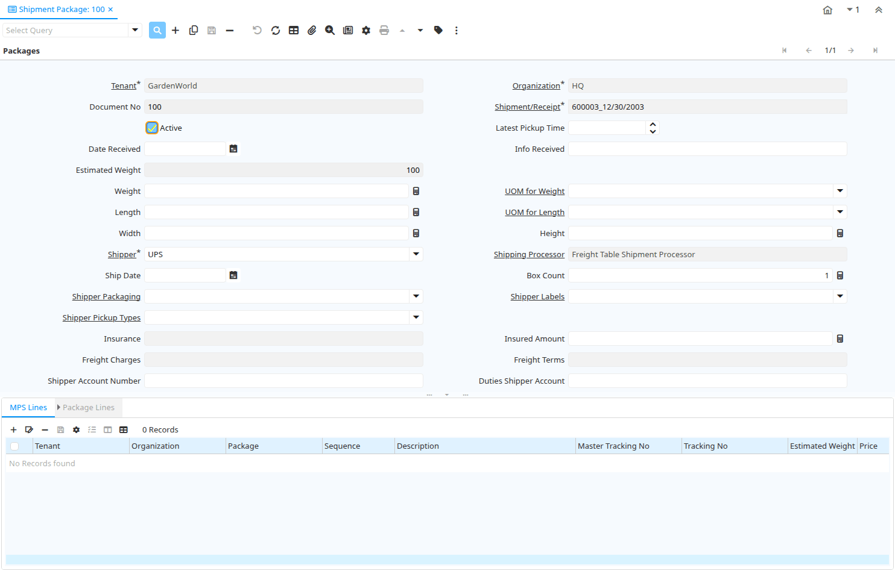

# Shipment Package

Window ID 200025

*06/12/2012 → 06/12/2012*

## Tab: Packages

*Tab Level 0 · Created 06/12/2012 · Updated 06/12/2012*

| **Name** | **Description** | **Comment/Help** | **Technical Data** |
|---|---|---|---|
| Tenant | Tenant for this installation. | A Tenant is a company or a legal entity. You cannot share data between Tenants. | M_Package.AD_Client_ID<small> numeric(10)   Table Direct</small> |
| Organization | Organizational entity within tenant | An organization is a unit of your tenant or legal entity - examples are store, department. You can share data between organizations. | M_Package.AD_Org_ID<small> numeric(10)   Table Direct</small> |
| Document No | Document sequence number of the document | The document number is usually automatically generated by the system and determined by the document type of the document. If the document is not saved, the preliminary number is displayed in "&lt;&gt;".  If the document type of your document has no automatic document sequence defined, the field is empty if you create a new document. This is for documents which usually have an external number (like vendor invoice).  If you leave the field empty, the system will generate a document number for you. The document sequence used for this fallback number is defined in the "Maintain Sequence" window with the name "DocumentNo_&lt;TableName&gt;", where TableName is the actual name of the table (e.g. C_Order). | M_Package.DocumentNo<small> character varying(30)   String</small> |
| Shipment/Receipt | Material Shipment Document | The Material Shipment / Receipt  | M_Package.M_InOut_ID<small> numeric(10)   Search</small> |
| Active | The record is active in the system | There are two methods of making records unavailable in the system: One is to delete the record, the other is to de-activate the record. A de-activated record is not available for selection, but available for reports. There are two reasons for de-activating and not deleting records: (1) The system requires the record for audit purposes. (2) The record is referenced by other records. E.g., you cannot delete a Business Partner, if there are invoices for this partner record existing. You de-activate the Business Partner and prevent that this record is used for future entries. | M_Package.IsActive<small> character(1)   Yes-No</small> |
| Latest Pickup Time |  |  | M_Package.LatestPickupTime<small> timestamp without time zone   Time</small> |
| Date Received | Date a product was received | The Date Received indicates the date that product was received. | M_Package.DateReceived<small> timestamp without time zone   Date</small> |
| Info Received | Information of the receipt of the package (acknowledgement) |  | M_Package.ReceivedInfo<small> character varying(255)   String</small> |
| Estimated Weight |  |  | M_Package.EstimatedWeight<small>    Quantity</small> |
| Weight | Weight of a product | The Weight indicates the weight  of the product in the Weight UOM of the Tenant | M_Package.Weight<small> numeric   Quantity</small> |
| UOM for Weight | Standard Unit of Measure for Weight | The Standard UOM for Weight indicates the UOM to use for products referenced by weight in a document. | M_Package.C_UOM_Weight_ID<small> numeric(10)   Table</small> |
| Length |  |  | M_Package.Length<small> numeric   Quantity</small> |
| UOM for Length | Standard Unit of Measure for Length | The Standard UOM for Length indicates the UOM to use for products referenced by length in a document. | M_Package.C_UOM_Length_ID<small> numeric(10)   Table</small> |
| Width |  |  | M_Package.Width<small> numeric   Quantity</small> |
| Height |  |  | M_Package.Height<small> numeric   Quantity</small> |
| Shipper | Method or manner of product delivery | The Shipper indicates the method of delivering product | M_Package.M_Shipper_ID<small> numeric(10)   Table</small> |
| Shipping Processor |  |  | M_Package.M_ShippingProcessor_ID<small>    Table</small> |
| Ship Date | Shipment Date/Time | Actual Date/Time of Shipment (pick up) | M_Package.ShipDate<small> timestamp without time zone   Date</small> |
| Box Count |  |  | M_Package.BoxCount<small> numeric(10)   Integer</small> |
| Shipper Packaging |  |  | M_Package.M_ShipperPackaging_ID<small> numeric(10)   Table</small> |
| Shipper Labels |  |  | M_Package.M_ShipperLabels_ID<small> numeric(10)   Table</small> |
| Shipper Pickup Types |  |  | M_Package.M_ShipperPickupTypes_ID<small> numeric(10)   Table</small> |
| Insurance |  |  | M_Package.Insurance<small>    List</small> |
| Insured Amount |  |  | M_Package.InsuredAmount<small> numeric   Amount</small> |
| Freight Charges |  |  | M_Package.FreightCharges<small>    List</small> |
| Freight Terms |  |  | M_Package.FOB<small>    List</small> |
| Shipper Account Number |  |  | M_Package.ShipperAccount<small> character varying(40)   String</small> |
| Duties Shipper Account |  |  | M_Package.DutiesShipperAccount<small> character varying(40)   String</small> |
| Partner Location | Identifies the (ship to) address for this Business Partner | The Partner address indicates the location of a Business Partner | M_Package.C_BPartner_Location_ID<small> numeric(10)   Table Direct</small> |
| Handling Charge |  |  | M_Package.HandlingCharge<small> numeric   Amount</small> |
| Added Handling |  |  | M_Package.IsAddedHandling<small> character(1)   Yes-No</small> |
| COD |  |  | M_Package.CashOnDelivery<small> character(1)   Yes-No</small> |
| Payment Rule | How you pay the invoice | The Payment Rule indicates the method of invoice payment. | M_Package.PaymentRule<small> character(1)   List</small> |
| Delivery Confirmation | EMail Delivery confirmation |  | M_Package.DeliveryConfirmation<small> character(1)   Yes-No</small> |
| Delivery Confirmation Type |  |  | M_Package.DeliveryConfirmationType<small> character varying(30)   List</small> |
| Verbal Confirmation |  |  | M_Package.IsVerbalConfirmation<small> character(1)   Yes-No</small> |
| Saturday Delivery |  |  | M_Package.IsSaturdayDelivery<small> character(1)   Yes-No</small> |
| Saturday Pickup |  |  | M_Package.IsSaturdayPickup<small> character(1)   Yes-No</small> |
| Future Day Shipment |  |  | M_Package.IsFutureDayShipment<small> character(1)   Yes-No</small> |
| Residential |  |  | M_Package.IsResidential<small> character(1)   Yes-No</small> |
| Home Delivery Premium Type |  |  | M_Package.HomeDeliveryPremiumType<small> character varying(30)   List</small> |
| Phone Number |  |  | M_Package.HomeDeliveryPremiumPhone<small> character varying(30)   String</small> |
| Date |  |  | M_Package.HomeDeliveryPremiumDate<small> timestamp without time zone   Date</small> |
| Hazardous Materials |  |  | M_Package.IsHazMat<small> character(1)   Yes-No</small> |
| Dot Hazard Class or Division |  |  | M_Package.DotHazardClassOrDivision<small> character varying(30)   List</small> |
| Cargo Aircraft Only |  |  | M_Package.IsCargoAircraftOnly<small> character(1)   Yes-No</small> |
| Accessible |  |  | M_Package.IsAccessible<small> character(1)   Yes-No</small> |
| Dry Ice |  |  | M_Package.IsDryIce<small> character(1)   Yes-No</small> |
| Dry Ice Weight |  |  | M_Package.DryIceWeight<small> numeric   Amount</small> |
| Hold At Location |  |  | M_Package.IsHoldAtLocation<small> character(1)   Yes-No</small> |
| Hold Address |  |  | M_Package.HoldAddress_ID<small> numeric(10)   Table</small> |
| Ignore Zip State Not Match |  |  | M_Package.IsIgnoreZipStateNotMatch<small> character(1)   Yes-No</small> |
| Ignore Zip Not Found |  |  | M_Package.IsIgnoreZipNotFound<small> character(1)   Yes-No</small> |
| Dutiable |  |  | M_Package.IsDutiable<small> character(1)   Yes-No</small> |
| Notification Type | Type of Notifications | Emails or Notification sent out for Request Updates, etc. | M_Package.NotificationType<small> character varying(2)   List</small> |
| Notification Message |  |  | M_Package.NotificationMessage<small> character varying(255)   String</small> |
| Online Shipping Rate Inquiry |  |  | M_Package.ShippingRateInquiry<small> character(1)   Button</small> |
| Void Shipment Online | Void shipment using web services provided by shipper |  | M_Package.VoidIt<small> character(1)   Button</small> |
| Process Shipment Online | Create shipment using web services provided by shipper |  | M_Package.OProcessing<small> character(1)   Button</small> |
| Print Shipping Label | Print shipping label | Print shipping label return from online shipping services. | M_Package.LabelPrint<small> character(1)   Button</small> |
| Price | Price | The Price indicates the Price for a product or service. | M_Package.Price<small> numeric   Costs+Prices</small> |
| Currency | The Currency for this record | Indicates the Currency to be used when processing or reporting on this record | M_Package.C_Currency_ID<small> numeric(10)   Table Direct</small> |
| Surcharges |  |  | M_Package.Surcharges<small> numeric   Costs+Prices</small> |
| Total Price |  |  | M_Package.TotalPrice<small>    Costs+Prices</small> |
| Tracking No | Number to track the shipment |  | M_Package.TrackingNo<small> character varying(255)   String</small> |
| Tracking Info |  |  | M_Package.TrackingInfo<small> character varying(255)   String</small> |
| Rate Inquiry Message |  |  | M_Package.RateInquiryMessage<small> character varying(2000)   Text</small> |
| Response Message |  |  | M_Package.ShippingRespMessage<small> character varying(2000)   Text</small> |
| Description | Optional short description of the record | A description is limited to 255 characters. | M_Package.Description<small> character varying(255)   String</small> |
| Processed | The document has been processed | The Processed checkbox indicates that a document has been processed. | M_Package.Processed<small> character(1)   Yes-No</small> |

## Tab: › MPS Lines

*Tab Level 1 · Created 06/12/2012 · Updated 06/12/2012*

| **Name** | **Description** | **Comment/Help** | **Technical Data** |
|---|---|---|---|
| Tenant | Tenant for this installation. | A Tenant is a company or a legal entity. You cannot share data between Tenants. | M_PackageMPS.AD_Client_ID<small> numeric(10)   Table Direct</small> |
| Organization | Organizational entity within tenant | An organization is a unit of your tenant or legal entity - examples are store, department. You can share data between organizations. | M_PackageMPS.AD_Org_ID<small> numeric(10)   Table Direct</small> |
| Package | Shipment Package | A Shipment can have one or more Packages.  A Package may be individually tracked. | M_PackageMPS.M_Package_ID<small> numeric(10)   Search</small> |
| Sequence | Method of ordering records; lowest number comes first | The Sequence indicates the order of records | M_PackageMPS.SeqNo<small> numeric(10)   Integer</small> |
| Description | Optional short description of the record | A description is limited to 255 characters. | M_PackageMPS.Description<small> character varying(255)   String</small> |
| Master Tracking No |  |  | M_PackageMPS.MasterTrackingNo<small> character varying(255)   String</small> |
| Tracking No | Number to track the shipment |  | M_PackageMPS.TrackingNo<small> character varying(255)   String</small> |
| Estimated Weight |  |  | M_PackageMPS.EstimatedWeight<small>    Quantity</small> |
| Price | Price | The Price indicates the Price for a product or service. | M_PackageMPS.Price<small> numeric   Costs+Prices</small> |
| Weight | Weight of a product | The Weight indicates the weight  of the product in the Weight UOM of the Tenant | M_PackageMPS.Weight<small> numeric   Quantity</small> |
| UOM for Weight | Standard Unit of Measure for Weight | The Standard UOM for Weight indicates the UOM to use for products referenced by weight in a document. | M_PackageMPS.C_UOM_Weight_ID<small> numeric(10)   Table</small> |
| Length |  |  | M_PackageMPS.Length<small> numeric   Quantity</small> |
| UOM for Length | Standard Unit of Measure for Length | The Standard UOM for Length indicates the UOM to use for products referenced by length in a document. | M_PackageMPS.C_UOM_Length_ID<small> numeric(10)   Table</small> |
| Width |  |  | M_PackageMPS.Width<small> numeric   Quantity</small> |
| Height |  |  | M_PackageMPS.Height<small> numeric   Quantity</small> |
| Create lines from | Process which will generate a new document lines based on an existing document | The Create From process will create a new document based on information in an existing document selected by the user. | M_PackageMPS.CreateFrom<small> character(1)   Button</small> |
| Processed | The document has been processed | The Processed checkbox indicates that a document has been processed. | M_PackageMPS.Processed<small> character(1)   Yes-No</small> |

## Tab: › › Package Lines

*Tab Level 2 · Created 06/12/2012 · Updated 06/12/2012*

| **Name** | **Description** | **Comment/Help** | **Technical Data** |
|---|---|---|---|
| Tenant | Tenant for this installation. | A Tenant is a company or a legal entity. You cannot share data between Tenants. | M_PackageLine.AD_Client_ID<small> numeric(10)   Table Direct</small> |
| Organization | Organizational entity within tenant | An organization is a unit of your tenant or legal entity - examples are store, department. You can share data between organizations. | M_PackageLine.AD_Org_ID<small> numeric(10)   Table Direct</small> |
| Package MPS |  |  | M_PackageLine.M_PackageMPS_ID<small> numeric(10)   Search</small> |
| Package | Shipment Package | A Shipment can have one or more Packages.  A Package may be individually tracked. | M_PackageLine.M_Package_ID<small> numeric(10)   Search</small> |
| Shipment/Receipt Line | Line on Shipment or Receipt document | The Shipment/Receipt Line indicates a unique line in a Shipment/Receipt document | M_PackageLine.M_InOutLine_ID<small> numeric(10)   Table Direct</small> |
| Quantity | Quantity | The Quantity indicates the number of a specific product or item for this document. | M_PackageLine.Qty<small> numeric   Quantity</small> |
| Product | Product, Service, Item | Identifies an item which is either purchased or sold in this organization. | M_PackageLine.M_Product_ID<small> numeric(10)   Search</small> |
| Description | Optional short description of the record | A description is limited to 255 characters. | M_PackageLine.Description<small> character varying(255)   String</small> |

