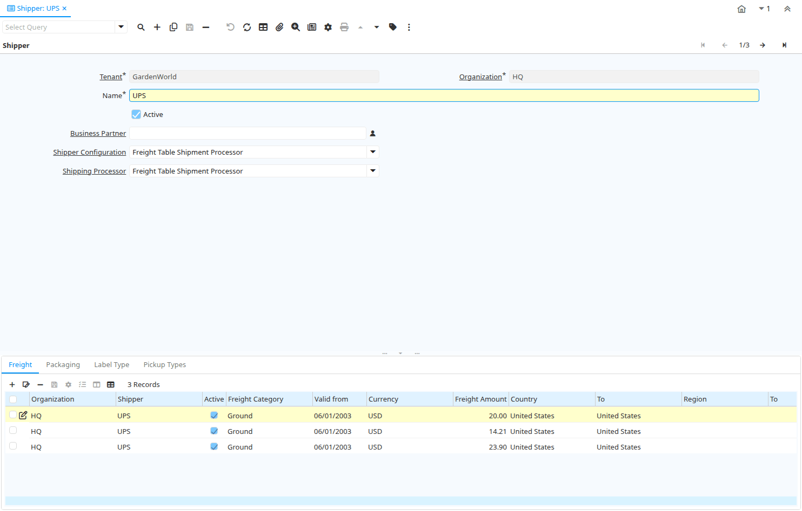

# Shipper

Window ID 142

*09/08/1999 → 02/01/2000*

**Description:** Maintain Shippers

**Comment/Help:** The Shipper Window defines the different shipping provides used by an Organization.  When a delivery method of Shipper is used on an Order a predefined Shipper must be selected.

## Tab: Shipper

*Tab Level 0 · Created 09/08/1999 · Updated 17/12/2007*

**Description:** Shippers

**Comment/Help:** The Shippers Tab defines any entity who will provide shipping to or shipping from an Organization.

| **Name** | **Description** | **Comment/Help** | **Technical Data** |
|---|---|---|---|
| Tenant | Tenant for this installation. | A Tenant is a company or a legal entity. You cannot share data between Tenants. | M_Shipper.AD_Client_ID<small> numeric(10)   Table Direct</small> |
| Organization | Organizational entity within tenant | An organization is a unit of your tenant or legal entity - examples are store, department. You can share data between organizations. | M_Shipper.AD_Org_ID<small> numeric(10)   Table Direct</small> |
| Name | Alphanumeric identifier of the entity | The name of an entity (record) is used as an default search option in addition to the search key. The name is up to 60 characters in length. | M_Shipper.Name<small> character varying(60)   String</small> |
| Active | The record is active in the system | There are two methods of making records unavailable in the system: One is to delete the record, the other is to de-activate the record. A de-activated record is not available for selection, but available for reports. There are two reasons for de-activating and not deleting records: (1) The system requires the record for audit purposes. (2) The record is referenced by other records. E.g., you cannot delete a Business Partner, if there are invoices for this partner record existing. You de-activate the Business Partner and prevent that this record is used for future entries. | M_Shipper.IsActive<small> character(1)   Yes-No</small> |
| Business Partner | Identifies a Business Partner | A Business Partner is anyone with whom you transact.  This can include Vendor, Customer, Employee or Salesperson | M_Shipper.C_BPartner_ID<small> numeric(10)   Search</small> |
| Shipper Configuration |  |  | M_Shipper.M_ShipperCfg_ID<small> numeric(10)   Table Direct</small> |
| Shipping Processor |  |  | M_Shipper.M_ShippingProcessor_ID<small> numeric(10)   Table</small> |
| Shipper Create From ... |  |  | M_Shipper.CreateFrom<small> character(1)   Button</small> |

## Tab: › Freight

*Tab Level 1 · Created 07/06/2003 · Updated 17/12/2007*

**Description:** Freight Rates

**Comment/Help:** Freight Rates for Shipper

| **Name** | **Description** | **Comment/Help** | **Technical Data** |
|---|---|---|---|
| Tenant | Tenant for this installation. | A Tenant is a company or a legal entity. You cannot share data between Tenants. | M_Freight.AD_Client_ID<small> numeric(10)   Table Direct</small> |
| Organization | Organizational entity within tenant | An organization is a unit of your tenant or legal entity - examples are store, department. You can share data between organizations. | M_Freight.AD_Org_ID<small> numeric(10)   Table Direct</small> |
| Shipper | Method or manner of product delivery | The Shipper indicates the method of delivering product | M_Freight.M_Shipper_ID<small> numeric(10)   Table</small> |
| Active | The record is active in the system | There are two methods of making records unavailable in the system: One is to delete the record, the other is to de-activate the record. A de-activated record is not available for selection, but available for reports. There are two reasons for de-activating and not deleting records: (1) The system requires the record for audit purposes. (2) The record is referenced by other records. E.g., you cannot delete a Business Partner, if there are invoices for this partner record existing. You de-activate the Business Partner and prevent that this record is used for future entries. | M_Freight.IsActive<small> character(1)   Yes-No</small> |
| Freight Category | Category of the Freight | Freight Categories are used to calculate the Freight for the Shipper selected | M_Freight.M_FreightCategory_ID<small> numeric(10)   Table Direct</small> |
| Valid from | Valid from including this date (first day) | The Valid From date indicates the first day of a date range | M_Freight.ValidFrom<small> timestamp without time zone   Date</small> |
| Max Weight |  |  | M_Freight.MaxWeight<small> numeric   Amount</small> |
| Max Dimension |  |  | M_Freight.MaxDimension<small> numeric   Amount</small> |
| Country | Country  | The Country defines a Country.  Each Country must be defined before it can be used in any document. | M_Freight.C_Country_ID<small> numeric(10)   Table Direct</small> |
| To | Receiving Country | The To Country indicates the receiving country on a document | M_Freight.To_Country_ID<small> numeric(10)   Table</small> |
| Region | Identifies a geographical Region | The Region identifies a unique Region for this Country. | M_Freight.C_Region_ID<small> numeric(10)   Table Direct</small> |
| To | Receiving Region | The To Region indicates the receiving region on a document | M_Freight.To_Region_ID<small> numeric(10)   Table</small> |
| Currency | The Currency for this record | Indicates the Currency to be used when processing or reporting on this record | M_Freight.C_Currency_ID<small> numeric(10)   Table Direct</small> |
| Freight Amount | Freight Amount  | The Freight Amount indicates the amount charged for Freight in the document currency. | M_Freight.FreightAmt<small> numeric   Amount</small> |

## Tab: › Packaging

*Tab Level 1 · Created 06/12/2012 · Updated 06/12/2012*

**Description:** Packaging Options supported by the Shipper

| **Name** | **Description** | **Comment/Help** | **Technical Data** |
|---|---|---|---|
| Tenant | Tenant for this installation. | A Tenant is a company or a legal entity. You cannot share data between Tenants. | M_ShipperPackaging.AD_Client_ID<small> numeric(10)   Table Direct</small> |
| Organization | Organizational entity within tenant | An organization is a unit of your tenant or legal entity - examples are store, department. You can share data between organizations. | M_ShipperPackaging.AD_Org_ID<small> numeric(10)   Table Direct</small> |
| Shipper | Method or manner of product delivery | The Shipper indicates the method of delivering product | M_ShipperPackaging.M_Shipper_ID<small> numeric(10)   Table</small> |
| Shipper Packaging Configuration |  |  | M_ShipperPackaging.M_ShipperPackagingCfg_ID<small> numeric(10)   Table Direct</small> |
| Name | Alphanumeric identifier of the entity | The name of an entity (record) is used as an default search option in addition to the search key. The name is up to 60 characters in length. | M_ShipperPackaging.Name<small> character varying(60)   String</small> |
| Active | The record is active in the system | There are two methods of making records unavailable in the system: One is to delete the record, the other is to de-activate the record. A de-activated record is not available for selection, but available for reports. There are two reasons for de-activating and not deleting records: (1) The system requires the record for audit purposes. (2) The record is referenced by other records. E.g., you cannot delete a Business Partner, if there are invoices for this partner record existing. You de-activate the Business Partner and prevent that this record is used for future entries. | M_ShipperPackaging.IsActive<small> character(1)   Yes-No</small> |
| Default | Default value | The Default Checkbox indicates if this record will be used as a default value. | M_ShipperPackaging.IsDefault<small> character(1)   Yes-No</small> |
| Weight | Weight of a product | The Weight indicates the weight  of the product in the Weight UOM of the Tenant | M_ShipperPackaging.Weight<small> numeric   Quantity</small> |

## Tab: › Label Type

*Tab Level 1 · Created 06/12/2012 · Updated 06/12/2012*

**Description:** Label Types Supported by the Shipper.

**Comment/Help:** Used when booking a shipment online to define the label format that will be printed.

| **Name** | **Description** | **Comment/Help** | **Technical Data** |
|---|---|---|---|
| Tenant | Tenant for this installation. | A Tenant is a company or a legal entity. You cannot share data between Tenants. | M_ShipperLabels.AD_Client_ID<small> numeric(10)   Table Direct</small> |
| Organization | Organizational entity within tenant | An organization is a unit of your tenant or legal entity - examples are store, department. You can share data between organizations. | M_ShipperLabels.AD_Org_ID<small> numeric(10)   Table Direct</small> |
| Shipper | Method or manner of product delivery | The Shipper indicates the method of delivering product | M_ShipperLabels.M_Shipper_ID<small> numeric(10)   Table</small> |
| Shipper Labels Configuration |  |  | M_ShipperLabels.M_ShipperLabelsCfg_ID<small> numeric(10)   Table Direct</small> |
| Name | Alphanumeric identifier of the entity | The name of an entity (record) is used as an default search option in addition to the search key. The name is up to 60 characters in length. | M_ShipperLabels.Name<small> character varying(60)   String</small> |
| Active | The record is active in the system | There are two methods of making records unavailable in the system: One is to delete the record, the other is to de-activate the record. A de-activated record is not available for selection, but available for reports. There are two reasons for de-activating and not deleting records: (1) The system requires the record for audit purposes. (2) The record is referenced by other records. E.g., you cannot delete a Business Partner, if there are invoices for this partner record existing. You de-activate the Business Partner and prevent that this record is used for future entries. | M_ShipperLabels.IsActive<small> character(1)   Yes-No</small> |
| Default | Default value | The Default Checkbox indicates if this record will be used as a default value. | M_ShipperLabels.IsDefault<small> character(1)   Yes-No</small> |
| Label Print Method |  |  | M_ShipperLabels.LabelPrintMethod<small> character(1)   List</small> |

## Tab: › Pickup Types

*Tab Level 1 · Created 06/12/2012 · Updated 06/12/2012*

**Description:** Methods that the Shipper will support for picking up from your location

| **Name** | **Description** | **Comment/Help** | **Technical Data** |
|---|---|---|---|
| Tenant | Tenant for this installation. | A Tenant is a company or a legal entity. You cannot share data between Tenants. | M_ShipperPickupTypes.AD_Client_ID<small> numeric(10)   Table Direct</small> |
| Organization | Organizational entity within tenant | An organization is a unit of your tenant or legal entity - examples are store, department. You can share data between organizations. | M_ShipperPickupTypes.AD_Org_ID<small> numeric(10)   Table Direct</small> |
| Shipper | Method or manner of product delivery | The Shipper indicates the method of delivering product | M_ShipperPickupTypes.M_Shipper_ID<small> numeric(10)   Table</small> |
| Shipper Pickup Types Configuration |  |  | M_ShipperPickupTypes.M_ShipperPickupTypesCfg_ID<small> numeric(10)   Table Direct</small> |
| Name | Alphanumeric identifier of the entity | The name of an entity (record) is used as an default search option in addition to the search key. The name is up to 60 characters in length. | M_ShipperPickupTypes.Name<small> character varying(60)   String</small> |
| Active | The record is active in the system | There are two methods of making records unavailable in the system: One is to delete the record, the other is to de-activate the record. A de-activated record is not available for selection, but available for reports. There are two reasons for de-activating and not deleting records: (1) The system requires the record for audit purposes. (2) The record is referenced by other records. E.g., you cannot delete a Business Partner, if there are invoices for this partner record existing. You de-activate the Business Partner and prevent that this record is used for future entries. | M_ShipperPickupTypes.IsActive<small> character(1)   Yes-No</small> |
| Default | Default value | The Default Checkbox indicates if this record will be used as a default value. | M_ShipperPickupTypes.IsDefault<small> character(1)   Yes-No</small> |

