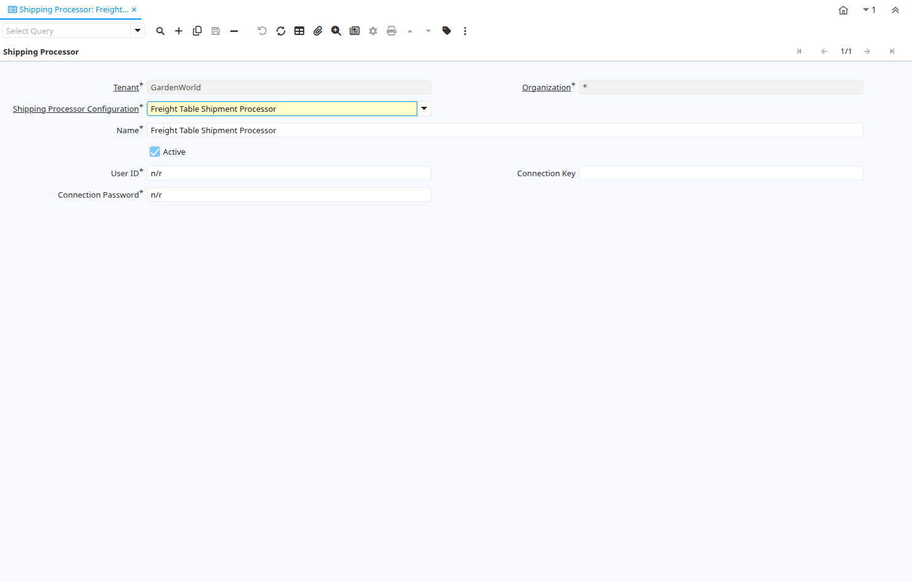

# Shipping Processor

Window ID 200024

*06/12/2012 → 06/12/2012*

## Tab: Shipping Processor

*Tab Level 0 · Created 06/12/2012 · Updated 06/12/2012*

**Description:** Shipping Processors

**Comment/Help:** Shipping processor tab to define integration details with online shipping services.

| **Name** | **Description** | **Comment/Help** | **Technical Data** |
|---|---|---|---|
| Tenant | Tenant for this installation. | A Tenant is a company or a legal entity. You cannot share data between Tenants. | M_ShippingProcessor.AD_Client_ID<small> numeric(10)   Table Direct</small> |
| Organization | Organizational entity within tenant | An organization is a unit of your tenant or legal entity - examples are store, department. You can share data between organizations. | M_ShippingProcessor.AD_Org_ID<small> numeric(10)   Table Direct</small> |
| Shipping Processor Configuration |  |  | M_ShippingProcessor.M_ShippingProcessorCfg_ID<small> numeric(10)   Table Direct</small> |
| Name | Alphanumeric identifier of the entity | The name of an entity (record) is used as an default search option in addition to the search key. The name is up to 60 characters in length. | M_ShippingProcessor.Name<small> character varying(60)   String</small> |
| Active | The record is active in the system | There are two methods of making records unavailable in the system: One is to delete the record, the other is to de-activate the record. A de-activated record is not available for selection, but available for reports. There are two reasons for de-activating and not deleting records: (1) The system requires the record for audit purposes. (2) The record is referenced by other records. E.g., you cannot delete a Business Partner, if there are invoices for this partner record existing. You de-activate the Business Partner and prevent that this record is used for future entries. | M_ShippingProcessor.IsActive<small> character(1)   Yes-No</small> |
| User ID | User ID or account number | The User ID identifies a user and allows access to records or processes. | M_ShippingProcessor.UserID<small> character varying(60)   String</small> |
| Connection Key |  |  | M_ShippingProcessor.ConnectionKey<small> character varying(60)   String</small> |
| Connection Password |  |  | M_ShippingProcessor.ConnectionPassword<small> character varying(60)   String</small> |

