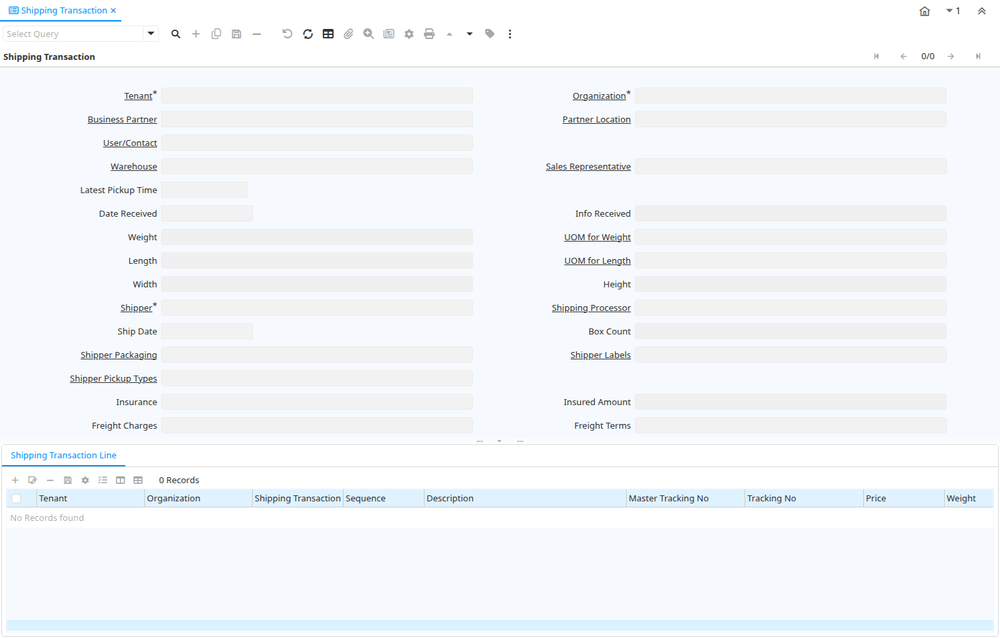

# Shipping Transaction

Window ID 200030

*14/12/2012 → 14/12/2012*

**Description:** Shipping Transactions

## Tab: Shipping Transaction

*Tab Level 0 · Created 14/12/2012 · Updated 14/12/2012*

| **Name** | **Description** | **Comment/Help** | **Technical Data** |
|---|---|---|---|
| Tenant | Tenant for this installation. | A Tenant is a company or a legal entity. You cannot share data between Tenants. | M_ShippingTransaction.AD_Client_ID<small> numeric(10)   Table Direct</small> |
| Organization | Organizational entity within tenant | An organization is a unit of your tenant or legal entity - examples are store, department. You can share data between organizations. | M_ShippingTransaction.AD_Org_ID<small> numeric(10)   Table Direct</small> |
| Business Partner | Identifies a Business Partner | A Business Partner is anyone with whom you transact.  This can include Vendor, Customer, Employee or Salesperson | M_ShippingTransaction.C_BPartner_ID<small> numeric(10)   Search</small> |
| Partner Location | Identifies the (ship to) address for this Business Partner | The Partner address indicates the location of a Business Partner | M_ShippingTransaction.C_BPartner_Location_ID<small> numeric(10)   Table Direct</small> |
| User/Contact | User within the system - Internal or Business Partner Contact | The User identifies a unique user in the system. This could be an internal user or a business partner contact | M_ShippingTransaction.AD_User_ID<small> numeric(10)   Table Direct</small> |
| Warehouse | Storage Warehouse and Service Point | The Warehouse identifies a unique Warehouse where products are stored or Services are provided. | M_ShippingTransaction.M_Warehouse_ID<small> numeric(10)   Table Direct</small> |
| Sales Representative | Sales Representative or Company Agent | The Sales Representative indicates the Sales Rep for this Region.  Any Sales Rep must be a valid internal user. | M_ShippingTransaction.SalesRep_ID<small> numeric(10)   Table</small> |
| Latest Pickup Time |  |  | M_ShippingTransaction.LatestPickupTime<small> timestamp without time zone   Time</small> |
| Date Received | Date a product was received | The Date Received indicates the date that product was received. | M_ShippingTransaction.DateReceived<small> timestamp without time zone   Date</small> |
| Info Received | Information of the receipt of the package (acknowledgement) |  | M_ShippingTransaction.ReceivedInfo<small> character varying(255)   String</small> |
| Weight | Weight of a product | The Weight indicates the weight  of the product in the Weight UOM of the Tenant | M_ShippingTransaction.Weight<small> numeric   Quantity</small> |
| UOM for Weight | Standard Unit of Measure for Weight | The Standard UOM for Weight indicates the UOM to use for products referenced by weight in a document. | M_ShippingTransaction.C_UOM_Weight_ID<small> numeric(10)   Table</small> |
| Length |  |  | M_ShippingTransaction.Length<small> numeric   Quantity</small> |
| UOM for Length | Standard Unit of Measure for Length | The Standard UOM for Length indicates the UOM to use for products referenced by length in a document. | M_ShippingTransaction.C_UOM_Length_ID<small> numeric(10)   Table</small> |
| Width |  |  | M_ShippingTransaction.Width<small> numeric   Quantity</small> |
| Height |  |  | M_ShippingTransaction.Height<small> numeric   Quantity</small> |
| Shipper | Method or manner of product delivery | The Shipper indicates the method of delivering product | M_ShippingTransaction.M_Shipper_ID<small> numeric(10)   Table</small> |
| Shipping Processor |  |  | M_ShippingTransaction.M_ShippingProcessor_ID<small> numeric(10)   Table</small> |
| Ship Date | Shipment Date/Time | Actual Date/Time of Shipment (pick up) | M_ShippingTransaction.ShipDate<small> timestamp without time zone   Date</small> |
| Box Count |  |  | M_ShippingTransaction.BoxCount<small> numeric(10)   Integer</small> |
| Shipper Packaging |  |  | M_ShippingTransaction.M_ShipperPackaging_ID<small> numeric(10)   Table</small> |
| Shipper Labels |  |  | M_ShippingTransaction.M_ShipperLabels_ID<small> numeric(10)   Table</small> |
| Shipper Pickup Types |  |  | M_ShippingTransaction.M_ShipperPickupTypes_ID<small> numeric(10)   Table</small> |
| Insurance |  |  | M_ShippingTransaction.Insurance<small> character(1)   List</small> |
| Insured Amount |  |  | M_ShippingTransaction.InsuredAmount<small> numeric   Amount</small> |
| Freight Charges |  |  | M_ShippingTransaction.FreightCharges<small> character varying(10)   List</small> |
| Freight Terms |  |  | M_ShippingTransaction.FOB<small> character varying(10)   List</small> |
| Shipper Account Number |  |  | M_ShippingTransaction.ShipperAccount<small> character varying(40)   String</small> |
| Duties Shipper Account |  |  | M_ShippingTransaction.DutiesShipperAccount<small> character varying(40)   String</small> |
| Invoice Location | Business Partner Location for invoicing |  | M_ShippingTransaction.Bill_Location_ID<small> numeric(10)   Table</small> |
| Customs Value |  |  | M_ShippingTransaction.CustomsValue<small> numeric   Costs+Prices</small> |
| Freight Amount | Freight Amount  | The Freight Amount indicates the amount charged for Freight in the document currency. | M_ShippingTransaction.FreightAmt<small> numeric   Costs+Prices</small> |
| Handling Charge |  |  | M_ShippingTransaction.HandlingCharge<small> numeric   Amount</small> |
| Added Handling |  |  | M_ShippingTransaction.IsAddedHandling<small> character(1)   Yes-No</small> |
| COD |  |  | M_ShippingTransaction.CashOnDelivery<small> character(1)   Yes-No</small> |
| COD Amount |  |  | M_ShippingTransaction.CODAmount<small> numeric   Costs+Prices</small> |
| Payment Rule | How you pay the invoice | The Payment Rule indicates the method of invoice payment. | M_ShippingTransaction.PaymentRule<small> character(1)   List</small> |
| Delivery Confirmation | EMail Delivery confirmation |  | M_ShippingTransaction.DeliveryConfirmation<small> character(1)   Yes-No</small> |
| Delivery Confirmation Type |  |  | M_ShippingTransaction.DeliveryConfirmationType<small> character varying(30)   List</small> |
| Verbal Confirmation |  |  | M_ShippingTransaction.IsVerbalConfirmation<small> character(1)   Yes-No</small> |
| Saturday Delivery |  |  | M_ShippingTransaction.IsSaturdayDelivery<small> character(1)   Yes-No</small> |
| Saturday Pickup |  |  | M_ShippingTransaction.IsSaturdayPickup<small> character(1)   Yes-No</small> |
| Future Day Shipment |  |  | M_ShippingTransaction.IsFutureDayShipment<small> character(1)   Yes-No</small> |
| Residential |  |  | M_ShippingTransaction.IsResidential<small> character(1)   Yes-No</small> |
| Home Delivery Premium Type |  |  | M_ShippingTransaction.HomeDeliveryPremiumType<small> character varying(30)   List</small> |
| Phone Number |  |  | M_ShippingTransaction.HomeDeliveryPremiumPhone<small> character varying(30)   String</small> |
| Date |  |  | M_ShippingTransaction.HomeDeliveryPremiumDate<small> timestamp without time zone   Date</small> |
| Hazardous Materials |  |  | M_ShippingTransaction.IsHazMat<small> character(1)   Yes-No</small> |
| Dot Hazard Class or Division |  |  | M_ShippingTransaction.DotHazardClassOrDivision<small> character varying(30)   List</small> |
| Cargo Aircraft Only |  |  | M_ShippingTransaction.IsCargoAircraftOnly<small> character(1)   Yes-No</small> |
| Accessible |  |  | M_ShippingTransaction.IsAccessible<small> character(1)   Yes-No</small> |
| Dry Ice |  |  | M_ShippingTransaction.IsDryIce<small> character(1)   Yes-No</small> |
| Dry Ice Weight |  |  | M_ShippingTransaction.DryIceWeight<small> numeric   Amount</small> |
| Hold At Location |  |  | M_ShippingTransaction.IsHoldAtLocation<small> character(1)   Yes-No</small> |
| Hold Address |  |  | M_ShippingTransaction.HoldAddress_ID<small> numeric(10)   Table</small> |
| Ignore Zip State Not Match |  |  | M_ShippingTransaction.IsIgnoreZipStateNotMatch<small> character(1)   Yes-No</small> |
| Ignore Zip Not Found |  |  | M_ShippingTransaction.IsIgnoreZipNotFound<small> character(1)   Yes-No</small> |
| Dutiable |  |  | M_ShippingTransaction.IsDutiable<small> character(1)   Yes-No</small> |
| Alternate Return Address |  |  | M_ShippingTransaction.IsAlternateReturnAddress<small> character(1)   Yes-No</small> |
| Return Partner |  |  | M_ShippingTransaction.ReturnBPartner_ID<small> numeric(10)   Search</small> |
| Return Location |  |  | M_ShippingTransaction.ReturnLocation_ID<small> numeric(10)   Table</small> |
| Return User/Contact |  |  | M_ShippingTransaction.ReturnUser_ID<small> numeric(10)   Table</small> |
| Notification Type | Type of Notifications | Emails or Notification sent out for Request Updates, etc. | M_ShippingTransaction.NotificationType<small> character varying(2)   List</small> |
| Notification Message |  |  | M_ShippingTransaction.NotificationMessage<small> character varying(255)   String</small> |
| Price | Price | The Price indicates the Price for a product or service. | M_ShippingTransaction.Price<small> numeric   Costs+Prices</small> |
| Currency | The Currency for this record | Indicates the Currency to be used when processing or reporting on this record | M_ShippingTransaction.C_Currency_ID<small> numeric(10)   Table Direct</small> |
| Surcharges |  |  | M_ShippingTransaction.Surcharges<small> numeric   Costs+Prices</small> |
| Tracking No | Number to track the shipment |  | M_ShippingTransaction.TrackingNo<small> character varying(255)   String</small> |
| Tracking Info |  |  | M_ShippingTransaction.TrackingInfo<small> character varying(255)   String</small> |
| Response Message |  |  | M_ShippingTransaction.ShippingRespMessage<small> character varying(2000)   Text</small> |
| Description | Optional short description of the record | A description is limited to 255 characters. | M_ShippingTransaction.Description<small> character varying(255)   String</small> |
| Processed | The document has been processed | The Processed checkbox indicates that a document has been processed. | M_ShippingTransaction.Processed<small> character(1)   Yes-No</small> |
| Action | Indicates the Action to be performed | The Action field is a drop down list box which indicates the Action to be performed for this Item. | M_ShippingTransaction.Action<small> character varying(2)   List</small> |
| Privileged Rate |  |  | M_ShippingTransaction.IsPriviledgedRate<small> character(1)   Yes-No</small> |
| Order | Order | The Order is a control document.  The  Order is complete when the quantity ordered is the same as the quantity shipped and invoiced.  When you close an order, unshipped (backordered) quantities are cancelled. | M_ShippingTransaction.C_Order_ID<small> numeric(10)   Search</small> |
| Order Reference | Transaction Reference Number (Sales Order, Purchase Order) of your Business Partner | The business partner order reference is the order reference for this specific transaction; Often Purchase Order numbers are given to print on Invoices for easier reference.  A standard number can be defined in the Business Partner (Customer) window. | M_ShippingTransaction.POReference<small> character varying(30)   String</small> |
| Shipment/Receipt | Material Shipment Document | The Material Shipment / Receipt  | M_ShippingTransaction.M_InOut_ID<small> numeric(10)   Search</small> |
| Package | Shipment Package | A Shipment can have one or more Packages.  A Package may be individually tracked. | M_ShippingTransaction.M_Package_ID<small> numeric(10)   Search</small> |
| Invoice | Invoice Identifier | The Invoice Document. | M_ShippingTransaction.C_Invoice_ID<small> numeric(10)   Search</small> |

## Tab: › Shipping Transaction Line

*Tab Level 1 · Created 14/12/2012 · Updated 14/12/2012*

| **Name** | **Description** | **Comment/Help** | **Technical Data** |
|---|---|---|---|
| Tenant | Tenant for this installation. | A Tenant is a company or a legal entity. You cannot share data between Tenants. | M_ShippingTransactionLine.AD_Client_ID<small> numeric(10)   Table Direct</small> |
| Organization | Organizational entity within tenant | An organization is a unit of your tenant or legal entity - examples are store, department. You can share data between organizations. | M_ShippingTransactionLine.AD_Org_ID<small> numeric(10)   Table Direct</small> |
| Shipping Transaction |  |  | M_ShippingTransactionLine.M_ShippingTransaction_ID<small> numeric(10)   Search</small> |
| Sequence | Method of ordering records; lowest number comes first | The Sequence indicates the order of records | M_ShippingTransactionLine.SeqNo<small> numeric(10)   Integer</small> |
| Description | Optional short description of the record | A description is limited to 255 characters. | M_ShippingTransactionLine.Description<small> character varying(255)   String</small> |
| Master Tracking No |  |  | M_ShippingTransactionLine.MasterTrackingNo<small> character varying(255)   String</small> |
| Tracking No | Number to track the shipment |  | M_ShippingTransactionLine.TrackingNo<small> character varying(255)   String</small> |
| Price | Price | The Price indicates the Price for a product or service. | M_ShippingTransactionLine.Price<small> numeric   Costs+Prices</small> |
| Weight | Weight of a product | The Weight indicates the weight  of the product in the Weight UOM of the Tenant | M_ShippingTransactionLine.Weight<small> numeric   Quantity</small> |
| UOM for Weight | Standard Unit of Measure for Weight | The Standard UOM for Weight indicates the UOM to use for products referenced by weight in a document. | M_ShippingTransactionLine.C_UOM_Weight_ID<small> numeric(10)   Table</small> |
| Length |  |  | M_ShippingTransactionLine.Length<small> numeric   Quantity</small> |
| UOM for Length | Standard Unit of Measure for Length | The Standard UOM for Length indicates the UOM to use for products referenced by length in a document. | M_ShippingTransactionLine.C_UOM_Length_ID<small> numeric(10)   Table</small> |
| Width |  |  | M_ShippingTransactionLine.Width<small> numeric   Quantity</small> |
| Height |  |  | M_ShippingTransactionLine.Height<small> numeric   Quantity</small> |
| Processed | The document has been processed | The Processed checkbox indicates that a document has been processed. | M_ShippingTransactionLine.Processed<small> character(1)   Yes-No</small> |
| Package MPS |  |  | M_ShippingTransactionLine.M_PackageMPS_ID<small> numeric(10)   Search</small> |

