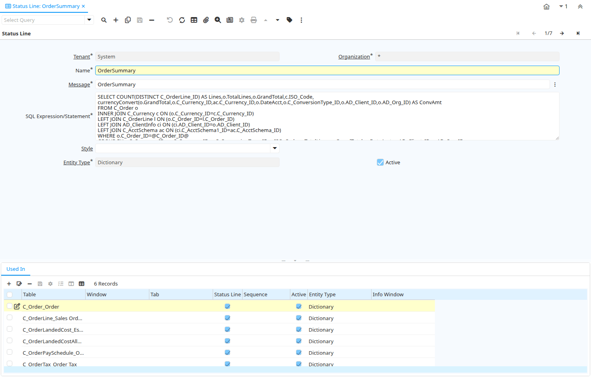

# Status Line

Window ID 200049

*12/01/2014 → 12/01/2014*

## Tab: Status Line

*Tab Level 0 · Created 12/01/2014 · Updated 12/01/2014*

| **Name** | **Description** | **Comment/Help** | **Technical Data** |
|---|---|---|---|
| Tenant | Tenant for this installation. | A Tenant is a company or a legal entity. You cannot share data between Tenants. | AD_StatusLine.AD_Client_ID<small> numeric(10)   Table Direct</small> |
| Organization | Organizational entity within tenant | An organization is a unit of your tenant or legal entity - examples are store, department. You can share data between organizations. | AD_StatusLine.AD_Org_ID<small> numeric(10)   Table Direct</small> |
| Name | Alphanumeric identifier of the entity | The name of an entity (record) is used as an default search option in addition to the search key. The name is up to 60 characters in length. | AD_StatusLine.Name<small> character varying(60)   String</small> |
| Message | System Message | Information and Error messages | AD_StatusLine.AD_Message_ID<small> numeric(10)   Search</small> |
| SQL Expression/Statement |  |  | AD_StatusLine.SQLStatement<small> character varying(2000)   Text</small> |
| Style | CSS style for field and label |  | AD_StatusLine.AD_Style_ID<small> numeric(10)   Table Direct</small> |
| Entity Type | Dictionary Entity Type; Determines ownership and synchronization | The Entity Types "Dictionary", "iDempiere" and "Application" might be automatically synchronized and customizations deleted or overwritten.    For customizations, copy the entity and select "User"! | AD_StatusLine.EntityType<small> character varying(40)   Table</small> |
| Active | The record is active in the system | There are two methods of making records unavailable in the system: One is to delete the record, the other is to de-activate the record. A de-activated record is not available for selection, but available for reports. There are two reasons for de-activating and not deleting records: (1) The system requires the record for audit purposes. (2) The record is referenced by other records. E.g., you cannot delete a Business Partner, if there are invoices for this partner record existing. You de-activate the Business Partner and prevent that this record is used for future entries. | AD_StatusLine.IsActive<small> character(1)   Yes-No</small> |

## Tab: › Used In

*Tab Level 1 · Created 12/01/2014 · Updated 12/01/2014*

| **Name** | **Description** | **Comment/Help** | **Technical Data** |
|---|---|---|---|
| Tenant | Tenant for this installation. | A Tenant is a company or a legal entity. You cannot share data between Tenants. | AD_StatusLineUsedIn.AD_Client_ID<small> numeric(10)   Table Direct</small> |
| Organization | Organizational entity within tenant | An organization is a unit of your tenant or legal entity - examples are store, department. You can share data between organizations. | AD_StatusLineUsedIn.AD_Org_ID<small> numeric(10)   Table Direct</small> |
| Status Line |  |  | AD_StatusLineUsedIn.AD_StatusLine_ID<small> numeric(10)   Search</small> |
| Table | Database Table information | The Database Table provides the information of the table definition | AD_StatusLineUsedIn.AD_Table_ID<small> numeric(10)   Table Direct</small> |
| Entity Type | Dictionary Entity Type; Determines ownership and synchronization | The Entity Types "Dictionary", "iDempiere" and "Application" might be automatically synchronized and customizations deleted or overwritten.    For customizations, copy the entity and select "User"! | AD_StatusLineUsedIn.EntityType<small> character varying(40)   Table</small> |
| Window | Data entry or display window | The Window field identifies a unique Window in the system. | AD_StatusLineUsedIn.AD_Window_ID<small> numeric(10)   Table Direct</small> |
| Tab | Tab within a Window | The Tab indicates a tab that displays within a window. | AD_StatusLineUsedIn.AD_Tab_ID<small> numeric(10)   Table Direct</small> |
| Info Window | Info and search/select Window | The Info window is used to search and select records as well as display information relevant to the selection. | AD_StatusLineUsedIn.AD_InfoWindow_ID<small> numeric(10)   Table Direct</small> |
| Sequence | Method of ordering records; lowest number comes first | The Sequence indicates the order of records | AD_StatusLineUsedIn.SeqNo<small> numeric(10)   Integer</small> |
| Status Line | Defines if this record refers to a status line or to a help widget | If checked the definition corresponds to a status line, when unchecked it corresponds to a help widget | AD_StatusLineUsedIn.IsStatusLine<small> character(1)   Yes-No</small> |
| Active | The record is active in the system | There are two methods of making records unavailable in the system: One is to delete the record, the other is to de-activate the record. A de-activated record is not available for selection, but available for reports. There are two reasons for de-activating and not deleting records: (1) The system requires the record for audit purposes. (2) The record is referenced by other records. E.g., you cannot delete a Business Partner, if there are invoices for this partner record existing. You de-activate the Business Partner and prevent that this record is used for future entries. | AD_StatusLineUsedIn.IsActive<small> character(1)   Yes-No</small> |

