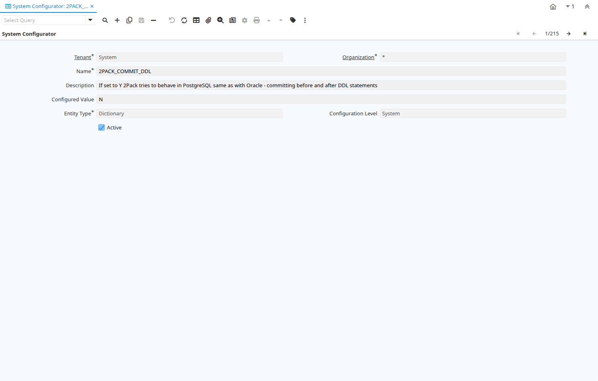

# System Configurator

Window ID 50006

*28/02/2007 → 20/12/2021*

## Tab: System Configurator

*Tab Level 0 · Created 28/02/2007 · Updated 30/06/2021*

| **Name** | **Description** | **Comment/Help** | **Technical Data** |
|---|---|---|---|
| Tenant | Tenant for this installation. | A Tenant is a company or a legal entity. You cannot share data between Tenants. | AD_SysConfig.AD_Client_ID<small> numeric(10)   Table Direct</small> |
| Organization | Organizational entity within tenant | An organization is a unit of your tenant or legal entity - examples are store, department. You can share data between organizations. | AD_SysConfig.AD_Org_ID<small> numeric(10)   Table Direct</small> |
| Name | Alphanumeric identifier of the entity | The name of an entity (record) is used as an default search option in addition to the search key. The name is up to 60 characters in length. | AD_SysConfig.Name<small> character varying(50)   String</small> |
| Description | Optional short description of the record | A description is limited to 255 characters. | AD_SysConfig.Description<small> character varying(255)   String</small> |
| Configured Value | Value for the configuration key | You can check the valid variables and values at http://wiki.idempiere.org/en/System_Configurator_(Window_ID-50006) | AD_SysConfig.Value<small> character varying(4000)   String</small> |
| Entity Type | Dictionary Entity Type; Determines ownership and synchronization | The Entity Types "Dictionary", "iDempiere" and "Application" might be automatically synchronized and customizations deleted or overwritten.    For customizations, copy the entity and select "User"! | AD_SysConfig.EntityType<small> character varying(40)   Table</small> |
| Configuration Level | Configuration Level for this parameter | Configuration Level for this parameter S - just allowed system configuration C - tenant configurable parameter O - org configurable parameter | AD_SysConfig.ConfigurationLevel<small> character(1)   List</small> |
| Active | The record is active in the system | There are two methods of making records unavailable in the system: One is to delete the record, the other is to de-activate the record. A de-activated record is not available for selection, but available for reports. There are two reasons for de-activating and not deleting records: (1) The system requires the record for audit purposes. (2) The record is referenced by other records. E.g., you cannot delete a Business Partner, if there are invoices for this partner record existing. You de-activate the Business Partner and prevent that this record is used for future entries. | AD_SysConfig.IsActive<small> character(1)   Yes-No</small> |

