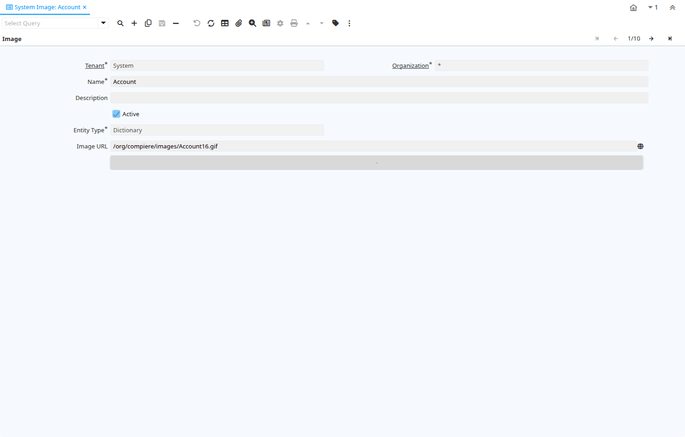

# System Image

Window ID 227

*05/09/2001 → 02/01/2000*

**Description:** Maintain Images and Icons

## Tab: Image

*Tab Level 0 · Created 05/09/2001 · Updated 02/01/2000*

**Description:** Image or Icon link

| **Name** | **Description** | **Comment/Help** | **Technical Data** |
|---|---|---|---|
| Tenant | Tenant for this installation. | A Tenant is a company or a legal entity. You cannot share data between Tenants. | AD_Image.AD_Client_ID<small> numeric(10)   Table Direct</small> |
| Organization | Organizational entity within tenant | An organization is a unit of your tenant or legal entity - examples are store, department. You can share data between organizations. | AD_Image.AD_Org_ID<small> numeric(10)   Table Direct</small> |
| Name | Alphanumeric identifier of the entity | The name of an entity (record) is used as an default search option in addition to the search key. The name is up to 60 characters in length. | AD_Image.Name<small> character varying(60)   String</small> |
| Description | Optional short description of the record | A description is limited to 255 characters. | AD_Image.Description<small> character varying(255)   String</small> |
| Active | The record is active in the system | There are two methods of making records unavailable in the system: One is to delete the record, the other is to de-activate the record. A de-activated record is not available for selection, but available for reports. There are two reasons for de-activating and not deleting records: (1) The system requires the record for audit purposes. (2) The record is referenced by other records. E.g., you cannot delete a Business Partner, if there are invoices for this partner record existing. You de-activate the Business Partner and prevent that this record is used for future entries. | AD_Image.IsActive<small> character(1)   Yes-No</small> |
| Entity Type | Dictionary Entity Type; Determines ownership and synchronization | The Entity Types "Dictionary", "iDempiere" and "Application" might be automatically synchronized and customizations deleted or overwritten.    For customizations, copy the entity and select "User"! | AD_Image.EntityType<small> character varying(40)   Table</small> |
| Image URL | URL of  image | URL of image; The image is not stored in the database, but retrieved at runtime. The image can be a gif, jpeg or png. | AD_Image.ImageURL<small> character varying(120)   URL</small> |
| Binary Data | Binary Data | The Binary field stores binary data. | AD_Image.BinaryData<small> bytea   Binary</small> |

