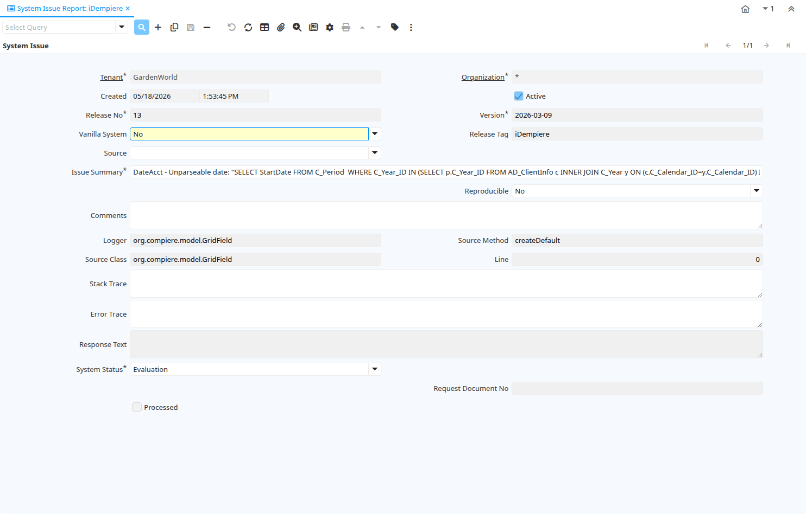

# System Issue Report

Window ID 363

*12/12/2005 → 14/12/2005*

**Description:** Automatically created or manually entered System Issue Reports

**Comment/Help:** System Issues are created to speed up the resolution of any system related issues (potential bugs).  If enabled, they are automatically reported to iDempiere.  No data or confidential information is transferred.

## Tab: System Issue

*Tab Level 0 · Created 12/12/2005 · Updated 01/02/2026*

**Description:** Automatically created or manually entered System Issue Reporting

**Comment/Help:** System Issues are created to speed up the resolution of any system related issues (potential bugs).  If enabled, they are automatically reported to iDempiere.  No data or confidential information is transferred.

| **Name** | **Description** | **Comment/Help** | **Technical Data** |
|---|---|---|---|
| Tenant | Tenant for this installation. | A Tenant is a company or a legal entity. You cannot share data between Tenants. | AD_Issue.AD_Client_ID<small> numeric(10)   Table Direct</small> |
| Organization | Organizational entity within tenant | An organization is a unit of your tenant or legal entity - examples are store, department. You can share data between organizations. | AD_Issue.AD_Org_ID<small> numeric(10)   Table Direct</small> |
| Created | Date this record was created | The Created field indicates the date that this record was created. | AD_Issue.Created<small> timestamp without time zone   Date+Time</small> |
| Active | The record is active in the system | There are two methods of making records unavailable in the system: One is to delete the record, the other is to de-activate the record. A de-activated record is not available for selection, but available for reports. There are two reasons for de-activating and not deleting records: (1) The system requires the record for audit purposes. (2) The record is referenced by other records. E.g., you cannot delete a Business Partner, if there are invoices for this partner record existing. You de-activate the Business Partner and prevent that this record is used for future entries. | AD_Issue.IsActive<small> character(1)   Yes-No</small> |
| Release No | Internal Release Number |  | AD_Issue.ReleaseNo<small> character varying(10)   String</small> |
| Version | Version of the table definition | The Version indicates the version of this table definition. | AD_Issue.Version<small> character varying(40)   String</small> |
| Vanilla System | The system was NOT compiled from Source - i.e. standard distribution | You may have customizations, like additional columns, tables, etc - but no code modifications which require compiling from source. | AD_Issue.IsVanillaSystem<small> character(1)   List</small> |
| Release Tag | Release Tag |  | AD_Issue.ReleaseTag<small> character varying(60)   String</small> |
| Source | Issue Source | Source of the Issue | AD_Issue.IssueSource<small> character(1)   List</small> |
| Window | Data entry or display window | The Window field identifies a unique Window in the system. | AD_Issue.AD_Window_ID<small> numeric(10)   Search</small> |
| Process | Process or Report | The Process field identifies a unique Process or Report in the system. | AD_Issue.AD_Process_ID<small> numeric(10)   Search</small> |
| Special Form | Special Form | The Special Form field identifies a unique Special Form in the system. | AD_Issue.AD_Form_ID<small> numeric(10)   Table Direct</small> |
| Issue Summary | Issue Summary |  | AD_Issue.IssueSummary<small> character varying(2000)   String</small> |
| Reproducible | Problem can re reproduced in Gardenworld | The problem occurs also in the standard distribution in the demo tenant Gardenworld. | AD_Issue.IsReproducible<small> character(1)   List</small> |
| Comments | Comments or additional information | The Comments field allows for free form entry of additional information. | AD_Issue.Comments<small> character varying(2000)   Text</small> |
| Logger | Logger Name |  | AD_Issue.LoggerName<small> character varying(255)   String</small> |
| Source Method | Source Method Name |  | AD_Issue.SourceMethodName<small> character varying(60)   String</small> |
| Source Class | Source Class Name |  | AD_Issue.SourceClassName<small> character varying(255)   String</small> |
| Line | Line No |  | AD_Issue.LineNo<small> numeric(10)   Integer</small> |
| Stack Trace | System Log Trace |  | AD_Issue.StackTrace<small> character varying(2000)   Text</small> |
| Error Trace | System Error Trace | Java Trace Info | AD_Issue.ErrorTrace<small> character varying(2000)   Text</small> |
| Response Text | Request Response Text | Text block to be copied into request response text | AD_Issue.ResponseText<small> character varying(2000)   Text</small> |
| System Status | Status of the system - Support priority depends on system status | System status helps to prioritize support resources | AD_Issue.SystemStatus<small> character(1)   List</small> |
| Known Issue | Known Issue |  | AD_Issue.R_IssueKnown_ID<small> numeric(10)   Search</small> |
| Request Document No | iDempiere Request Document No |  | AD_Issue.RequestDocumentNo<small> character varying(30)   String</small> |
| Request | Request from a Business Partner or Prospect | The Request identifies a unique request from a Business Partner or Prospect. | AD_Issue.R_Request_ID<small> numeric(10)   Search</small> |
| Asset | Asset used internally or by customers | An asset is either created by purchasing or by delivering a product.  An asset can be used internally or be a customer asset. | AD_Issue.A_Asset_ID<small> numeric(10)   Search</small> |
| Issue Project | Implementation Projects |  | AD_Issue.R_IssueProject_ID<small> numeric(10)   Search</small> |
| Support EMail | EMail address to send support information and updates to | If not entered the registered email is used. | AD_Issue.SupportEMail<small> character varying(60)   String</small> |
| Name | Alphanumeric identifier of the entity | The name of an entity (record) is used as an default search option in addition to the search key. The name is up to 60 characters in length. | AD_Issue.Name<small> character varying(60)   String</small> |
| User Name |  |  | AD_Issue.UserName<small> character varying(60)   String</small> |
| Issue System | System creating the issue |  | AD_Issue.R_IssueSystem_ID<small> numeric(10)   Search</small> |
| Issue User | User who reported issues |  | AD_Issue.R_IssueUser_ID<small> numeric(10)   Search</small> |
| DB Address | JDBC URL of the database server |  | AD_Issue.DBAddress<small> character varying(255)   String</small> |
| Local Host | Local Host Info |  | AD_Issue.Local_Host<small> character varying(120)   String</small> |
| Statistics | Information to help profiling the system for solving support issues | Profile information do not contain sensitive information and are used to support issue detection and diagnostics as well as general anonymous statistics | AD_Issue.StatisticsInfo<small> character varying(255)   String</small> |
| Profile | Information to help profiling the system for solving support issues | Profile information do not contain sensitive information and are used to support issue detection and diagnostics | AD_Issue.ProfileInfo<small> character varying(4000)   String</small> |
| Remote Host | Remote host Info |  | AD_Issue.Remote_Host<small> character varying(120)   String</small> |
| Remote Addr | Remote Address | The Remote Address indicates an alternative or external address. | AD_Issue.Remote_Addr<small> character varying(60)   String</small> |
| Operating System | Operating System Info |  | AD_Issue.OperatingSystemInfo<small> character varying(255)   String</small> |
| Java Info | Java Version Info |  | AD_Issue.JavaInfo<small> character varying(255)   String</small> |
| Database | Database Information |  | AD_Issue.DatabaseInfo<small> character varying(255)   String</small> |
| Processed | The document has been processed | The Processed checkbox indicates that a document has been processed. | AD_Issue.Processed<small> character(1)   Yes-No</small> |
| Report or Update Issue | Report Issue to iDempiere |  | AD_Issue.Processing<small> character(1)   Button</small> |
| Record ID | Direct internal record ID | The Record ID is the internal unique identifier of a record. Please note that zooming to the record may not be successful for Orders, Invoices and Shipment/Receipts as sometimes the Sales Order type is not known. | AD_Issue.Record_ID<small> numeric(10)   Integer</small> |

