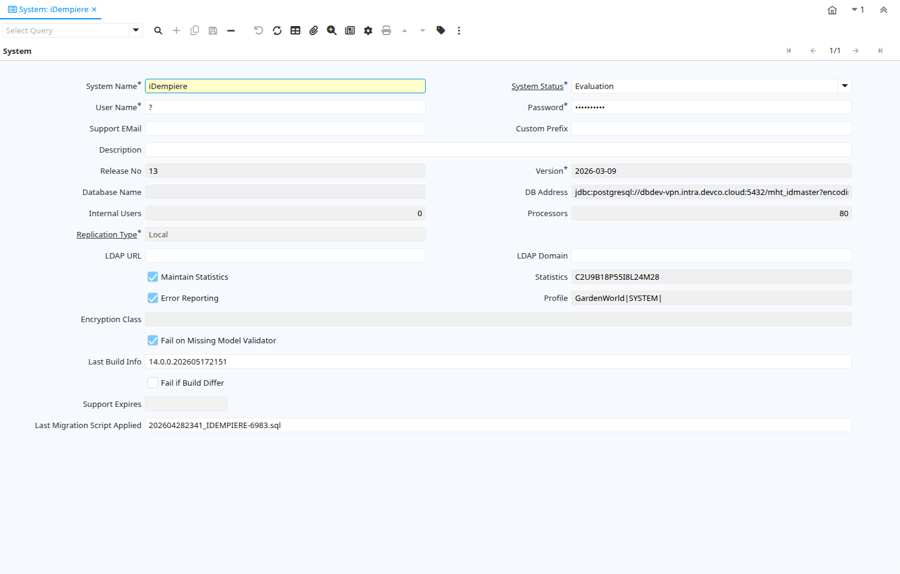

# System

Window ID 246

*01/11/2002 → 02/01/2000*

**Description:** System Definition

**Comment/Help:** Common System Definition - Only one Record - Do not add additional records.

## Tab: System

*Tab Level 0 · Created 01/11/2002 · Updated 18/10/2005*

**Description:** System Definition

**Comment/Help:** Common System Definition.

| **Name** | **Description** | **Comment/Help** | **Technical Data** |
|---|---|---|---|
| System Name | Name your iDempiere System installation, e.g. Joe Block, Inc. | The name if the system to differentiate support contracts | AD_System.Name<small> character varying(60)   String</small> |
| System Status | Status of the system - Support priority depends on system status | System status helps to prioritize support resources | AD_System.SystemStatus<small> character(1)   List</small> |
| User Name |  |  | AD_System.UserName<small> character varying(60)   String</small> |
| Password | Password of any length (case sensitive) | The Password for this User.  Passwords are required to identify authorized users.  For iDempiere Users, you can change the password via the Process "Reset Password". | AD_System.Password<small> character varying(20)   String</small> |
| Support EMail | EMail address to send support information and updates to | If not entered the registered email is used. | AD_System.SupportEMail<small> character varying(60)   String</small> |
| Custom Prefix | Prefix for Custom entities | The prefix listed are ignored as customization for database or entity migration | AD_System.CustomPrefix<small> character varying(60)   String</small> |
| Description | Optional short description of the record | A description is limited to 255 characters. | AD_System.Description<small> character varying(255)   String</small> |
| Release No | Internal Release Number |  | AD_System.ReleaseNo<small> character varying(10)   String</small> |
| Version | Version of the table definition | The Version indicates the version of this table definition. | AD_System.Version<small> character varying(20)   String</small> |
| Database Name | Database Name |  | AD_System.DBInstance<small> character varying(60)   String</small> |
| DB Address | JDBC URL of the database server |  | AD_System.DBAddress<small> character varying(255)   String</small> |
| Internal Users | Number of Internal Users for iDempiere Support | You can purchase professioal support from iDempiere, Inc. or their partners.  See http://www.idempiere.org for details.  | AD_System.SupportUnits<small> numeric(10)   Integer</small> |
| Processors | Number of Database Processors |  | AD_System.NoProcessors<small> numeric(10)   Integer</small> |
| Replication Type | Type of Data Replication | The Type of data Replication determines the direction of the data replication.  &lt;br&gt; Reference means that the data in this system is read only -&gt; &lt;br&gt; Local means that the data in this system is not replicated to other systems - &lt;br&gt; Merge means that the data in this system is synchronized with the other system &lt;-&gt; &lt;br&gt; | AD_System.ReplicationType<small> character(1)   List</small> |
| ID Range Start | Start of the ID Range used | The ID Range allows to restrict the range of the internally used IDs. The standard rages are 0-899,999 for the Application Dictionary 900,000-999,999 for Application Dictionary customizations/extensions and &gt; 1,000,000 for tenant data. The standard system limit is 9,999,999,999 but can easily be extended.  The ID range is on a per table basis. Please note that the ID range is NOT enforced. | AD_System.IDRangeStart<small> numeric   Number</small> |
| ID Range End | End if the ID Range used | The ID Range allows to restrict the range of the internally used IDs. Please note that the ID range is NOT enforced. | AD_System.IDRangeEnd<small> numeric   Number</small> |
| LDAP URL | Connection String to LDAP server starting with ldap:// | LDAP connection string, e.g. ldap://dc.idempiere.org | AD_System.LDAPHost<small> character varying(60)   String</small> |
| LDAP Domain | Directory service domain name - e.g. idempiere.org | If LDAP Host and Domain is specified, the user is authenticated via LDAP. The password in the User table is not used for connecting to iDempiere. | AD_System.LDAPDomain<small> character varying(255)   String</small> |
| Maintain Statistics | Maintain general statistics | Maintain and allow to transfer general statistics (number of tenants, orgs, business partners, users, products, invoices) to get a better feeling for the application use.  This information is not published. | AD_System.IsAllowStatistics<small> character(1)   Yes-No</small> |
| Statistics | Information to help profiling the system for solving support issues | Profile information do not contain sensitive information and are used to support issue detection and diagnostics as well as general anonymous statistics | AD_System.StatisticsInfo<small> character varying(60)   String</small> |
| Error Reporting | Automatically report Errors | To automate error reporting, submit errors to iDempiere. Only error (stack trace) information is submitted (no data or confidential information).  It helps us to react faster and proactively.  If you have a support contract, we will you inform about corrective measures.  This functionality is experimental at this point. | AD_System.IsAutoErrorReport<small> character(1)   Yes-No</small> |
| Profile | Information to help profiling the system for solving support issues | Profile information do not contain sensitive information and are used to support issue detection and diagnostics | AD_System.ProfileInfo<small> character varying(4000)   String</small> |
| Encryption Class | Encryption Class used for securing data content | The class needs to implement the interface org.compiere.util.SecureInterface. You enable it by setting the COMPIERE_SECURE parameter of your Tenant and Server start scripts to the custom class. | AD_System.EncryptionKey<small> character varying(255)   String</small> |
| Fail on Missing Model Validator |  |  | AD_System.IsFailOnMissingModelValidator<small> character(1)   Yes-No</small> |
| Last Build Info |  |  | AD_System.LastBuildInfo<small> character varying(255)   String</small> |
| Fail if Build Differ |  |  | AD_System.IsFailOnBuildDiffer<small> character(1)   Yes-No</small> |
| Support Expires | Date when the iDempiere support expires | Check http://www.idempiere.org for support options | AD_System.SupportExpDate<small> timestamp without time zone   Date</small> |
| Validate Support | Validate Support Contract | The process connects to the iDempiere Support Services server and validates the support contract.  To sign up for support, please go to http://www.idempiere.org | AD_System.Processing<small> character(1)   Button</small> |
| Last Migration Script Applied | Register of the filename for the last migration script applied on this database |  | AD_System.LastMigrationScriptApplied<small> character varying(255)   String</small> |

