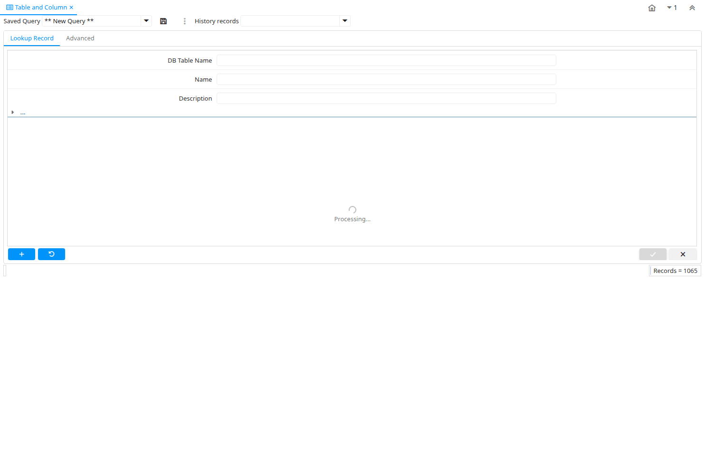

# Table and Column

Window ID 100

*21/05/1999 → 02/01/2000*

**Description:** Maintain Tables and Columns

**Comment/Help:** The Table and Column Window defines all tables with their columns

## Tab: Table

*Tab Level 0 · Created 21/05/1999 · Updated 15/01/2024*

**Description:** Table definitions

**Comment/Help:** Table (header) definition - Note that the name of most tables is automatically synchronized.

| **Name** | **Description** | **Comment/Help** | **Technical Data** |
|---|---|---|---|
| Tenant | Tenant for this installation. | A Tenant is a company or a legal entity. You cannot share data between Tenants. | AD_Table.AD_Client_ID<small> numeric(10)   Table Direct</small> |
| Organization | Organizational entity within tenant | An organization is a unit of your tenant or legal entity - examples are store, department. You can share data between organizations. | AD_Table.AD_Org_ID<small> numeric(10)   Table Direct</small> |
| DB Table Name | Name of the table in the database | The DB Table Name indicates the name of the table in database. | AD_Table.TableName<small> character varying(60)   String</small> |
| Name | Alphanumeric identifier of the entity | The name of an entity (record) is used as an default search option in addition to the search key. The name is up to 60 characters in length. | AD_Table.Name<small> character varying(60)   String</small> |
| Description | Optional short description of the record | A description is limited to 255 characters. | AD_Table.Description<small> character varying(255)   String</small> |
| Comment/Help | Comment or Hint | The Help field contains a hint, comment or help about the use of this item. | AD_Table.Help<small> character varying(2000)   Text</small> |
| Active | The record is active in the system | There are two methods of making records unavailable in the system: One is to delete the record, the other is to de-activate the record. A de-activated record is not available for selection, but available for reports. There are two reasons for de-activating and not deleting records: (1) The system requires the record for audit purposes. (2) The record is referenced by other records. E.g., you cannot delete a Business Partner, if there are invoices for this partner record existing. You de-activate the Business Partner and prevent that this record is used for future entries. | AD_Table.IsActive<small> character(1)   Yes-No</small> |
| View | This is a view | This is a view rather than a table.  A view is always treated as read only in the system. | AD_Table.IsView<small> character(1)   Yes-No</small> |
| Data Access Level | Access Level required | Indicates the access level required for this record or process. | AD_Table.AccessLevel<small> character(1)   List</small> |
| Maintain Change Log | Maintain a log of changes | If selected, a log of all changes is maintained. | AD_Table.IsChangeLog<small> character(1)   Yes-No</small> |
| Replication Type | Type of Data Replication | The Type of data Replication determines the direction of the data replication.  &lt;br&gt; Reference means that the data in this system is read only -&gt; &lt;br&gt; Local means that the data in this system is not replicated to other systems - &lt;br&gt; Merge means that the data in this system is synchronized with the other system &lt;-&gt; &lt;br&gt; | AD_Table.ReplicationType<small> character(1)   List</small> |
| Window | Data entry or display window | The Window field identifies a unique Window in the system. | AD_Table.AD_Window_ID<small> numeric(10)   Table Direct</small> |
| PO Window | Purchase Order Window | Window for Purchase Order (AP) Zooms | AD_Table.PO_Window_ID<small> numeric(10)   Table</small> |
| Records deletable | Indicates if records can be deleted from the database | The Records Deletable checkbox indicates if a record can be deleted from the database.  If records cannot be deleted, you can only deselect the Active flag | AD_Table.IsDeleteable<small> character(1)   Yes-No</small> |
| High Volume | Use Search instead of Pick list | The High Volume Checkbox indicates if a search screen will display as opposed to a pick list for selecting records from this table. | AD_Table.IsHighVolume<small> character(1)   Yes-No</small> |
| Entity Type | Dictionary Entity Type; Determines ownership and synchronization | The Entity Types "Dictionary", "iDempiere" and "Application" might be automatically synchronized and customizations deleted or overwritten.    For customizations, copy the entity and select "User"! | AD_Table.EntityType<small> character varying(40)   Table</small> |
| Create Columns from DB | Create Dictionary Columns of Table not existing as a Column but in the Database | If you have added columns in the database to this table, this procedure creates the Column records in the Dictionary.  Please be aware, that they may deleted, if the entity type is not set to User. | AD_Table.ImportTable<small> character(1)   Button</small> |
| Copy Columns from Table | Create Dictionary Columns for a Table taking another as base |  | AD_Table.CopyColumnsFromTable<small> character varying(1)   Button</small> |
| Centrally maintained | Information maintained in System Element table | The Centrally Maintained checkbox indicates if the Name, Description and Help maintained in 'System Element' table  or 'Window' table. | AD_Table.IsCentrallyMaintained<small> character(1)   Yes-No</small> |
| View Validate |  |  | AD_Table.Processing<small> character(1)   Button</small> |
| Drop view |  |  | AD_Table.DatabaseViewDrop<small> character(1)   Button</small> |
| Copy Components From View | Create dictionary view components for a table taking another as base |  | AD_Table.CopyComponentsFromView<small> character(1)   Button</small> |
| Create Window, Tab and Field from Table | Create Window, Tab and Field record of the Table | This process will take the table definition and create the Window/Tab and field record with these options:&lt;br&gt;  New Window: if selected the process will create a new Window record. Otherwise, the process will create a new tab and add it to the selected window.&lt;br&gt; Create Menu: if selected the process creates the menu record for the new window. | AD_Table.CreateWindowFromTable<small> character(1)   Button</small> |
| Show In Drill Options | This parameter enables the table to be displayed in Drill Assistant - Table tab |  | AD_Table.IsShowInDrillOptions<small> character(1)   Yes-No</small> |
| Partition | This is a partitioned table |  | AD_Table.IsPartition<small> character(1)   Yes-No</small> |
| Create/Update Table Partition | Process which create or update table partitions based on the table and column records | The Create/update partition process will create or update table partitions based on the information in the table and column records | AD_Table.CreatePartition<small> character(1)   Button</small> |

## Tab: › Column

*Tab Level 1 · Created 21/05/1999 · Updated 15/01/2024*

**Description:** Table Column definitions

**Comment/Help:** Defines the columns of a table. Note that the name of the column is automatically synchronized.

| **Name** | **Description** | **Comment/Help** | **Technical Data** |
|---|---|---|---|
| Tenant | Tenant for this installation. | A Tenant is a company or a legal entity. You cannot share data between Tenants. | AD_Column.AD_Client_ID<small> numeric(10)   Table Direct</small> |
| Organization | Organizational entity within tenant | An organization is a unit of your tenant or legal entity - examples are store, department. You can share data between organizations. | AD_Column.AD_Org_ID<small> numeric(10)   Table Direct</small> |
| Table | Database Table information | The Database Table provides the information of the table definition | AD_Column.AD_Table_ID<small> numeric(10)   Table Direct</small> |
| System Element | System Element enables the central maintenance of column description and help. | The System Element allows for the central maintenance of help, descriptions and terminology for a database column. | AD_Column.AD_Element_ID<small> numeric(10)   Search</small> |
| Entity Type | Dictionary Entity Type; Determines ownership and synchronization | The Entity Types "Dictionary", "iDempiere" and "Application" might be automatically synchronized and customizations deleted or overwritten.    For customizations, copy the entity and select "User"! | AD_Column.EntityType<small> character varying(40)   Table</small> |
| DB Column Name | Name of the column in the database | The Column Name indicates the name of a column on a table as defined in the database. | AD_Column.ColumnName<small> character varying(63)   String</small> |
| Column SQL | Virtual Column (r/o) | You can define virtual columns (not stored in the database). If defined, the Column name is the synonym of the SQL expression defined here. The SQL expression must be valid.&lt;br&gt; Example: "Updated-Created" would list the age of the entry in days.&lt;br&gt; It is not recommended to add complex queries in virtual columns as the impact on the database performance can be too expensive.&lt;br&gt; However, you can use the prefix @SQLFIND= for virtual columns that can be used for queries and reports, they have less impact on the database, but as a field they don't show values.&lt;br&gt; Additionally, the prefix @SQL= allows to define a virtual UI column, this is calculated on the fly and can use context variables in the query, virtual UI columns are shown in grid just on the current row, they are not searchable, and not shown in reports. | AD_Column.ColumnSQL<small> character varying(4000)   String</small> |
| Name | Alphanumeric identifier of the entity | The name of an entity (record) is used as an default search option in addition to the search key. The name is up to 60 characters in length. | AD_Column.Name<small> character varying(60)   String</small> |
| Description | Optional short description of the record | A description is limited to 255 characters. | AD_Column.Description<small> character varying(255)   String</small> |
| Comment/Help | Comment or Hint | The Help field contains a hint, comment or help about the use of this item. | AD_Column.Help<small> character varying(2000)   Text</small> |
| Placeholder |  |  | AD_Column.Placeholder<small> character varying(255)   String</small> |
| Active | The record is active in the system | There are two methods of making records unavailable in the system: One is to delete the record, the other is to de-activate the record. A de-activated record is not available for selection, but available for reports. There are two reasons for de-activating and not deleting records: (1) The system requires the record for audit purposes. (2) The record is referenced by other records. E.g., you cannot delete a Business Partner, if there are invoices for this partner record existing. You de-activate the Business Partner and prevent that this record is used for future entries. | AD_Column.IsActive<small> character(1)   Yes-No</small> |
| Version | Version of the table definition | The Version indicates the version of this table definition. | AD_Column.Version<small> numeric   Amount</small> |
| Reference | System Reference and Validation | The Reference could be a display type, list or table validation. | AD_Column.AD_Reference_ID<small> numeric(10)   Table</small> |
| Dynamic Validation | Dynamic Validation Rule | These rules define how an entry is determined to valid. You can use variables for dynamic (context sensitive) validation. | AD_Column.AD_Val_Rule_ID<small> numeric(10)   Table Direct</small> |
| Length | Length of the column in the database | The Length indicates the length of a column as defined in the database. | AD_Column.FieldLength<small> numeric(10)   Integer</small> |
| Dynamic Validation (Lookup) | Override Dynamic Validation Rule for Lookup Window | For some situations the dynamic validation rule for a Lookup window should be different from user data entry window.  | AD_Column.AD_Val_Rule_Lookup_ID<small> numeric(10)   Table</small> |
| HTML | Text has HTML tags |  | AD_Column.IsHtml<small> character(1)   Yes-No</small> |
| Auto complete | Automatic completion for text fields | The autocompletion uses all existing values (from the same tenant and organization) of the field. | AD_Column.IsAutocomplete<small> character(1)   Yes-No</small> |
| Format Pattern | The pattern used to format a number or date. | A string complying with either Java SimpleDateFormat or DecimalFormat pattern syntax used to override the default presentation format of a date or number type field. | AD_Column.FormatPattern<small> character varying(22)   String</small> |
| Value Format | Format of the value; Can contain fixed format elements, Variables: "_lLoOaAcCa09", or ~regex | &lt;B&gt;Validation elements:&lt;/B&gt;  ~regex - Validates a regular expression   	(Space) any character _	Space (fixed character) l	any Letter a..Z NO space L	any Letter a..Z NO space converted to upper case o	any Letter a..Z or space O	any Letter a..Z or space converted to upper case a	any Letters &amp; Digits NO space A	any Letters &amp; Digits NO space converted to upper case c	any Letters &amp; Digits or space C	any Letters &amp; Digits or space converted to upper case 0	Digits 0..9 NO space 9	Digits 0..9 or space  Example of format "(000)_000-0000" | AD_Column.VFormat<small> character varying(255)   String</small> |
| Process | Process or Report | The Process field identifies a unique Process or Report in the system. | AD_Column.AD_Process_ID<small> numeric(10)   Table Direct</small> |
| Info Window | Info and search/select Window | The Info window is used to search and select records as well as display information relevant to the selection. | AD_Column.AD_InfoWindow_ID<small> numeric(10)   Table Direct</small> |
| Chart |  |  | AD_Column.AD_Chart_ID<small> numeric(10)   Table Direct</small> |
| Dashboard Content |  |  | AD_Column.PA_DashboardContent_ID<small> numeric(10)   Table Direct</small> |
| Reference Key | Required to specify, if data type is Table or List | The Reference Value indicates where the reference values are stored.  It must be specified if the data type is Table or List.   | AD_Column.AD_Reference_Value_ID<small> numeric(10)   Table</small> |
| Min. Value | Minimum Value for a field | The Minimum Value indicates the lowest  allowable value for a field. use format yyyy-mm-dd for Date | AD_Column.ValueMin<small> character varying(20)   String</small> |
| Max. Value | Maximum Value for a field | The Maximum Value indicates the highest allowable value for a field. use format yyyy-mm-dd for Date | AD_Column.ValueMax<small> character varying(20)   String</small> |
| Key column | This column is the key in this table | The key column must also be display sequence 0 in the field definition and may be hidden. | AD_Column.IsKey<small> character(1)   Yes-No</small> |
| Parent link column | This column is a link to the parent table (e.g. header from lines) - incl. Association key columns | The Parent checkbox indicates if this column is a link to the parent table. | AD_Column.IsParent<small> character(1)   Yes-No</small> |
| Constraint Name |  |  | AD_Column.FKConstraintName<small> character varying(63)   String</small> |
| Constraint Type |  |  | AD_Column.FKConstraintType<small> character(1)   List</small> |
| Constraint Message |  |  | AD_Column.FKConstraintMsg_ID<small> numeric(10)   Search</small> |
| Default Logic | Default value hierarchy, separated by ; | The defaults are evaluated in the order of definition, the first not null value becomes the default value of the column. The values are separated by comma or semicolon. a) Literals:. 'Text' or 123 b) Variables - in format @Variable@ - Login e.g. #Date, #AD_Org_ID, #AD_Tenant_ID - Accounting Schema: e.g. $C_AcctSchema_ID, $C_Calendar_ID - Global defaults: e.g. DateFormat - Window values (all Picks, CheckBoxes, RadioButtons, and DateDoc/DateAcct) c) SQL code with the tag: @SQL=SELECT something AS DefaultValue FROM ... The SQL statement can contain variables.  There can be no other value other than the SQL statement. The default is only evaluated, if no user preference is defined.  Default definitions are ignored for record columns as Key, Parent, Tenant as well as Buttons. | AD_Column.DefaultValue<small> character varying(2000)   Text</small> |
| Mandatory | Data entry is required in this column | The field must have a value for the record to be saved to the database. | AD_Column.IsMandatory<small> character(1)   Yes-No</small> |
| Updatable | Determines, if the field can be updated | The Updatable checkbox indicates if a field can be updated by the user. | AD_Column.IsUpdateable<small> character(1)   Yes-No</small> |
| Always Updatable | The column is always updateable, even if the record is not active or processed | If selected and if the window / tab is not read only, you can always update the column.  This might be useful for comments, etc. | AD_Column.IsAlwaysUpdateable<small> character(1)   Yes-No</small> |
| Synchronize Column | Change database table definition from application dictionary | When selected, the database column definition is updated based on your entries in the Column definition of the Application Dictionary. Note that not all changes are supported by the database and may result in an error. | AD_Column.IsSyncDatabase<small> character(1)   Button</small> |
| Always Updatable Logic | Logic to determine if field is Updatable irrespective if record's active status or processed status. This logic Applicable only if Always Updatable is N. | format := &#123;expression&#125; [&#123;logic&#125; &#123;expression&#125;]&lt;br&gt;  expression := @&#123;context&#125;@&#123;operand&#125;&#123;value&#125; or @&#123;context&#125;@&#123;operand&#125;&#123;value&#125;&lt;br&gt;  logic := \|&amp;()&lt;br&gt; context := any global or window context &lt;br&gt; value := strings or numbers&lt;br&gt; logic operators	:= AND or OR with the previous result from left to right &lt;br&gt; operand := eq&#123;=&#125;, gt&#123;&amp;gt;&#125;, le&#123;&amp;lt;&#125;, not&#123;~^!&#125; &lt;br&gt; Examples: &lt;br&gt; &lt;ul&gt; &lt;li&gt; @AD_Table_ID@=14 \| @Language@!GERGER&lt;/li&gt; &lt;li&gt; @PriceLimit@&gt;10 \| @PriceList@&gt;@PriceActual@&lt;/li&gt; &lt;li&gt; @Name@&gt;J&lt;/li&gt; &lt;/ul&gt; Strings may be in single quotes (optional) | AD_Column.AlwaysUpdatableLogic<small> character varying(2000)   Text</small> |
| Column Encryption | Test and enable Column Encryption | To enable storage encryption or remove encryption is dangerous as you may loose data. You need to verify that the column is big enough to hold the encrypted value.  You can provide your own encryption method, but cannot change it once enabled.  &lt;br&gt; The default implementation supports US ASCII String conversion (not Unicode, Numbers, Dates)&lt;br&gt; Note that support is restricted to setup and test, but not data recovery. | AD_Column.IsEncrypted<small> character(1)   Button</small> |
| Read Only Logic | Logic to determine if field is read only (applies only when field is read-write) | format := &#123;expression&#125; [&#123;logic&#125; &#123;expression&#125;]&lt;br&gt;  expression := @&#123;context&#125;@&#123;operand&#125;&#123;value&#125; or @&#123;context&#125;@&#123;operand&#125;&#123;value&#125;&lt;br&gt;  logic := &#123;\|&#125;\|&#123;&amp;&#125;&lt;br&gt; context := any global or window context &lt;br&gt; value := strings or numbers&lt;br&gt; logic operators	:= AND or OR with the previous result from left to right &lt;br&gt; operand := eq&#123;=&#125;, gt&#123;&amp;gt;&#125;, le&#123;&amp;lt;&#125;, not&#123;~^!&#125; &lt;br&gt; Examples: &lt;br&gt; &lt;ul&gt; &lt;li&gt; @AD_Table_ID@=14 \| @Language@!GERGER&lt;/li&gt; &lt;li&gt; @PriceLimit@&gt;10 \| @PriceList@&gt;@PriceActual@&lt;/li&gt; &lt;li&gt; @Name@&gt;J&lt;/li&gt; &lt;/ul&gt; Strings may be in single quotes (optional) | AD_Column.ReadOnlyLogic<small> character varying(2000)   Text</small> |
| Mandatory Logic |  |  | AD_Column.MandatoryLogic<small> character varying(2000)   Text</small> |
| Identifier | This column is part of the record identifier | The Identifier checkbox indicates that this column is part of the identifier or key for this table.   | AD_Column.IsIdentifier<small> character(1)   Yes-No</small> |
| Sequence | Method of ordering records; lowest number comes first | The Sequence indicates the order of records | AD_Column.SeqNo<small> numeric(10)   Integer</small> |
| Selection Column | Is this column used for finding rows in windows | If selected, the column is listed in the first find window tab and in the selection part of the window | AD_Column.IsSelectionColumn<small> character(1)   Yes-No</small> |
| Selection Column Sequence | Selection Column Sequence | For ordering sequence of selection column | AD_Column.SeqNoSelection<small> numeric(10)   Integer</small> |
| Allow Logging | Determine if a column must be recorded into the change log |  | AD_Column.IsAllowLogging<small> character(1)   Yes-No</small> |
| Allow Copy | Determine if a column must be copied when pushing the button to copy record |  | AD_Column.IsAllowCopy<small> character(1)   Yes-No</small> |
| Secure content | Defines whether content must be treated as secure |  | AD_Column.IsSecure<small> character(1)   Yes-No</small> |
| Toolbar Button | Show the button on the toolbar, the window, or both | The IsToolbarButton field indicates if this button is part of the toolbar's process button popup list, or render as field in window, or both. | AD_Column.IsToolbarButton<small> character(1)   List</small> |
| Translated | This column is translated | The Translated checkbox indicates if this column is translated. | AD_Column.IsTranslated<small> character(1)   Yes-No</small> |
| Callout | Fully qualified class names and method - separated by semicolons | A Callout allow you to create Java extensions to perform certain tasks always after a value changed. Callouts should not be used for validation but consequences of a user selecting a certain value. The callout is a Java class implementing org.compiere.model.Callout and a method name to call.  Example: "org.compiere.model.CalloutRequest.copyText" instantiates the class "CalloutRequest" and calls the method "copyText". You can have multiple callouts by separating them via a semicolon | AD_Column.Callout<small> character varying(255)   String</small> |
| Partition Key | This is a partition key |  | AD_Column.IsPartitionKey<small> character(1)   Yes-No</small> |
| Partition Key Sequence | Indicates the order of partition keys | The Partition Key Sequence indicates the order of the partition keys where the lowest number comes first | AD_Column.SeqNoPartition<small> numeric(10)   Integer</small> |
| Partitioning Method | Indicates how the Table is partitioned | The Partitioning Method indicates how the Table is partitioned (List or Range). List partitioning - The data distribution is defined by a discrete list of values. Range Partitioning - The data is distributed based on a range of values. | AD_Column.PartitioningMethod<small> character varying(2)   List</small> |
| Range Partition Interval | Indicates the interval used in a range partitioning | The Range Partition Interval indicates the interval used in a range partitioning (date or number). Examples of date intervals: 1 year; 6 months; Examples of number intervals: 5000; 100000; | AD_Column.RangePartitionInterval<small> character varying(30)   String</small> |

## Tab: › › Column Translation

*Tab Level 2 · Created 06/09/2004 · Updated 27/10/2024*

**Description:** Column Translation

**Comment/Help:** Do not translate - overwritten / translated automatically

| **Name** | **Description** | **Comment/Help** | **Technical Data** |
|---|---|---|---|
| Tenant | Tenant for this installation. | A Tenant is a company or a legal entity. You cannot share data between Tenants. | AD_Column_Trl.AD_Client_ID<small> numeric(10)   Table Direct</small> |
| Organization | Organizational entity within tenant | An organization is a unit of your tenant or legal entity - examples are store, department. You can share data between organizations. | AD_Column_Trl.AD_Org_ID<small> numeric(10)   Table Direct</small> |
| Column | Column in the table | Link to the database column of the table | AD_Column_Trl.AD_Column_ID<small> numeric(10)   Table Direct</small> |
| Language | Language for this entity | The Language identifies the language to use for display and formatting | AD_Column_Trl.AD_Language<small> character varying(6)   Table</small> |
| Name | Alphanumeric identifier of the entity | The name of an entity (record) is used as an default search option in addition to the search key. The name is up to 60 characters in length. | AD_Column_Trl.Name<small> character varying(60)   String</small> |
| Placeholder |  |  | AD_Column_Trl.Placeholder<small> character varying(255)   String</small> |
| Active | The record is active in the system | There are two methods of making records unavailable in the system: One is to delete the record, the other is to de-activate the record. A de-activated record is not available for selection, but available for reports. There are two reasons for de-activating and not deleting records: (1) The system requires the record for audit purposes. (2) The record is referenced by other records. E.g., you cannot delete a Business Partner, if there are invoices for this partner record existing. You de-activate the Business Partner and prevent that this record is used for future entries. | AD_Column_Trl.IsActive<small> character(1)   Yes-No</small> |
| Translated | This column is translated | The Translated checkbox indicates if this column is translated. | AD_Column_Trl.IsTranslated<small> character(1)   Yes-No</small> |

## Tab: › › Used in Field

*Tab Level 2 · Created 12/12/2009 · Updated 16/11/2012*

| **Name** | **Description** | **Comment/Help** | **Technical Data** |
|---|---|---|---|
| Tab | Tab within a Window | The Tab indicates a tab that displays within a window. | AD_Field.AD_Tab_ID<small> numeric(10)   Table Direct</small> |
| Field | Field on a database table | The Field identifies a field on a database table. | AD_Field.AD_Field_ID<small> numeric(10)   ID</small> |
| Name | Alphanumeric identifier of the entity | The name of an entity (record) is used as an default search option in addition to the search key. The name is up to 60 characters in length. | AD_Field.Name<small> character varying(60)   String</small> |

## Tab: › Zoom Condition

*Tab Level 1 · Created 28/02/2013 · Updated 28/02/2013*

| **Name** | **Description** | **Comment/Help** | **Technical Data** |
|---|---|---|---|
| Tenant | Tenant for this installation. | A Tenant is a company or a legal entity. You cannot share data between Tenants. | AD_ZoomCondition.AD_Client_ID<small> numeric(10)   Table Direct</small> |
| Organization | Organizational entity within tenant | An organization is a unit of your tenant or legal entity - examples are store, department. You can share data between organizations. | AD_ZoomCondition.AD_Org_ID<small> numeric(10)   Table Direct</small> |
| Table | Database Table information | The Database Table provides the information of the table definition | AD_ZoomCondition.AD_Table_ID<small> numeric(10)   Table Direct</small> |
| Sequence | Method of ordering records; lowest number comes first | The Sequence indicates the order of records | AD_ZoomCondition.SeqNo<small> numeric(10)   Integer</small> |
| Entity Type | Dictionary Entity Type; Determines ownership and synchronization | The Entity Types "Dictionary", "iDempiere" and "Application" might be automatically synchronized and customizations deleted or overwritten.    For customizations, copy the entity and select "User"! | AD_ZoomCondition.EntityType<small> character varying(40)   Table</small> |
| Name | Alphanumeric identifier of the entity | The name of an entity (record) is used as an default search option in addition to the search key. The name is up to 60 characters in length. | AD_ZoomCondition.Name<small> character varying(60)   String</small> |
| Description | Optional short description of the record | A description is limited to 255 characters. | AD_ZoomCondition.Description<small> character varying(255)   String</small> |
| Zoom Logic | the result determines if the zoom condition is applied | format := &#123;expression&#125; [&#123;logic&#125; &#123;expression&#125;]&lt;br&gt;  expression := @&#123;context&#125;@&#123;operand&#125;&#123;value&#125; or @&#123;context&#125;@&#123;operand&#125;&#123;value&#125;&lt;br&gt;  logic := &#123;\|&#125;\|&#123;&amp;&#125;&lt;br&gt; context := any global or window context &lt;br&gt; value := strings or numbers&lt;br&gt; logic operators	:= AND or OR with the previous result from left to right &lt;br&gt; operand := eq&#123;=&#125;, gt&#123;&amp;gt;&#125;, le&#123;&amp;lt;&#125;, not&#123;~^!&#125; &lt;br&gt; Examples: &lt;br&gt; &lt;ul&gt; &lt;li&gt; @AD_Table_ID@=14 \| @Language@!GERGER&lt;/li&gt; &lt;li&gt; @PriceLimit@&gt;10 \| @PriceList@&gt;@PriceActual@&lt;/li&gt; &lt;li&gt; @Name@&gt;J&lt;/li&gt; &lt;/ul&gt; Strings may be in single quotes (optional) | AD_ZoomCondition.ZoomLogic<small> character varying(2000)   Text</small> |
| Sql WHERE | Fully qualified SQL WHERE clause | The Where Clause indicates the SQL WHERE clause to use for record selection. The WHERE clause is added to the query. Fully qualified means "tablename.columnname". | AD_ZoomCondition.WhereClause<small> character varying(2000)   Text</small> |
| Window | Data entry or display window | The Window field identifies a unique Window in the system. | AD_ZoomCondition.AD_Window_ID<small> numeric(10)   Table Direct</small> |
| Active | The record is active in the system | There are two methods of making records unavailable in the system: One is to delete the record, the other is to de-activate the record. A de-activated record is not available for selection, but available for reports. There are two reasons for de-activating and not deleting records: (1) The system requires the record for audit purposes. (2) The record is referenced by other records. E.g., you cannot delete a Business Partner, if there are invoices for this partner record existing. You de-activate the Business Partner and prevent that this record is used for future entries. | AD_ZoomCondition.IsActive<small> character(1)   Yes-No</small> |

## Tab: › Table Script Validator

*Tab Level 1 · Created 01/02/2008 · Updated 22/07/2013*

| **Name** | **Description** | **Comment/Help** | **Technical Data** |
|---|---|---|---|
| Tenant | Tenant for this installation. | A Tenant is a company or a legal entity. You cannot share data between Tenants. | AD_Table_ScriptValidator.AD_Client_ID<small> numeric(10)   Table Direct</small> |
| Organization | Organizational entity within tenant | An organization is a unit of your tenant or legal entity - examples are store, department. You can share data between organizations. | AD_Table_ScriptValidator.AD_Org_ID<small> numeric(10)   Table Direct</small> |
| Table | Database Table information | The Database Table provides the information of the table definition | AD_Table_ScriptValidator.AD_Table_ID<small> numeric(10)   Table Direct</small> |
| Event Model Validator |  |  | AD_Table_ScriptValidator.EventModelValidator<small> character varying(4)   List</small> |
| Rule |  |  | AD_Table_ScriptValidator.AD_Rule_ID<small> numeric(10)   Table Direct</small> |
| Sequence | Method of ordering records; lowest number comes first | The Sequence indicates the order of records | AD_Table_ScriptValidator.SeqNo<small> numeric(10)   Integer</small> |
| Active | The record is active in the system | There are two methods of making records unavailable in the system: One is to delete the record, the other is to de-activate the record. A de-activated record is not available for selection, but available for reports. There are two reasons for de-activating and not deleting records: (1) The system requires the record for audit purposes. (2) The record is referenced by other records. E.g., you cannot delete a Business Partner, if there are invoices for this partner record existing. You de-activate the Business Partner and prevent that this record is used for future entries. | AD_Table_ScriptValidator.IsActive<small> character(1)   Yes-No</small> |

## Tab: › Table Translation

*Tab Level 1 · Created 07/07/2004 · Updated 27/10/2024*

**Description:** Table Translation

**Comment/Help:** Note that many Table names will be overwritten / translated automatically

| **Name** | **Description** | **Comment/Help** | **Technical Data** |
|---|---|---|---|
| Tenant | Tenant for this installation. | A Tenant is a company or a legal entity. You cannot share data between Tenants. | AD_Table_Trl.AD_Client_ID<small> numeric(10)   Table Direct</small> |
| Organization | Organizational entity within tenant | An organization is a unit of your tenant or legal entity - examples are store, department. You can share data between organizations. | AD_Table_Trl.AD_Org_ID<small> numeric(10)   Table Direct</small> |
| Table | Database Table information | The Database Table provides the information of the table definition | AD_Table_Trl.AD_Table_ID<small> numeric(10)   Table Direct</small> |
| Language | Language for this entity | The Language identifies the language to use for display and formatting | AD_Table_Trl.AD_Language<small> character varying(6)   Table</small> |
| Name | Alphanumeric identifier of the entity | The name of an entity (record) is used as an default search option in addition to the search key. The name is up to 60 characters in length. | AD_Table_Trl.Name<small> character varying(60)   String</small> |
| Active | The record is active in the system | There are two methods of making records unavailable in the system: One is to delete the record, the other is to de-activate the record. A de-activated record is not available for selection, but available for reports. There are two reasons for de-activating and not deleting records: (1) The system requires the record for audit purposes. (2) The record is referenced by other records. E.g., you cannot delete a Business Partner, if there are invoices for this partner record existing. You de-activate the Business Partner and prevent that this record is used for future entries. | AD_Table_Trl.IsActive<small> character(1)   Yes-No</small> |
| Translated | This column is translated | The Translated checkbox indicates if this column is translated. | AD_Table_Trl.IsTranslated<small> character(1)   Yes-No</small> |

## Tab: › Table Index

*Tab Level 1 · Created 04/07/2013 · Updated 01/08/2019*

| **Name** | **Description** | **Comment/Help** | **Technical Data** |
|---|---|---|---|
| Tenant | Tenant for this installation. | A Tenant is a company or a legal entity. You cannot share data between Tenants. | AD_TableIndex.AD_Client_ID<small> numeric(10)   Table Direct</small> |
| Organization | Organizational entity within tenant | An organization is a unit of your tenant or legal entity - examples are store, department. You can share data between organizations. | AD_TableIndex.AD_Org_ID<small> numeric(10)   Table Direct</small> |
| Table | Database Table information | The Database Table provides the information of the table definition | AD_TableIndex.AD_Table_ID<small> numeric(10)   Table Direct</small> |
| Name | Alphanumeric identifier of the entity | The name of an entity (record) is used as an default search option in addition to the search key. The name is up to 60 characters in length. | AD_TableIndex.Name<small> character varying(63)   String</small> |
| Description | Optional short description of the record | A description is limited to 255 characters. | AD_TableIndex.Description<small> character varying(255)   String</small> |
| Comment/Help | Comment or Hint | The Help field contains a hint, comment or help about the use of this item. | AD_TableIndex.Help<small> character varying(2000)   Text</small> |
| Active | The record is active in the system | There are two methods of making records unavailable in the system: One is to delete the record, the other is to de-activate the record. A de-activated record is not available for selection, but available for reports. There are two reasons for de-activating and not deleting records: (1) The system requires the record for audit purposes. (2) The record is referenced by other records. E.g., you cannot delete a Business Partner, if there are invoices for this partner record existing. You de-activate the Business Partner and prevent that this record is used for future entries. | AD_TableIndex.IsActive<small> character(1)   Yes-No</small> |
| Create Constraint |  |  | AD_TableIndex.IsCreateConstraint<small> character(1)   Yes-No</small> |
| Unique |  |  | AD_TableIndex.IsUnique<small> character(1)   Yes-No</small> |
| Key column | This column is the key in this table | The key column must also be display sequence 0 in the field definition and may be hidden. | AD_TableIndex.IsKey<small> character(1)   Yes-No</small> |
| Message | System Message | Information and Error messages | AD_TableIndex.AD_Message_ID<small> numeric(10)   Search</small> |
| Entity Type | Dictionary Entity Type; Determines ownership and synchronization | The Entity Types "Dictionary", "iDempiere" and "Application" might be automatically synchronized and customizations deleted or overwritten.    For customizations, copy the entity and select "User"! | AD_TableIndex.EntityType<small> character varying(40)   Table</small> |
| Index Validate |  |  | AD_TableIndex.Processing<small> character(1)   Button</small> |
| Drop Table Index |  |  | AD_TableIndex.TableIndexDrop<small> character(1)   Button</small> |

## Tab: › › Index Column

*Tab Level 2 · Created 04/07/2013 · Updated 01/08/2019*

| **Name** | **Description** | **Comment/Help** | **Technical Data** |
|---|---|---|---|
| Tenant | Tenant for this installation. | A Tenant is a company or a legal entity. You cannot share data between Tenants. | AD_IndexColumn.AD_Client_ID<small> numeric(10)   Table Direct</small> |
| Organization | Organizational entity within tenant | An organization is a unit of your tenant or legal entity - examples are store, department. You can share data between organizations. | AD_IndexColumn.AD_Org_ID<small> numeric(10)   Table Direct</small> |
| Table Index |  |  | AD_IndexColumn.AD_TableIndex_ID<small> numeric(10)   Table Direct</small> |
| Column | Column in the table | Link to the database column of the table | AD_IndexColumn.AD_Column_ID<small> numeric(10)   Table Direct</small> |
| Column SQL | Virtual Column (r/o) | You can define virtual columns (not stored in the database). If defined, the Column name is the synonym of the SQL expression defined here. The SQL expression must be valid.&lt;br&gt; Example: "Updated-Created" would list the age of the entry in days | AD_IndexColumn.ColumnSQL<small> character varying(255)   String</small> |
| Active | The record is active in the system | There are two methods of making records unavailable in the system: One is to delete the record, the other is to de-activate the record. A de-activated record is not available for selection, but available for reports. There are two reasons for de-activating and not deleting records: (1) The system requires the record for audit purposes. (2) The record is referenced by other records. E.g., you cannot delete a Business Partner, if there are invoices for this partner record existing. You de-activate the Business Partner and prevent that this record is used for future entries. | AD_IndexColumn.IsActive<small> character(1)   Yes-No</small> |
| Sequence | Method of ordering records; lowest number comes first | The Sequence indicates the order of records | AD_IndexColumn.SeqNo<small> numeric(10)   Integer</small> |
| Entity Type | Dictionary Entity Type; Determines ownership and synchronization | The Entity Types "Dictionary", "iDempiere" and "Application" might be automatically synchronized and customizations deleted or overwritten.    For customizations, copy the entity and select "User"! | AD_IndexColumn.EntityType<small> character varying(40)   Table</small> |

## Tab: › View Component

*Tab Level 1 · Created 04/07/2013 · Updated 28/07/2017*

| **Name** | **Description** | **Comment/Help** | **Technical Data** |
|---|---|---|---|
| Tenant | Tenant for this installation. | A Tenant is a company or a legal entity. You cannot share data between Tenants. | AD_ViewComponent.AD_Client_ID<small> numeric(10)   Table Direct</small> |
| Organization | Organizational entity within tenant | An organization is a unit of your tenant or legal entity - examples are store, department. You can share data between organizations. | AD_ViewComponent.AD_Org_ID<small> numeric(10)   Table Direct</small> |
| Table | Database Table information | The Database Table provides the information of the table definition | AD_ViewComponent.AD_Table_ID<small> numeric(10)   Table Direct</small> |
| Active | The record is active in the system | There are two methods of making records unavailable in the system: One is to delete the record, the other is to de-activate the record. A de-activated record is not available for selection, but available for reports. There are two reasons for de-activating and not deleting records: (1) The system requires the record for audit purposes. (2) The record is referenced by other records. E.g., you cannot delete a Business Partner, if there are invoices for this partner record existing. You de-activate the Business Partner and prevent that this record is used for future entries. | AD_ViewComponent.IsActive<small> character(1)   Yes-No</small> |
| Name | Alphanumeric identifier of the entity | The name of an entity (record) is used as an default search option in addition to the search key. The name is up to 60 characters in length. | AD_ViewComponent.Name<small> character varying(50)   String</small> |
| Description | Optional short description of the record | A description is limited to 255 characters. | AD_ViewComponent.Description<small> character varying(255)   String</small> |
| Comment/Help | Comment or Hint | The Help field contains a hint, comment or help about the use of this item. | AD_ViewComponent.Help<small> character varying(2000)   Text</small> |
| Sequence | Method of ordering records; lowest number comes first | The Sequence indicates the order of records | AD_ViewComponent.SeqNo<small> numeric(10)   Integer</small> |
| Is UNION ALL | The component view is UNION ALL | When this is set the component view is joined to the others using UNION ALL, otherwise just UNION | AD_ViewComponent.IsUnionAll<small> character(1)   Yes-No</small> |
| Distinct | Select Distinct |  | AD_ViewComponent.IsDistinct<small> character(1)   Yes-No</small> |
| Sql FROM | SQL FROM clause | The Select Clause indicates the SQL FROM clause to use for selecting the record for a measure calculation. It can have JOIN clauses. It must include the FROM itself. | AD_ViewComponent.FromClause<small> character varying(4000)   String</small> |
| Sql WHERE | Fully qualified SQL WHERE clause | The Where Clause indicates the SQL WHERE clause to use for record selection. It must include the WHERE itself. Fully qualified means "tablename.columnname". | AD_ViewComponent.WhereClause<small> character varying(2000)   Text</small> |
| Other SQL Clause | Other SQL Clause | Any other complete clause like GROUP BY, HAVING, ORDER BY, etc. after WHERE clause. | AD_ViewComponent.OtherClause<small> character varying(2000)   Text</small> |
| Entity Type | Dictionary Entity Type; Determines ownership and synchronization | The Entity Types "Dictionary", "iDempiere" and "Application" might be automatically synchronized and customizations deleted or overwritten.    For customizations, copy the entity and select "User"! | AD_ViewComponent.EntityType<small> character varying(40)   Table</small> |
| Referenced Table |  |  | AD_ViewComponent.Referenced_Table_ID<small> numeric(10)   Table</small> |

## Tab: › › View Column

*Tab Level 2 · Created 04/07/2013 · Updated 28/07/2017*

| **Name** | **Description** | **Comment/Help** | **Technical Data** |
|---|---|---|---|
| Tenant | Tenant for this installation. | A Tenant is a company or a legal entity. You cannot share data between Tenants. | AD_ViewColumn.AD_Client_ID<small> numeric(10)   Table Direct</small> |
| Organization | Organizational entity within tenant | An organization is a unit of your tenant or legal entity - examples are store, department. You can share data between organizations. | AD_ViewColumn.AD_Org_ID<small> numeric(10)   Table Direct</small> |
| Database View Component |  |  | AD_ViewColumn.AD_ViewComponent_ID<small> numeric(10)   Table Direct</small> |
| Column SQL | Virtual Column (r/o) | You can define virtual columns (not stored in the database). If defined, the Column name is the synonym of the SQL expression defined here. The SQL expression must be valid.&lt;br&gt; Example: "Updated-Created" would list the age of the entry in days | AD_ViewColumn.ColumnSQL<small> character varying(2000)   String</small> |
| DB Column Name | Name of the column in the database | The Column Name indicates the name of a column on a table as defined in the database. | AD_ViewColumn.ColumnName<small> character varying(63)   String</small> |
| Description | Optional short description of the record | A description is limited to 255 characters. | AD_ViewColumn.Description<small> character varying(255)   String</small> |
| Comment/Help | Comment or Hint | The Help field contains a hint, comment or help about the use of this item. | AD_ViewColumn.Help<small> character varying(2000)   Text</small> |
| Active | The record is active in the system | There are two methods of making records unavailable in the system: One is to delete the record, the other is to de-activate the record. A de-activated record is not available for selection, but available for reports. There are two reasons for de-activating and not deleting records: (1) The system requires the record for audit purposes. (2) The record is referenced by other records. E.g., you cannot delete a Business Partner, if there are invoices for this partner record existing. You de-activate the Business Partner and prevent that this record is used for future entries. | AD_ViewColumn.IsActive<small> character(1)   Yes-No</small> |
| Sequence | Method of ordering records; lowest number comes first | The Sequence indicates the order of records | AD_ViewColumn.SeqNo<small> numeric(10)   Integer</small> |
| Entity Type | Dictionary Entity Type; Determines ownership and synchronization | The Entity Types "Dictionary", "iDempiere" and "Application" might be automatically synchronized and customizations deleted or overwritten.    For customizations, copy the entity and select "User"! | AD_ViewColumn.EntityType<small> character varying(40)   Table</small> |
| Database Data Type |  |  | AD_ViewColumn.DBDataType<small> character(1)   List</small> |

## Tab: › Table Partition

*Tab Level 1 · Created 04/12/2023 · Updated 27/12/2023*

| **Name** | **Description** | **Comment/Help** | **Technical Data** |
|---|---|---|---|
| Tenant | Tenant for this installation. | A Tenant is a company or a legal entity. You cannot share data between Tenants. | AD_TablePartition.AD_Client_ID<small> numeric(10)   Table Direct</small> |
| Organization | Organizational entity within tenant | An organization is a unit of your tenant or legal entity - examples are store, department. You can share data between organizations. | AD_TablePartition.AD_Org_ID<small> numeric(10)   Table Direct</small> |
| Table | Database Table information | The Database Table provides the information of the table definition | AD_TablePartition.AD_Table_ID<small> numeric(10)   Table Direct</small> |
| Column | Column in the table | Link to the database column of the table | AD_TablePartition.AD_Column_ID<small> numeric(10)   Table Direct</small> |
| Name | Alphanumeric identifier of the entity | The name of an entity (record) is used as an default search option in addition to the search key. The name is up to 60 characters in length. | AD_TablePartition.Name<small> character varying(63)   String</small> |
| Expression | SQL clause for partition |  | AD_TablePartition.ExpressionPartition<small> character varying(250)   String</small> |
| Parent Partition | Parent table partition |  | AD_TablePartition.Parent_TablePartition_ID<small> numeric(10)   Search</small> |
| Attached | Partition attached to table |  | AD_TablePartition.IsPartitionAttached<small> character(1)   Yes-No</small> |
| Detach/re-attach Table Partition | Detach or re-attach table partition | Detach an attached table partition or re-attach a detached table partition | AD_TablePartition.Processing<small> character(1)   Button</small> |
| Active | The record is active in the system | There are two methods of making records unavailable in the system: One is to delete the record, the other is to de-activate the record. A de-activated record is not available for selection, but available for reports. There are two reasons for de-activating and not deleting records: (1) The system requires the record for audit purposes. (2) The record is referenced by other records. E.g., you cannot delete a Business Partner, if there are invoices for this partner record existing. You de-activate the Business Partner and prevent that this record is used for future entries. | AD_TablePartition.IsActive<small> character(1)   Yes-No</small> |

## Tab: › Table Attribute Set

*Tab Level 1 · Created 31/12/2024 · Updated 31/12/2024*

| **Name** | **Description** | **Comment/Help** | **Technical Data** |
|---|---|---|---|
| Tenant | Tenant for this installation. | A Tenant is a company or a legal entity. You cannot share data between Tenants. | AD_TableAttributeSet.AD_Client_ID<small> numeric(10)   Search</small> |
| Organization | Organizational entity within tenant | An organization is a unit of your tenant or legal entity - examples are store, department. You can share data between organizations. | AD_TableAttributeSet.AD_Org_ID<small> numeric(10)   Table Direct</small> |
| Table | Database Table information | The Database Table provides the information of the table definition | AD_TableAttributeSet.AD_Table_ID<small> numeric(10)   Search</small> |
| Attribute Set | Product Attribute Set | Define Product Attribute Sets to add additional attributes and values to the product. You need to define a Attribute Set if you want to enable Serial and Lot Number tracking. | AD_TableAttributeSet.M_AttributeSet_ID<small> numeric(10)   Table Direct</small> |
| Active | The record is active in the system | There are two methods of making records unavailable in the system: One is to delete the record, the other is to de-activate the record. A de-activated record is not available for selection, but available for reports. There are two reasons for de-activating and not deleting records: (1) The system requires the record for audit purposes. (2) The record is referenced by other records. E.g., you cannot delete a Business Partner, if there are invoices for this partner record existing. You de-activate the Business Partner and prevent that this record is used for future entries. | AD_TableAttributeSet.IsActive<small> character(1)   Yes-No</small> |

