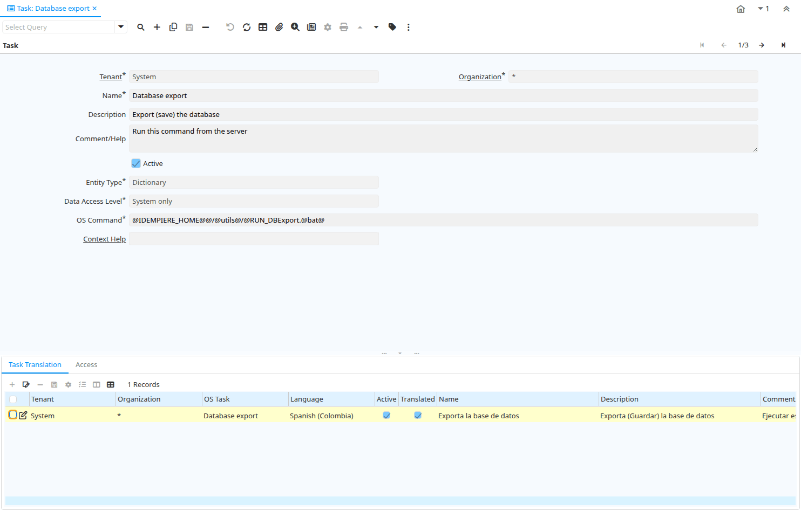

# Task

Window ID 114

*11/06/1999 → 02/01/2000*

**Description:** Maintain Tasks

**Comment/Help:** The Maintain Tasks window defines the different tasks used in workflows and the access level for those tasks.

## Tab: Task

*Tab Level 0 · Created 21/06/1999 · Updated 06/08/2013*

**Description:** Task

**Comment/Help:** The Task Tab defines the unique tasks that will be used.

| **Name** | **Description** | **Comment/Help** | **Technical Data** |
|---|---|---|---|
| Tenant | Tenant for this installation. | A Tenant is a company or a legal entity. You cannot share data between Tenants. | AD_Task.AD_Client_ID<small> numeric(10)   Table Direct</small> |
| Organization | Organizational entity within tenant | An organization is a unit of your tenant or legal entity - examples are store, department. You can share data between organizations. | AD_Task.AD_Org_ID<small> numeric(10)   Table Direct</small> |
| Name | Alphanumeric identifier of the entity | The name of an entity (record) is used as an default search option in addition to the search key. The name is up to 60 characters in length. | AD_Task.Name<small> character varying(60)   String</small> |
| Description | Optional short description of the record | A description is limited to 255 characters. | AD_Task.Description<small> character varying(255)   String</small> |
| Comment/Help | Comment or Hint | The Help field contains a hint, comment or help about the use of this item. | AD_Task.Help<small> character varying(2000)   Text</small> |
| Active | The record is active in the system | There are two methods of making records unavailable in the system: One is to delete the record, the other is to de-activate the record. A de-activated record is not available for selection, but available for reports. There are two reasons for de-activating and not deleting records: (1) The system requires the record for audit purposes. (2) The record is referenced by other records. E.g., you cannot delete a Business Partner, if there are invoices for this partner record existing. You de-activate the Business Partner and prevent that this record is used for future entries. | AD_Task.IsActive<small> character(1)   Yes-No</small> |
| Entity Type | Dictionary Entity Type; Determines ownership and synchronization | The Entity Types "Dictionary", "iDempiere" and "Application" might be automatically synchronized and customizations deleted or overwritten.    For customizations, copy the entity and select "User"! | AD_Task.EntityType<small> character varying(40)   Table</small> |
| Data Access Level | Access Level required | Indicates the access level required for this record or process. | AD_Task.AccessLevel<small> character(1)   List</small> |
| OS Command | Operating System Command | The OS Command is for optionally defining a command to that will be part of this task.  For example it can be used to starting a back up process or performing a file transfer. | AD_Task.OS_Command<small> character varying(2000)   String</small> |
| Context Help |  |  | AD_Task.AD_CtxHelp_ID<small> numeric(10)   Search</small> |

## Tab: › Task Translation

*Tab Level 1 · Created 11/06/1999 · Updated 27/10/2024*

| **Name** | **Description** | **Comment/Help** | **Technical Data** |
|---|---|---|---|
| Tenant | Tenant for this installation. | A Tenant is a company or a legal entity. You cannot share data between Tenants. | AD_Task_Trl.AD_Client_ID<small> numeric(10)   Table Direct</small> |
| Organization | Organizational entity within tenant | An organization is a unit of your tenant or legal entity - examples are store, department. You can share data between organizations. | AD_Task_Trl.AD_Org_ID<small> numeric(10)   Table Direct</small> |
| OS Task | Operation System Task | The Task field identifies a Operation System Task in the system. | AD_Task_Trl.AD_Task_ID<small> numeric(10)   Table Direct</small> |
| Language | Language for this entity | The Language identifies the language to use for display and formatting | AD_Task_Trl.AD_Language<small> character varying(6)   Table</small> |
| Active | The record is active in the system | There are two methods of making records unavailable in the system: One is to delete the record, the other is to de-activate the record. A de-activated record is not available for selection, but available for reports. There are two reasons for de-activating and not deleting records: (1) The system requires the record for audit purposes. (2) The record is referenced by other records. E.g., you cannot delete a Business Partner, if there are invoices for this partner record existing. You de-activate the Business Partner and prevent that this record is used for future entries. | AD_Task_Trl.IsActive<small> character(1)   Yes-No</small> |
| Translated | This column is translated | The Translated checkbox indicates if this column is translated. | AD_Task_Trl.IsTranslated<small> character(1)   Yes-No</small> |
| Name | Alphanumeric identifier of the entity | The name of an entity (record) is used as an default search option in addition to the search key. The name is up to 60 characters in length. | AD_Task_Trl.Name<small> character varying(60)   String</small> |
| Description | Optional short description of the record | A description is limited to 255 characters. | AD_Task_Trl.Description<small> character varying(255)   String</small> |
| Comment/Help | Comment or Hint | The Help field contains a hint, comment or help about the use of this item. | AD_Task_Trl.Help<small> character varying(2000)   Text</small> |

## Tab: › Access

*Tab Level 1 · Created 04/09/2000 · Updated 06/08/2013*

**Description:** Task Access

**Comment/Help:** The Task Access Tab defines the Roles that will have access to this task and the type of access each Role is granted.

| **Name** | **Description** | **Comment/Help** | **Technical Data** |
|---|---|---|---|
| Tenant | Tenant for this installation. | A Tenant is a company or a legal entity. You cannot share data between Tenants. | AD_Task_Access.AD_Client_ID<small> numeric(10)   Table Direct</small> |
| Organization | Organizational entity within tenant | An organization is a unit of your tenant or legal entity - examples are store, department. You can share data between organizations. | AD_Task_Access.AD_Org_ID<small> numeric(10)   Table Direct</small> |
| OS Task | Operation System Task | The Task field identifies a Operation System Task in the system. | AD_Task_Access.AD_Task_ID<small> numeric(10)   Table Direct</small> |
| Role | Responsibility Role | The Role determines security and access a user who has this Role will have in the System. | AD_Task_Access.AD_Role_ID<small> numeric(10)   Table Direct</small> |
| Active | The record is active in the system | There are two methods of making records unavailable in the system: One is to delete the record, the other is to de-activate the record. A de-activated record is not available for selection, but available for reports. There are two reasons for de-activating and not deleting records: (1) The system requires the record for audit purposes. (2) The record is referenced by other records. E.g., you cannot delete a Business Partner, if there are invoices for this partner record existing. You de-activate the Business Partner and prevent that this record is used for future entries. | AD_Task_Access.IsActive<small> character(1)   Yes-No</small> |
| Read Write | Field is read / write | The Read Write indicates that this field may be read and updated. | AD_Task_Access.IsReadWrite<small> character(1)   Yes-No</small> |

