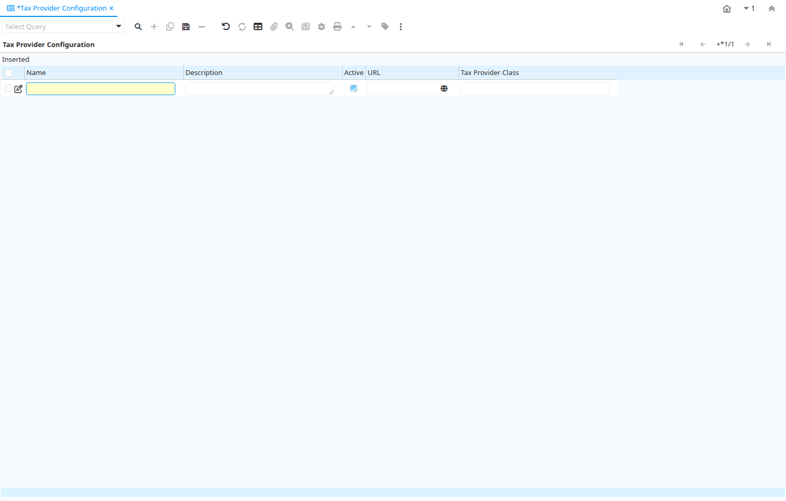

# Tax Provider Configuration

Window ID 200044

*14/08/2013 → 14/08/2013*

## Tab: Tax Provider Configuration

*Tab Level 0 · Created 14/08/2013 · Updated 14/08/2013*

| **Name** | **Description** | **Comment/Help** | **Technical Data** |
|---|---|---|---|
| Tenant | Tenant for this installation. | A Tenant is a company or a legal entity. You cannot share data between Tenants. | C_TaxProviderCfg.AD_Client_ID<small> numeric(10)   Table Direct</small> |
| Organization | Organizational entity within tenant | An organization is a unit of your tenant or legal entity - examples are store, department. You can share data between organizations. | C_TaxProviderCfg.AD_Org_ID<small> numeric(10)   Table Direct</small> |
| Name | Alphanumeric identifier of the entity | The name of an entity (record) is used as an default search option in addition to the search key. The name is up to 60 characters in length. | C_TaxProviderCfg.Name<small> character varying(120)   String</small> |
| Description | Optional short description of the record | A description is limited to 255 characters. | C_TaxProviderCfg.Description<small> character varying(255)   Text</small> |
| Active | The record is active in the system | There are two methods of making records unavailable in the system: One is to delete the record, the other is to de-activate the record. A de-activated record is not available for selection, but available for reports. There are two reasons for de-activating and not deleting records: (1) The system requires the record for audit purposes. (2) The record is referenced by other records. E.g., you cannot delete a Business Partner, if there are invoices for this partner record existing. You de-activate the Business Partner and prevent that this record is used for future entries. | C_TaxProviderCfg.IsActive<small> character(1)   Yes-No</small> |
| URL | Full URL address - e.g. http://www.idempiere.org | The URL defines an fully qualified web address like http://www.idempiere.org | C_TaxProviderCfg.URL<small> character varying(120)   URL</small> |
| Tax Provider Class |  |  | C_TaxProviderCfg.TaxProviderClass<small> character varying(60)   String</small> |

