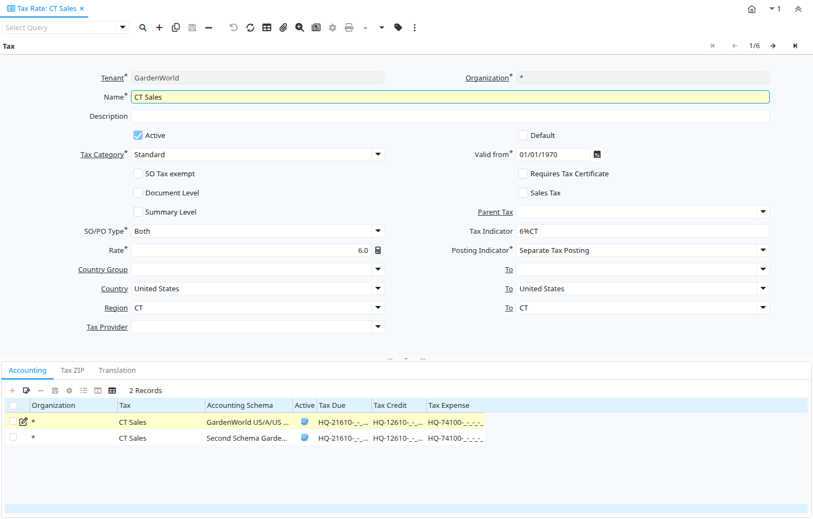

# Tax Rate

Window ID 137

*09/08/1999 → 03/03/2008*

**Description:** Maintain Taxes and their Rates

**Comment/Help:** The Tax Rate Window defines the different taxes used for each tax category.  For example Sales Tax must be defined for each State in which it applies.

## Tab: Tax

*Tab Level 0 · Created 09/08/1999 · Updated 03/03/2008*

**Description:** Tax definition

**Comment/Help:** The Tax Rate Window defines the different taxes used for each tax category.  For example Sales Tax must be defined for each State in which it applies.&lt;br&gt;
If you have multiple taxes create a summary level tax with the approximate total tax rate and the actual tax rates pointing to the summary level tax as their parent. When entering the order or invoice lines the tax is estimated the correct tax is calculated when the document is processed.  The tax is always calculated from the line net amount. If one tax has a the tax basis the line net amount and another tax you need to adjust the percentage to result in the correct amount.&lt;br&gt;
Valid From/To is determined by the parent tax.

| **Name** | **Description** | **Comment/Help** | **Technical Data** |
|---|---|---|---|
| Tenant | Tenant for this installation. | A Tenant is a company or a legal entity. You cannot share data between Tenants. | C_Tax.AD_Client_ID<small> numeric(10)   Table Direct</small> |
| Organization | Organizational entity within tenant | An organization is a unit of your tenant or legal entity - examples are store, department. You can share data between organizations. | C_Tax.AD_Org_ID<small> numeric(10)   Table Direct</small> |
| Name | Alphanumeric identifier of the entity | The name of an entity (record) is used as an default search option in addition to the search key. The name is up to 60 characters in length. | C_Tax.Name<small> character varying(60)   String</small> |
| Description | Optional short description of the record | A description is limited to 255 characters. | C_Tax.Description<small> character varying(255)   String</small> |
| Active | The record is active in the system | There are two methods of making records unavailable in the system: One is to delete the record, the other is to de-activate the record. A de-activated record is not available for selection, but available for reports. There are two reasons for de-activating and not deleting records: (1) The system requires the record for audit purposes. (2) The record is referenced by other records. E.g., you cannot delete a Business Partner, if there are invoices for this partner record existing. You de-activate the Business Partner and prevent that this record is used for future entries. | C_Tax.IsActive<small> character(1)   Yes-No</small> |
| Default | Default value | The Default Checkbox indicates if this record will be used as a default value. | C_Tax.IsDefault<small> character(1)   Yes-No</small> |
| Tax Category | Tax Category | The Tax Category provides a method of grouping similar taxes.  For example, Sales Tax or Value Added Tax. | C_Tax.C_TaxCategory_ID<small> numeric(10)   Table Direct</small> |
| Valid from | Valid from including this date (first day) | The Valid From date indicates the first day of a date range | C_Tax.ValidFrom<small> timestamp without time zone   Date</small> |
| SO Tax exempt | Business partner is exempt from tax on sales | If a business partner is exempt from tax on sales, the exempt tax rate is used. For this, you need to set up a tax rate with a 0% rate and indicate that this is your tax exempt rate.  This is required for tax reporting, so that you can track tax exempt transactions. | C_Tax.IsTaxExempt<small> character(1)   Yes-No</small> |
| Requires Tax Certificate | This tax rate requires the Business Partner to be tax exempt | The Requires Tax Certificate indicates that a tax certificate is required for a Business Partner to be tax exempt. | C_Tax.RequiresTaxCertificate<small> character(1)   Yes-No</small> |
| Document Level | Tax is calculated on document level (rather than line by line) | If the tax is calculated on document level, all lines with that tax rate are added before calculating the total tax for the document. Otherwise the tax is calculated per line and then added. Due to rounding, the tax amount can differ. | C_Tax.IsDocumentLevel<small> character(1)   Yes-No</small> |
| Sales Tax | This is a sales tax (i.e. not a value added tax) | If selected AP tax is handled as expense, otherwise it is handled as a VAT credit. | C_Tax.IsSalesTax<small> character(1)   Yes-No</small> |
| Summary Level | This is a summary entity | A summary entity represents a branch in a tree rather than an end-node. Summary entities are used for reporting and do not have own values. | C_Tax.IsSummary<small> character(1)   Yes-No</small> |
| Parent Tax | Parent Tax indicates a tax that is made up of multiple taxes | The Parent Tax indicates a tax that is a reference for multiple taxes.  This allows you to charge multiple taxes on a document by entering the Parent Tax | C_Tax.Parent_Tax_ID<small> numeric(10)   Table</small> |
| SO/PO Type | Sales Tax applies to sales situations, Purchase Tax to purchase situations | Sales Tax: charged when selling - examples: Sales Tax, Output VAT (payable) Purchase Tax: tax charged when purchasing - examples: Use Tax, Input VAT (receivable) | C_Tax.SOPOType<small> character(1)   List</small> |
| Tax Indicator | Short form for Tax to be printed on documents | The Tax Indicator identifies the short name that will print on documents referencing this tax. | C_Tax.TaxIndicator<small> character varying(10)   String</small> |
| Rate | Rate or Tax or Exchange | The Rate indicates the percentage to be multiplied by the source to arrive at the tax or exchange amount. | C_Tax.Rate<small> numeric   Number</small> |
| Posting Indicator | Type of input tax (deductible and non deductible) | Separate Tax Posting: Tax is calculated on the full amount of the item and posted separately. Distribute Tax with Relevant Expense: Tax amount is added to the item amount during account posting time and for updating of Product Cost. | C_Tax.TaxPostingIndicator<small> character(1)   List</small> |
| Country Group |  |  | C_Tax.C_CountryGroupFrom_ID<small> numeric(10)   Table</small> |
| To |  |  | C_Tax.C_CountryGroupTo_ID<small> numeric(10)   Table</small> |
| Country | Country  | The Country defines a Country.  Each Country must be defined before it can be used in any document. | C_Tax.C_Country_ID<small> numeric(10)   Table</small> |
| To | Receiving Country | The To Country indicates the receiving country on a document | C_Tax.To_Country_ID<small> numeric(10)   Table</small> |
| Region | Identifies a geographical Region | The Region identifies a unique Region for this Country. | C_Tax.C_Region_ID<small> numeric(10)   Table</small> |
| To | Receiving Region | The To Region indicates the receiving region on a document | C_Tax.To_Region_ID<small> numeric(10)   Table</small> |
| Tax Provider |  |  | C_Tax.C_TaxProvider_ID<small> numeric(10)   Table Direct</small> |

## Tab: › Accounting

*Tab Level 1 · Created 19/12/2000 · Updated 05/03/2013*

**Description:** Accounting

**Comment/Help:** The Accounting Tab defines the accounting parameters to be used for transactions referencing this Tax Rate.

| **Name** | **Description** | **Comment/Help** | **Technical Data** |
|---|---|---|---|
| Tenant | Tenant for this installation. | A Tenant is a company or a legal entity. You cannot share data between Tenants. | C_Tax_Acct.AD_Client_ID<small> numeric(10)   Table Direct</small> |
| Organization | Organizational entity within tenant | An organization is a unit of your tenant or legal entity - examples are store, department. You can share data between organizations. | C_Tax_Acct.AD_Org_ID<small> numeric(10)   Table Direct</small> |
| Tax | Tax identifier | The Tax indicates the type of tax used in document line. | C_Tax_Acct.C_Tax_ID<small> numeric(10)   Table Direct</small> |
| Accounting Schema | Rules for accounting | An Accounting Schema defines the rules used in accounting such as costing method, currency and calendar | C_Tax_Acct.C_AcctSchema_ID<small> numeric(10)   Table Direct</small> |
| Active | The record is active in the system | There are two methods of making records unavailable in the system: One is to delete the record, the other is to de-activate the record. A de-activated record is not available for selection, but available for reports. There are two reasons for de-activating and not deleting records: (1) The system requires the record for audit purposes. (2) The record is referenced by other records. E.g., you cannot delete a Business Partner, if there are invoices for this partner record existing. You de-activate the Business Partner and prevent that this record is used for future entries. | C_Tax_Acct.IsActive<small> character(1)   Yes-No</small> |
| Tax Due | Account for Tax you have to pay | The Tax Due Account indicates the account used to record taxes that you are liable to pay. | C_Tax_Acct.T_Due_Acct<small> numeric(10)   Account</small> |
| Tax Credit | Account for Tax you can reclaim | The Tax Credit Account indicates the account used to record taxes that can be reclaimed | C_Tax_Acct.T_Credit_Acct<small> numeric(10)   Account</small> |
| Tax Expense | Account for paid tax you cannot reclaim | The Tax Expense Account indicates the account used to record the taxes that have been paid that cannot be reclaimed. | C_Tax_Acct.T_Expense_Acct<small> numeric(10)   Account</small> |

## Tab: › Tax ZIP

*Tab Level 1 · Created 12/03/2004 · Updated 16/11/2012*

**Description:** Tax Postal/ZIP

**Comment/Help:** For local tax you may have to define a list of (ranges of) postal codes or ZIPs

| **Name** | **Description** | **Comment/Help** | **Technical Data** |
|---|---|---|---|
| Tenant | Tenant for this installation. | A Tenant is a company or a legal entity. You cannot share data between Tenants. | C_TaxPostal.AD_Client_ID<small> numeric(10)   Table Direct</small> |
| Organization | Organizational entity within tenant | An organization is a unit of your tenant or legal entity - examples are store, department. You can share data between organizations. | C_TaxPostal.AD_Org_ID<small> numeric(10)   Table Direct</small> |
| Tax | Tax identifier | The Tax indicates the type of tax used in document line. | C_TaxPostal.C_Tax_ID<small> numeric(10)   Table Direct</small> |
| Active | The record is active in the system | There are two methods of making records unavailable in the system: One is to delete the record, the other is to de-activate the record. A de-activated record is not available for selection, but available for reports. There are two reasons for de-activating and not deleting records: (1) The system requires the record for audit purposes. (2) The record is referenced by other records. E.g., you cannot delete a Business Partner, if there are invoices for this partner record existing. You de-activate the Business Partner and prevent that this record is used for future entries. | C_TaxPostal.IsActive<small> character(1)   Yes-No</small> |
| ZIP | Postal code | The Postal Code or ZIP identifies the postal code for this entity's address. | C_TaxPostal.Postal<small> character varying(10)   String</small> |
| ZIP To | Postal code to | Consecutive range to | C_TaxPostal.Postal_To<small> character varying(10)   String</small> |

## Tab: › Translation

*Tab Level 1 · Created 17/02/2003 · Updated 27/10/2024*

| **Name** | **Description** | **Comment/Help** | **Technical Data** |
|---|---|---|---|
| Tenant | Tenant for this installation. | A Tenant is a company or a legal entity. You cannot share data between Tenants. | C_Tax_Trl.AD_Client_ID<small> numeric(10)   Table Direct</small> |
| Organization | Organizational entity within tenant | An organization is a unit of your tenant or legal entity - examples are store, department. You can share data between organizations. | C_Tax_Trl.AD_Org_ID<small> numeric(10)   Table Direct</small> |
| Tax | Tax identifier | The Tax indicates the type of tax used in document line. | C_Tax_Trl.C_Tax_ID<small> numeric(10)   Table Direct</small> |
| Language | Language for this entity | The Language identifies the language to use for display and formatting | C_Tax_Trl.AD_Language<small> character varying(6)   Table</small> |
| Active | The record is active in the system | There are two methods of making records unavailable in the system: One is to delete the record, the other is to de-activate the record. A de-activated record is not available for selection, but available for reports. There are two reasons for de-activating and not deleting records: (1) The system requires the record for audit purposes. (2) The record is referenced by other records. E.g., you cannot delete a Business Partner, if there are invoices for this partner record existing. You de-activate the Business Partner and prevent that this record is used for future entries. | C_Tax_Trl.IsActive<small> character(1)   Yes-No</small> |
| Translated | This column is translated | The Translated checkbox indicates if this column is translated. | C_Tax_Trl.IsTranslated<small> character(1)   Yes-No</small> |
| Name | Alphanumeric identifier of the entity | The name of an entity (record) is used as an default search option in addition to the search key. The name is up to 60 characters in length. | C_Tax_Trl.Name<small> character varying(60)   String</small> |
| Description | Optional short description of the record | A description is limited to 255 characters. | C_Tax_Trl.Description<small> character varying(255)   String</small> |
| Tax Indicator | Short form for Tax to be printed on documents | The Tax Indicator identifies the short name that will print on documents referencing this tax. | C_Tax_Trl.TaxIndicator<small> character varying(10)   String</small> |

