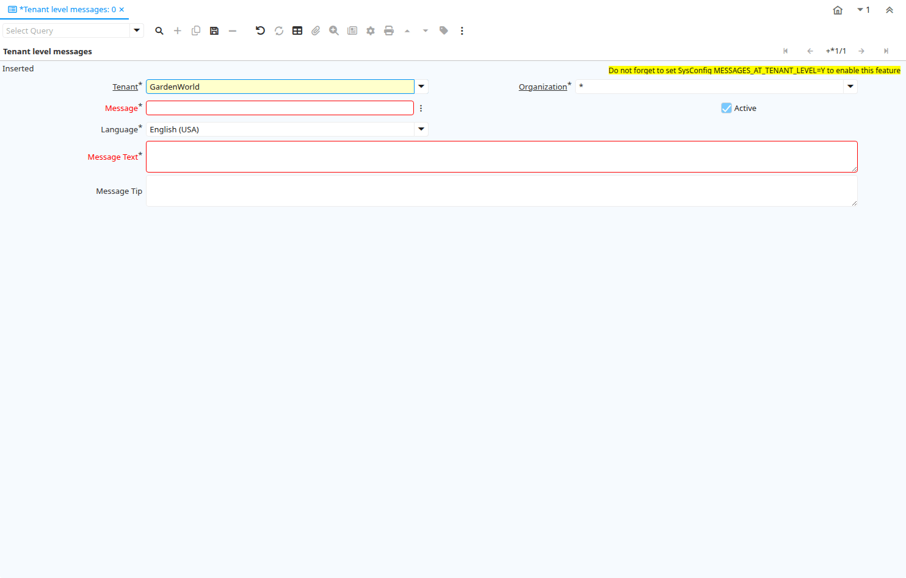

# Tenant level messages

Window ID 200120

*04/01/2022 → 17/01/2025*

## Tab: Tenant level messages

*Tab Level 0 · Created 04/01/2022 · Updated 28/01/2026*

| **Name** | **Description** | **Comment/Help** | **Technical Data** |
|---|---|---|---|
| Tenant | Tenant for this installation. | A Tenant is a company or a legal entity. You cannot share data between Tenants. | AD_Message_Trl.AD_Client_ID<small> numeric(10)   Table Direct</small> |
| Organization | Organizational entity within tenant | An organization is a unit of your tenant or legal entity - examples are store, department. You can share data between organizations. | AD_Message_Trl.AD_Org_ID<small> numeric(10)   Table Direct</small> |
| Message | System Message | Information and Error messages | AD_Message_Trl.AD_Message_ID<small> numeric(10)   Search</small> |
| Active | The record is active in the system | There are two methods of making records unavailable in the system: One is to delete the record, the other is to de-activate the record. A de-activated record is not available for selection, but available for reports. There are two reasons for de-activating and not deleting records: (1) The system requires the record for audit purposes. (2) The record is referenced by other records. E.g., you cannot delete a Business Partner, if there are invoices for this partner record existing. You de-activate the Business Partner and prevent that this record is used for future entries. | AD_Message_Trl.IsActive<small> character(1)   Yes-No</small> |
| Language | Language for this entity | The Language identifies the language to use for display and formatting | AD_Message_Trl.AD_Language<small> character varying(6)   Table</small> |
| Message Text | Textual Informational, Menu or Error Message | The Message Text indicates the message that will display  | AD_Message_Trl.MsgText<small> character varying(2000)   Text</small> |
| Message Tip | Additional tip or help for this message | The Message Tip defines additional help or information about this message. | AD_Message_Trl.MsgTip<small> character varying(2000)   Text</small> |

