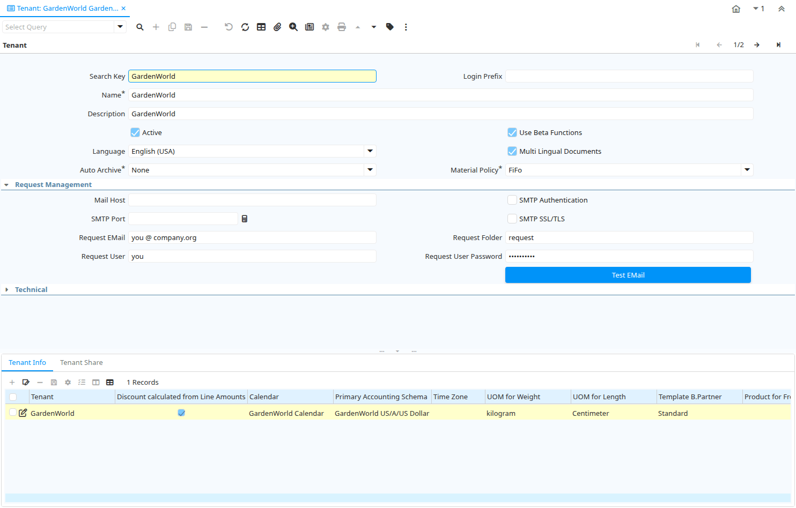

# Tenant

Window ID 109

*11/06/1999 → 10/03/2022*

**Description:** Maintain Tenants

**Comment/Help:** The Tenant is the highest level of an independent business entity.  Each Tenant will have one or more Organizations reporting to it.  Each Tenant defines the accounting parameters (Accounting Schema, Tree definition, Non Monetary UOM's). To create new Tenants, run the Initial Tenant Setup with the System Administrator Role.
Do not create a new tenant in this window, but use "Initial Tenant Setup" to set up the required security and access rules. If you create a new tenant here, you will not be able to view it and also the required tenant infrastructure would not have been set up.

## Tab: Tenant

*Tab Level 0 · Created 19/06/1999 · Updated 10/03/2022*

**Description:** Tenant Definition

**Comment/Help:** The Tenant Definition Tab defines a unique tenant.
Do not create a new tenant in this window, but use "Initial Tenant Setup" (System Administrator Role) to set up the required security and access rules. If you create a new tenant here, you will not be able to view it and also the required tenant infrastructure would not have been set up.

| **Name** | **Description** | **Comment/Help** | **Technical Data** |
|---|---|---|---|
| Search Key | Search key for the record in the format required - must be unique | A search key allows you a fast method of finding a particular record. If you leave the search key empty, the system automatically creates a numeric number.  The document sequence used for this fallback number is defined in the "Maintain Sequence" window with the name "DocumentNo_&lt;TableName&gt;", where TableName is the actual name of the table (e.g. C_Order). | AD_Client.Value<small> character varying(40)   String</small> |
| Login Prefix |  |  | AD_Client.LoginPrefix<small> character varying(40)   String</small> |
| Name | Alphanumeric identifier of the entity | The name of an entity (record) is used as an default search option in addition to the search key. The name is up to 60 characters in length. | AD_Client.Name<small> character varying(60)   String</small> |
| Description | Optional short description of the record | A description is limited to 255 characters. | AD_Client.Description<small> character varying(255)   String</small> |
| Active | The record is active in the system | There are two methods of making records unavailable in the system: One is to delete the record, the other is to de-activate the record. A de-activated record is not available for selection, but available for reports. There are two reasons for de-activating and not deleting records: (1) The system requires the record for audit purposes. (2) The record is referenced by other records. E.g., you cannot delete a Business Partner, if there are invoices for this partner record existing. You de-activate the Business Partner and prevent that this record is used for future entries. | AD_Client.IsActive<small> character(1)   Yes-No</small> |
| Use Beta Functions | Enable the use of Beta Functionality | The exact scope of Beta Functionality is listed in the release note.  It is usually not recommended to enable Beta functionality in production environments. | AD_Client.IsUseBetaFunctions<small> character(1)   Yes-No</small> |
| Language | Language for this entity | The Language identifies the language to use for display and formatting | AD_Client.AD_Language<small> character varying(6)   Table</small> |
| Multi Lingual Documents | Documents are Multi Lingual | If selected, you enable multi lingual documents and need to maintain translations for entities used in documents (examples: Products, Payment Terms, ...).&lt;br&gt; Please note, that the base language is always English. | AD_Client.IsMultiLingualDocument<small> character(1)   Yes-No</small> |
| Auto Archive | Enable and level of automatic Archive of documents | iDempiere allows to automatically create archives of Documents (e.g. Invoices) or Reports. You view the archived material with the Archive Viewer | AD_Client.AutoArchive<small> character(1)   List</small> |
| Material Policy | Material Movement Policy | The Material Movement Policy determines how the stock is flowing (FiFo or LiFo) if a specific Product Instance was not selected.  The policy can not contradict the costing method (e.g. FiFo movement policy and LiFo costing method). | AD_Client.MMPolicy<small> character(1)   List</small> |
| Password Policies |  |  | AD_Client.AD_PasswordRule_ID<small> numeric(10)   Table Direct</small> |
| Mail Host | Hostname of Mail Server for SMTP and IMAP | The host name of the Mail Server for this tenant with SMTP services to send mail, and IMAP to process incoming mail. | AD_Client.SMTPHost<small> character varying(60)   String</small> |
| SMTP Authentication | Your mail server requires Authentication | Some email servers require authentication before sending emails.  If yes, users are required to define their email user name and password.  If authentication is required and no user name and password is required, delivery will fail. | AD_Client.IsSmtpAuthorization<small> character(1)   Yes-No</small> |
| SMTP Port | SMTP Port Number |  | AD_Client.SMTPPort<small> numeric(10)   Integer</small> |
| SMTP SSL/TLS | Use SSL/TLS for SMTP |  | AD_Client.IsSecureSMTP<small> character(1)   Yes-No</small> |
| Request EMail | EMail address to send automated mails from or receive mails for automated processing (fully qualified) | EMails for requests, alerts and escalation are sent from this email address as well as delivery information if the sales rep does not have an email account. The address must be filly qualified (e.g. joe.smith@company.com) and should be a valid address. | AD_Client.RequestEMail<small> character varying(60)   String</small> |
| Request Folder | EMail folder to process incoming emails; if empty INBOX is used | Email folder used to read emails to process as requests, If left empty the default mailbox (INBOX) will be used. Requires IMAP services. | AD_Client.RequestFolder<small> character varying(20)   String</small> |
| Request User | User Name (ID) of the email owner | EMail user name for requests, alerts and escalation are sent from this email address as well as delivery information if the sales rep does not have an email account. Required, if your mail server requires authentication as well as for processing incoming mails. | AD_Client.RequestUser<small> character varying(60)   String</small> |
| Request User Password | Password of the user name (ID) for mail processing |  | AD_Client.RequestUserPW<small> character varying(255)   String</small> |
| Test EMail | Test EMail Connection | Test EMail Connection based on info defined. An EMail is sent from the request user to the request user.  Also, the web store mail settings are tested. | AD_Client.EMailTest<small> character(1)   Button</small> |
| Model Validation Classes | List of data model validation classes separated by ; | List of classes implementing the interface org.compiere.model.ModelValidator, separated by semicolon. The class is called for the tenant and allows to validate documents in the prepare stage and monitor model changes. | AD_Client.ModelValidationClasses<small> character varying(255)   String</small> |
| Store Archive On File System |  |  | AD_Client.StoreArchiveOnFileSystem<small> character(1)   Yes-No</small> |
| Windows Archive Path |  |  | AD_Client.WindowsArchivePath<small> character varying(255)   String</small> |
| Is Use ASP |  |  | AD_Client.IsUseASP<small> character(1)   Yes-No</small> |
| Unix Archive Path |  |  | AD_Client.UnixArchivePath<small> character varying(255)   String</small> |
| Replication Strategy | Data Replication Strategy | The Data Replication Strategy determines what and how tables are replicated  | AD_Client.AD_ReplicationStrategy_ID<small> numeric(10)   Table Direct</small> |
| Authentication Type |  |  | AD_Client.AuthenticationType<small> character varying(10)   List</small> |

## Tab: › Tenant Info

*Tab Level 1 · Created 09/07/1999 · Updated 10/03/2022*

**Description:** Tenant Info

**Comment/Help:** The Tenant Info Tab defines the details for each tenant.  The accounting rules and high level defaults are defined here. The Calendar is used to determine if a period is open or closed.

| **Name** | **Description** | **Comment/Help** | **Technical Data** |
|---|---|---|---|
| Tenant | Tenant for this installation. | A Tenant is a company or a legal entity. You cannot share data between Tenants. | AD_ClientInfo.AD_Client_ID<small> numeric(10)   Table Direct</small> |
| Discount calculated from Line Amounts | Payment Discount calculation does not include Taxes and Charges | If the payment discount is calculated from line amounts only, the tax and charge amounts are not included. This is e.g. business practice in the US.  If not selected the total invoice amount is used to calculate the payment discount. | AD_ClientInfo.IsDiscountLineAmt<small> character(1)   Yes-No</small> |
| Calendar | Accounting Calendar Name | The Calendar uniquely identifies an accounting calendar.  Multiple calendars can be used.  For example you may need a standard calendar that runs from Jan 1 to Dec 31 and a fiscal calendar that runs from July 1 to June 30. | AD_ClientInfo.C_Calendar_ID<small> numeric(10)   Table Direct</small> |
| Primary Accounting Schema | Primary rules for accounting | An Accounting  Schema defines the rules used accounting such as costing method, currency and calendar. | AD_ClientInfo.C_AcctSchema1_ID<small> numeric(10)   Table</small> |
| Time Zone | Time zone name |  | AD_ClientInfo.TimeZone<small> character varying(60)   Time Zone</small> |
| UOM for Length | Standard Unit of Measure for Length | The Standard UOM for Length indicates the UOM to use for products referenced by length in a document. | AD_ClientInfo.C_UOM_Length_ID<small> numeric(10)   Table</small> |
| UOM for Weight | Standard Unit of Measure for Weight | The Standard UOM for Weight indicates the UOM to use for products referenced by weight in a document. | AD_ClientInfo.C_UOM_Weight_ID<small> numeric(10)   Table</small> |
| Template B.Partner | Business Partner used for creating new Business Partners on the fly | When creating a new Business Partner from the Business Partner Search Field (right-click: Create), the selected business partner is used as a template, e.g. to define price list, payment terms, etc. | AD_ClientInfo.C_BPartnerCashTrx_ID<small> numeric(10)   Search</small> |
| Product for Freight |  |  | AD_ClientInfo.M_ProductFreight_ID<small> numeric(10)   Search</small> |
| Charge for Freight |  |  | AD_ClientInfo.C_ChargeFreight_ID<small> numeric(10)   Table</small> |
| Attachment Store |  |  | AD_ClientInfo.AD_StorageProvider_ID<small> numeric(10)   Table Direct</small> |
| Archive Store |  |  | AD_ClientInfo.StorageArchive_ID<small> numeric(10)   Table</small> |
| Image Store | Storage provider for Image |  | AD_ClientInfo.StorageImage_ID<small> numeric(10)   Table</small> |
| Show Confirmation On Document Action Close |  |  | AD_ClientInfo.IsConfirmOnDocClose<small> character(1)   Yes-No</small> |
| Show Confirmation On Document Action Void |  |  | AD_ClientInfo.IsConfirmOnDocVoid<small> character(1)   Yes-No</small> |
| Organization Tree | Trees are used for (financial) reporting and security access (via role) | Trees are used for (finanial) reporting and security access (via role) | AD_ClientInfo.AD_Tree_Org_ID<small> numeric(10)   Table</small> |
| Menu Tree | Tree of the menu | Menu access tree | AD_ClientInfo.AD_Tree_Menu_ID<small> numeric(10)   Table</small> |
| BPartner Tree | Trees are used for (financial) reporting | Trees are used for (finanial) reporting | AD_ClientInfo.AD_Tree_BPartner_ID<small> numeric(10)   Table</small> |
| Product Tree | Trees are used for (financial) reporting | Trees are used for (finanial) reporting | AD_ClientInfo.AD_Tree_Product_ID<small> numeric(10)   Table</small> |
| Project Tree | Trees are used for (financial) reporting | Trees are used for (finanial) reporting | AD_ClientInfo.AD_Tree_Project_ID<small> numeric(10)   Table</small> |
| Sales Region Tree | Trees are used for (financial) reporting | Trees are used for (finanial) reporting | AD_ClientInfo.AD_Tree_SalesRegion_ID<small> numeric(10)   Table</small> |
| Campaign Tree | Trees are used for (financial) reporting | Trees are used for (finanial) reporting | AD_ClientInfo.AD_Tree_Campaign_ID<small> numeric(10)   Table</small> |
| Activity Tree | Trees are used for (financial) reporting | Trees are used for (finanial) reporting | AD_ClientInfo.AD_Tree_Activity_ID<small> numeric(10)   Table</small> |
| Logo |  |  | AD_ClientInfo.Logo_ID<small> numeric(10)   Image</small> |
| Logo Report |  |  | AD_ClientInfo.LogoReport_ID<small> numeric(10)   Image</small> |
| Logo Web |  |  | AD_ClientInfo.LogoWeb_ID<small> numeric(10)   Image</small> |

## Tab: › Tenant Share

*Tab Level 1 · Created 20/11/2005 · Updated 10/03/2022*

**Description:** Force (not) sharing of tenant/org entities

**Comment/Help:** Business Partner can be either defined on Tenant level (shared) or on Org level (not shared).  You can define here of Products are always shared (i.e. always created under Organization "*") or if they are not shared (i.e. you cannot enter them with Organization "*").&lt;br&gt;
The creation of  "Tenant and Org" shared records is the default and is ignored.

| **Name** | **Description** | **Comment/Help** | **Technical Data** |
|---|---|---|---|
| Tenant | Tenant for this installation. | A Tenant is a company or a legal entity. You cannot share data between Tenants. | AD_ClientShare.AD_Client_ID<small> numeric(10)   Table Direct</small> |
| Organization | Organizational entity within tenant | An organization is a unit of your tenant or legal entity - examples are store, department. You can share data between organizations. | AD_ClientShare.AD_Org_ID<small> numeric(10)   Table Direct</small> |
| Name | Alphanumeric identifier of the entity | The name of an entity (record) is used as an default search option in addition to the search key. The name is up to 60 characters in length. | AD_ClientShare.Name<small> character varying(60)   String</small> |
| Description | Optional short description of the record | A description is limited to 255 characters. | AD_ClientShare.Description<small> character varying(255)   String</small> |
| Active | The record is active in the system | There are two methods of making records unavailable in the system: One is to delete the record, the other is to de-activate the record. A de-activated record is not available for selection, but available for reports. There are two reasons for de-activating and not deleting records: (1) The system requires the record for audit purposes. (2) The record is referenced by other records. E.g., you cannot delete a Business Partner, if there are invoices for this partner record existing. You de-activate the Business Partner and prevent that this record is used for future entries. | AD_ClientShare.IsActive<small> character(1)   Yes-No</small> |
| Table | Database Table information | The Database Table provides the information of the table definition | AD_ClientShare.AD_Table_ID<small> numeric(10)   Table Direct</small> |
| Share Type | Type of sharing | Defines if a table is shared within a tenant or not. | AD_ClientShare.ShareType<small> character(1)   List</small> |

