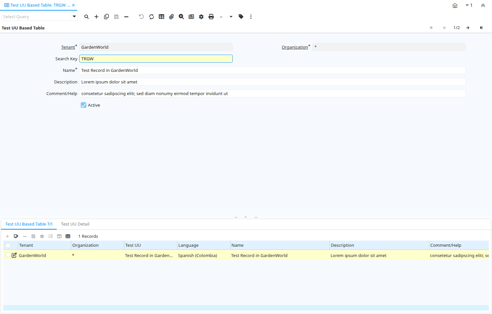

# Test UU Based Table

Window ID 200138

*17/03/2023 → 17/03/2023*

## Tab: Test UU Based Table

*Tab Level 0 · Created 17/03/2023 · Updated 10/06/2023*

| **Name** | **Description** | **Comment/Help** | **Technical Data** |
|---|---|---|---|
| Tenant | Tenant for this installation. | A Tenant is a company or a legal entity. You cannot share data between Tenants. | TestUU.AD_Client_ID<small> numeric(10)   Search</small> |
| Organization | Organizational entity within tenant | An organization is a unit of your tenant or legal entity - examples are store, department. You can share data between organizations. | TestUU.AD_Org_ID<small> numeric(10)   Table Direct</small> |
| Search Key | Search key for the record in the format required - must be unique | A search key allows you a fast method of finding a particular record. If you leave the search key empty, the system automatically creates a numeric number.  The document sequence used for this fallback number is defined in the "Maintain Sequence" window with the name "DocumentNo_&lt;TableName&gt;", where TableName is the actual name of the table (e.g. C_Order). | TestUU.Value<small> character varying(40)   String</small> |
| Name | Alphanumeric identifier of the entity | The name of an entity (record) is used as an default search option in addition to the search key. The name is up to 60 characters in length. | TestUU.Name<small> character varying(60)   String</small> |
| Description | Optional short description of the record | A description is limited to 255 characters. | TestUU.Description<small> character varying(255)   String</small> |
| Comment/Help | Comment or Hint | The Help field contains a hint, comment or help about the use of this item. | TestUU.Help<small> character varying(2000)   String</small> |
| Active | The record is active in the system | There are two methods of making records unavailable in the system: One is to delete the record, the other is to de-activate the record. A de-activated record is not available for selection, but available for reports. There are two reasons for de-activating and not deleting records: (1) The system requires the record for audit purposes. (2) The record is referenced by other records. E.g., you cannot delete a Business Partner, if there are invoices for this partner record existing. You de-activate the Business Partner and prevent that this record is used for future entries. | TestUU.IsActive<small> character(1)   Yes-No</small> |

## Tab: › Test UU Based Table Trl

*Tab Level 1 · Created 26/11/2023 · Updated 27/10/2024*

| **Name** | **Description** | **Comment/Help** | **Technical Data** |
|---|---|---|---|
| Tenant | Tenant for this installation. | A Tenant is a company or a legal entity. You cannot share data between Tenants. | TestUU_Trl.AD_Client_ID<small> numeric(10)   Search</small> |
| Organization | Organizational entity within tenant | An organization is a unit of your tenant or legal entity - examples are store, department. You can share data between organizations. | TestUU_Trl.AD_Org_ID<small> numeric(10)   Table Direct</small> |
| Test UU |  |  | TestUU_Trl.TestUU_UU<small> uuid   Search (UU)</small> |
| Language | Language for this entity | The Language identifies the language to use for display and formatting | TestUU_Trl.AD_Language<small> character varying(6)   Table</small> |
| Name | Alphanumeric identifier of the entity | The name of an entity (record) is used as an default search option in addition to the search key. The name is up to 60 characters in length. | TestUU_Trl.Name<small> character varying(60)   String</small> |
| Description | Optional short description of the record | A description is limited to 255 characters. | TestUU_Trl.Description<small> character varying(255)   String</small> |
| Comment/Help | Comment or Hint | The Help field contains a hint, comment or help about the use of this item. | TestUU_Trl.Help<small> character varying(2000)   String</small> |
| Translated | This column is translated | The Translated checkbox indicates if this column is translated. | TestUU_Trl.IsTranslated<small> character(1)   Yes-No</small> |
| Active | The record is active in the system | There are two methods of making records unavailable in the system: One is to delete the record, the other is to de-activate the record. A de-activated record is not available for selection, but available for reports. There are two reasons for de-activating and not deleting records: (1) The system requires the record for audit purposes. (2) The record is referenced by other records. E.g., you cannot delete a Business Partner, if there are invoices for this partner record existing. You de-activate the Business Partner and prevent that this record is used for future entries. | TestUU_Trl.IsActive<small> character(1)   Yes-No</small> |

## Tab: › Test UU Detail

*Tab Level 1 · Created 24/03/2023 · Updated 26/11/2023*

| **Name** | **Description** | **Comment/Help** | **Technical Data** |
|---|---|---|---|
| Tenant | Tenant for this installation. | A Tenant is a company or a legal entity. You cannot share data between Tenants. | TestUUDet.AD_Client_ID<small> numeric(10)   Search</small> |
| Organization | Organizational entity within tenant | An organization is a unit of your tenant or legal entity - examples are store, department. You can share data between organizations. | TestUUDet.AD_Org_ID<small> numeric(10)   Table Direct</small> |
| Test UU |  |  | TestUUDet.TestUU_UU<small> uuid   Table Direct (UU)</small> |
| Name | Alphanumeric identifier of the entity | The name of an entity (record) is used as an default search option in addition to the search key. The name is up to 60 characters in length. | TestUUDet.Name<small> character varying(60)   String</small> |
| Alternate Test UU |  |  | TestUUDet.AltTestUU_UU<small> uuid   Search (UU)</small> |
| Multi Test UU |  |  | TestUUDet.TestUU_UUs<small> character varying(2000)   Chosen Multiple Selection Table</small> |
| Active | The record is active in the system | There are two methods of making records unavailable in the system: One is to delete the record, the other is to de-activate the record. A de-activated record is not available for selection, but available for reports. There are two reasons for de-activating and not deleting records: (1) The system requires the record for audit purposes. (2) The record is referenced by other records. E.g., you cannot delete a Business Partner, if there are invoices for this partner record existing. You de-activate the Business Partner and prevent that this record is used for future entries. | TestUUDet.IsActive<small> character(1)   Yes-No</small> |

