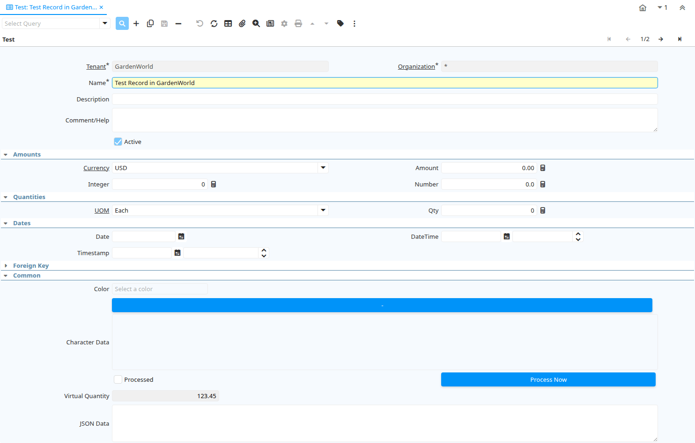

# Test

Window ID 127

*21/06/1999 → 02/01/2000*

**Description:** Test Screen

## Tab: Test

*Tab Level 0 · Created 21/06/1999 · Updated 02/01/2000*

| **Name** | **Description** | **Comment/Help** | **Technical Data** |
|---|---|---|---|
| Tenant | Tenant for this installation. | A Tenant is a company or a legal entity. You cannot share data between Tenants. | Test.AD_Client_ID<small> numeric(10)   Table Direct</small> |
| Organization | Organizational entity within tenant | An organization is a unit of your tenant or legal entity - examples are store, department. You can share data between organizations. | Test.AD_Org_ID<small> numeric(10)   Table Direct</small> |
| Name | Alphanumeric identifier of the entity | The name of an entity (record) is used as an default search option in addition to the search key. The name is up to 60 characters in length. | Test.Name<small> character varying(60)   String</small> |
| Description | Optional short description of the record | A description is limited to 255 characters. | Test.Description<small> character varying(255)   String</small> |
| Comment/Help | Comment or Hint | The Help field contains a hint, comment or help about the use of this item. | Test.Help<small> character varying(2000)   Text</small> |
| Active | The record is active in the system | There are two methods of making records unavailable in the system: One is to delete the record, the other is to de-activate the record. A de-activated record is not available for selection, but available for reports. There are two reasons for de-activating and not deleting records: (1) The system requires the record for audit purposes. (2) The record is referenced by other records. E.g., you cannot delete a Business Partner, if there are invoices for this partner record existing. You de-activate the Business Partner and prevent that this record is used for future entries. | Test.IsActive<small> character(1)   Yes-No</small> |
| Currency | The Currency for this record | Indicates the Currency to be used when processing or reporting on this record | Test.C_Currency_ID<small> numeric(10)   Table Direct</small> |
| Amount |  |  | Test.T_Amount<small> numeric   Amount</small> |
| Integer |  |  | Test.T_Integer<small> numeric(10)   Integer</small> |
| Number |  |  | Test.T_Number<small> numeric   Number</small> |
| UOM | Unit of Measure | The UOM defines a unique non monetary Unit of Measure | Test.C_UOM_ID<small> numeric(10)   Table Direct</small> |
| Qty |  |  | Test.T_Qty<small> numeric   Quantity</small> |
| Date |  |  | Test.T_Date<small> timestamp without time zone   Date</small> |
| DateTime |  |  | Test.T_DateTime<small> timestamp without time zone   Date+Time</small> |
| Timestamp | Timestamp with time zone |  | Test.T_Timestamp<small> timestamp with time zone   Timestamp With Time Zone</small> |
| Business Partner | Identifies a Business Partner | A Business Partner is anyone with whom you transact.  This can include Vendor, Customer, Employee or Salesperson | Test.C_BPartner_ID<small> numeric(10)   Search</small> |
| Payment | Payment identifier | The Payment is a unique identifier of this payment. | Test.C_Payment_ID<small> numeric(10)   Search</small> |
| Product | Product, Service, Item | Identifies an item which is either purchased or sold in this organization. | Test.M_Product_ID<small> numeric(10)   Search</small> |
| Locator | Warehouse Locator | The Locator indicates where in a Warehouse a product is located. | Test.M_Locator_ID<small> numeric(10)   Locator (WH)</small> |
| Address | Location or Address | The Location / Address field defines the location of an entity. | Test.C_Location_ID<small> numeric(10)   Location (Address)</small> |
| Account_Acct |  |  | Test.Account_Acct<small> numeric(10)   Account</small> |
| Table | Database Table information | The Database Table provides the information of the table definition | Test.AD_Table_ID<small> numeric(10)   Table Direct</small> |
| Record ID | Direct internal record ID | The Record ID is the internal unique identifier of a record. Please note that zooming to the record may not be successful for Orders, Invoices and Shipment/Receipts as sometimes the Sales Order type is not known. | Test.Record_ID<small> numeric(10)   Record ID</small> |
| Record UUID |  |  | Test.Record_UU<small> uuid   Record UUID</small> |
| Color |  |  | Test.Color<small> character varying(7)   Color</small> |
| Binary Data | Binary Data | The Binary field stores binary data. | Test.BinaryData<small> bytea   Binary</small> |
| Character Data | Long Character Field |  | Test.CharacterData<small> text   Text Long</small> |
| Processed | The document has been processed | The Processed checkbox indicates that a document has been processed. | Test.Processed<small> character(1)   Yes-No</small> |
| Process Now |  |  | Test.Processing<small> character(1)   Button</small> |
| Virtual Quantity | Used only for testing purposes |  | Test.TestVirtualQty<small>    Quantity</small> |
| JSON Data | The json field stores json data. |  | Test.JsonData<small> jsonb   JSON</small> |

