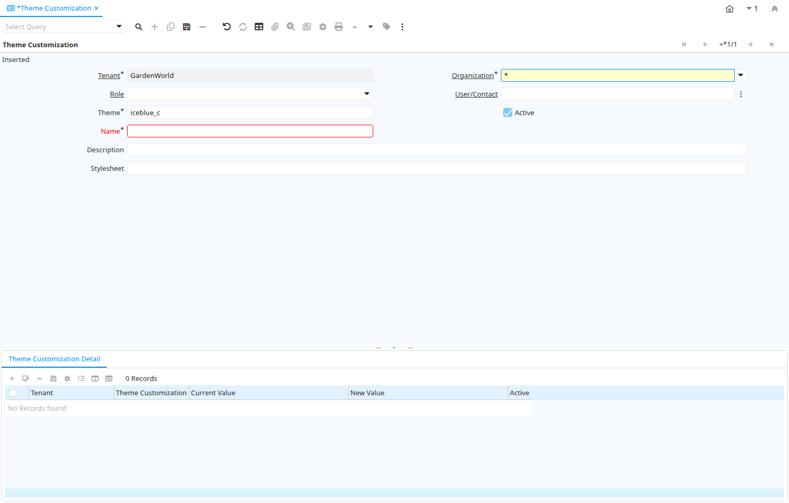

# Theme Customization

Window ID 200151

*12/11/2024 → 22/11/2024*

## Tab: Theme Customization

*Tab Level 0 · Created 12/11/2024 · Updated 24/11/2024*

| **Name** | **Description** | **Comment/Help** | **Technical Data** |
|---|---|---|---|
| Tenant | Tenant for this installation. | A Tenant is a company or a legal entity. You cannot share data between Tenants. | AD_UserDef_Theme.AD_Client_ID<small> numeric(10)   Search</small> |
| Organization | Organizational entity within tenant | An organization is a unit of your tenant or legal entity - examples are store, department. You can share data between organizations. | AD_UserDef_Theme.AD_Org_ID<small> numeric(10)   Table Direct</small> |
| Role | Responsibility Role | The Role determines security and access a user who has this Role will have in the System. | AD_UserDef_Theme.AD_Role_ID<small> numeric(10)   Table Direct</small> |
| User/Contact | User within the system - Internal or Business Partner Contact | The User identifies a unique user in the system. This could be an internal user or a business partner contact | AD_UserDef_Theme.AD_User_ID<small> numeric(10)   Search</small> |
| Theme | Theme name |  | AD_UserDef_Theme.Theme<small> character varying(60)   String</small> |
| Active | The record is active in the system | There are two methods of making records unavailable in the system: One is to delete the record, the other is to de-activate the record. A de-activated record is not available for selection, but available for reports. There are two reasons for de-activating and not deleting records: (1) The system requires the record for audit purposes. (2) The record is referenced by other records. E.g., you cannot delete a Business Partner, if there are invoices for this partner record existing. You de-activate the Business Partner and prevent that this record is used for future entries. | AD_UserDef_Theme.IsActive<small> character(1)   Yes-No</small> |
| Name | Alphanumeric identifier of the entity | The name of an entity (record) is used as an default search option in addition to the search key. The name is up to 60 characters in length. | AD_UserDef_Theme.Name<small> character varying(60)   String</small> |
| Description | Optional short description of the record | A description is limited to 255 characters. | AD_UserDef_Theme.Description<small> character varying(255)   String</small> |
| Stylesheet | CSS (Stylesheet) used | Base Stylesheet (.css file) to use - if empty, the default (standard.css) is used. The Style sheet can be a URL. | AD_UserDef_Theme.Stylesheet<small> character varying(512)   String</small> |

## Tab: › Theme Customization Detail

*Tab Level 1 · Created 12/11/2024 · Updated 22/11/2024*

| **Name** | **Description** | **Comment/Help** | **Technical Data** |
|---|---|---|---|
| Tenant | Tenant for this installation. | A Tenant is a company or a legal entity. You cannot share data between Tenants. | AD_UserDef_Theme_Detail.AD_Client_ID<small> numeric(10)   Search</small> |
| Organization | Organizational entity within tenant | An organization is a unit of your tenant or legal entity - examples are store, department. You can share data between organizations. | AD_UserDef_Theme_Detail.AD_Org_ID<small> numeric(10)   Table Direct</small> |
| Theme Customization |  |  | AD_UserDef_Theme_Detail.AD_UserDef_Theme_ID<small> numeric(10)   Search</small> |
| Active | The record is active in the system | There are two methods of making records unavailable in the system: One is to delete the record, the other is to de-activate the record. A de-activated record is not available for selection, but available for reports. There are two reasons for de-activating and not deleting records: (1) The system requires the record for audit purposes. (2) The record is referenced by other records. E.g., you cannot delete a Business Partner, if there are invoices for this partner record existing. You de-activate the Business Partner and prevent that this record is used for future entries. | AD_UserDef_Theme_Detail.IsActive<small> character(1)   Yes-No</small> |
| Current Value |  |  | AD_UserDef_Theme_Detail.CurrentValue<small> character varying(255)   String</small> |
| New Value | New field value | New data entered in the field | AD_UserDef_Theme_Detail.NewValue<small> character varying(255)   String</small> |

