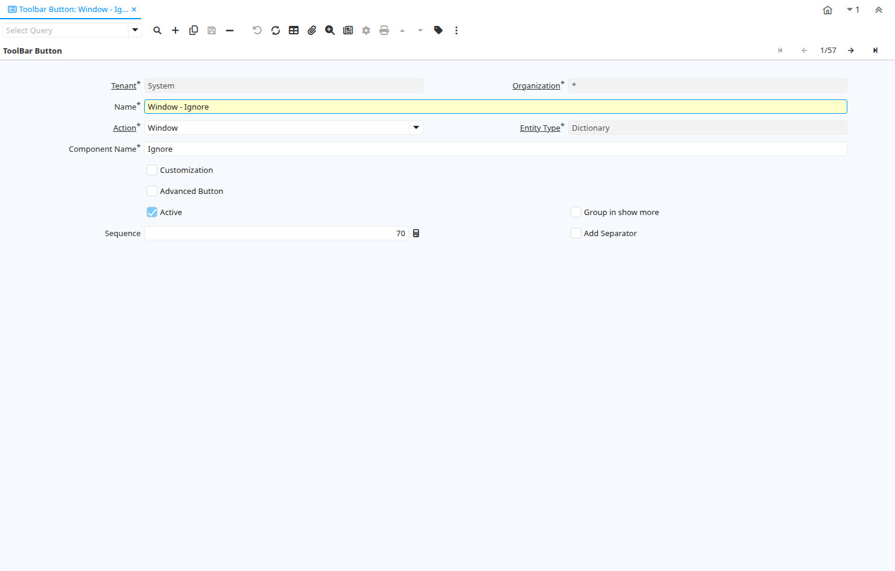

# Toolbar Button

Window ID 200000

*28/03/2012 → 23/10/2012*

## Tab: ToolBar Button

*Tab Level 0 · Created 28/03/2012 · Updated 24/10/2012*

| **Name** | **Description** | **Comment/Help** | **Technical Data** |
|---|---|---|---|
| Tenant | Tenant for this installation. | A Tenant is a company or a legal entity. You cannot share data between Tenants. | AD_ToolBarButton.AD_Client_ID<small> numeric(10)   Table Direct</small> |
| Organization | Organizational entity within tenant | An organization is a unit of your tenant or legal entity - examples are store, department. You can share data between organizations. | AD_ToolBarButton.AD_Org_ID<small> numeric(10)   Table Direct</small> |
| Name | Alphanumeric identifier of the entity | The name of an entity (record) is used as an default search option in addition to the search key. The name is up to 60 characters in length. | AD_ToolBarButton.Name<small> character varying(60)   String</small> |
| Action | Indicates the Action to be performed | The Action field is a drop down list box which indicates the Action to be performed for this Item. | AD_ToolBarButton.Action<small> character(1)   List</small> |
| Entity Type | Dictionary Entity Type; Determines ownership and synchronization | The Entity Types "Dictionary", "iDempiere" and "Application" might be automatically synchronized and customizations deleted or overwritten.    For customizations, copy the entity and select "User"! | AD_ToolBarButton.EntityType<small> character varying(40)   Table</small> |
| Component Name |  |  | AD_ToolBarButton.ComponentName<small> character varying(255)   String</small> |
| Customization | The change is a customization of the data dictionary and can be applied after Migration | The migration "resets" the system to the current/original setting.  If selected you can save the customization and re-apply it.  Please note that you need to check, if your customization has no negative side effect in the new release. | AD_ToolBarButton.IsCustomization<small> character(1)   Yes-No</small> |
| Service Component Name | The service component name that implements the interface for toolbar actions | The OSGi service component name that implements the IAction interface for toolbar action | AD_ToolBarButton.ActionClassName<small> character varying(255)   String</small> |
| Advanced Button | This Button contains advanced Functionality | The button with advanced functionality is only displayed for role that can access advanced functionality | AD_ToolBarButton.IsAdvancedButton<small> character(1)   Yes-No</small> |
| Active | The record is active in the system | There are two methods of making records unavailable in the system: One is to delete the record, the other is to de-activate the record. A de-activated record is not available for selection, but available for reports. There are two reasons for de-activating and not deleting records: (1) The system requires the record for audit purposes. (2) The record is referenced by other records. E.g., you cannot delete a Business Partner, if there are invoices for this partner record existing. You de-activate the Business Partner and prevent that this record is used for future entries. | AD_ToolBarButton.IsActive<small> character(1)   Yes-No</small> |
| Pressed Logic |  |  | AD_ToolBarButton.PressedLogic<small> character varying(2000)   Text</small> |
| Group in show more |  |  | AD_ToolBarButton.IsShowMore<small> character(1)   Yes-No</small> |
| Display Logic | If the Field is displayed, the result determines if the field is actually displayed | format := &#123;expression&#125; [&#123;logic&#125; &#123;expression&#125;]&lt;br&gt;  expression := @&#123;context&#125;@&#123;operand&#125;&#123;value&#125; or @&#123;context&#125;@&#123;operand&#125;&#123;value&#125;&lt;br&gt;  logic := &#123;\|&#125;\|&#123;&amp;&#125;&lt;br&gt; context := any global or window context &lt;br&gt; value := strings or numbers&lt;br&gt; logic operators	:= AND or OR with the previous result from left to right &lt;br&gt; operand := eq&#123;=&#125;, gt&#123;&amp;gt;&#125;, le&#123;&amp;lt;&#125;, not&#123;~^!&#125; &lt;br&gt; Examples: &lt;br&gt; &lt;ul&gt; &lt;li&gt; @AD_Table_ID@=14 \| @Language@!GERGER&lt;/li&gt; &lt;li&gt; @PriceLimit@&gt;10 \| @PriceList@&gt;@PriceActual@&lt;/li&gt; &lt;li&gt; @Name@&gt;J&lt;/li&gt; &lt;/ul&gt; Strings may be in single quotes (optional) | AD_ToolBarButton.DisplayLogic<small> character varying(2000)   Text</small> |
| Read Only Logic | Logic to determine if field is read only (applies only when field is read-write) | format := &#123;expression&#125; [&#123;logic&#125; &#123;expression&#125;]&lt;br&gt;  expression := @&#123;context&#125;@&#123;operand&#125;&#123;value&#125; or @&#123;context&#125;@&#123;operand&#125;&#123;value&#125;&lt;br&gt;  logic := &#123;\|&#125;\|&#123;&amp;&#125;&lt;br&gt; context := any global or window context &lt;br&gt; value := strings or numbers&lt;br&gt; logic operators	:= AND or OR with the previous result from left to right &lt;br&gt; operand := eq&#123;=&#125;, gt&#123;&amp;gt;&#125;, le&#123;&amp;lt;&#125;, not&#123;~^!&#125; &lt;br&gt; Examples: &lt;br&gt; &lt;ul&gt; &lt;li&gt; @AD_Table_ID@=14 \| @Language@!GERGER&lt;/li&gt; &lt;li&gt; @PriceLimit@&gt;10 \| @PriceList@&gt;@PriceActual@&lt;/li&gt; &lt;li&gt; @Name@&gt;J&lt;/li&gt; &lt;/ul&gt; Strings may be in single quotes (optional) | AD_ToolBarButton.ReadOnlyLogic<small> character varying(2000)   Text</small> |
| Sequence | Method of ordering records; lowest number comes first | The Sequence indicates the order of records | AD_ToolBarButton.SeqNo<small> numeric(10)   Integer</small> |
| Add Separator |  |  | AD_ToolBarButton.IsAddSeparator<small> character(1)   Yes-No</small> |

